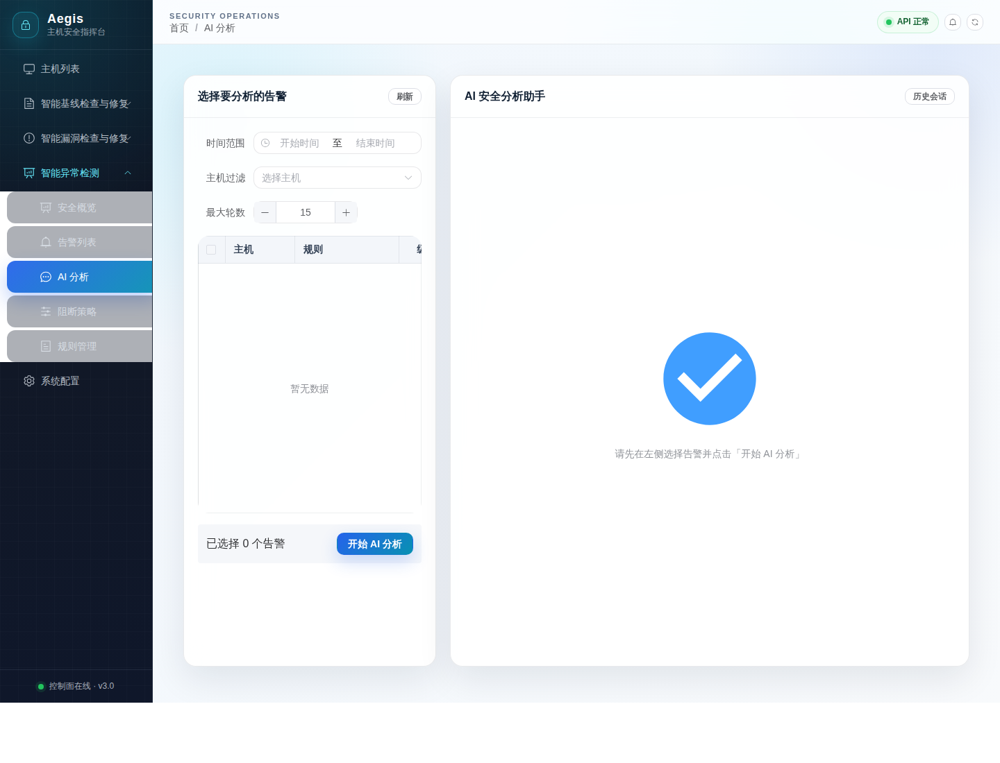

# aegis智能主机安全系统

中文 | [English](README_EN.md)



## 项目概述

Aegis 智能主机安全系统：新一代 AI 原生主机安全平台。系统深度集成大模型技术，实现主机配置与漏洞的动态审计管理。通过 AI 持续降噪与自动化研判，构建起从精准防护到自动化响应的闭环。我们致力于通过"模型对抗模型"的前瞻技术，为运维与安全工程师打造极简、智能的主机安全。

## 核心功能

### 文档智能解析

| 功能             | 说明                                            |
| :--------------- | :---------------------------------------------- |
| **多格式支持**   | 支持 PDF、Word、YAML、Excel、TXT 格式的基线文档 |
| **LLM 自动解析** | 上传文档后自动提取检查规则和修复方法            |
| **MD5 去重**     | 自动检测重复文件，避免重复解析                  |
| **实时进度**     | 轮询显示解析进度和状态                          |

### 脚本自动生成

| 功能           | 说明                       |
| :------------- | :------------------------- |
| **一键生成**   | 批量生成检测脚本和修复脚本 |
| **在线编辑**   | 支持在线查看和编辑脚本内容 |
| **版本管理**   | 保留脚本版本历史，支持追溯 |
| **安全性校验** | 自动检测危险命令，保障安全 |

### 任务执行管理

| 功能         | 说明                                         |
| :----------- | :------------------------------------------- |
| **批量执行** | 选择多条规则和多台主机，批量下发任务         |
| **实时状态** | 实时查看任务执行状态、进度、输出日志         |
| **类型标识** | 任务组类型列显示"检测"和"修复"标签，一目了然 |
| **筛选排序** | 支持按状态、类型筛选任务                     |

### 智能自愈修复

| 功能         | 说明                                       |
| :----------- | :----------------------------------------- |
| **自动触发** | 检测失败/修复失败时自动触发 LLM 自愈流程   |
| **错误分析** | LLM 分析错误原因，生成修复后的脚本         |
| **自动重试** | 最多 3 次重试，自动执行修复后的脚本        |
| **状态追踪** | 实时显示"脚本修复中"、"脚本修复成功"等状态 |

### 任务详情增强

| 功能         | 说明                                       |
| :----------- | :----------------------------------------- |
| **重新下发** | 未通过的任务支持重新下发检测，验证修复效果 |
| **一键修复** | 未通过的任务支持一键创建修复任务           |
| **类型筛选** | 任务详情页支持按类型（检测/修复）筛选      |
| **修复建议** | 显示 LLM 生成的修复建议                    |

### 智能漏洞检查与修复 (V3.0新增)

| 功能          | 说明                                        |
| :------------ | :------------------------------------------ |
| **一键扫描**  | 采集主机软件清单，LLM 分析识别已知 CVE 漏洞 |
| **漏洞列表**  | 按发现时间排序，支持严重程度筛选和搜索      |
| **自定义CVE** | 手动输入 CVE 编号，调用大模型查询详情并入库 |
| **POC验证**   | 生成安全的验证脚本，确认漏洞是否存在        |
| **一键修复**  | 生成针对性修复脚本，批量执行修复任务        |
| **状态追踪**  | 实时显示脚本生成和执行进度                  |

### 实时威胁检测与响应 (V5.0新增)

| 功能              | 说明                                                            |
| :---------------- | :-------------------------------------------------------------- |
| **eBPF事件采集**  | 基于 eBPF 实时采集进程执行等系统事件（仅在 CentOS 9 测试过） |
| **Sigma规则匹配** | 内置 Sigma 规则库，在 Agent 端进行初筛                          |
| **告警去重**      | 按 host+pid+mitre_id 自动去重，减少告警噪音                     |
| **手动AI降噪**    | 用户选择时间范围后，手动触发 LLM 分析告警真实性                 |
| **自动阻断**      | 支持按 MITRE ATT&CK 策略配置自动阻断开关                        |
| **实时推送**      | WebSocket 实时推送告警到前端                                    |

### AI 告警分析与溯源图 (V5.6新增)

| 功能             | 说明                                                          |
| :--------------- | :------------------------------------------------------------ |
| **多告警分析**   | 支持选择多条告警并按时间范围、主机过滤条件发起 AI 分析        |
| **流式推理展示** | 前端按 SSE 展示 Thought、Action、Observation 与最终结论        |
| **攻击溯源图**   | 最终结论解析 `attack_graph` 后同时展示交互式图谱与流程图图片  |
| **图片模型接入** | 「系统配置 / 模型配置」支持独立配置文本模型与图片模型，用于生成流程图图片 |
| **中文截图稳定** | 前端统一使用 CJK 安全字体栈，截图归档避免中文或图谱节点乱码    |

## 界面截图

V5.6 UI 视觉刷新截图保存在 `docs/screenshots/ui-refresh/`，其中 AI 分析相关截图：

| 页面 | 截图 |
| :--- | :--- |
| AI 分析页 | `docs/screenshots/ui-refresh/detection-ai-analysis.png` |
| 攻击溯源图 | `docs/screenshots/ui-refresh/detection-ai-analysis-flowchart.png` |

## 快速开始

### 环境要求

- Docker 20.10+
- Docker Compose 2.0+
- 2GB+ 可用内存
- 生成中文 UI 截图时建议安装 `fonts-noto-cjk` 或 `fonts-wqy-microhei`

### 源码部署

```bash
# 1. 克隆项目
git clone <repository-url>
cd aegis

# 2. 配置环境变量
cp .env.example .env
vim .env

# 3. 构建并启动
docker compose up -d --build

# 4. 验证服务
curl http://localhost:8082/health
```

浏览器访问 http://localhost:8081

### 一键部署

```bash
# 1. 下载版本包

# 2. 执行部署脚本
  ./start.sh
```
浏览器访问 http://localhost:8081


### 配置 LLM

首次使用需要在「系统配置 / 模型配置」页面配置大模型服务：

1. 进入「系统配置 / 模型配置」页面
2. 填写 API Key 和 Base URL（支持阿里云 DashScope、OpenAI 等）
3. 点击「连通性测试」验证配置
4. 保存配置

### 部署 Agent

在「系统配置 / Agent 安装」页面获取 Agent 安装命令，在目标服务器上执行：

```bash
curl -sSL http://<SERVER_IP>:8082/api/v1/agent/install.sh | sudo bash
```


## 端口说明

| 服务 | 端口 |
| :--- | :--- |
| 前端 | 8081 |
| API Server HTTP | 8082 |
| API Server gRPC | 19093 |
| Server gRPC | 19090 / 19094 |
| DC gRPC | 19092 |
| PostgreSQL | 5432 |
| Redis | 6379 |
| MinIO API | 9000 |
| MinIO Console | 9001 |


## 纯AI设计，开发，测试项目
