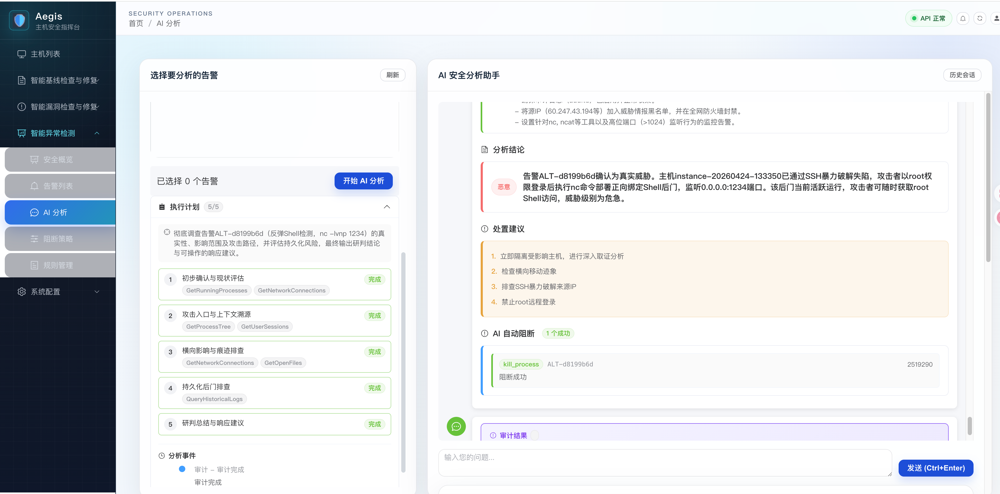
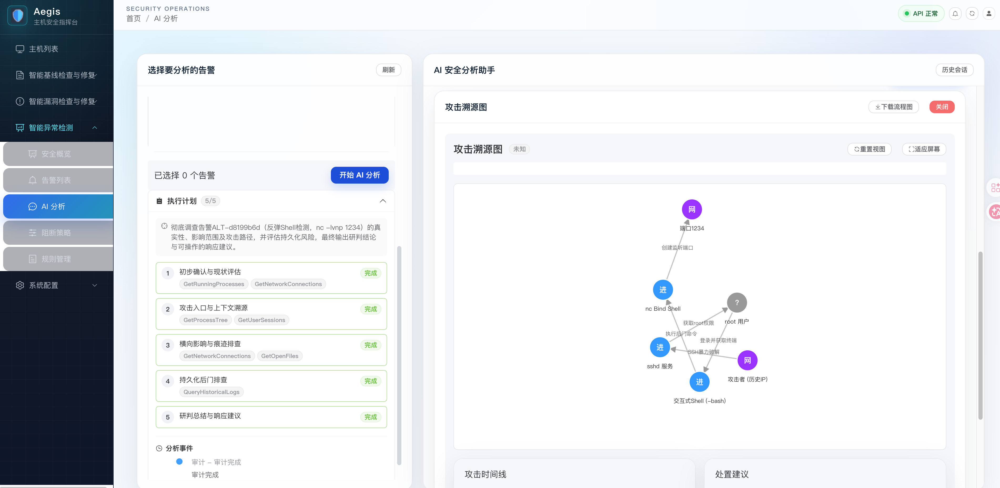
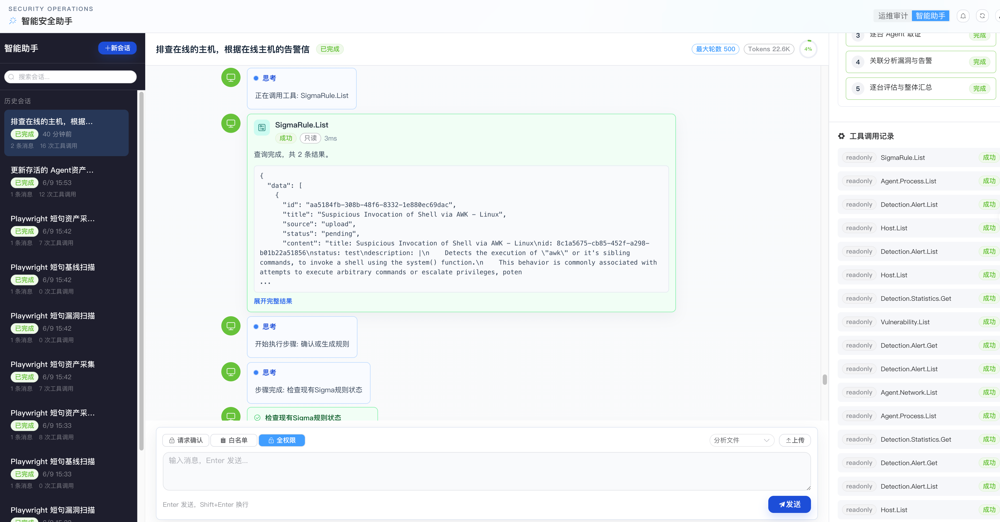

# aegis智能主机安全系统

中文 | [English](README_EN.md)







## 项目概述

Aegis 智能主机安全智能体系统：新一代 AI 原生主机安全平台。系统深度集成大模型技术，实现主机配置与漏洞的动态审计管理。通过 AI 持续降噪与自动化研判，构建起从精准防护到自动化响应的闭环。我们致力于通过"模型对抗模型"的前瞻技术，为运维与安全工程师打造极简、智能的主机安全。

## 核心功能

### 双模智能安全指挥台（V6.0）

V6.0 的核心变化是：平台中的主机管理、基线检查、漏洞治理、脚本审计、
自愈修复、实时检测、告警溯源、阻断策略、资产采集和动态检测包等核心能力，
都可以在智能体模式中通过自然语言统一发起、编排和追踪；普通模式仍然保留，
用于精确查看、手动配置和细粒度操作。

- 操作更简单：用户不需要记住每个功能入口和表单路径，可以直接描述目标，
  例如“检查这批主机的 SSH 基线”“分析这台主机是否被攻击”“生成并下发修复脚本”。
- 流程更连贯：智能体可以自动拆解任务、选择工具、串联主机、资产、漏洞、
  基线、告警、Agent 实时证据和 DetectionPackage 等能力，减少跨页面来回切换。
- 分析更完整：智能体会围绕目标主动补充上下文，把资产信息、漏洞风险、
  基线结果、告警证据、进程网络行为和历史任务结果汇总成可理解的结论。
- 三种权限模式控制，阻断、修复、签名、启用检测包等动作可以先解释影响范围，
  经审批后再执行。
- 结果可追溯：计划、工具调用、审批记录、执行结果和错误信息都会沉淀为审计轨迹，便于复盘一次处置过程为什么这么判断、调用了什么工具、对哪些主机产生了影响。


### 主机与 Agent 管理

- 主机列表、Agent 在线状态、主机基础信息与运行状态管理
- Agent 一键安装命令生成与分发
- API Server、Server、Agent 基于 gRPC 的任务下发与结果回传

### 智能基线检查与修复

- 支持 PDF、Word、YAML、Excel、TXT 等格式的基线文档上传
- 基于 LLM 自动解析检查规则、检测方法和修复建议
- 文档 MD5 去重、解析进度跟踪和解析状态展示
- 批量大模型生成检测脚本、修复脚本，支持在线查看、编辑和版本追溯
- 选择多条规则和多台主机批量下发检测或修复任务
- 任务状态、执行进度、输出日志、任务类型筛选与排序
- 未通过任务支持重新下发检测、一键创建修复任务和查看修复建议

### 智能漏洞检查与修复

- 采集主机软件清单并调用大模型识别已知 CVE 漏洞
- 漏洞列表支持严重等级筛选、搜索和按时间排序
- 支持手动录入自定义 CVE，并调用大模型补全漏洞详情
- 自动调用大模型生成 POC 验证脚本，确认漏洞是否真实存在
- 自动调用大模型生成针对性修复脚本，支持批量下发和进度追踪

### 脚本安全审计

- 统一脚本审计服务覆盖基线检测、基线修复、漏洞修复、POC 验证和自愈脚本
- 命令审计黑名单支持新增、编辑、启停、删除、搜索和批量操作
- 黑名单规则支持正则匹配、全命令精确匹配、分类标签、严重等级和适用脚本类型
- 预置高危命令规则，覆盖文件系统破坏、权限滥用、网络外联、反弹 Shell 等风险
- 脚本生成后先进行黑名单审计，再进行 AI 安全审计
- 审计失败时自动把失败原因反馈给 LLM 重新生成，最多重试 3 次
- 任务下发前进行黑名单二次校验，Agent 侧执行前进行最后校验
- 审计日志记录脚本内容、命中规则、AI 分析结果、风险等级和审计时间线

### 智能自愈修复

- 检测失败或修复失败时自动触发 LLM 自愈流程
- 自动分析错误原因，生成修复后的脚本
- 自动重试执行修复后的脚本，并跟踪自愈状态
- 自愈脚本纳入统一脚本安全审计流程

### 实时威胁检测与响应

- 基于 eBPF 实时采集进程执行、文件访问和网络连接事件
- 文件事件支持敏感路径访问监控，网络事件支持 IPv4、IPv6、源地址和目标端口采集
- eBPF 根据内核能力自动适配 ringbuf、perf buffer
- Agent 端内置 Sigma 规则匹配，支持进程、文件、网络事件初筛
- 告警按主机、进程、规则和 MITRE 技术自动聚合去重
- 告警中心支持筛选、搜索、详情查看和实时 WebSocket 推送
- 阻断策略支持按 MITRE ATT&CK 技术配置手动阻断、规则命中自动阻断和 AI 分析后自动阻断

### 动态 eBPF 检测包（V5.8）

- 支持针对特定 CVE 动态生成 eBPF 检测程序，扩展 Agent 运行时检测能力
- 提供检测包管理页面：草稿编辑、构建、签名、启用、下发全流程可视化
- 管理员审核后才可构建和启用，确保检测代码安全可控
- 检测包支持单事件规则匹配和多事件关联检测，覆盖复杂攻击链场景

### 智能资产采集（V5.8）

- 自动采集主机安装的软件包和运行中的应用进程
- 通过大模型自动识别应用类型（数据库、Web 服务、Web 框架、Web 站点）和版本
- 主机列表下提供资产分类视图，快速了解每台主机的软件资产情况
- 为漏洞扫描提供精准的资产上下文，提升漏洞匹配准确性
- 支持定时自动采集和手动触发采集

### AI 告警分析与攻击溯源

- 支持按时间范围、主机和告警选择发起多告警 AI 分析
- 基于 ReAct 智能体执行计划、工具调用、反思、审计、纠正和总结
- 通过 SSE 流式展示思考过程、工具调用、观察结果、执行计划和最终结论
- 历史会话支持恢复分析过程、结论、处置建议和执行结果
- 支持攻击溯源图谱、攻击流程图图片和结构化处置建议展示
- 支持上下文压缩、批量事件分析和大上下文场景下的分析过程可观测

### 系统配置与可观测性

- 模型配置支持文本模型和图片模型独立配置、连通性测试和安全保存
- 首次未配置模型时展示可编辑空状态，不将未配置误报为系统错误
- 支持 OpenAI 兼容模型、DashScope 等大模型服务接入
- 审计日志页面展示总审计次数、通过率、失败次数、重试分布和详情抽屉
- 智能体分析过程记录迭代次数、工具调用次数、失败率、会话时长和 token 消耗


## 快速开始

### 环境要求

- Docker 20.10+
- Docker Compose 2.0+
- 2GB+ 可用内存


### 源码部署

```bash
# 1. 克隆项目
git clone <repository-url>
cd aegis

# 2. 配置环境变量
cp .env.example .env
vim .env

# 3. 构建并启动
docker compose up -d --build

# 4. 验证服务
curl http://localhost:8082/health
```

浏览器访问 http://localhost:8081

### 一键部署（离线包）

```bash
# 1. 解压离线部署包
unzip aegis-v6.0-linux-amd64-release.zip
cd v6.0

# 2. 执行部署脚本（自动检测IP、加载镜像、启动服务）
bash start.sh
```

浏览器访问 http://<部署IP>:8081


### 配置 LLM

首次使用需要在「系统配置 / 模型配置」页面配置大模型服务：

1. 进入「系统配置 / 模型配置」页面
2. 填写 API Key 和 Base URL（支持阿里云 DashScope、OpenAI 等）
3. 点击「连通性测试」验证配置
4. 保存配置

### 部署 Agent

在「系统配置 / Agent 安装」页面获取 Agent 安装命令，在目标服务器上执行：

```bash
curl -sSL http://<SERVER_IP>:8082/api/v1/agent/install.sh | sudo bash
```


## 端口说明

| 服务 | 端口 |
| :--- | :--- |
| 前端 | 8081 |
| API Server HTTP | 8082 |
| API Server gRPC | 19093 |
| Server gRPC | 19090 / 19094 |
| DC gRPC | 19092 |
| Builder gRPC | 19096 |
| PostgreSQL | 5432 |
| Redis | 6379 |
| MinIO API | 9000 |
| MinIO Console | 9001 |
| Kafka | 29092 |
