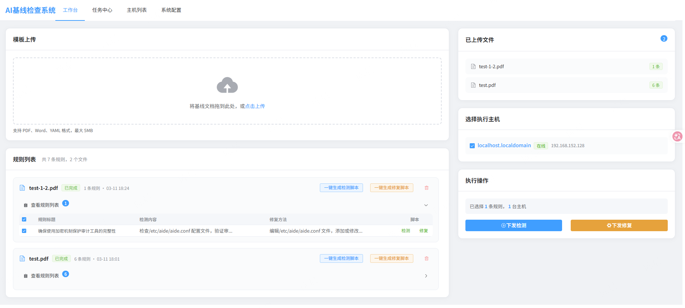

# AI基线检查系统



## 项目概述

AI基线检查系统是一个面向运维和安全工程师的服务器基线自动化管理平台。系统结合大语言模型（LLM）的智能解析能力与 Agent 的自动化执行能力，实现从基线文档到自动化检查修复的完整闭环。
解决了安全运营的最后一公里。

### 核心能力

| 功能             | 说明                                                        |
| ---------------- | ----------------------------------------------------------- |
| **智能文档解析** | 上传 PDF/Word/YAML 基线文档，LLM 自动解析为检查/修复规则    |
| **脚本自动生成** | 点击按钮即可让 LLM 生成检测脚本和修复脚本，支持在线编辑保存 |
| **批量主机管理** | 一键在多台服务器上执行基线检查和修复                        |
| **任务进度追踪** | 实时查看任务执行状态、脚本输出、错误信息                    |
| **智能自愈**     | 脚本执行失败时，LLM 自动分析错误原因并生成修复后的脚本重试  |

## 快速开始

### 环境要求

- Docker 20.10+
- Docker Compose 2.0+
- 2GB+ 可用内存

### 一键部署

```bash
# 1. 克隆项目
git clone <repository-url>
cd ai-benchmark

# 2. 配置环境变量
cp .env.example .env
vim .env

# 3. 构建并启动
docker compose up -d --build

# 4. 验证服务
curl http://localhost:8080/health
```

浏览器访问 http://localhost:8081

### AI提示词一键部署提示词（请把下面内容拷贝给AI）

```bash
作为 DevOps 专家，请执行：
1. ​**克隆项目**​：`https://github.com/chenchen511/ai-benchmark`。
2. ​**深度解析**​：读取 `README.md` 与 `baseline_system_design_v2.2`，严格按其架构与安全基线部署。
3. ​**自动化执行**​：生成并运行部署脚本，验证服务状态。
```

### 配置 LLM


首次使用需要在「系统配置」页面配置大模型服务：

1. 进入「系统配置」页面
2. 填写 API Key 和 Base URL（支持阿里云 DashScope、OpenAI 等）
3. 点击「连通性测试」验证配置
4. 保存配置

### 部署 Agent

在「系统配置」页面获取 Agent 安装命令，在目标服务器上执行：

```bash
curl -sSL http://<SERVER_IP>:8080/api/v1/agent/install.sh | sudo bash
```

### 使用流程

```
上传基线文档 → LLM解析规则 → 生成/编辑脚本 → 选择主机 → 执行检测/修复 → 查看结果
```

## 端口说明

| 服务          | 端口 |
| ------------- | ---- |
| 前端 Web      | 8081 |
| 后端 HTTP API | 8080 |
| 后端 gRPC     | 9090 |
| PostgreSQL    | 5432 |
| Redis         | 6379 |
| MinIO API     | 9000 |
| MinIO Console | 9001 |

