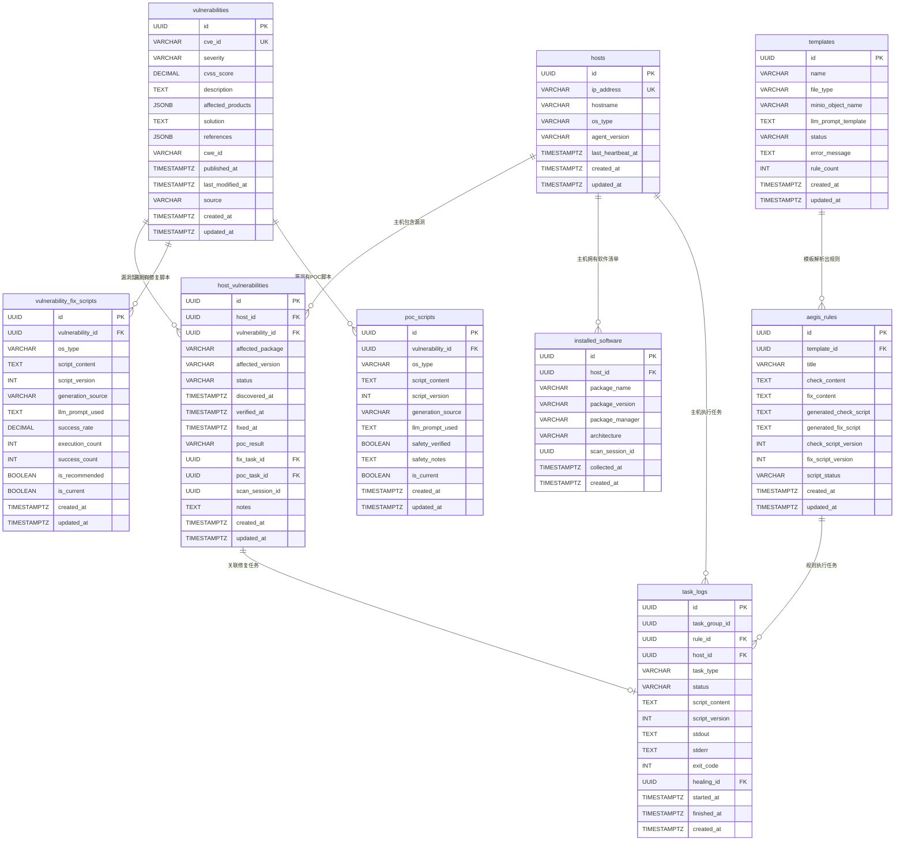

# 数据库设计文档 - V3.0 完整版

**版本**: 3.0
**状态**: 定稿
**作者**: 安全产品团队
**日期**: 2026-03-13

---

## 1. 修订历史

| 版本 | 日期 | 作者 | 修订说明 |
|:---|:---|:---|:---|
| 3.0 | 2026-03-13 | 安全产品团队 | **新增漏洞管理模块**。在V2.2基础上新增5张表：`vulnerabilities`（漏洞主表）、`host_vulnerabilities`（主机漏洞关联表）、`installed_software`（主机软件清单缓存表）、`vulnerability_fix_scripts`（漏洞修复脚本表）、`poc_scripts`（POC验证脚本表），支持智能漏洞检查与修复功能。 |
| 2.2 | 2026-03-12 | Sisyphus | 任务管理与超时机制增强。 |
| 2.0 | 2026-03-05 | Manus AI | 全面更新，新增LLM配置、脚本版本、自愈日志三张表。 |
| 1.6 | 2026-03-05 | Manus AI | 完整重写，包含4张核心表的详细字段定义。 |

---

## 2. 概述

本文档为Aegis智能主机安全系统提供PostgreSQL数据库的完整数据模型设计。V3.0版本在V2.2的7张表基础上，新增5张表以支持**智能漏洞检查与修复**核心功能。新模块支持从软件清单采集、CVE漏洞发现、主机关联、POC验证到修复执行的完整安全运营闭环。

---

## 3. 数据库表结构总览

V3.0版本的数据库包含**12张表**，按业务领域可分为四组。

| 业务领域 | 表名 | 描述 | 版本 |
|:---|:---|:---|:---|
| 资产管理 | `hosts` | 存储Agent上报的主机核心身份信息 | V1.6保留 |
| 模板与规则 | `templates` | 存储用户上传的基线模板文件元数据 | V1.6保留 |
| 模板与规则 | `aegis_rules` | 存储LLM解析出的基线规则 | V1.6保留 |
| 任务执行 | `task_logs` | 记录检查/修复任务的执行日志 | V2.2更新 |
| 系统配置 | `llm_configs` | 存储LLM服务的配置信息 | V2.2新增 |
| 脚本管理 | `script_versions` | 记录LLM生成/修复脚本的版本历史 | V2.2新增 |
| 自愈管理 | `self_healing_logs` | 记录自愈修复流程的详细日志 | V2.2新增 |
| **漏洞管理** | `vulnerabilities` | 存储CVE漏洞主数据 | **V3.0新增** |
| **漏洞管理** | `host_vulnerabilities` | 关联主机与漏洞的映射表 | **V3.0新增** |
| **漏洞管理** | `installed_software` | 缓存主机软件清单（每次扫描更新） | **V3.0新增** |
| **漏洞管理** | `vulnerability_fix_scripts` | 存储漏洞修复脚本（按CVE和OS） | **V3.0新增** |
| **漏洞管理** | `poc_scripts` | 存储POC验证脚本（按CVE和OS） | **V3.0新增** |

---

## 4. 表结构详述

### 4.1 V2.2保留表结构（简要说明）

以下表在V3.0中保持V2.2设计，但部分表需要支持漏洞管理功能：

- **`hosts`** (资产表)：存储Agent纳管的主机信息。V3.0新增：`os_type`字段需包含完整版本信息（如"CentOS 7"、"Ubuntu 20.04"），用于漏洞修复脚本匹配。
- **`templates`** (模板元数据表)：存储上传的基线文档元数据。无变化。
- **`aegis_rules`** (基线规则表)：存储LLM解析的基线检查规则。无变化。
- **`task_logs`** (执行日志表)：存储基线检查/修复任务日志。**V3.0更新**：新增对漏洞任务的支持，`task_type`新增`VULNERABILITY_FIX`和`POC_VERIFY`类型，新增`vulnerability_id`字段关联漏洞。
- **`llm_configs`** (LLM配置表)：存储大模型服务配置。无变化。
- **`script_versions`** (脚本版本表)：存储脚本版本历史。**V3.0更新**：支持漏洞脚本版本管理。
- **`self_healing_logs`** (自愈日志表)：存储自愈修复流程记录。**V3.0更新**：支持漏洞修复脚本的自愈流程。

### 4.2 `vulnerabilities` (CVE漏洞库表) — V3.0新增

存储从扫描结果中识别出的CVE漏洞基本信息，作为漏洞管理的核心数据表。每个唯一的CVE编号在此表中只有一条记录。

| 字段名 | 数据类型 | 约束 | 描述 |
|:---|:---|:---|:---|
| `id` | `UUID` | `PRIMARY KEY`, `DEFAULT gen_random_uuid()` | 记录的唯一标识符。 |
| `cve_id` | `VARCHAR(20)` | `NOT NULL`, `UNIQUE` | CVE编号，如 'CVE-2021-44228'，作为漏洞的唯一标识。 |
| `severity` | `VARCHAR(20)` | `NOT NULL` | 严重程度：'Critical'、'High'、'Medium'、'Low'。 |
| `cvss_score` | `DECIMAL(3,1)` | `NULL` | CVSS评分，范围0.0-10.0，如9.0。 |
| `description` | `TEXT` | `NOT NULL` | 漏洞描述和原理说明。 |
| `affected_products` | `JSONB` | `NULL` | 受影响的产品/组件列表，JSON数组格式。 |
| `solution` | `TEXT` | `NULL` | 官方修复建议或解决方案。 |
| `references` | `JSONB` | `NULL` | 参考链接列表，JSON数组格式。 |
| `cwe_id` | `VARCHAR(50)` | `NULL` | 关联的CWE（常见弱点枚举）ID。 |
| `published_at` | `TIMESTAMPTZ` | `NULL` | CVE公开日期。 |
| `last_modified_at` | `TIMESTAMPTZ` | `NULL` | CVE最后修改日期。 |
| `source` | `VARCHAR(50)` | `NOT NULL`, `DEFAULT 'llm_analysis'` | 数据来源：'llm_analysis'（LLM分析）、'nvd_import'（NVD导入）、'manual'（手动录入）。 |
| `created_at` | `TIMESTAMPTZ` | `NOT NULL`, `DEFAULT NOW()` | 记录的创建时间戳。 |
| `updated_at` | `TIMESTAMPTZ` | `NOT NULL`, `DEFAULT NOW()` | 记录的最后更新时间戳。 |

**数据示例**：

```json
{
  "id": "550e8400-e29b-41d4-a716-446655440000",
  "cve_id": "CVE-2021-44228",
  "severity": "Critical",
  "cvss_score": 10.0,
  "description": "Apache Log4j2中存在JNDI注入漏洞，攻击者可通过构造特制日志消息利用JNDI功能执行任意代码。",
  "affected_products": [
    {
      "product": "log4j-core",
      "vendor": "apache",
      "versions": ["2.0-beta9", "2.14.1"],
      "fixed_versions": ["2.15.0", "2.17.0"]
    }
  ],
  "solution": "升级至Log4j 2.17.0或更高版本",
  "references": [
    "https://nvd.nist.gov/vuln/detail/CVE-2021-44228",
    "https://logging.apache.org/log4j/2.x/security.html"
  ],
  "cwe_id": "CWE-502",
  "source": "llm_analysis"
}
```

### 4.3 `host_vulnerabilities` (主机漏洞关联表) — V3.0新增

映射表，建立主机与漏洞之间的多对多关系，记录每台主机上每个漏洞的具体状态、检测历史和修复进度。

| 字段名 | 数据类型 | 约束 | 描述 |
|:---|:---|:---|:---|
| `id` | `UUID` | `PRIMARY KEY`, `DEFAULT gen_random_uuid()` | 记录的唯一标识符。 |
| `host_id` | `UUID` | `NOT NULL`, `FOREIGN KEY (hosts.id)` | 关联的主机ID。 |
| `vulnerability_id` | `UUID` | `NOT NULL`, `FOREIGN KEY (vulnerabilities.id)` | 关联的漏洞ID。 |
| `affected_package` | `VARCHAR(255)` | `NOT NULL` | 受影响的软件包名称，如"log4j-core"。 |
| `affected_version` | `VARCHAR(100)` | `NOT NULL` | 主机上安装的软件包版本，如"2.14.1"。 |
| `status` | `VARCHAR(20)` | `NOT NULL`, `DEFAULT 'detected'` | 漏洞状态：'detected'(已检测)、'poc_verified'(POC已验证)、'fixing'(修复中)、'fixed'(已修复)、'ignored'(已忽略)、'false_positive'(误报)。 |
| `discovered_at` | `TIMESTAMPTZ` | `NOT NULL`, `DEFAULT NOW()` | 首次检测到该漏洞的时间。 |
| `verified_at` | `TIMESTAMPTZ` | `NULL` | POC验证完成时间。 |
| `fixed_at` | `TIMESTAMPTZ` | `NULL` | 漏洞修复完成时间。 |
| `poc_result` | `VARCHAR(20)` | `NULL` | POC验证结果：'vulnerable'(漏洞存在)、'not_vulnerable'(漏洞不存在)、'error'(验证失败)。 |
| `fix_task_id` | `UUID` | `NULL`, `FOREIGN KEY (task_logs.id)` | 关联的修复任务ID。 |
| `poc_task_id` | `UUID` | `NULL`, `FOREIGN KEY (task_logs.id)` | 关联的POC验证任务ID。 |
| `scan_session_id` | `UUID` | `NOT NULL` | 扫描会话ID，同一次扫描产生的漏洞记录共享此ID。 |
| `notes` | `TEXT` | `NULL` | 备注，如忽略原因、修复说明等。 |
| `created_at` | `TIMESTAMPTZ` | `NOT NULL`, `DEFAULT NOW()` | 记录的创建时间戳。 |
| `updated_at` | `TIMESTAMPTZ` | `NOT NULL`, `DEFAULT NOW()` | 记录的最后更新时间戳。 |

**唯一约束**：`(host_id, vulnerability_id, affected_package, affected_version)` 组合唯一，防止同一主机同一软件版本的重复记录。

**状态流转图**：

```
detected ──► poc_verified ──► fixing ──► fixed
    │              │             │
    └──────────────┴─────────────┴──► ignored
                                        │
                                   false_positive
```

### 4.4 `installed_software` (主机软件清单缓存表) — V3.0新增

缓存每台主机上已安装的软件包信息。每次执行漏洞扫描时，Agent采集的软件清单会写入此表，供LLM进行CVE分析。表中的数据在每次扫描时全量覆盖，不保留历史软件列表（历史扫描结果体现在`host_vulnerabilities`表中）。

| 字段名 | 数据类型 | 约束 | 描述 |
|:---|:---|:---|:---|
| `id` | `UUID` | `PRIMARY KEY`, `DEFAULT gen_random_uuid()` | 记录的唯一标识符。 |
| `host_id` | `UUID` | `NOT NULL`, `FOREIGN KEY (hosts.id)` | 关联的主机ID。 |
| `package_name` | `VARCHAR(255)` | `NOT NULL` | 软件包名称，如"log4j-core"、"openssl"。 |
| `package_version` | `VARCHAR(100)` | `NOT NULL` | 已安装的软件包版本，如"2.14.1-1.el7"。 |
| `package_manager` | `VARCHAR(20)` | `NOT NULL` | 包管理器类型：'rpm'（CentOS/RHEL/Fedora）、'dpkg'（Ubuntu/Debian）。 |
| `architecture` | `VARCHAR(20)` | `NULL` | 架构信息，如'x86_64'、'aarch64'。 |
| `scan_session_id` | `UUID` | `NOT NULL` | 采集此记录的扫描会话ID，与`host_vulnerabilities.scan_session_id`关联。 |
| `collected_at` | `TIMESTAMPTZ` | `NOT NULL`, `DEFAULT NOW()` | Agent采集该软件信息的时间戳。 |
| `created_at` | `TIMESTAMPTZ` | `NOT NULL`, `DEFAULT NOW()` | 记录的创建时间戳。 |

**唯一约束**：`(host_id, package_name, package_version, scan_session_id)` 组合唯一，确保同一次扫描中同一主机同一软件包不重复记录。

**数据示例**：

```json
[
  {
    "host_id": "550e8400-e29b-41d4-a716-446655440001",
    "package_name": "log4j-core",
    "package_version": "2.14.1",
    "package_manager": "rpm",
    "architecture": "noarch",
    "scan_session_id": "660e8400-e29b-41d4-a716-446655440000",
    "collected_at": "2026-03-13T10:30:15Z"
  },
  {
    "host_id": "550e8400-e29b-41d4-a716-446655440001",
    "package_name": "openssl",
    "package_version": "1.1.1k-6.el8",
    "package_manager": "rpm",
    "architecture": "x86_64",
    "scan_session_id": "660e8400-e29b-41d4-a716-446655440000",
    "collected_at": "2026-03-13T10:30:15Z"
  }
]
```

### 4.5 `vulnerability_fix_scripts` (漏洞修复脚本表) — V3.0新增

存储LLM为特定漏洞和操作系统生成的修复脚本。由于不同操作系统（CentOS/Ubuntu等）的修复方法不同，同一CVE可能有多个修复脚本版本。此表支持脚本的版本管理和成功率统计。

| 字段名 | 数据类型 | 约束 | 描述 |
|:---|:---|:---|:---|
| `id` | `UUID` | `PRIMARY KEY`, `DEFAULT gen_random_uuid()` | 记录的唯一标识符。 |
| `vulnerability_id` | `UUID` | `NOT NULL`, `FOREIGN KEY (vulnerabilities.id)` | 关联的漏洞ID。 |
| `os_type` | `VARCHAR(50)` | `NOT NULL` | 目标操作系统类型，如 'CentOS 7'、'Ubuntu 20.04'。 |
| `script_content` | `TEXT` | `NOT NULL` | 修复脚本内容（Shell脚本）。 |
| `script_version` | `INT` | `NOT NULL`, `DEFAULT 1` | 脚本版本号，支持多次生成和迭代。 |
| `generation_source` | `VARCHAR(20)` | `NOT NULL`, `DEFAULT 'llm_generated'` | 生成来源：'llm_generated'（LLM生成）、'manual'（手动编写）、'self_healing'（自愈修复）。 |
| `llm_prompt_used` | `TEXT` | `NULL` | 生成此脚本时使用的LLM Prompt（用于调试和审计）。 |
| `success_rate` | `DECIMAL(5,2)` | `NULL` | 执行成功率统计，百分比，如 '85.50'。 |
| `execution_count` | `INT` | `NOT NULL`, `DEFAULT 0` | 执行次数统计。 |
| `success_count` | `INT` | `NOT NULL`, `DEFAULT 0` | 执行成功次数统计。 |
| `is_recommended` | `BOOLEAN` | `NOT NULL`, `DEFAULT true` | 是否为推荐脚本（成功率最高的版本）。 |
| `is_current` | `BOOLEAN` | `NOT NULL`, `DEFAULT true` | 是否为当前使用的版本。 |
| `created_at` | `TIMESTAMPTZ` | `NOT NULL`, `DEFAULT NOW()` | 记录的创建时间戳。 |
| `updated_at` | `TIMESTAMPTZ` | `NOT NULL`, `DEFAULT NOW()` | 记录的最后更新时间戳。 |

**唯一约束**：`(vulnerability_id, os_type, script_version)` 组合唯一。

**修复脚本示例**（存储在`script_content`字段）：

```bash
#!/bin/bash
# CVE-2021-44228 Log4j 漏洞修复脚本
# 目标系统: CentOS 7
# 生成时间: 2026-03-13 14:30:00

echo "开始修复 Log4j 漏洞..."

# 备份原有jar文件
find / -name "log4j-core-*.jar" -type f 2>/dev/null | while read jar_file; do
    echo "备份: $jar_file"
    cp "$jar_file" "$jar_file.bak.$(date +%Y%m%d%H%M%S)"
done

# 更新至安全版本
yum update -y log4j

# 验证修复结果
if rpm -q log4j | grep -q "2.17"; then
    echo "修复成功: Log4j已更新至安全版本"
    exit 0
else
    echo "修复失败: 版本更新未成功"
    exit 1
fi
```

### 4.6 `poc_scripts` (POC验证脚本表) — V3.0新增

存储LLM为特定漏洞和操作系统生成的POC验证脚本。POC脚本用于非破坏性地验证漏洞是否真实存在。所有POC脚本都经过安全设计，不会对系统造成破坏。

| 字段名 | 数据类型 | 约束 | 描述 |
|:---|:---|:---|:---|
| `id` | `UUID` | `PRIMARY KEY`, `DEFAULT gen_random_uuid()` | 记录的唯一标识符。 |
| `vulnerability_id` | `UUID` | `NOT NULL`, `FOREIGN KEY (vulnerabilities.id)` | 关联的漏洞ID。 |
| `os_type` | `VARCHAR(50)` | `NOT NULL` | 目标操作系统类型，如 'CentOS 7'、'Ubuntu 20.04'。 |
| `script_content` | `TEXT` | `NOT NULL` | POC验证脚本内容（Shell脚本）。 |
| `script_version` | `INT` | `NOT NULL`, `DEFAULT 1` | 脚本版本号。 |
| `generation_source` | `VARCHAR(20)` | `NOT NULL`, `DEFAULT 'llm_generated'` | 生成来源：'llm_generated'（LLM生成）、'manual'（手动编写）。 |
| `llm_prompt_used` | `TEXT` | `NULL` | 生成此脚本时使用的LLM Prompt。 |
| `safety_verified` | `BOOLEAN` | `NOT NULL`, `DEFAULT false` | 是否经过安全验证（确认无破坏性操作）。 |
| `safety_notes` | `TEXT` | `NULL` | 安全验证说明，描述脚本执行的安全范围。 |
| `is_current` | `BOOLEAN` | `NOT NULL`, `DEFAULT true` | 是否为当前使用的版本。 |
| `created_at` | `TIMESTAMPTZ` | `NOT NULL`, `DEFAULT NOW()` | 记录的创建时间戳。 |
| `updated_at` | `TIMESTAMPTZ` | `NOT NULL`, `DEFAULT NOW()` | 记录的最后更新时间戳。 |

**唯一约束**：`(vulnerability_id, os_type, script_version)` 组合唯一。

**POC脚本示例**（存储在`script_content`字段）：

```bash
#!/bin/bash
# CVE-2021-44228 Log4j POC验证脚本
# 安全说明: 此脚本仅检测特征，不执行恶意代码

echo "开始验证 Log4j 漏洞..."

# 检测log4j版本
LOG4J_VERSION=$(rpm -q log4j 2>/dev/null | grep -oP '\d+\.\d+' | head -1)

if [[ -z "$LOG4J_VERSION" ]]; then
    echo "未检测到log4j安装"
    exit 0
fi

echo "检测到log4j版本: $LOG4J_VERSION"

# 版本比对 (< 2.15.0 存在漏洞)
if [[ $(echo "$LOG4J_VERSION < 2.15" | bc) -eq 1 ]]; then
    echo "漏洞验证结果: 存在 (版本 $LOG4J_VERSION 低于安全版本2.15.0)"
    exit 1
else
    echo "漏洞验证结果: 不存在 (版本 $LOG4J_VERSION 已修复)"
    exit 0
fi
```

---

## 5. 索引策略

在V2.2索引基础上，为新增的漏洞管理表补充索引以优化查询性能。

| 表名 | 字段名 | 索引类型 | 理由 |
|:---|:---|:---|:---|
| `vulnerabilities` | `cve_id` | `BTREE` (UNIQUE) | CVE编号是唯一标识，高频查询。 |
| `vulnerabilities` | `severity` | `BTREE` | 按严重程度筛选漏洞列表。 |
| `vulnerabilities` | `cvss_score` | `BTREE` | 按CVSS评分排序。 |
| `host_vulnerabilities` | `host_id` | `BTREE` | 查询主机的所有漏洞。 |
| `host_vulnerabilities` | `vulnerability_id` | `BTREE` | 查询影响某漏洞的所有主机。 |
| `host_vulnerabilities` | `status` | `BTREE` | 按状态筛选漏洞（如待修复）。 |
| `host_vulnerabilities` | `scan_session_id` | `BTREE` | 按扫描会话查询漏洞记录。 |
| `host_vulnerabilities` | `host_id, vulnerability_id, affected_package, affected_version` | `BTREE` (UNIQUE) | 唯一约束索引，防止重复记录。 |
| `installed_software` | `host_id` | `BTREE` | 查询主机的所有已安装软件。 |
| `installed_software` | `package_name` | `BTREE` | 按软件名称搜索，支持CVE影响范围匹配。 |
| `installed_software` | `scan_session_id` | `BTREE` | 按扫描会话批量查询软件清单。 |
| `installed_software` | `host_id, package_name, package_version, scan_session_id` | `BTREE` (UNIQUE) | 唯一约束索引，防止同一扫描会话重复记录。 |
| `vulnerability_fix_scripts` | `vulnerability_id, os_type` | `BTREE` | 查询特定漏洞和操作系统的修复脚本。 |
| `vulnerability_fix_scripts` | `is_current` | `BTREE` | 快速查找当前使用的脚本版本。 |
| `poc_scripts` | `vulnerability_id, os_type` | `BTREE` | 查询特定漏洞和操作系统的POC脚本。 |
| `poc_scripts` | `is_current` | `BTREE` | 快速查找当前使用的脚本版本。 |

---

## 6. ER关系图（Mermaid格式）



### 6.1 关系说明

**漏洞管理模块（V3.0新增）**：

- `vulnerabilities` 1:N `host_vulnerabilities`：一个CVE可以影响多台主机
- `hosts` 1:N `host_vulnerabilities`：一台主机可以有多个漏洞
- `hosts` 1:N `installed_software`：一台主机每次扫描产生一批软件清单记录
- `vulnerabilities` 1:N `vulnerability_fix_scripts`：一个CVE可以有多个修复脚本（针对不同操作系统）
- `vulnerabilities` 1:N `poc_scripts`：一个CVE可以有多个POC验证脚本（针对不同操作系统）
- `host_vulnerabilities` N:1 `task_logs`：漏洞实例可以关联修复任务和POC验证任务

**基线检查模块（保留）**：

- `templates` 1:N `aegis_rules`：一个模板解析出多条规则
- `aegis_rules` 1:N `task_logs`：一条规则可执行多次任务
- `hosts` 1:N `task_logs`：一台主机可执行多个任务

---

## 7. 完整SQL初始化脚本（V3.0更新版）

此脚本可直接用于初始化一个全新的数据库，包含V2.2所有表结构及V3.0新增的漏洞管理相关表。

```sql
-- ============================================================
-- Aegis智能主机安全系统 - 数据库初始化脚本
-- 版本: V3.0
-- ============================================================

-- 启用pgcrypto扩展以生成UUID
CREATE EXTENSION IF NOT EXISTS "pgcrypto";

-- 自动更新updated_at时间戳的触发器函数
CREATE OR REPLACE FUNCTION update_updated_at_column()
RETURNS TRIGGER AS $$
BEGIN
    NEW.updated_at = NOW();
    RETURN NEW;
END;
$$ language 'plpgsql';

-- ============================================================
-- 1. 资产表 (hosts) - V1.6保留
-- ============================================================
CREATE TABLE hosts (
    id UUID PRIMARY KEY DEFAULT gen_random_uuid(),
    ip_address VARCHAR(45) NOT NULL UNIQUE,
    hostname VARCHAR(255) NOT NULL,
    os_type VARCHAR(50) NOT NULL,
    agent_version VARCHAR(50) NOT NULL,
    last_heartbeat_at TIMESTAMPTZ NOT NULL,
    created_at TIMESTAMPTZ NOT NULL DEFAULT NOW(),
    updated_at TIMESTAMPTZ NOT NULL DEFAULT NOW()
);
CREATE INDEX idx_hosts_hostname ON hosts(hostname);
CREATE INDEX idx_hosts_last_heartbeat_at ON hosts(last_heartbeat_at);
CREATE TRIGGER update_hosts_updated_at BEFORE UPDATE ON hosts
    FOR EACH ROW EXECUTE FUNCTION update_updated_at_column();

-- ============================================================
-- 2. LLM配置表 (llm_configs) - V2.2新增
-- ============================================================
CREATE TABLE llm_configs (
    id UUID PRIMARY KEY DEFAULT gen_random_uuid(),
    api_key_encrypted TEXT NOT NULL,
    api_key_masked VARCHAR(50) NOT NULL,
    base_url VARCHAR(500) NOT NULL,
    model_name VARCHAR(100) NOT NULL DEFAULT 'qwen-plus',
    is_active BOOLEAN NOT NULL DEFAULT true,
    last_test_status VARCHAR(20),
    last_test_at TIMESTAMPTZ,
    created_at TIMESTAMPTZ NOT NULL DEFAULT NOW(),
    updated_at TIMESTAMPTZ NOT NULL DEFAULT NOW()
);
CREATE INDEX idx_llm_configs_is_active ON llm_configs(is_active);
CREATE TRIGGER update_llm_configs_updated_at BEFORE UPDATE ON llm_configs
    FOR EACH ROW EXECUTE FUNCTION update_updated_at_column();

-- 插入默认配置
INSERT INTO llm_configs (api_key_encrypted, api_key_masked, base_url, model_name, is_active)
VALUES ('', '未配置', 'https://dashscope.aliyuncs.com/compatible-mode/v1', 'qwen-plus', true);

-- ============================================================
-- 3. 模板元数据表 (templates) - V1.6保留
-- ============================================================
CREATE TABLE templates (
    id UUID PRIMARY KEY DEFAULT gen_random_uuid(),
    name VARCHAR(255) NOT NULL,
    file_type VARCHAR(20) NOT NULL,
    minio_object_name VARCHAR(255) NOT NULL,
    llm_prompt_template TEXT,
    status VARCHAR(20) NOT NULL DEFAULT 'parsing',
    error_message TEXT,
    rule_count INT DEFAULT 0,
    created_at TIMESTAMPTZ NOT NULL DEFAULT NOW(),
    updated_at TIMESTAMPTZ NOT NULL DEFAULT NOW()
);
CREATE TRIGGER update_templates_updated_at BEFORE UPDATE ON templates
    FOR EACH ROW EXECUTE FUNCTION update_updated_at_column();

-- ============================================================
-- 4. 基线规则表 (aegis_rules) - V1.6保留
-- ============================================================
CREATE TABLE aegis_rules (
    id UUID PRIMARY KEY DEFAULT gen_random_uuid(),
    template_id UUID NOT NULL REFERENCES templates(id) ON DELETE CASCADE,
    title VARCHAR(255) NOT NULL,
    check_content TEXT NOT NULL,
    fix_content TEXT NOT NULL,
    generated_check_script TEXT,
    generated_fix_script TEXT,
    check_script_version INT DEFAULT 0,
    fix_script_version INT DEFAULT 0,
    script_status VARCHAR(20) DEFAULT 'pending',
    created_at TIMESTAMPTZ NOT NULL DEFAULT NOW(),
    updated_at TIMESTAMPTZ NOT NULL DEFAULT NOW()
);
CREATE INDEX idx_aegis_rules_template_id ON aegis_rules(template_id);
CREATE INDEX idx_aegis_rules_script_status ON aegis_rules(script_status);
CREATE TRIGGER update_aegis_rules_updated_at BEFORE UPDATE ON aegis_rules
    FOR EACH ROW EXECUTE FUNCTION update_updated_at_column();

-- ============================================================
-- 5. 脚本版本表 (script_versions) - V2.2新增
-- ============================================================
CREATE TABLE script_versions (
    id UUID PRIMARY KEY DEFAULT gen_random_uuid(),
    rule_id UUID NOT NULL REFERENCES aegis_rules(id) ON DELETE CASCADE,
    script_type VARCHAR(10) NOT NULL,
    version INT NOT NULL,
    script_content TEXT NOT NULL,
    generation_source VARCHAR(20) NOT NULL DEFAULT 'initial',
    llm_prompt_used TEXT,
    llm_response_raw TEXT,
    minio_object_name VARCHAR(255),
    is_current BOOLEAN NOT NULL DEFAULT true,
    created_at TIMESTAMPTZ NOT NULL DEFAULT NOW(),
    CONSTRAINT chk_script_type CHECK (script_type IN ('CHECK', 'FIX')),
    CONSTRAINT chk_generation_source CHECK (generation_source IN ('initial', 'self_healing'))
);
CREATE INDEX idx_script_versions_rule_id_type ON script_versions(rule_id, script_type);
CREATE INDEX idx_script_versions_is_current ON script_versions(is_current);

-- ============================================================
-- 6. 自愈日志表 (self_healing_logs) - V2.2新增
-- ============================================================
CREATE TABLE self_healing_logs (
    id UUID PRIMARY KEY DEFAULT gen_random_uuid(),
    rule_id UUID NOT NULL REFERENCES aegis_rules(id) ON DELETE CASCADE,
    host_id UUID NOT NULL REFERENCES hosts(id) ON DELETE CASCADE,
    script_type VARCHAR(10) NOT NULL,
    trigger_error TEXT NOT NULL,
    trigger_exit_code INT NOT NULL,
    total_attempts INT NOT NULL DEFAULT 0,
    max_attempts INT NOT NULL DEFAULT 3,
    status VARCHAR(20) NOT NULL DEFAULT 'healing',
    final_script_version_id UUID REFERENCES script_versions(id),
    attempts_detail JSONB,
    started_at TIMESTAMPTZ NOT NULL DEFAULT NOW(),
    finished_at TIMESTAMPTZ,
    created_at TIMESTAMPTZ NOT NULL DEFAULT NOW(),
    CONSTRAINT chk_healing_script_type CHECK (script_type IN ('CHECK', 'FIX')),
    CONSTRAINT chk_healing_status CHECK (status IN ('healing', 'healed', 'failed'))
);
CREATE INDEX idx_self_healing_logs_status ON self_healing_logs(status);

-- ============================================================
-- 7. 执行日志表 (task_logs) - V2.2更新
-- ============================================================
CREATE TABLE task_logs (
    id UUID PRIMARY KEY DEFAULT gen_random_uuid(),
    task_group_id UUID NOT NULL,
    rule_id UUID NOT NULL REFERENCES aegis_rules(id) ON DELETE CASCADE,
    host_id UUID NOT NULL REFERENCES hosts(id) ON DELETE CASCADE,
    task_type VARCHAR(20) NOT NULL,
    status VARCHAR(20) NOT NULL DEFAULT 'PENDING',
    script_content TEXT,
    script_version INT,
    stdout TEXT,
    stderr TEXT,
    exit_code INT,
    healing_id UUID REFERENCES self_healing_logs(id),
    started_at TIMESTAMPTZ,
    finished_at TIMESTAMPTZ,
    created_at TIMESTAMPTZ NOT NULL DEFAULT NOW(),
    CONSTRAINT chk_task_type CHECK (task_type IN ('CHECK', 'FIX')),
    CONSTRAINT chk_task_status CHECK (status IN ('PENDING', 'RUNNING', 'SUCCESS', 'FAILED', 'TIMEOUT', 'HEALING'))
);
CREATE INDEX idx_task_logs_task_group_id ON task_logs(task_group_id);
CREATE INDEX idx_task_logs_rule_id_host_id ON task_logs(rule_id, host_id);
CREATE INDEX idx_task_logs_created_at ON task_logs(created_at);
CREATE INDEX idx_task_logs_healing_id ON task_logs(healing_id);

-- 添加self_healing_logs对task_logs的外键引用（延迟添加避免循环引用）
ALTER TABLE self_healing_logs
    ADD COLUMN original_task_id UUID NOT NULL REFERENCES task_logs(id) DEFAULT gen_random_uuid();
CREATE INDEX idx_self_healing_logs_original_task_id ON self_healing_logs(original_task_id);

-- ============================================================
-- 8. 漏洞主表 (vulnerabilities) - V3.0新增
-- ============================================================
CREATE TABLE vulnerabilities (
    id UUID PRIMARY KEY DEFAULT gen_random_uuid(),
    cve_id VARCHAR(20) NOT NULL UNIQUE,
    severity VARCHAR(20) NOT NULL,
    cvss_score DECIMAL(3,1),
    description TEXT NOT NULL,
    affected_products JSONB,
    solution TEXT,
    references JSONB,
    cwe_id VARCHAR(50),
    published_at TIMESTAMPTZ,
    last_modified_at TIMESTAMPTZ,
    source VARCHAR(50) NOT NULL DEFAULT 'llm_analysis',
    created_at TIMESTAMPTZ NOT NULL DEFAULT NOW(),
    updated_at TIMESTAMPTZ NOT NULL DEFAULT NOW(),
    CONSTRAINT chk_severity CHECK (severity IN ('Critical', 'High', 'Medium', 'Low')),
    CONSTRAINT chk_cvss_score CHECK (cvss_score >= 0.0 AND cvss_score <= 10.0),
    CONSTRAINT chk_vuln_source CHECK (source IN ('llm_analysis', 'nvd_import', 'manual'))
);
CREATE INDEX idx_vulnerabilities_cve_id ON vulnerabilities(cve_id);
CREATE INDEX idx_vulnerabilities_severity ON vulnerabilities(severity);
CREATE INDEX idx_vulnerabilities_cvss_score ON vulnerabilities(cvss_score);
CREATE TRIGGER update_vulnerabilities_updated_at BEFORE UPDATE ON vulnerabilities
    FOR EACH ROW EXECUTE FUNCTION update_updated_at_column();

-- ============================================================
-- 9. 主机漏洞关联表 (host_vulnerabilities) - V3.0新增
-- ============================================================
CREATE TABLE host_vulnerabilities (
    id UUID PRIMARY KEY DEFAULT gen_random_uuid(),
    host_id UUID NOT NULL REFERENCES hosts(id) ON DELETE CASCADE,
    vulnerability_id UUID NOT NULL REFERENCES vulnerabilities(id) ON DELETE CASCADE,
    affected_package VARCHAR(255) NOT NULL,
    affected_version VARCHAR(100) NOT NULL,
    status VARCHAR(20) NOT NULL DEFAULT 'detected',
    discovered_at TIMESTAMPTZ NOT NULL DEFAULT NOW(),
    verified_at TIMESTAMPTZ,
    fixed_at TIMESTAMPTZ,
    poc_result VARCHAR(20),
    fix_task_id UUID,
    poc_task_id UUID,
    scan_session_id UUID NOT NULL,
    notes TEXT,
    created_at TIMESTAMPTZ NOT NULL DEFAULT NOW(),
    updated_at TIMESTAMPTZ NOT NULL DEFAULT NOW(),
    CONSTRAINT chk_hv_status CHECK (status IN ('detected', 'poc_verified', 'fixing', 'fixed', 'ignored', 'false_positive')),
    CONSTRAINT chk_poc_result CHECK (poc_result IS NULL OR poc_result IN ('vulnerable', 'not_vulnerable', 'error')),
    CONSTRAINT uq_host_vuln_package UNIQUE (host_id, vulnerability_id, affected_package, affected_version)
);
CREATE INDEX idx_host_vulnerabilities_host_id ON host_vulnerabilities(host_id);
CREATE INDEX idx_host_vulnerabilities_vulnerability_id ON host_vulnerabilities(vulnerability_id);
CREATE INDEX idx_host_vulnerabilities_status ON host_vulnerabilities(status);
CREATE INDEX idx_host_vulnerabilities_scan_session_id ON host_vulnerabilities(scan_session_id);
CREATE TRIGGER update_host_vulns_updated_at BEFORE UPDATE ON host_vulnerabilities
    FOR EACH ROW EXECUTE FUNCTION update_updated_at_column();

-- ============================================================
-- 10. 主机软件清单缓存表 (installed_software) - V3.0新增
-- ============================================================
CREATE TABLE installed_software (
    id UUID PRIMARY KEY DEFAULT gen_random_uuid(),
    host_id UUID NOT NULL REFERENCES hosts(id) ON DELETE CASCADE,
    package_name VARCHAR(255) NOT NULL,
    package_version VARCHAR(100) NOT NULL,
    package_manager VARCHAR(20) NOT NULL,
    architecture VARCHAR(20),
    scan_session_id UUID NOT NULL,
    collected_at TIMESTAMPTZ NOT NULL DEFAULT NOW(),
    created_at TIMESTAMPTZ NOT NULL DEFAULT NOW(),
    CONSTRAINT chk_package_manager CHECK (package_manager IN ('rpm', 'dpkg')),
    CONSTRAINT uq_installed_software UNIQUE (host_id, package_name, package_version, scan_session_id)
);
CREATE INDEX idx_installed_software_host_id ON installed_software(host_id);
CREATE INDEX idx_installed_software_package_name ON installed_software(package_name);
CREATE INDEX idx_installed_software_scan_session_id ON installed_software(scan_session_id);

-- ============================================================
-- 11. 漏洞修复脚本表 (vulnerability_fix_scripts) - V3.0新增
-- ============================================================
CREATE TABLE vulnerability_fix_scripts (
    id UUID PRIMARY KEY DEFAULT gen_random_uuid(),
    vulnerability_id UUID NOT NULL REFERENCES vulnerabilities(id) ON DELETE CASCADE,
    os_type VARCHAR(50) NOT NULL,
    script_content TEXT NOT NULL,
    script_version INT NOT NULL DEFAULT 1,
    generation_source VARCHAR(20) NOT NULL DEFAULT 'llm_generated',
    llm_prompt_used TEXT,
    success_rate DECIMAL(5,2),
    execution_count INT NOT NULL DEFAULT 0,
    success_count INT NOT NULL DEFAULT 0,
    is_recommended BOOLEAN NOT NULL DEFAULT true,
    is_current BOOLEAN NOT NULL DEFAULT true,
    created_at TIMESTAMPTZ NOT NULL DEFAULT NOW(),
    updated_at TIMESTAMPTZ NOT NULL DEFAULT NOW(),
    CONSTRAINT chk_fix_generation_source CHECK (generation_source IN ('llm_generated', 'manual', 'self_healing')),
    CONSTRAINT uq_vuln_fix_script UNIQUE (vulnerability_id, os_type, script_version)
);
CREATE INDEX idx_vulnerability_fix_scripts_vuln_os ON vulnerability_fix_scripts(vulnerability_id, os_type);
CREATE INDEX idx_vulnerability_fix_scripts_is_current ON vulnerability_fix_scripts(is_current);
CREATE TRIGGER update_vulnerability_fix_scripts_updated_at BEFORE UPDATE ON vulnerability_fix_scripts
    FOR EACH ROW EXECUTE FUNCTION update_updated_at_column();

-- ============================================================
-- 12. POC验证脚本表 (poc_scripts) - V3.0新增
-- ============================================================
CREATE TABLE poc_scripts (
    id UUID PRIMARY KEY DEFAULT gen_random_uuid(),
    vulnerability_id UUID NOT NULL REFERENCES vulnerabilities(id) ON DELETE CASCADE,
    os_type VARCHAR(50) NOT NULL,
    script_content TEXT NOT NULL,
    script_version INT NOT NULL DEFAULT 1,
    generation_source VARCHAR(20) NOT NULL DEFAULT 'llm_generated',
    llm_prompt_used TEXT,
    safety_verified BOOLEAN NOT NULL DEFAULT false,
    safety_notes TEXT,
    is_current BOOLEAN NOT NULL DEFAULT true,
    created_at TIMESTAMPTZ NOT NULL DEFAULT NOW(),
    updated_at TIMESTAMPTZ NOT NULL DEFAULT NOW(),
    CONSTRAINT chk_poc_generation_source CHECK (generation_source IN ('llm_generated', 'manual')),
    CONSTRAINT uq_poc_script UNIQUE (vulnerability_id, os_type, script_version)
);
CREATE INDEX idx_poc_scripts_vuln_os ON poc_scripts(vulnerability_id, os_type);
CREATE INDEX idx_poc_scripts_is_current ON poc_scripts(is_current);
CREATE TRIGGER update_poc_scripts_updated_at BEFORE UPDATE ON poc_scripts
    FOR EACH ROW EXECUTE FUNCTION update_updated_at_column();

-- 为 host_vulnerabilities 添加对 task_logs 的外键引用
-- （延迟添加以避免建表顺序问题）
ALTER TABLE host_vulnerabilities
    ADD CONSTRAINT fk_host_vulnerabilities_fix_task FOREIGN KEY (fix_task_id) REFERENCES task_logs(id) ON DELETE SET NULL;
ALTER TABLE host_vulnerabilities
    ADD CONSTRAINT fk_host_vulnerabilities_poc_task FOREIGN KEY (poc_task_id) REFERENCES task_logs(id) ON DELETE SET NULL;
```

---

## 8. 数据生命周期管理

| 表名 | 保留策略 | 清理方式 |
|:---|:---|:---|
| `hosts` | 永久保留，除非主机被明确下线 | 手动删除 |
| `templates` | 永久保留，除非用户手动删除 | 级联删除关联的`aegis_rules` |
| `aegis_rules` | 跟随模板生命周期 | 级联删除关联的`script_versions`和`task_logs` |
| `task_logs` | 保留最近90天 | 定时任务清理：`DELETE FROM task_logs WHERE created_at < NOW() - INTERVAL '90 days'` |
| `llm_configs` | 永久保留（含历史记录） | 无需清理 |
| `script_versions` | 保留最近180天的非当前版本 | 定时任务清理：`DELETE FROM script_versions WHERE is_current = false AND created_at < NOW() - INTERVAL '180 days'` |
| `self_healing_logs` | 保留最近90天 | 定时任务清理：`DELETE FROM self_healing_logs WHERE created_at < NOW() - INTERVAL '90 days'` |
| `vulnerabilities` | **V3.0新增**：永久保留 | 无需清理（CVE信息具有长期参考价值） |
| `host_vulnerabilities` | **V3.0新增**：保留最近180天的已修复记录 | 定时任务清理：`DELETE FROM host_vulnerabilities WHERE status = 'fixed' AND fixed_at < NOW() - INTERVAL '180 days'` |
| `installed_software` | **V3.0新增**：保留最近30天的扫描数据 | 定时任务清理：`DELETE FROM installed_software WHERE collected_at < NOW() - INTERVAL '30 days'` |
| `vulnerability_fix_scripts` | **V3.0新增**：保留最近180天的非当前版本 | 定时任务清理：`DELETE FROM vulnerability_fix_scripts WHERE is_current = false AND created_at < NOW() - INTERVAL '180 days'` |
| `poc_scripts` | **V3.0新增**：保留最近180天的非当前版本 | 定时任务清理：`DELETE FROM poc_scripts WHERE is_current = false AND created_at < NOW() - INTERVAL '180 days'` |

---

## 9. Redis缓存更新（V3.0扩展）

在V2.2基础上，为漏洞管理模块新增Redis缓存Key设计。漏洞扫描是高频操作，合理的缓存设计可以显著提升系统性能。

### 9.1 缓存Key设计

| Key模式 | 数据类型 | TTL | 说明 |
|:---|:---|:---|:---|
| `vulnerability:scan:session:{session_id}` | `HASH` | 2h | 漏洞扫描会话状态缓存 |
| `vulnerability:host:packages:{host_id}` | `HASH` | 10min | 主机软件清单临时缓存（采集后等待LLM分析期间使用） |
| `vulnerability:cve:{cve_id}` | `STRING` | 无 | CVE详情缓存（JSON格式） |
| `vulnerability:fix:script:{vuln_id}:{os_type}` | `STRING` | 1h | 漏洞修复脚本缓存 |
| `vulnerability:poc:script:{vuln_id}:{os_type}` | `STRING` | 1h | POC验证脚本缓存 |
| `host:vulnerabilities:{host_id}` | `SET` | 无 | 主机漏洞ID列表缓存 |

### 9.2 漏洞扫描会话缓存结构

`vulnerability:scan:session:{session_id}` HASH 结构：

```
{
    "status": "scanning|analyzing|completed|failed",
    "total_hosts": "10",
    "scanned_hosts": "5",
    "found_vulnerabilities": "23",
    "started_at": "2026-03-13T10:30:00Z",
    "current_phase": "software_collection|cve_analysis|report_generation",
    "error_message": ""
}
```

### 9.3 主机软件清单缓存结构

`vulnerability:host:packages:{host_id}` HASH 结构：

```
{
    "status": "collecting|completed|failed",
    "package_count": "156",
    "packages": "[{\"name\":\"log4j-core\",\"version\":\"2.14.1\"},...]",
    "collected_at": "2026-03-13T10:30:15Z"
}
```

### 9.4 CVE详情缓存结构

`vulnerability:cve:{cve_id}` STRING 结构（JSON格式）：

```json
{
  "id": "550e8400-e29b-41d4-a716-446655440000",
  "cve_id": "CVE-2021-44228",
  "severity": "Critical",
  "cvss_score": 10.0,
  "description": "Apache Log4j2中存在JNDI注入漏洞..."
}
```

### 9.5 缓存策略说明

**写入策略**：
1. 扫描会话状态：每次状态变更时同时写入Redis和数据库
2. 软件清单：Agent采集完成后同时写入Redis（供LLM分析使用）和`installed_software`表（持久化，用于历史比对）
3. CVE详情：首次查询数据库后写入缓存，后续直接从缓存读取
4. 修复/POC脚本：LLM生成后写入数据库并缓存

**失效策略**：
1. 扫描会话：2小时自动过期，或完成/失败后手动删除
2. 软件清单：10分钟自动过期（数据库中长期保留）
3. CVE详情：数据更新时手动删除缓存
4. 脚本缓存：1小时自动过期，新版本生成时删除旧缓存

---

## 10. 关键业务查询示例

### 10.1 查询主机的所有漏洞（按严重程度排序）

```sql
SELECT 
    v.cve_id,
    v.severity,
    v.cvss_score,
    v.description,
    hv.affected_package,
    hv.affected_version,
    hv.status,
    hv.discovered_at,
    hv.verified_at,
    hv.fixed_at
FROM host_vulnerabilities hv
JOIN vulnerabilities v ON hv.vulnerability_id = v.id
WHERE hv.host_id = 'host-uuid-here'
AND hv.status NOT IN ('ignored', 'false_positive')
ORDER BY 
    CASE v.severity
        WHEN 'Critical' THEN 1
        WHEN 'High' THEN 2
        WHEN 'Medium' THEN 3
        WHEN 'Low' THEN 4
    END,
    v.cvss_score DESC;
```

### 10.2 统计各主机的漏洞数量（按严重程度分组）

```sql
SELECT 
    h.ip_address,
    h.hostname,
    COUNT(*) FILTER (WHERE v.severity = 'Critical' AND hv.status NOT IN ('ignored', 'false_positive')) AS critical_count,
    COUNT(*) FILTER (WHERE v.severity = 'High' AND hv.status NOT IN ('ignored', 'false_positive')) AS high_count,
    COUNT(*) FILTER (WHERE v.severity = 'Medium' AND hv.status NOT IN ('ignored', 'false_positive')) AS medium_count,
    COUNT(*) FILTER (WHERE v.severity = 'Low' AND hv.status NOT IN ('ignored', 'false_positive')) AS low_count,
    COUNT(*) FILTER (WHERE hv.status NOT IN ('ignored', 'false_positive')) AS total_count
FROM host_vulnerabilities hv
JOIN hosts h ON hv.host_id = h.id
JOIN vulnerabilities v ON hv.vulnerability_id = v.id
GROUP BY h.id, h.ip_address, h.hostname
ORDER BY critical_count DESC, high_count DESC;
```

### 10.3 查询特定CVE的影响主机列表

```sql
SELECT 
    h.ip_address,
    h.hostname,
    h.os_type,
    hv.affected_package,
    hv.affected_version,
    hv.status,
    hv.poc_result,
    hv.discovered_at
FROM host_vulnerabilities hv
JOIN hosts h ON hv.host_id = h.id
JOIN vulnerabilities v ON hv.vulnerability_id = v.id
WHERE v.cve_id = 'CVE-2021-44228'
AND hv.status NOT IN ('ignored', 'false_positive')
ORDER BY h.ip_address;
```

### 10.4 查询漏洞的可用修复脚本（按操作系统）

```sql
SELECT 
    v.cve_id,
    vfs.os_type,
    vfs.script_version,
    vfs.success_rate,
    vfs.execution_count,
    vfs.success_count,
    vfs.is_recommended,
    vfs.created_at
FROM vulnerability_fix_scripts vfs
JOIN vulnerabilities v ON vfs.vulnerability_id = v.id
WHERE v.cve_id = 'CVE-2021-44228'
AND vfs.is_current = true
ORDER BY vfs.is_recommended DESC, vfs.success_rate DESC;
```

### 10.5 查询漏洞的POC验证脚本

```sql
SELECT 
    v.cve_id,
    ps.os_type,
    ps.script_version,
    ps.safety_verified,
    ps.safety_notes,
    ps.is_current,
    ps.created_at
FROM poc_scripts ps
JOIN vulnerabilities v ON ps.vulnerability_id = v.id
WHERE v.cve_id = 'CVE-2021-44228'
AND ps.is_current = true;
```

### 10.6 查询扫描会话的漏洞发现结果

```sql
SELECT 
    v.cve_id,
    v.severity,
    v.cvss_score,
    v.description,
    COUNT(DISTINCT hv.host_id) AS affected_host_count,
    STRING_AGG(DISTINCT hv.affected_package, ', ') AS affected_packages
FROM host_vulnerabilities hv
JOIN vulnerabilities v ON hv.vulnerability_id = v.id
WHERE hv.scan_session_id = 'session-uuid-here'
GROUP BY v.id, v.cve_id, v.severity, v.cvss_score, v.description
ORDER BY 
    CASE v.severity
        WHEN 'Critical' THEN 1
        WHEN 'High' THEN 2
        WHEN 'Medium' THEN 3
        WHEN 'Low' THEN 4
    END,
    v.cvss_score DESC;
```

### 10.7 查询漏洞修复成功率统计

```sql
SELECT 
    v.cve_id,
    vfs.os_type,
    vfs.success_rate,
    vfs.execution_count,
    vfs.success_count,
    ROUND((vfs.success_count::DECIMAL / NULLIF(vfs.execution_count, 0)) * 100, 2) AS calculated_success_rate
FROM vulnerability_fix_scripts vfs
JOIN vulnerabilities v ON vfs.vulnerability_id = v.id
WHERE vfs.execution_count > 0
ORDER BY vfs.success_rate DESC;
```

### 10.8 查询主机的软件清单（最新一次扫描）

```sql
SELECT 
    is2.package_name,
    is2.package_version,
    is2.package_manager,
    is2.architecture,
    is2.collected_at
FROM installed_software is2
WHERE is2.host_id = 'host-uuid-here'
AND is2.scan_session_id = (
    SELECT scan_session_id 
    FROM installed_software 
    WHERE host_id = 'host-uuid-here'
    ORDER BY collected_at DESC 
    LIMIT 1
)
ORDER BY is2.package_name;
```

### 10.9 查询各主机的软件安装数量（最新扫描）

```sql
SELECT 
    h.ip_address,
    h.hostname,
    COUNT(is2.id) AS software_count,
    MAX(is2.collected_at) AS last_scan_at
FROM hosts h
LEFT JOIN installed_software is2 ON h.id = is2.host_id
WHERE is2.scan_session_id IN (
    SELECT DISTINCT ON (host_id) scan_session_id
    FROM installed_software
    ORDER BY host_id, collected_at DESC
)
GROUP BY h.id, h.ip_address, h.hostname
ORDER BY software_count DESC;
```

---

**文档结束**

*本文档为Aegis智能主机安全系统的数据库设计文档，版本3.0。如有疑问，请联系产品团队。*
