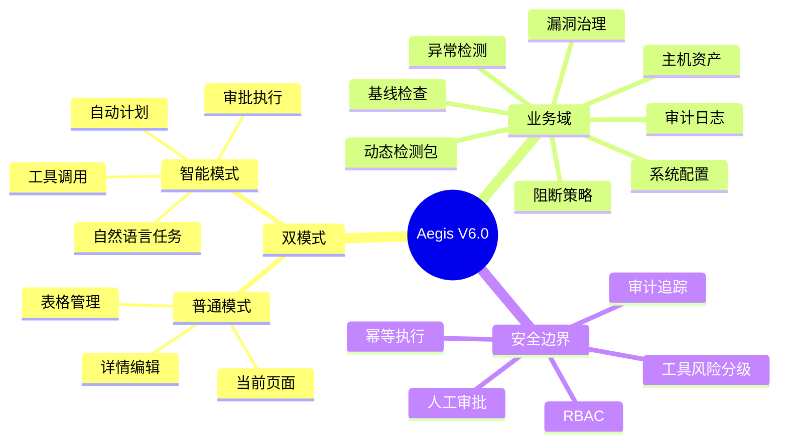

# Aegis V6.0 双模智能安全指挥台设计文档

**版本**: 6.0  
**日期**: 2026-05-29  
**状态**: 方案设计中  
**主题**: 普通模式与智能模式双模式切换，所有核心功能通过智能体对话完成，数据与权限完全互通

---

## 1. 版本定位

V6.0 将 Aegis 从“功能页面驱动的主机安全平台”升级为“页面操作 + 智能体操作共用同一控制面的双模安全系统”。

普通模式继续保留当前 V5.8 的全部页面和操作路径。智能模式新增全局安全智能体工作台，用户可以用自然语言完成主机巡检、基线检查、漏洞扫描、告警溯源、规则生成、动态检测包生产、阻断策略分析、系统配置排障等工作。

智能模式不建立一套独立业务数据。它通过工具注册中心调用现有 `api-server` service/repository/gRPC 能力，最终仍写入现有业务表。新增表只保存智能体会话、消息、上下文引用、工具调用、审批、记忆和审计轨迹。

---

## 2. 文档索引

| 文档 | 说明 |
|:---|:---|
| `prd_design_v6.0.md` | V6.0 产品需求、角色、用户流程、验收标准 |
| `overall_architecture_design_v6.0.md` | 总体架构、设计图、端到端链路、组件边界 |
| `frontend_development_design_v6.0.md` | 前端路由、页面布局、组件、Pinia store、API 类型、SSE 事件 |
| `backend_development_design_v6.0.md` | 后端目录、模型、服务、工具注册、审批网关、函数与接口 |
| `api_database_design_v6.0.md` | HTTP API、SSE 协议、数据库表结构、枚举和索引 |
| `implementation_blueprint_v6.0.md` | 面向开发落地的实施蓝图、调用链、主要函数、文件改造顺序、工具实现映射 |
| `agent_runtime_tool_orchestration_design_v6.0.md` | agent-runtime 复用、工具目录、意图路由、工具检索注入、V5.8 检测包/规则/阻断工具全量映射 |
| `assistant_api_curl_test_cases_v6.0.md` | Assistant 全接口 curl 测试用例、jq 断言、审批模式和白名单数据校验 |

---

## 3. V6.0 核心决策

| 决策点 | 结论 |
|:---|:---|
| 智能模式定位 | 全局安全智能体工作台，不是告警 AI 分析页的简单扩展 |
| 普通模式是否保留 | 完整保留，继续作为精确控制和可视化主界面 |
| 数据是否互通 | 完全互通，智能模式调用现有业务服务并写入同一业务表 |
| 是否新增独立智能体服务 | 第一版不新增独立微服务，放在 `api-server/internal/assistant` |
| 是否复用 agent-runtime | 必须复用现有 `github.com/alex-chenc/agent-runtime`，参考 `AIAnalysisHandler` 和 `llm/adapters.NewAegisRuntime` 的接入方式 |
| 是否一次性暴露全部工具 | 不允许。所有业务查询/动作都注册为 ToolSpec，但每次运行通过意图路由和工具检索挑选小集合注入 agent-runtime |
| 智能体工具审批模式 | 支持 `request_approval`、`whitelist`、`full_access` 三种模式 |
| 是否允许 AI 直接写数据库 | 不允许，必须通过工具调用现有 service/repository 边界 |
| 是否允许 AI 直接执行高风险动作 | 默认不允许；`request_approval` 全部审批，`whitelist` 白名单外审批，`full_access` 由管理员显式放行但保留审计 |
| DetectionPackage 安全边界 | AI 可生成草稿和解释构建结果，签名发布、启用、hook allowlist 修改必须拆成独立工具调用，按当前审批模式执行 |
| 审计要求 | 所有智能体工具调用、审批、执行结果必须可追溯 |
| 前端形态 | 新增 `/assistant` 智能模式工作台，并在配置页展示全部智能体工具和白名单开关 |

---

## 4. 目标能力地图

---

## 5. 推荐实施顺序

| 阶段 | 范围 | 目标 |
|:---|:---|:---|
| V6.0-alpha | 全局会话、消息、上下文引用、只读工具 | 智能模式可查询和解释全局数据 |
| V6.0-beta | 工具注册中心、计划执行、SSE、结果卡片 | 智能体可跨模块编排分析 |
| V6.0-rc | 审批网关、写操作工具、前端审批卡片 | 可安全创建任务、提交构建、修改配置 |
| V6.0 | 全部普通页面接入智能体入口 | 双模式体验闭环，所有核心功能可对话完成 |

---

## 6. 与 V5.8 的关系

V6.0 不替换 V5.8 的动态 eBPF DetectionPackage 方案，而是在其上增加智能编排入口：

- 复用 `detection_package_drafts`、`detection_package_builds`、`detection_packages`。
- 复用 builder gRPC、MinIO、server 到 agent 的下发链路。
- 复用 V5.8 的“AI 只生成草稿，人工构建、审核、签名、启用”的安全边界。
- 新增智能体工具覆盖动态检测包、Sigma 规则、阻断策略、阻断记录、hook allowlist、构建审核、签名、启用、回滚、卸载和包告警查询。
- 详细工具目录、风险等级、service 函数映射见 `agent_runtime_tool_orchestration_design_v6.0.md`。
