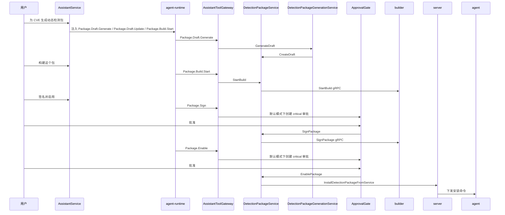

# Aegis V6.0 agent-runtime 与工具编排设计

**版本**: 6.0  
**日期**: 2026-06-04  
**状态**: 开发落地设计  
**核心结论**: V6.0 继续使用 `github.com/alex-chenc/agent-runtime` 构建智能体；所有业务能力都注册为 Aegis 内部工具，但每次运行只按用户意图检索并注入一小组工具，不把全量工具一次性给大模型。

---

## 1. 本文解决的问题

前序 V6.0 文档已经定义了“双模式”和“内部 Tool 层”，但还缺四个开发必须明确的点：

1. 智能体运行时必须沿用现有 `agent-runtime`，不能重写一个 Orchestrator。
2. V5.8 的动态 eBPF DetectionPackage、Sigma 规则管理、阻断策略和阻断记录必须纳入智能体工具范围。
3. 数据库查询类接口都要能成为大模型工具，但不能全部同时暴露给模型。
4. 主机攻击研判需要更强的跨源分析能力，但不能把资产、漏洞、基线、告警、Agent、外部 MCP 等所有底层工具一次性暴露给模型。
5. 开发人员需要知道主要链路、主要结构体、主要函数和每个工具落到哪个现有 service/repository 方法。

---

## 2. 总体方案

### 2.1 不把全量工具直接给模型

V6.0 后端会把所有可对话操作登记到 `ToolCatalog`，但运行时只给模型一个经过筛选的 `selected_tools`。

```text
用户消息
  -> ContextLoader 加载页面对象和会话上下文
  -> IntentRouter 判断领域、动作、对象、风险
  -> ToolSelector 从 ToolCatalog 检索候选工具
  -> RuntimeFactory 用 selected_tools 创建 agent-runtime
  -> agent-runtime.Run()
  -> AssistantToolGateway 执行工具或创建审批
  -> 写 assistant_* 审计表和业务表
```

### 2.2 为什么不用全量工具

如果把几十到上百个工具一次性给模型，会产生这些问题：

- prompt 变长，模型更容易忽略关键 schema。
- 工具名相近时误调用概率上升，例如 `Package.Enable` 和 `SigmaRule.Enable`。
- 高风险工具虽然有审批，但过早出现在模型上下文中会诱导模型规划危险动作。
- 新增业务模块后每次对话成本持续增长。

所以 V6.0 采用“全量注册、按需注入、可扩展检索”的模式。

### 2.3 推荐策略

```text
所有工具注册到 ToolCatalog
每次运行默认注入:
  1. System.Context
  2. Tool.Search
  3. 当前页面对象相关工具
  4. IntentRouter 命中的 Profile 工具，例如 Investigation.HostAttack.Analyze
  5. IntentRouter 命中的领域 topN 工具
  6. 低风险只读发现工具
必要时通过 Tool.Search 请求扩展工具集
```

工具数量约束：

| 约束 | 建议值 |
|:---|:---|
| 每次注入工具总数 | 12 到 24 个 |
| 单业务域工具数 | 不超过 10 个 |
| 写操作工具数 | 不超过 6 个 |
| high/critical 工具 | 只有用户明确表达执行意图时才注入 |
| 默认常驻工具 | `Tool.Search`、`Context.Get`、`Session.Summarize`、`Approval.ListPending` |

对主机攻击研判这类复杂任务，优先注入 `Investigation.*` 高层工具。高层工具由后端内部按固定链路调用底层 service/repository/gRPC 工具，模型只看到“研判目标”和“结构化结果”，减少工具过载和误调用。

---

## 3. 现有 agent-runtime 接入参考

当前 AI 分析页已经使用 `agent-runtime`：

| 文件 | 现状 |
|:---|:---|
| `api-server/internal/api/handler/ai_analysis_handler.go` | 在流式分析中创建 runtime 并调用 `runtime.Run(ctx, agentruntime.TaskInput{...})` |
| `api-server/internal/llm/adapters/runtime_factory.go` | `NewAegisRuntime(...)` 组装 LLM adapter、tool gateway、hook sink、prompt provider、runtime config |
| `api-server/internal/llm/adapters/tool_descriptors.go` | 定义 `[]agentruntime.ToolDescriptor` |
| `api-server/internal/llm/adapters/tool_gateway_adapter.go` | 实现 `agentruntime.ToolGateway`，把工具转成 server gRPC `ExecuteTool` |
| `api-server/internal/llm/adapters/hook_sink_sse.go` | 把 runtime hook 事件转成 SSE |

V6.0 不重新发明这些能力，而是抽象成通用运行时工厂。

---

## 4. V6.0 运行时工厂

### 4.1 新增文件

```text
api-server/internal/assistant/runtime_factory.go
api-server/internal/assistant/runtime_config.go
api-server/internal/assistant/runtime_events.go
api-server/internal/assistant/tool_catalog.go
api-server/internal/assistant/tool_selector.go
api-server/internal/assistant/intent_router.go
api-server/internal/assistant/tool_gateway.go
api-server/internal/assistant/tool_expansion.go
```

保留现有 `api-server/internal/llm/adapters`，但把可复用代码拆出来：

- `LLMClientAdapter` 继续复用。
- `SSEHookSink` 继续复用或复制成 `AssistantHookSink` 后支持更多事件。
- `AegisPromptProvider` 扩展为按 `mode` 构建 prompt。
- `NewAegisRuntime` 保留给 AI 分析页；新增 `NewAssistantRuntime` 给 V6.0 全局智能体。

### 4.2 RuntimeFactory 结构体

```go
package assistant

import (
    "context"
    agentruntime "github.com/alex-chenc/agent-runtime"
)

type RuntimeFactory struct {
    configRepo       ConfigRepository
    vectorService    ExperienceVectorService
    reflectionRepo   ReflectionRepository
    catalog          *ToolCatalog
    selector         *ToolSelector
    gatewayFactory   *ToolGatewayFactory
    promptFactory    *PromptProviderFactory
    hookSinkFactory  *HookSinkFactory
}

type RuntimeBuildRequest struct {
    SessionID       string
    Operator        string
    UserInput       string
    Mode            RuntimeMode
    ContextRefs     []ContextRef
    PageRoute       string
    PreviousSummary string
    MaxIterations   int
    AllowExpansion  bool
}

type RuntimeBuildResult struct {
    Runtime       *agentruntime.Runtime
    ToolSelection ToolSelectionResult
    UserContext   map[string]interface{}
}

func NewRuntimeFactory(deps RuntimeFactoryDeps) *RuntimeFactory

func (f *RuntimeFactory) Build(ctx context.Context, req RuntimeBuildRequest) (*RuntimeBuildResult, error)
```

### 4.3 Build 函数主流程

```go
func (f *RuntimeFactory) Build(ctx context.Context, req RuntimeBuildRequest) (*RuntimeBuildResult, error) {
    llmClient, err := f.buildLLMClient(ctx)
    if err != nil {
        return nil, err
    }

    userContext, err := f.loadUserContext(ctx, req)
    if err != nil {
        return nil, err
    }

    selection, err := f.selector.Select(ctx, ToolSelectionRequest{
        Query:       req.UserInput,
        Mode:        req.Mode,
        Operator:    req.Operator,
        PageRoute:   req.PageRoute,
        ContextRefs: req.ContextRefs,
        MaxTools:    24,
    })
    if err != nil {
        return nil, err
    }

    gateway := f.gatewayFactory.NewGateway(ToolGatewayOptions{
        SessionID: req.SessionID,
        Operator:  req.Operator,
        ToolNames: selection.ToolNames(),
    })

    hookSink := f.hookSinkFactory.New(req.SessionID)
    promptProvider := f.promptFactory.New(PromptProviderOptions{
        Mode:          req.Mode,
        UserContext:   userContext,
        ToolSelection: selection,
    })

    config := DefaultAssistantRuntimeConfig(req.MaxIterations)
    runtime, err := agentruntime.New(
        agentruntime.WithLLMClient(NewLLMClientAdapter(llmClient, userContext)),
        agentruntime.WithToolGateway(gateway),
        agentruntime.WithTools(selection.Descriptors),
        agentruntime.WithHooks(hookSink),
        agentruntime.WithPromptProvider(promptProvider),
        agentruntime.WithConfig(config),
    )
    if err != nil {
        return nil, err
    }

    return &RuntimeBuildResult{
        Runtime:       runtime,
        ToolSelection: selection,
        UserContext:   userContext,
    }, nil
}
```

### 4.4 Runtime 配置

沿用 AI 分析页现有配置风格，但根据全局智能体调低工具上限：

```go
func DefaultAssistantRuntimeConfig(maxIterations int) agentruntime.RuntimeConfig {
    if maxIterations <= 0 {
        maxIterations = 80
    }
    return agentruntime.RuntimeConfig{
        MaxTotalTurns:         maxIterations,
        MaxPlanSteps:          8,
        MaxStepReactTurns:     8,
        MaxToolCalls:          60,
        MaxToolCallsPerStep:   6,
        MaxToolFailures:       8,
        MaxModelFailures:      5,
        MaxParseFailures:      3,
        MaxNoProgressTurns:    3,
        TaskTimeout:           30 * time.Minute,
        ModelTimeout:          60 * time.Second,
        ToolTimeout:           60 * time.Second,
        HookTimeout:           10 * time.Second,
        EnableReflection:      true,
        EnableAudit:           true,
        EnableCorrection:      true,
        EnableExperience:      true,
        AuditEveryNSteps:      3,
        MaxAudits:             2,
        MaxReflections:        2,
        MaxStepRetries:        2,
        MaxCorrections:        2,
        AllowDynamicNewSteps:  true,
        AllowSkipFailedStep:   true,
        AllowBestEffortAnswer: true,
        AllowHighRiskTools:    false,
        AllowDangerousTools:   false,
        MaxContextTokens:      256000,
        ReservedOutputTokens:  8192,
        EnableContextCompress: true,
        ToolCompressRatio:     0.70,
        StepCompressRatio:     0.80,
        LLMCompressRatio:      0.95,
        CompressTargetRatio:   0.60,
        RecentTurnsToKeep:     6,
    }
}
```

---

## 5. ToolCatalog 设计

### 5.1 ToolSpec

```go
type ToolRisk string

const (
    ToolRiskReadonly ToolRisk = "readonly"
    ToolRiskLow      ToolRisk = "low"
    ToolRiskMedium   ToolRisk = "medium"
    ToolRiskHigh     ToolRisk = "high"
    ToolRiskCritical ToolRisk = "critical"
)

type ToolDomain string

const (
    DomainSystem        ToolDomain = "system"
    DomainHost          ToolDomain = "host"
    DomainBaseline      ToolDomain = "baseline"
    DomainTask          ToolDomain = "task"
    DomainVulnerability ToolDomain = "vulnerability"
    DomainDetection     ToolDomain = "detection"
    DomainSigmaRule     ToolDomain = "sigma_rule"
    DomainBlock         ToolDomain = "block"
    DomainPackage       ToolDomain = "package"
    DomainConfig        ToolDomain = "config"
    DomainAudit         ToolDomain = "audit"
    DomainAgent         ToolDomain = "agent"
)

type ToolOperation string

const (
    OpList      ToolOperation = "list"
    OpGet       ToolOperation = "get"
    OpSearch    ToolOperation = "search"
    OpCreate    ToolOperation = "create"
    OpUpdate    ToolOperation = "update"
    OpDelete    ToolOperation = "delete"
    OpGenerate  ToolOperation = "generate"
    OpExecute   ToolOperation = "execute"
    OpDispatch  ToolOperation = "dispatch"
    OpApprove   ToolOperation = "approve"
    OpRollback  ToolOperation = "rollback"
)

type ToolSpec struct {
    Name              string
    Domain            ToolDomain
    Operation         ToolOperation
    Capability        string
    Description       string
    Aliases           []string
    Tags              []string
    ObjectTypes       []string
    PageRoutes        []string
    Risk              ToolRisk
    AutoCallable      bool
    RequiresApproval  bool
    Idempotent        bool
    DefaultTimeout    time.Duration
    ArgsSchema        map[string]any
    ResultSchema      map[string]any
    Handler           ToolHandler
    ServiceBinding    ServiceBinding
}

type ServiceBinding struct {
    Component string
    File      string
    Function  string
    Notes     string
}

type ToolHandler interface {
    Execute(ctx context.Context, req ToolExecutionRequest) (*ToolExecutionResult, error)
}
```

### 5.2 ToolCatalog 接口

```go
type ToolCatalog struct {
    byName map[string]ToolSpec
    index  *ToolIndex
}

func NewToolCatalog() *ToolCatalog
func (c *ToolCatalog) Register(spec ToolSpec) error
func (c *ToolCatalog) MustRegister(spec ToolSpec)
func (c *ToolCatalog) Resolve(name string) (ToolSpec, bool)
func (c *ToolCatalog) Search(ctx context.Context, q ToolSearchQuery) ([]ToolMatch, error)
func (c *ToolCatalog) BuildDescriptors(names []string) []agentruntime.ToolDescriptor
func (c *ToolCatalog) ListByDomain(domain ToolDomain) []ToolSpec
func (c *ToolCatalog) ListForPageRoute(route string) []ToolSpec
```

### 5.3 ToolDescriptor 转换

```go
func (s ToolSpec) Descriptor() agentruntime.ToolDescriptor {
    return agentruntime.ToolDescriptor{
        Name:             s.Name,
        Description:      s.Description,
        ArgsSchema:       s.ArgsSchema,
        RiskLevel:        toRuntimeRisk(s.Risk),
        AutoCallable:     s.AutoCallable,
        RequiresApproval: s.RequiresApproval,
        DefaultTimeout:   s.DefaultTimeout,
        Idempotent:       s.Idempotent,
        Tags:             append([]string{string(s.Domain), string(s.Operation)}, s.Tags...),
    }
}
```

---

## 6. 工具检索与注入算法

### 6.1 IntentRouter

`IntentRouter` 负责把用户话术变成领域和动作，不执行工具。

```go
type IntentRouter struct {
    rules       []IntentRule
    llmClientFn func(ctx context.Context) (*llm.LLMClient, error)
}

type IntentResult struct {
    Domains          []ToolDomain
    Operations       []ToolOperation
    ObjectTypes      []string
    ObjectIDs        []string
    Keywords         []string
    ExplicitToolName string
    RiskHint         ToolRisk
    NeedWrite        bool
    NeedApproval     bool
    Confidence       float64
    Reason           string
}

func (r *IntentRouter) Classify(ctx context.Context, req IntentRequest) (*IntentResult, error)
```

实现策略：

1. 先用规则命中常见词，例如“检测包/签名/启用/hook 白名单”命中 `DomainPackage`。
2. 结合页面路由，例如 `/detection/packages/:id` 默认提升 `DomainPackage`。
3. 结合上下文对象，例如 `object_type=alert` 默认提升 `DomainDetection` 和 `DomainBlock`。
4. 规则置信度低时，调用一次轻量 LLM 分类，只返回 JSON，不带工具。

### 6.2 ToolSelector

```go
type ToolSelectionRequest struct {
    Query       string
    Mode        RuntimeMode
    Operator    string
    PageRoute   string
    ContextRefs []ContextRef
    MaxTools    int
}

type ToolSelectionResult struct {
    Intent       IntentResult
    Matches      []ToolMatch
    Descriptors  []agentruntime.ToolDescriptor
    AlwaysTools  []string
    ExpandedFrom []string
}

type ToolMatch struct {
    Name       string
    Score      float64
    Domain     ToolDomain
    Risk       ToolRisk
    Reason     string
}

func (s *ToolSelector) Select(ctx context.Context, req ToolSelectionRequest) (ToolSelectionResult, error)
func (s *ToolSelector) Expand(ctx context.Context, current ToolSelectionResult, query string, names []string) (ToolSelectionResult, error)
```

### 6.3 评分规则

```text
score =
  0.35 * domain_match
+ 0.20 * operation_match
+ 0.15 * keyword_match
+ 0.10 * page_route_match
+ 0.10 * context_object_match
+ 0.05 * recent_usage_match
+ 0.05 * risk_fit
```

过滤规则：

- `critical` 工具默认不进入候选，除非用户明确说“签名、启用、回滚、删除、阻断、执行、修改白名单”等动作。
- 没有 RBAC 权限的工具不进入候选。
- `delete` 类工具默认只在第二轮确认或审批恢复阶段进入候选。
- 查询类工具总是优先注入，但必须分页和限量。

### 6.4 Tool.Search 元工具

`Tool.Search` 是常驻工具，用来处理模型发现当前工具不够的情况。

```go
type ToolSearchArgs struct {
    Query      string   `json:"query"`
    Domains    []string `json:"domains"`
    Operations []string `json:"operations"`
    MaxResults int      `json:"max_results"`
}

type ToolSearchResult struct {
    Matches []ToolSearchItem `json:"matches"`
}

type ToolSearchItem struct {
    Name        string   `json:"name"`
    Domain      string   `json:"domain"`
    Operation   string   `json:"operation"`
    Risk        string   `json:"risk"`
    Description string   `json:"description"`
    ArgsSummary string   `json:"args_summary"`
    Tags        []string `json:"tags"`
}
```

注意：`Tool.Search` 返回的是工具说明，不直接把新工具注入到已经运行中的模型上下文。开发实现采用“两段式扩展”：

```text
第一段 runtime:
  注入 initial tools + Tool.Search
  模型调用 Tool.Search
  AssistantToolGateway 记录 expansion_requested

Orchestrator:
  读取 expansion_requested
  调 ToolSelector.Expand()
  追加工具选择记录
  构造带前一段摘要的新 runtime

第二段 runtime:
  注入 expanded tools
  继续完成任务
```

这样不依赖 agent-runtime 支持运行中动态追加 tool descriptor，开发风险最低。

---

## 7. AssistantToolGateway

### 7.1 职责

`AssistantToolGateway` 实现 `agentruntime.ToolGateway`，但不只转发 agent gRPC。它统一调度本地业务工具和 agent 工具。

```go
type AssistantToolGateway struct {
    sessionID      string
    operator       string
    catalog        *ToolCatalog
    selectedTools  map[string]struct{}
    dispatcher     *ToolDispatcher
    approvalGate   *ApprovalGate
    toolCallRepo   ToolCallRepository
    expansionStore *ToolExpansionStore
}

func (g *AssistantToolGateway) Call(ctx context.Context, req agentruntime.ToolRequest) (agentruntime.ToolResponse, error)
func (g *AssistantToolGateway) Cancel(ctx context.Context, callID string, reason string) error
```

### 7.2 Call 主流程

```go
func (g *AssistantToolGateway) Call(ctx context.Context, req agentruntime.ToolRequest) (agentruntime.ToolResponse, error) {
    spec, ok := g.catalog.Resolve(req.ToolName)
    if !ok {
        return runtimeToolError(req, "unknown tool"), nil
    }
    if _, allowed := g.selectedTools[req.ToolName]; !allowed {
        return runtimeToolError(req, "tool is not selected for this run; call Tool.Search first"), nil
    }

    call := g.persistToolCallStarted(req, spec)

    if spec.Name == "Tool.Search" {
        result := g.dispatcher.ExecuteSearch(ctx, req)
        g.expansionStore.Record(g.sessionID, result)
        g.persistToolCallFinished(call, result)
        return runtimeToolSuccess(req, result), nil
    }

    decision := g.approvalGate.Evaluate(ctx, ApprovalEvaluateRequest{
        Operator: g.operator,
        Spec:     spec,
        Args:     req.Args,
    })
    if decision.RequireApproval {
        approval := g.approvalGate.CreateApproval(ctx, CreateApprovalRequest{
            SessionID:  g.sessionID,
            ToolCallID: call.CallID,
            ToolName:   spec.Name,
            Risk:       spec.Risk,
            Args:       req.Args,
            Summary:    decision.ImpactSummary,
        })
        g.persistToolCallWaitingApproval(call, approval)
        return runtimeToolSuccess(req, ApprovalRequiredResult{ApprovalID: approval.ApprovalID}), nil
    }

    result, err := g.dispatcher.Execute(ctx, ToolExecutionRequest{
        ToolName: spec.Name,
        Args:     req.Args,
        Operator: g.operator,
        SessionID: g.sessionID,
    })
    if err != nil {
        g.persistToolCallFailed(call, err)
        return runtimeToolError(req, err.Error()), nil
    }
    g.persistToolCallFinished(call, result)
    return runtimeToolSuccess(req, result), nil
}
```

---

## 8. 工具命名规范

统一使用 `Domain.Operation`，不要混用自然语言函数名。

| 类型 | 示例 |
|:---|:---|
| 查询列表 | `Host.List`、`Detection.Alert.List`、`Package.List` |
| 查询详情 | `Host.Get`、`SigmaRule.Get`、`Package.Get` |
| 创建草稿 | `Package.Draft.Create` |
| 更新配置 | `Package.Allowlist.Update`、`Block.Policy.Update` |
| 执行动作 | `Vulnerability.Scan.Start`、`Detection.Alert.Block` |
| AI 生成 | `SigmaRule.Generate`、`Package.Draft.Generate` |
| Agent 现场查询 | `Agent.Process.List`、`Agent.Network.List` |

---

## 9. 数据库查询接口工具化原则

用户说“数据库查询的接口都应该支持给大模型做工具”，V6.0 的设计结论是：

1. 所有现有页面依赖的 `List/Get/Stats/Trend` 能力都登记为只读工具。
2. 工具实现必须走 repository/service，不提供任意 SQL 工具。
3. 所有列表工具必须分页，默认 `page_size <= 20`，最大 `page_size <= 100`。
4. 所有大字段结果要摘要化，例如 YAML、脚本、构建日志、LLM 响应只返回摘要和对象链接。
5. 查询工具全部可被 `Tool.Search` 检索，但不全部注入模型。

禁止第一版提供：

```text
DB.RawSQL
DB.ExecuteSQL
DB.DeleteRows
DB.ExportAll
```

原因是这会绕开业务权限、审计和安全边界。

---

## 10. V5.8 动态检测包工具目录

### 10.1 Package 生命周期工具

| 工具名 | 风险 | 是否默认白名单 | 绑定函数 |
|:---|:---|:---|:---|
| `Package.List` | readonly | 是 | `DetectionPackageService.ListPackages(ctx,page,pageSize,status,search)` |
| `Package.Get` | readonly | 是 | `DetectionPackageService.GetPackage(ctx,packageID)` |
| `Package.Draft.Get` | readonly | 是 | `DetectionPackageService.GetDraft(ctx,packageID)` |
| `Package.Draft.Create` | medium | 否 | `DetectionPackageService.CreateDraft(ctx,req,operator)` |
| `Package.Draft.Update` | medium | 否 | `DetectionPackageService.UpdateDraft(ctx,draftID,req,operator)` |
| `Package.Draft.Delete` | high | 否 | `DetectionPackageService.DeleteDraftByPackageID(ctx,packageID,operator)` |
| `Package.Build.Start` | medium | 否 | `DetectionPackageService.StartBuild(ctx,packageID,operator)` |
| `Package.Build.Get` | readonly | 是 | `DetectionPackageService.GetBuild(ctx,buildID)` |
| `Package.Build.GetLatest` | readonly | 是 | `DetectionPackageService.GetLatestBuild(ctx,packageID)` |
| `Package.Build.GetLog` | readonly | 是 | `DetectionPackageService.GetBuildLogURL(ctx,buildID)` |
| `Package.Build.Review` | high | 否 | `DetectionPackageService.ReviewBuild(ctx,buildID,approved,comment,operator)` |
| `Package.Sign` | critical | 否 | `DetectionPackageService.SignPackage(ctx,packageID,operator)` |
| `Package.Enable` | critical | 否 | `DetectionPackageService.EnablePackage(ctx,packageID,operator)` |
| `Package.Disable` | high | 否 | `DetectionPackageService.DisablePackage(ctx,packageID,operator)` |
| `Package.Rollback` | critical | 否 | `DetectionPackageService.RollbackPackage(ctx,packageID,targetVersion,operator)` |
| `Package.Uninstall` | critical | 否 | `DetectionPackageService.UninstallPackage(ctx,packageID,operator)` |
| `Package.Delete` | high | 否 | `DetectionPackageService.DeletePackage(ctx,packageID,operator)` |
| `Package.HostStatus.List` | readonly | 是 | `DetectionPackageService.ListHostStatus(ctx,packageID,version,page,pageSize)` |
| `Package.Alert.List` | readonly | 是 | `DetectionPackageService.ListPackageAlerts(ctx,packageID,page,pageSize)` |

### 10.2 Package AI 草稿生成

现有 `DetectionPackageHandler.AIGenerateDraft` 把 LLM 调用和 handler 绑在一起。V6.0 必须下沉为 service，供普通页面和智能体共同调用。

新增文件：

```text
api-server/internal/service/detection_package_generation_service.go
```

核心函数：

```go
type DetectionPackageGenerationService struct {
    configRepo *repository.ConfigRepository
    pkgService *DetectionPackageService
}

type GenerateDetectionPackageDraftRequest struct {
    CVEID                    string
    VulnerabilityDescription string
    AttackPrerequisites      string
    ExploitationChain        string
    FalsePositiveConstraints string
    Operator                 string
}

func (s *DetectionPackageGenerationService) GenerateDraft(
    ctx context.Context,
    req GenerateDetectionPackageDraftRequest,
) (*model.DetectionPackageDraft, error)

func (s *DetectionPackageGenerationService) parseLLMResponse(response string) (GeneratedPackageSections, error)
```

工具映射：

| 工具名 | 风险 | 绑定函数 |
|:---|:---|:---|
| `Package.Draft.Generate` | medium | `DetectionPackageGenerationService.GenerateDraft(ctx,req)` |
| `Package.Draft.Explain` | readonly | 解析草稿 HookPlan/eBPF/Sigma/Correlation 并返回解释 |
| `Package.Build.ExplainFailure` | readonly | 读取 build error/log 摘要，给出修复建议 |

### 10.3 Hook allowlist 工具

| 工具名 | 风险 | 绑定函数 |
|:---|:---|:---|
| `Package.Allowlist.Get` | readonly | `DetectionPackageService.GetAllowlist(ctx)` |
| `Package.Allowlist.History` | readonly | `DetectionPackageService.ListAllowlistHistory(ctx,page,pageSize)` |
| `Package.Allowlist.Update` | critical | `DetectionPackageService.UpdateAllowlist(ctx,configJSON,description,operator)` |
| `Package.Allowlist.CheckPackage` | readonly | 新增 `DetectionPackagePolicyService.CheckAllowlistAgainstDraft(ctx,packageID)` |

`Package.Allowlist.Update` 默认不加入白名单；在 `request_approval` 模式和 `whitelist` 模式的非白名单状态下必须审批，因为它会影响所有在线 agent 对动态 eBPF hook 的加载策略。`full_access` 模式可跳过工具审批，但仍必须保留 RBAC、参数校验和审计。

### 10.4 动态检测包链路



---

## 11. Sigma 规则工具目录

### 11.1 规则查询和状态

| 工具名 | 风险 | 绑定函数 |
|:---|:---|:---|
| `SigmaRule.List` | readonly | `SigmaRuleRepository.List(page,pageSize,filters)` |
| `SigmaRule.Get` | readonly | `SigmaRuleRepository.FindByID(id)` 或 `FindByRuleID(ruleID)` |
| `SigmaRule.Active.List` | readonly | `SigmaRuleRepository.GetActiveAndExperimental()` |
| `SigmaRule.Experimental.List` | readonly | `SigmaRuleRepository.GetExperimentalRules()` |
| `SigmaRule.CountActive` | readonly | `SigmaRuleRepository.GetActiveCount()` |

### 11.2 规则生成和导入

现有 `DetectionHandler.GenerateSigmaRule`、`GenerateTestRule`、`UploadRules`、`ImportRules` 中有较多 handler 逻辑。V6.0 应抽出服务：

```text
api-server/internal/service/sigma_rule_management_service.go
```

```go
type SigmaRuleManagementService struct {
    sigmaRuleRepo         *repository.SigmaRuleRepository
    blockPolicyRepo       *repository.BlockPolicyRepository
    alertRepo             *repository.AlertRepository
    sigmaRuleService      *service.SigmaRuleService
    sigmaRuleUpload       *service.SigmaRuleUploadService
    ruleGenerationService *service.RuleGenerationService
    configRepo            *repository.ConfigRepository
}

func (s *SigmaRuleManagementService) GenerateRule(ctx context.Context, req GenerateSigmaRuleRequest, operator string) (*model.SigmaRule, error)
func (s *SigmaRuleManagementService) GenerateTestRule(ctx context.Context, req GenerateTestRuleRequest) (*service.GenerateRuleResponse, error)
func (s *SigmaRuleManagementService) ImportRules(ctx context.Context, content []byte, operator string) (*ImportRulesResult, error)
func (s *SigmaRuleManagementService) UploadRules(ctx context.Context, file io.Reader, fileName string, size int64, operator string) (*service.UploadResult, error)
func (s *SigmaRuleManagementService) UpdateContent(ctx context.Context, ruleID string, content string, operator string) (*model.SigmaRule, error)
func (s *SigmaRuleManagementService) UpdateStatus(ctx context.Context, ruleID string, status string, targetHostIDs []string, operator string) error
func (s *SigmaRuleManagementService) DeleteRules(ctx context.Context, ruleIDs []string, operator string) (*DeleteRulesResult, error)
func (s *SigmaRuleManagementService) CheckBeforeDelete(ctx context.Context, ruleIDs []string) (*RuleDeleteCheckResult, error)
```

工具映射：

| 工具名 | 风险 | 绑定函数 |
|:---|:---|:---|
| `SigmaRule.Generate` | medium | `SigmaRuleManagementService.GenerateRule` |
| `SigmaRule.GenerateTest` | readonly | `RuleGenerationService.GenerateTestRule` |
| `SigmaRule.Upload` | medium | `SigmaRuleManagementService.UploadRules` |
| `SigmaRule.Import` | medium | `SigmaRuleManagementService.ImportRules` |
| `SigmaRule.Content.Update` | high | `SigmaRuleManagementService.UpdateContent` |
| `SigmaRule.Status.Update` | high | `SigmaRuleManagementService.UpdateStatus` |
| `SigmaRule.Delete.Check` | readonly | `SigmaRuleManagementService.CheckBeforeDelete` |
| `SigmaRule.Delete` | critical | `SigmaRuleManagementService.DeleteRules` |
| `SigmaRule.AIConfig.Get` | readonly | `AIRuleConfigService.GetConfig` |
| `SigmaRule.AIConfig.Update` | high | `AIRuleConfigService.UpdateConfig` |

### 11.3 规则安全边界

- `SigmaRule.Generate` 只创建 experimental 规则。
- `SigmaRule.Status.Update` 到 active 需要 high 审批，因为会下发到 agent。
- `SigmaRule.Delete` 是 critical，因为当前实现会关联删除告警和阻断策略。
- `SigmaRule.Content.Update` 必须记录 diff 摘要。

---

## 12. 阻断工具目录

### 12.1 告警和阻断记录

| 工具名 | 风险 | 绑定函数 |
|:---|:---|:---|
| `Detection.Alert.List` | readonly | `AlertRepository.List(page,pageSize,filters)` |
| `Detection.Alert.Get` | readonly | `AlertRepository.FindByID(id)` |
| `Detection.Alert.Resolve` | low | `AlertRepository.Resolve(id)` |
| `Detection.Alert.Block` | critical | `AlertService.ManualBlock(alertID,action)` |
| `Detection.Alert.Delete` | high | `AlertRepository.DeleteByIDs(alertIDs)` |
| `Detection.ProcessTree.Get` | readonly | 优先返回 `alert.ProcessTree`，必要时走 agent 工具 |
| `Block.Record.List` | readonly | `BlockRepository.List(page,pageSize,filters)` |
| `Block.Record.CountToday` | readonly | `BlockRepository.GetTodayCount()` |

### 12.2 阻断策略

| 工具名 | 风险 | 绑定函数 |
|:---|:---|:---|
| `Block.Policy.List` | readonly | `BlockPolicyRepository.ListPaginatedWithRuleTitle(page,pageSize,query)` |
| `Block.Policy.Get` | readonly | `BlockPolicyRepository.FindByMitreID(mitreID)` |
| `Block.Policy.Update` | high | `BlockPolicyRepository.Update(mitreID,updates)` |
| `Block.Policy.Sync` | medium | `DetectionPolicyService.ReconcileRulePolicyBindings()` |
| `Block.Policy.Delete` | critical | `BlockPolicyRepository.DeleteByMitreID(mitreID)` 加关联删除 |

现有 `DetectionHandler.reconcileRulePolicyBindings`、`createPolicyForRule` 在 handler 内。V6.0 需要下沉：

```text
api-server/internal/service/detection_policy_service.go
```

```go
type DetectionPolicyService struct {
    sigmaRuleRepo   *repository.SigmaRuleRepository
    blockPolicyRepo *repository.BlockPolicyRepository
    alertRepo       *repository.AlertRepository
    wsService       *service.WebSocketService
}

func (s *DetectionPolicyService) ReconcileRulePolicyBindings(ctx context.Context) (*PolicyReconcileResult, error)
func (s *DetectionPolicyService) CreatePolicyForRule(ctx context.Context, rule *model.SigmaRule) error
func (s *DetectionPolicyService) UpdatePolicy(ctx context.Context, mitreID string, req UpdateBlockPolicyRequest, operator string) (*model.BlockPolicy, error)
func (s *DetectionPolicyService) DeletePolicyCascade(ctx context.Context, mitreID string, operator string) (*DeleteBlockPolicyResult, error)
```

### 12.3 阻断审批原则

- `Detection.Alert.Block` 默认不加入白名单；在 `request_approval` 或 `whitelist` 非白名单状态下必须 critical 审批，因为会影响主机进程、网络或文件访问。
- `Block.Policy.Update` 修改 `auto_block` 或 `ai_auto_block` 时默认不加入白名单；需要审批时展示 high 风险摘要。
- `Block.Policy.Delete` 默认不加入白名单；需要审批时展示 critical 风险摘要，因为会关联删除规则/告警。
- 只读查询、统计和趋势分析默认加入白名单，可自动执行；`request_approval` 模式会覆盖为全部审批。

---

## 13. Detection 查询和 AI 聚合工具

| 工具名 | 风险 | 绑定函数 |
|:---|:---|:---|
| `Detection.Statistics.Get` | readonly | `AlertRepository.GetTodayCount`、`BlockRepository.GetTodayCount`、`AlertRepository.GetAffectedHostCount`、`SigmaRuleRepository.GetActiveCount` |
| `Detection.Trend.Get` | readonly | `AlertRepository.GetTrend(hours)` |
| `Detection.AttackMatrix.Get` | readonly | `DetectionHandler.GetDefaultMITREMatrix` + `AlertRepository.GetCountByMitreID`，需下沉 service |
| `Detection.Aggregation.Start` | medium | `LLMAggregationService.StartAggregation(ctx,req)` |
| `Detection.Aggregation.Get` | readonly | `LLMAggregationService.GetStatus(aggregationID)` |
| `Detection.ToolCall.List` | readonly | `ToolCallRepository.List(page,pageSize,filters)` |
| `Detection.RuntimeEvent.List` | readonly | 新增 `RuntimeEventQueryService.List(ctx,q)` |

新增服务建议：

```text
api-server/internal/service/detection_query_service.go
```

```go
type DetectionQueryService struct {
    alertRepo        *repository.AlertRepository
    blockRepo        *repository.BlockRepository
    sigmaRuleRepo    *repository.SigmaRuleRepository
    toolCallRepo     *repository.ToolCallRepository
    runtimeEventRepo *repository.RuntimeEventRepository
}

func (s *DetectionQueryService) ListAlerts(ctx context.Context, q AlertQuery) ([]model.Alert, int64, error)
func (s *DetectionQueryService) GetAlert(ctx context.Context, id string) (*model.Alert, error)
func (s *DetectionQueryService) GetStatistics(ctx context.Context) (*DetectionStatistics, error)
func (s *DetectionQueryService) GetTrend(ctx context.Context, hours int) ([]TrendPoint, error)
func (s *DetectionQueryService) GetAttackMatrix(ctx context.Context) (*MITREMatrix, error)
func (s *DetectionQueryService) ListToolCalls(ctx context.Context, q PageQuery) ([]model.ToolCall, int64, error)
func (s *DetectionQueryService) ListRuntimeEvents(ctx context.Context, q RuntimeEventQuery) ([]model.RuntimeEvent, int64, error)
```

---

## 14. 其他业务域工具覆盖

### 14.1 主机和 Agent

| 工具名 | 风险 | 绑定函数 |
|:---|:---|:---|
| `Host.List` | readonly | `HostRepository.FindAll(page,pageSize,query)` + `Count(query)` |
| `Host.Get` | readonly | `HostRepository.FindByID(id)` |
| `Host.AgentStatus.Get` | readonly | `ServerClient.GetAgentStatus` 如已有 |
| `Agent.Process.List` | readonly | server gRPC `ExecuteTool(GetRunningProcesses)` |
| `Agent.Process.Tree` | readonly | server gRPC `ExecuteTool(GetProcessTree)` |
| `Agent.Network.List` | readonly | server gRPC `ExecuteTool(GetNetworkConnections)` |
| `Agent.File.OpenList` | readonly | server gRPC `ExecuteTool(GetOpenFiles)` |
| `Agent.Log.Query` | readonly | server gRPC `ExecuteTool(QueryHistoricalLogs)` |

### 14.2 基线和任务

| 工具名 | 风险 | 绑定函数 |
|:---|:---|:---|
| `Baseline.Template.List` | readonly | `TemplateRepository.List` 或现有 handler 下沉 service |
| `Baseline.Template.GetStatus` | readonly | `TemplateHandler.GetTemplateStatus` 逻辑下沉 |
| `Baseline.Rule.List` | readonly | `RuleRepository.FindByTemplateID` |
| `Baseline.Rule.Script.Generate` | medium | `ScriptGenerationService.GenerateCheckScript/GenerateFixScript` |
| `Baseline.Rule.Script.Update` | high | `RuleRepository.UpdateScriptContent` |
| `Task.List` | readonly | `TaskLogRepository.ListTaskGroups` |
| `Task.Get` | readonly | `TaskLogRepository` 详情查询 |
| `Task.RunCheck` | medium | `TaskService.CreateAndDispatchTasks(..., "check")` |
| `Task.RunFix` | high | `TaskService.CreateAndDispatchTasks(..., "fix")` |
| `Task.Delete` | high | `TaskLogRepository` 删除能力 |

### 14.3 漏洞治理

| 工具名 | 风险 | 绑定函数 |
|:---|:---|:---|
| `Vulnerability.List` | readonly | `VulnerabilityService.ListVulnerabilities(params)` |
| `Vulnerability.Get` | readonly | `VulnerabilityService.GetVulnerabilityByCveID(cveID)` |
| `Vulnerability.AffectedHosts.List` | readonly | `VulnerabilityService.GetAffectedHosts(vulnerabilityID)` |
| `Vulnerability.Scan.Start` | medium | `VulnerabilityService.StartScan(ctx,hostIDs)` |
| `Vulnerability.Scan.GetStatus` | readonly | `VulnerabilityService.GetScanStatus(scanID)` |
| `Vulnerability.CustomQuery.Start` | medium | `CustomCVEService.StartCustomQuery(ctx,cveID)` |
| `Vulnerability.Script.Generate` | medium | `HostVulnerabilityScriptService.GenerateScripts(ctx,cveID,hostIDs,scriptType)` |
| `Vulnerability.Script.Execute` | high | `HostVulnerabilityScriptService.ExecuteScripts(ctx,cveID,scriptType,hostIDs)` |

### 14.4 配置、审计、通知

| 工具名 | 风险 | 绑定函数 |
|:---|:---|:---|
| `Config.LLM.Get` | readonly | `ConfigRepository.GetActive()`，脱敏返回 |
| `Config.LLM.Test` | readonly | `ConfigService.TestLLMConnection`，需要从 handler 下沉 |
| `Config.LLM.Update` | high | `ConfigService.UpdateLLMConfig`，需要从 handler 下沉 |
| `Audit.Log.List` | readonly | `AuditLogRepo.List(scriptType,auditSource,passed,page,pageSize)` |
| `Audit.Log.GetStats` | readonly | `AuditLogRepo.GetStats()` |
| `Notification.List` | readonly | `NotificationService.List(filter)` |

### 14.5 外接 MCP 数据源工具

外接 MCP 只作为外部数据源协议，智能体仍调用 Aegis 内部工具。完整配置、Prompt 和数据脱敏设计见 `external_mcp_datasource_design_v6.0.md`。

| 工具名 | 风险 | 默认白名单 | 绑定函数 |
|:---|:---|:---:|:---|
| `ExternalMCP.Source.List` | readonly | 是 | `ExternalMCPSourceService.ListSources` |
| `ExternalMCP.Source.GetSchema` | readonly | 是 | `ExternalMCPSourceService.GetSchema` |
| `ExternalMCP.Source.TestConnection` | low | 否 | `ExternalMCPSourceService.TestConnection` |
| `ExternalMCP.Query` | medium | 否 | `ExternalMCPSourceService.Query` |
| `ExternalMCP.MultiQuery` | medium | 否 | `ExternalMCPSourceService.MultiQuery` |
| `ExternalMCP.Analyze` | readonly | 是 | `ExternalMCPContextBuilder.BuildAnalysisContext` |

安全约束：

- `ExternalMCP.Query` 只接受已配置 `source_id`，不接受用户临时输入 endpoint。
- 外部 MCP 返回结果必须脱敏、截断、标注来源后再进入大模型上下文。
- 外部 MCP 内容是不可信数据，不能作为系统指令。
- MCP credential 不允许进入 `ToolExecutionRequest.Args`、`ToolExecutionResult.Data` 或 Prompt。

### 14.6 主机攻击研判工具

主机攻击研判使用 Profile 工具，不把资产、漏洞、基线、告警、Agent、外部 MCP 的全部底层工具一次性给模型。完整证据链、入口推断、Prompt 和结构体设计见 `host_attack_investigation_agent_design_v6.0.md`。

| 工具名 | 风险 | 默认白名单 | 绑定函数 |
|:---|:---|:---:|:---|
| `Investigation.HostAttack.Plan` | readonly | 是 | `HostAttackInvestigationService.BuildPlan` |
| `Investigation.HostAttack.Analyze` | readonly | 是 | `HostAttackInvestigationService.AnalyzeHostAttack` |
| `Investigation.HostAttack.AnalyzeWithExternal` | medium | 否 | `HostAttackInvestigationService.AnalyzeHostAttackWithExternal` |
| `Investigation.Evidence.CollectAegis` | readonly | 是 | `EvidenceCollector.CollectAegisEvidence` |
| `Investigation.Evidence.CollectAgent` | readonly | 是 | `EvidenceCollector.CollectAgentEvidence` |
| `Investigation.Timeline.Build` | readonly | 是 | `AttackTimelineBuilder.Build` |
| `Investigation.EntryPoint.Infer` | readonly | 是 | `EntryPointInferer.Infer` |
| `Investigation.AttackPath.Build` | readonly | 是 | `AttackPathBuilder.Build` |
| `Investigation.CompromiseScore.Calculate` | readonly | 是 | `CompromiseScorer.Calculate` |
| `Investigation.Report.Generate` | readonly | 是 | `InvestigationReportBuilder.Generate` |

选择策略：

- 用户问“这台主机是不是被攻击了”“入口是什么”“攻击怎么进行的”时，`IntentRouter` 直接输出 `TaskTypeHostAttackInvestigation`。
- `ToolSelector` 初始只注入 `Investigation.HostAttack.Analyze`、`Investigation.HostAttack.Plan`、`Tool.Search` 和少量上下文工具。
- 如果用户明确要求融合 SIEM/CMDB/EDR，或 `Analyze` 返回 `missing_evidence` 指向外部数据缺口，再扩展 `Investigation.HostAttack.AnalyzeWithExternal` 和必要的 `ExternalMCP.*` 工具。
- 如果用户要求阻断、修复、禁用、启用，必须另行选择 `Detection.Alert.Block`、`Task.RunFix`、`Package.*` 等动作工具并进入审批策略。

结果约束：

- `Investigation.*` 输出必须包含 `evidence_id`。
- 没有证据时必须返回 `insufficient_evidence`，不能输出确认性失陷结论。
- 外部 MCP 证据只能作为不可信数据源进入证据矩阵，不能改变系统 prompt。

---

## 15. 工具注册代码结构

```text
api-server/internal/assistant/tools/
  registry.go
  system_tools.go
  host_tools.go
  agent_tools.go
  baseline_tools.go
  task_tools.go
  vulnerability_tools.go
  detection_query_tools.go
  sigma_rule_tools.go
  block_tools.go
  package_tools.go
  config_tools.go
  investigation_tools.go
  external_mcp_tools.go
  audit_tools.go
  notification_tools.go
```

统一注册入口：

```go
func RegisterAll(catalog *assistant.ToolCatalog, deps ToolDeps) {
    RegisterSystemTools(catalog, deps.System)
    RegisterHostTools(catalog, deps.Host)
    RegisterAgentTools(catalog, deps.Agent)
    RegisterBaselineTools(catalog, deps.Baseline)
    RegisterTaskTools(catalog, deps.Task)
    RegisterVulnerabilityTools(catalog, deps.Vulnerability)
    RegisterDetectionQueryTools(catalog, deps.DetectionQuery)
    RegisterSigmaRuleTools(catalog, deps.SigmaRule)
    RegisterBlockTools(catalog, deps.Block)
    RegisterPackageTools(catalog, deps.Package)
    RegisterConfigTools(catalog, deps.Config)
    RegisterInvestigationTools(catalog, deps.Investigation)
    RegisterExternalMCPTools(catalog, deps.ExternalMCP)
    RegisterAuditTools(catalog, deps.Audit)
    RegisterNotificationTools(catalog, deps.Notification)
}
```

单个工具示例：

```go
func RegisterPackageTools(c *assistant.ToolCatalog, deps PackageToolDeps) {
    c.MustRegister(assistant.ToolSpec{
        Name:        "Package.Sign",
        Domain:      assistant.DomainPackage,
        Operation:   assistant.OpApprove,
        Capability:  "sign_detection_package",
        Description: "对构建成功的动态 eBPF DetectionPackage 进行签名，签名后可启用并下发到 agent。",
        Aliases:     []string{"签名检测包", "发布检测包", "sign package"},
        Tags:        []string{"v5.8", "dynamic-ebpf", "builder", "signature"},
        ObjectTypes: []string{"detection_package"},
        PageRoutes:  []string{"/detection/packages", "/detection/packages/:id"},
        Risk:        assistant.ToolRiskCritical,
        AutoCallable: false,
        RequiresApproval: true,
        Idempotent: false,
        DefaultTimeout: 120 * time.Second,
        ArgsSchema: map[string]any{
            "type": "object",
            "properties": map[string]any{
                "package_id": map[string]any{"type": "string"},
            },
            "required": []string{"package_id"},
        },
        Handler: NewPackageSignTool(deps.PackageService),
        ServiceBinding: assistant.ServiceBinding{
            Component: "api-server",
            File:      "api-server/internal/service/detection_package_service.go",
            Function:  "DetectionPackageService.SignPackage",
        },
    })
}
```

---

## 16. main.go 注入顺序

在现有 `api-server/cmd/main.go` 中，V6.0 初始化顺序应为：

```text
1. 初始化现有 repositories
2. 初始化现有 services
3. 初始化需要从 handler 下沉的新 service:
   - DetectionQueryService
   - DetectionPolicyService
   - SigmaRuleManagementService
   - DetectionPackageGenerationService
   - ConfigService
4. 初始化 assistant repositories
5. 初始化 ToolCatalog
6. RegisterAll(catalog, deps)
7. 初始化 IntentRouter / ToolSelector / ApprovalGate / RuntimeFactory
8. 初始化 AssistantService / AssistantHandler
9. NewRouter 增加 assistantHandler
```

伪代码：

```go
detectionQueryService := service.NewDetectionQueryService(...)
detectionPolicyService := service.NewDetectionPolicyService(...)
sigmaRuleManagementService := service.NewSigmaRuleManagementService(...)
pkgGenerationService := service.NewDetectionPackageGenerationService(configRepo, detectionPkgService)
configService := service.NewConfigService(configRepo)

assistantCatalog := assistant.NewToolCatalog()
tools.RegisterAll(assistantCatalog, tools.ToolDeps{
    Host: tools.HostToolDeps{HostRepo: hostRepo, ServerClient: serverClient},
    DetectionQuery: tools.DetectionQueryToolDeps{Service: detectionQueryService},
    SigmaRule: tools.SigmaRuleToolDeps{Service: sigmaRuleManagementService},
    Block: tools.BlockToolDeps{PolicyService: detectionPolicyService, AlertService: alertService, BlockRepo: blockRepo},
    Package: tools.PackageToolDeps{PackageService: detectionPkgService, GenerationService: pkgGenerationService},
    Vulnerability: tools.VulnerabilityToolDeps{VulnService: vulnService, ScriptService: hostVulnerabilityScriptService},
})

intentRouter := assistant.NewIntentRouter()
toolSelector := assistant.NewToolSelector(assistantCatalog, intentRouter, roleRepo)
approvalGate := assistant.NewApprovalGate(...)
runtimeFactory := assistant.NewRuntimeFactory(assistant.RuntimeFactoryDeps{
    ConfigRepo: configRepo,
    Catalog: assistantCatalog,
    Selector: toolSelector,
    GatewayFactory: assistant.NewToolGatewayFactory(...),
})
assistantService := assistant.NewService(..., runtimeFactory, approvalGate)
assistantHandler := handler.NewAssistantHandler(assistantService, approvalGate)
```

---

## 17. 核心运行链路

### 17.1 普通对话查询

```text
用户: 最近有哪些高危告警？
  -> IntentRouter: DomainDetection + OpList + readonly
  -> ToolSelector: 注入 Detection.Alert.List / Detection.Statistics.Get / Detection.Trend.Get
  -> Runtime.Run
  -> Detection.Alert.List
       alertRepo.List(page=1,pageSize=20,filters={severity: high})
  -> Runtime 总结
  -> 前端展示告警列表卡片，可跳转普通页面
```

### 17.2 动态检测包生成

```text
用户: 为 CVE-2026-31431 生成一个动态检测包草稿
  -> IntentRouter: DomainPackage + OpGenerate + medium
  -> ToolSelector: Package.Draft.Generate / Package.Draft.Get / Package.Draft.Update / Package.Allowlist.Get
  -> Runtime.Run
  -> Package.Draft.Generate
       DetectionPackageGenerationService.GenerateDraft
       DetectionPackageService.CreateDraft
  -> 返回草稿对象卡片
```

### 17.3 签名启用

```text
用户: 签名并启用这个检测包
  -> IntentRouter: DomainPackage + OpApprove + critical + explicit write
  -> ToolSelector: Package.Get / Package.Build.GetLatest / Package.Sign / Package.Enable
  -> Runtime.Run
  -> Package.Sign
       ApprovalGate.CreateApproval
  -> 用户批准
  -> ApprovalGate.ExecuteApprovedTool
       DetectionPackageService.SignPackage
  -> Runtime 或审批结果提示下一步 Package.Enable
  -> Package.Enable 在需要审批的模式下再创建独立 critical 审批
```

### 17.4 阻断告警

```text
用户: 把这个反弹 shell 告警阻断掉
  -> ContextRef: alert_id
  -> IntentRouter: DomainDetection + DomainBlock + OpExecute + critical
  -> ToolSelector: Detection.Alert.Get / Detection.ProcessTree.Get / Detection.Alert.Block / Block.Record.List
  -> Runtime 先查询告警详情和进程上下文
  -> Detection.Alert.Block
       ApprovalGate.CreateApproval
  -> 用户批准
  -> AlertService.ManualBlock(alertID, action)
  -> server 下发阻断命令到 agent
```

### 17.5 主机攻击研判

```text
用户: 这台主机是不是被攻击了？入口是什么？
  -> ContextRef: host_id / alert_id
  -> IntentRouter: TaskTypeHostAttackInvestigation + DomainInvestigation + readonly
  -> ToolSelector: Investigation.HostAttack.Analyze / Investigation.HostAttack.Plan / Tool.Search
  -> Runtime.Run
  -> Investigation.HostAttack.Analyze
       HostAttackInvestigationService.AnalyzeHostAttack
       EvidenceCollector.CollectAegisEvidence
       EvidenceCollector.CollectAgentEvidence
       EvidenceCorrelator.Normalize/Deduplicate/Link
       EntryPointInferer.Infer
       AttackTimelineBuilder.Build
       AttackPathBuilder.Build
       CompromiseScorer.Calculate
       InvestigationReportBuilder.Generate
  -> 返回 HostAttackInvestigation result card
  -> 如果缺外部证据:
       Tool.Search("外部 SIEM CMDB EDR 数据源")
       ToolSelector 扩展 Investigation.HostAttack.AnalyzeWithExternal / ExternalMCP.Source.List / ExternalMCP.Query
       按审批策略执行外部查询
```

输出必须包含：

- `compromise_assessment`: 是否被攻击、分数、置信度。
- `entry_point_candidates`: 攻击入口候选和证据。
- `attack_timeline`: 攻击时间线。
- `attack_path`: 攻击路径图。
- `evidence_matrix`: 证据矩阵。
- `missing_evidence`: 证据不足和下一步取证建议。

---

## 18. 审批分级

### 18.1 工具审批模式

智能体需要支持三种全局审批模式。为了避免和单个审批记录的 `pending/approved/rejected` 混淆，后端命名为 `tool_approval_mode`。

| 模式 | 配置值 | 行为 | 适用场景 |
|:---|:---|:---|:---|
| 请求批准 | `request_approval` | 所有工具调用都先创建审批，用户批准并执行成功后，智能体才能继续下一步 | 生产环境初期、安全演示、强审计场景 |
| 白名单 | `whitelist` | 白名单内工具自动执行；非白名单工具创建审批，批准后继续 | 默认模式，兼顾效率和安全 |
| 完全权限 | `full_access` | 所有已被本轮 `ToolSelector` 注入的工具都可直接执行，不再创建审批 | 测试环境、离线演练、受控管理员环境 |

注意：

- `full_access` 仍然只允许执行已注册、已被 `ToolSelector` 注入、RBAC 允许的工具。
- `full_access` 仍然必须写 `assistant_tool_calls` 和业务审计日志。
- `full_access` 不开放任意 SQL，不绕过 service/repository/gRPC 边界。
- `request_approval` 下连 readonly 工具也要审批。
- `whitelist` 下默认初始化一批 readonly/low 工具到白名单，高危和关键工具默认不进白名单。

### 18.2 默认白名单

初始化时建议加入白名单的工具：

```text
Context.Get
Session.Summarize
Approval.ListPending
Host.List
Host.Get
Detection.Alert.List
Detection.Alert.Get
Detection.Statistics.Get
Detection.Trend.Get
Block.Record.List
Block.Policy.List
SigmaRule.List
SigmaRule.Get
Package.List
Package.Get
Package.Draft.Get
Package.Build.Get
Package.Build.GetLatest
Package.Build.GetLog
Package.Allowlist.Get
Package.Allowlist.History
Package.HostStatus.List
Package.Alert.List
Vulnerability.List
Vulnerability.Get
Vulnerability.AffectedHosts.List
Investigation.HostAttack.Plan
Investigation.HostAttack.Analyze
Investigation.Evidence.CollectAegis
Investigation.Evidence.CollectAgent
Investigation.Timeline.Build
Investigation.EntryPoint.Infer
Investigation.AttackPath.Build
Investigation.CompromiseScore.Calculate
Investigation.Report.Generate
Audit.Log.List
Notification.List
```

默认不加入白名单的工具：

```text
Package.Sign
Package.Enable
Package.Rollback
Package.Uninstall
Package.Allowlist.Update
Detection.Alert.Block
SigmaRule.Status.Update
SigmaRule.Content.Update
SigmaRule.Delete
Block.Policy.Update
Block.Policy.Delete
Vulnerability.Script.Execute
Task.RunFix
Investigation.HostAttack.AnalyzeWithExternal
ExternalMCP.Query
ExternalMCP.MultiQuery
```

### 18.3 ApprovalGate 决策函数

```go
type ToolApprovalMode string

const (
    ApprovalModeRequestApproval ToolApprovalMode = "request_approval"
    ApprovalModeWhitelist       ToolApprovalMode = "whitelist"
    ApprovalModeFullAccess      ToolApprovalMode = "full_access"
)

type ToolApprovalPolicy struct {
    Mode             ToolApprovalMode
    WhitelistVersion int
    Whitelist        map[string]bool
    UpdatedBy        string
    UpdatedAt        time.Time
}

type ApprovalDecision struct {
    AllowDirect     bool
    RequireApproval bool
    Reason          string
}

func (g *ApprovalGate) Evaluate(ctx context.Context, req ApprovalEvaluateRequest) ApprovalDecision {
    policy := g.policyService.GetToolApprovalPolicy(ctx)

    switch policy.Mode {
    case ApprovalModeFullAccess:
        return ApprovalDecision{AllowDirect: true, Reason: "full_access mode"}
    case ApprovalModeRequestApproval:
        return ApprovalDecision{RequireApproval: true, Reason: "request_approval mode"}
    case ApprovalModeWhitelist:
        if policy.Whitelist[req.Spec.Name] {
            return ApprovalDecision{AllowDirect: true, Reason: "tool in whitelist"}
        }
        return ApprovalDecision{RequireApproval: true, Reason: "tool not in whitelist"}
    default:
        return ApprovalDecision{RequireApproval: true, Reason: "unknown approval mode"}
    }
}
```

### 18.4 审批后继续运行

`request_approval` 和 `whitelist` 中的非白名单工具都要求“批准成功后才继续”。实现上不能让模型在工具未执行时继续推理。

推荐链路：

```text
ToolGateway.Call
  -> ApprovalGate.Evaluate = require approval
  -> 创建 assistant_approvals
  -> 当前 run 标记 waiting_approval
  -> SSE approval_required
  -> Orchestrator 暂停本轮 runtime

用户批准
  -> ApprovalGate.Approve
  -> ExecuteApprovedTool 执行原工具
  -> 保存 tool result
  -> Orchestrator.ResumeAfterApproval
  -> 构造包含“刚才工具结果”的新 TaskInput
  -> agent-runtime 继续下一步
```

需要新增函数：

```go
func (o *Orchestrator) PauseForApproval(ctx context.Context, runID string, approval *model.AssistantApproval) error
func (o *Orchestrator) ResumeAfterApproval(ctx context.Context, req ResumeAfterApprovalRequest) (*RunResult, error)
func (g *ApprovalGate) ExecuteApprovedTool(ctx context.Context, approval *model.AssistantApproval) (*ToolExecutionResult, error)
```

### 18.5 单个审批记录状态

单个审批记录仍然使用生命周期状态：

```text
pending
approved
rejected
expired
executed
failed
```

它和 `tool_approval_mode` 是两层概念：

- `tool_approval_mode` 决定工具调用前是否要创建审批。
- `assistant_approvals.status` 描述某个审批请求现在处于什么生命周期。

### 18.6 配置页面要求

配置页需要展示全部 `ToolCatalog` 工具，并允许管理员配置白名单。

表格字段：

| 字段 | 说明 |
|:---|:---|
| 工具名称 | `ToolSpec.Name`，如 `Package.Sign` |
| 工具域 | host/detection/package/block/sigma_rule 等 |
| 操作类型 | list/get/update/execute/approve 等 |
| 风险等级 | readonly/low/medium/high/critical |
| 工具详情 | `ToolSpec.Description` |
| 参数摘要 | args schema 的人类可读摘要 |
| 是否默认白名单 | 系统初始化策略 |
| 是否加入白名单 | 当前可编辑开关 |
| 是否启用 | 预留开关，第一版默认全部启用 |
| 更新时间 | 最后修改时间 |

配置页操作：

- 切换审批模式：请求批准 / 白名单 / 完全权限。
- 搜索工具名和工具详情。
- 按领域、风险等级、白名单状态过滤。
- 单个工具加入或移出白名单。
- 批量加入/移出白名单。
- 恢复默认白名单。
- 查看某个工具最近调用和审批记录。

---

下面的表格是 `whitelist` 模式的默认安全策略，不是所有模式的硬编码规则。`request_approval` 会覆盖为全部审批，`full_access` 会覆盖为全部直执；但两者都不能绕过工具注册、工具启用、RBAC、参数校验和审计。

| 风险 | 白名单模式默认直执 | 示例 |
|:---|:---|:---|
| readonly | 是 | 列表、详情、统计、趋势、构建日志、规则内容解释 |
| low | 是或轻提示 | 标记已读、解析摘要、resolve 告警 |
| medium | 默认需要确认，可配置自动 | 创建扫描、生成草稿、开始构建、生成规则 |
| high | 否 | 修改规则内容、修改阻断策略、执行修复脚本、禁用 package |
| critical | 否，审批卡片必须展示影响范围 | 签名、启用、回滚、卸载 package、阻断告警、删除规则、修改 hook allowlist |

`Package.Sign` 和 `Package.Enable` 必须拆成两个独立工具调用。在需要审批的模式下，它们必须是两个独立审批；在 `full_access` 模式下，也不能合并成一个隐藏动作。

---

## 19. 前端呈现要求

前端不需要知道工具选择算法，但需要展示它的结果：

| SSE 事件 | UI |
|:---|:---|
| `intent_detected` | 在计划面板显示“识别到：动态检测包/阻断/规则管理”等标签 |
| `tools_selected` | 折叠显示本轮注入的工具列表 |
| `tool_search` | 显示“正在查找可用工具” |
| `tool_expansion` | 显示“已扩展工具集，继续执行” |
| `tool_call_started` | 工具调用卡片 |
| `approval_required` | 审批卡片，展示影响范围和回滚提示 |
| `business_object` | 结果对象卡片，支持跳转普通页面 |

`tools_selected` 示例：

```json
{
  "event": "tools_selected",
  "data": {
    "domains": ["package"],
    "tool_count": 8,
    "tools": [
      {"name": "Package.Get", "risk": "readonly"},
      {"name": "Package.Build.GetLatest", "risk": "readonly"},
      {"name": "Package.Sign", "risk": "critical"},
      {"name": "Package.Enable", "risk": "critical"}
    ]
  }
}
```

---

## 20. 测试要求

### 20.1 单元测试

```text
api-server/internal/assistant/intent_router_test.go
api-server/internal/assistant/tool_catalog_test.go
api-server/internal/assistant/tool_selector_test.go
api-server/internal/assistant/tool_gateway_test.go
api-server/internal/assistant/approval_gate_test.go
api-server/internal/assistant/tools/package_tools_test.go
api-server/internal/assistant/tools/sigma_rule_tools_test.go
api-server/internal/assistant/tools/block_tools_test.go
```

关键断言：

- “检测包签名”只注入 package 相关工具，不注入漏洞扫描工具。
- “最近高危告警”只注入 detection 查询工具，不注入 block 执行工具。
- “阻断这个告警”会注入 `Detection.Alert.Block`，且在 `request_approval` 或 `whitelist` 非白名单状态下创建 critical 审批。
- `Package.Sign` 和 `Package.Enable` 永远是两个独立工具调用；在默认白名单模式下不自动执行，在 `full_access` 下也不能合并成一个隐藏动作。
- `Tool.Search` 能搜到未注入的工具，但不能直接执行未选中工具。

### 20.2 集成测试

```bash
cd api-server
go test ./internal/assistant -run 'RuntimeFactory|ToolSelector|ApprovalGate'
go test ./internal/assistant/tools -run 'Package|SigmaRule|Block'
```

### 20.3 手工验收

| 场景 | 预期 |
|:---|:---|
| 问“列出最近 20 条告警” | 自动调用 `Detection.Alert.List` |
| 问“生成 CVE 检测包草稿” | 自动创建草稿，但不签名启用 |
| 问“签名这个包” | 只生成审批卡片 |
| 批准签名 | 调用 `DetectionPackageService.SignPackage` |
| 问“启用这个包” | 再生成独立审批卡片 |
| 问“把这个告警阻断” | 先展示影响范围，再审批阻断 |
| 问“有哪些工具能管理 hook 白名单” | 调用 `Tool.Search`，返回 allowlist 工具 |

---

## 21. 开发拆分建议

### Phase A: agent-runtime 通用化

1. 新增 `RuntimeFactory`。
2. 抽 `PromptProviderFactory`。
3. 新增 `AssistantHookSink`。
4. 新增 `AssistantToolGateway`。
5. 保持 AI 分析页不回归。

### Phase B: ToolCatalog 和选择器

1. 新增 `ToolSpec`、`ToolCatalog`。
2. 新增 `IntentRouter`。
3. 新增 `ToolSelector`。
4. 实现 `Tool.Search`。
5. 单测覆盖中文意图。

### Phase C: V5.8 工具补齐

1. package tools。
2. package generation service 下沉。
3. sigma rule management service 下沉。
4. detection policy service 下沉。
5. block tools。
6. detection query tools。

### Phase D: 审批与 UI

1. high/critical 工具接入 ApprovalGate。
2. 前端展示 `tools_selected`、`tool_expansion`、`approval_required`。
3. 普通页面加入“交给智能体”入口。

---

## 22. 架构师检查清单

- 是否所有工具都能追到一个明确的 service/repository/gRPC 函数。
- 是否没有工具直接调用 HTTP handler。
- 是否没有任意 SQL 工具。
- 是否每个 List 工具都有分页和最大 page size。
- 是否 high/critical 工具不会出现在无明确执行意图的 selected tools 中。
- 是否 `Package.Sign` 和 `Package.Enable` 拆成两个审批。
- 是否 hook allowlist 修改为 critical。
- 是否动态检测包、规则、阻断、检测查询都被 ToolCatalog 覆盖。
- 是否 AI 分析页继续使用 agent-runtime 且不被 V6.0 改造破坏。
- 是否普通模式和智能模式最终写同一业务表。
