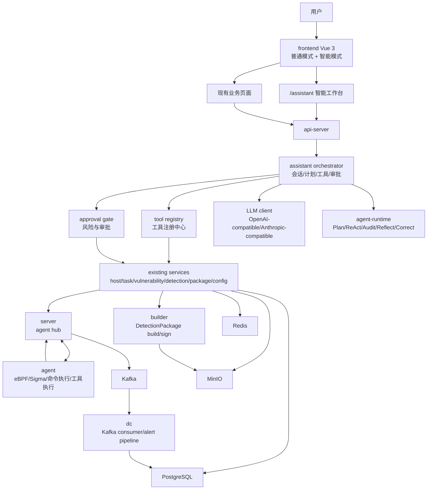
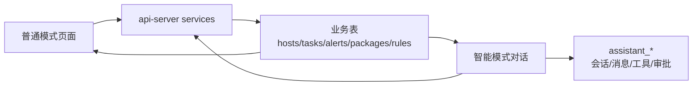
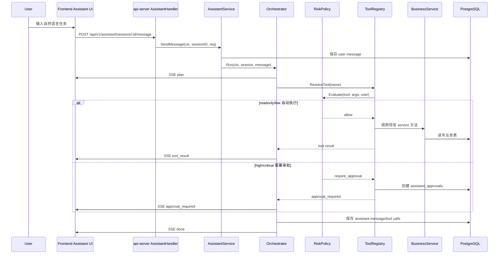
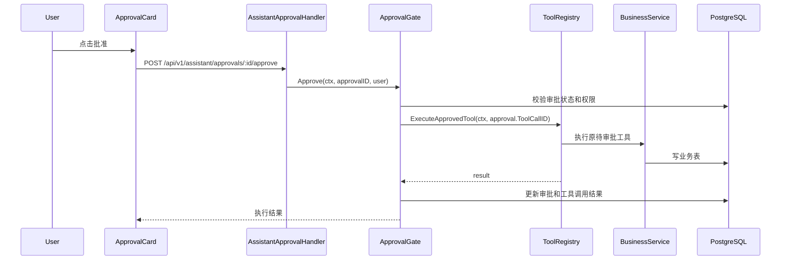
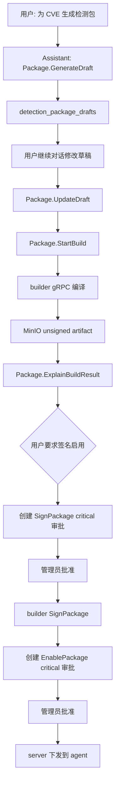

# Aegis V6.0 总体架构设计: 双模智能安全指挥台

**版本**: 6.0  
**日期**: 2026-05-29  
**状态**: 设计中

---

## 1. 架构目标

V6.0 在现有 V5.8 架构上新增“Assistant 智能体编排层”。该层位于 `api-server` 内部，负责会话、上下文、工具注册、计划执行、审批和审计。它不直接替代现有业务服务，而是把现有业务服务封装成可被智能体调用的工具。

---

## 2. 总体组件图



---

## 3. 双模式数据互通图



核心原则：

- 普通模式和智能模式都通过 `api-server` 访问业务服务。
- 智能模式新增的 `assistant_*` 表只存智能体过程，不复制业务事实。
- 智能模式产生的业务变更必须在普通模式立即可见。
- 普通模式中选中的对象可以作为 `assistant_context_refs` 注入智能模式。

---

## 4. 智能体执行链路



---

## 5. 审批执行链路



---

## 6. 动态检测包智能链路



约束：

- `Package.GenerateDraft` 可自动执行。
- `Package.StartBuild` 默认 medium，至少二次确认。
- `Package.SignPackage` 必须 critical 审批。
- `Package.EnablePackage` 必须 critical 审批。
- `HookAllowlist.Update` 必须 critical 审批。

---

## 7. 逻辑分层

```text
frontend
  assistant workspace
  existing business pages
  shared cards and object links

api-server
  handler layer
    AssistantHandler
    AssistantApprovalHandler
  assistant layer
    AssistantService
    Orchestrator
    ToolRegistry
    ApprovalGate
    ContextLoader
    MemoryService
  existing service layer
    HostService
    TaskService
    VulnerabilityService
    DetectionPackageService
    AlertService
    ConfigService
  repository layer
    assistant repositories
    existing repositories

server
  existing agent hub
  existing command forwarding

agent
  existing tool execution
  existing detection package manager
```

---

## 8. 新增 api-server 模块

| 模块 | 路径 | 职责 |
|:---|:---|:---|
| handler | `api-server/internal/api/handler/assistant_handler.go` | HTTP/SSE 入口 |
| service | `api-server/internal/assistant/service.go` | 会话、消息、运行控制 |
| orchestrator | `api-server/internal/assistant/orchestrator.go` | agent-runtime 编排 |
| tools | `api-server/internal/assistant/tools/` | 业务工具实现 |
| policy | `api-server/internal/assistant/risk_policy.go` | 风险等级和审批策略 |
| approval | `api-server/internal/assistant/approval_gate.go` | 审批创建、批准、拒绝、执行 |
| context | `api-server/internal/assistant/context_loader.go` | 加载上下文对象 |
| memory | `api-server/internal/assistant/memory_service.go` | 会话摘要和长期记忆 |
| repository | `api-server/internal/repository/assistant_*.go` | 新表读写 |

---

## 9. 工具域设计

| 域 | 工具前缀 | 对应现有能力 |
|:---|:---|:---|
| 主机 | `Host.*` | host repo, agent online status |
| 基线 | `Baseline.*` | task/template/rule service |
| 漏洞 | `Vulnerability.*` | vulnerability service, host script service |
| 检测 | `Detection.*` | alert/block/rule/llm aggregation service |
| 动态检测包 | `Package.*` | detection package service, builder client |
| 配置 | `Config.*` | config service, system config |
| 审计 | `Audit.*` | audit log repo, command audit repo |
| agent 主机工具 | `AgentTool.*` | server gRPC ExecuteTool |

---

## 10. 安全边界

### 10.1 不允许的调用

- 智能体直接拼 SQL 写业务表。
- 智能体直接调用 `builder.SignPackage` 绕过审批。
- 智能体直接调用 `server` 下发阻断命令绕过 BlockService。
- 智能体修改 hook allowlist 不经审批。
- 智能体使用未注册工具名。

### 10.2 必须审计的行为

- 每次模型调用。
- 每次工具调用。
- 每次审批创建。
- 每次审批批准或拒绝。
- 每次高风险业务写操作。
- 每次执行失败和回滚建议。

---

## 11. 兼容性

| 项 | 策略 |
|:---|:---|
| V5.8 API | 不删除、不改语义 |
| 前端现有路由 | 保留 |
| AI 分析页 | 保留，可逐步迁移到全局 assistant 能力 |
| 数据库 | 只新增表和索引，不破坏现有表 |
| agent | 第一版不要求 agent 升级，复用现有工具执行 |
| builder | 不改签名边界 |

---

## 12. 回滚方案

1. 前端隐藏 `/assistant` 路由和模式切换入口。
2. 后端关闭 `ASSISTANT_ENABLED=false`。
3. 保留 `assistant_*` 表不删除，不影响业务表。
4. 现有普通模式页面继续工作。
5. 已由智能体创建的业务任务继续按原业务流程完成。

