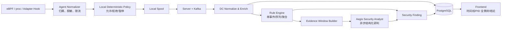

# Aegis V6.2 智能体行为采集与安全分析设计

**版本**：6.2  
**日期**：2026-07-30  
**状态**：设计完成，待实施

## 1. 能力定位

V6.2 的核心能力从“监控 Agent 是否访问敏感文件”升级为：

> 持续采集 AI Agent 及其实际执行进程的一系列操作，将离散事件还原为可视化操作链，再由确定性规则、跨事件关联规则和 Aegis 智能分析器联合判断行为是否具有攻击性。

敏感文件访问仍然保留，但只是 `file` 行为域中的一种高风险证据。系统不能因为文件不在敏感路径列表中，就忽略命令执行、网络连接、提权、持久化、清痕或沙箱逃逸行为。

V6.2 同时维持两类结果：

1. **行为事实**：Agent 实际执行了什么命令、操作了什么资源、由哪个进程发起、结果是否成功。
2. **安全结论**：哪些事实组成可疑或攻击链、命中了什么规则、智能分析器为何判定、采取了什么动作。

事实和结论必须分开保存。规则或模型升级后可以重新分析历史事实，但不能改写原始事件。

## 2. 成功标准

1. 对本机可观测 Agent，能够从控制进程追溯到 shell、Python、Node、编译器、容器进程等实际执行进程。
2. 统一采集进程/命令、文件、网络、身份权限、持久化、隔离控制和安全工具规避等行为域。
3. 将同一次用户请求或 Agent 执行阶段的行为关联成 session、execution unit、process chain 和 operation graph。
4. 前端能按以 PID 为主干的行为全景树和时间线展示“谁在什么时候对什么执行了什么操作，结果如何”。
5. 单事件规则和跨事件规则可以独立产生 finding，并引用原始 `event_id`。
6. Aegis 智能分析器只能基于真实、脱敏、带来源的证据输出结构化结论，不能虚构未观测行为。
7. 自动阻断必须来自本地确定性规则，或“高置信关联规则 + 明确策略授权”；智能分析器单独判定默认只告警或等待人工确认。
8. 事件丢失、字段截断、远程不可观测和工具语义缺失必须显示在证据完整性中。

## 3. 行为采集范围

### 3.1 首期行为域

| 行为域 | 操作示例 | 主要证据 | 默认采集策略 |
| --- | --- | --- | --- |
| `process` | fork、exec、exit、signal、ptrace | PID/start time、PPID、exe、argv、cwd、UID、进程链 | 全量生命周期，重复 exit/信号聚合 |
| `file` | open/read/write/create/delete/rename/chmod/chown/execute | 原始/解析路径、inode/dev、flags、结果、字节数摘要 | Agent 进程范围内采集，读写短窗口聚合 |
| `network` | connect、accept、listen、DNS、socket | 协议、源/目的地址端口、方向、结果、域名证据 | connect/listen 全量；流量内容不采集 |
| `identity` | setuid/setgid、capset、setns、credential 变化 | before/after UID/GID/capability、目标 namespace | 全量采集 |
| `persistence` | 写 shell profile、systemd/cron、SSH key、动态链接配置 | 文件行为 + 命令 + 资源分类 | 由资源分类和关联规则产生 |
| `isolation` | unshare/setns、mount、pivot_root、chroot、cgroup 变更 | syscall、目标、namespace/cgroup/mount 基线差异 | 全量采集并进入逃逸专项规则 |
| `kernel` | bpf、perf_event_open、module load、设备访问 | syscall、参数摘要、capability、结果 | Agent 范围内全量采集 |
| `ipc` | Unix socket、关键管道、共享内存 | endpoint/inode、对端进程、结果 | 关键端点全量，其余按策略 |
| `tool` | shell、编辑器、浏览器、MCP/插件工具调用 | tool name、call ID、参数摘要、结果摘要 | 仅 Adapter 可提供可信 Hook 时采集 |
| `control` | 启动容器/远程 sandbox、切换 backend | backend、container/session ID、配置来源 | Adapter 控制面采集 |

### 3.2 命令采集

命令行为至少包含：

```text
executable
argv（脱敏、限长）
cwd
uid/gid
parent process identity
process start identity
execution unit
exit code 或 signal（可获得时）
```

shell `-c` 内容属于 argv，可以采集但必须先脱敏。以下情况不能承诺获得完整命令文本：

- 命令通过 shell stdin、匿名 pipe 或解释器动态 `eval` 输入。
- 长 argv 被内核或 Agent 限长截断。
- 脚本运行后在进程内部解释动态生成内容。
- `cd`、`export`、`alias` 等只改变 shell 内部状态且不启动新进程的 builtin；其产生的后续 syscall 仍可观测。

这些情况下仍可通过解释器进程、后续文件/网络/权限行为形成证据，事件标记：

```json
{
  "command_visibility": "partial",
  "limitations": ["stdin_not_captured"]
}
```

V6.2 不采集完整 stdin、stdout、stderr。确需工具结果语义时，由产品 Adapter 提供经过白名单和脱敏的摘要。

### 3.3 文件行为

文件不再只按“敏感/非敏感”二分。每个文件事件都可以经过资源分类：

```text
credential
source_code
configuration
executable
persistence
security_control
container_control
log_or_history
temporary
unknown
```

资源分类来源：

1. 服务端内置资源规则。
2. 用户自定义路径规则。
3. inode/dev、文件类型和 owner/mode 等元数据。
4. 关联上下文，例如“下载后写入并执行”。

不上传文件内容。可选采集：

- inode/dev、owner/mode、size。
- 可执行文件或脚本的 SHA-256；仅在大小、文件类型和性能预算允许时由用户态异步计算。
- 写入前后元数据差异。

“读取”区分：

- `open_intent`：进程以读权限打开文件。
- `read_observed`：观察到对已跟踪 fd 的读取。
- `content_observed=false`：Aegis 不采集读取内容。

### 3.4 网络行为

首期采集 TCP/UDP/Unix socket 的连接元数据，不做 TLS 解密或内容审计：

```text
connect/listen/accept
address family
source/destination IP and port
Unix socket normalized path
DNS query/answer（能力允许且经过限流）
result/errno
bytes summary（可选聚合）
```

域名只能在 DNS 证据与连接时间窗口可关联时展示为 `observed_domain`，不能把反向 DNS 推测标记为真实访问域名。

### 3.5 工具语义

操作系统传感器能证明“进程做了什么”，不能天然知道“模型调用了哪个工具”。V6.2 定义可选 Adapter Hook：

```text
tool_call_started
tool_call_completed
tool_call_failed
```

可信来源包括：

- Agent 官方审计日志或事件流。
- 可验证的本地 plugin/hook API。
- Aegis 启动包装器生成的 correlation token。

仅解析普通终端输出或猜测进程名不能作为可信 tool call。没有 Hook 时前端显示：

```text
工具语义不可观测；操作系统行为采集正常
```

## 4. 统一事件模型

所有行为先规范化为 `AgentBehaviorEvent`：

```json
{
  "schema": "aegis.agent_behavior.v1",
  "event_id": "uuid",
  "host_id": "uuid",
  "host_boot_id": "uuid",
  "agent_sequence": 918273,
  "instance_id": "uuid",
  "execution_unit_id": "uuid",
  "session_id": "uuid",
  "correlation_id": "uuid",
  "parent_event_id": "uuid-or-empty",
  "occurred_at": "2026-07-30T10:00:00.123456Z",
  "occurred_monotonic_ns": 99182700123,
  "category": "process",
  "operation": "exec",
  "outcome": "success",
  "errno": 0,
  "actor": {
    "pid": 1234,
    "start_ticks": "987654",
    "ppid": 1200,
    "exe": "/usr/bin/curl",
    "argv": ["curl", "https://example.invalid/payload"],
    "cwd": "/workspace",
    "uid": 1000,
    "gid": 1000
  },
  "resource": {
    "type": "process",
    "identity": "/usr/bin/curl",
    "classification": "network_tool",
    "attributes": {}
  },
  "isolation": {
    "unit_type": "linux_namespace",
    "cgroup_id": "123",
    "namespace_digest": "sha256:..."
  },
  "collection": {
    "source": "ebpf",
    "sensor": "bprm_exec",
    "visibility": "complete",
    "truncated_fields": [],
    "lost_events_since_last": 0
  }
}
```

约束：

- `event_id` 全链路唯一。
- `host_boot_id + agent_sequence` 在一次主机启动内单调递增，用于检测缺口和稳定排序。
- `occurred_monotonic_ns` 只在同一 `host_boot_id` 内比较；跨主机展示使用 wall clock 并标记时钟偏差。
- PID 必须和 `start_ticks` 组合使用。
- `outcome` 只能表示真实返回结果；未获得结果时为 `unknown`。
- `parent_event_id` 只在有真实关联证据时填写。
- 原始事件不可被智能分析器覆盖或补写。
- 环境变量值、文件内容、认证头和 token 不进入事件。

## 5. 操作链与关联模型

### 5.1 层级

```text
AgentAsset
  -> AgentRuntimeInstance
      -> BehaviorSession
          -> AgentExecutionUnit
              -> Process identity
                  -> AgentBehaviorEvent
                      -> Resource
          -> SecurityFinding
              -> AnalysisRun
              -> GuardAction
```

`BehaviorSession` 表示一次可关联的工作阶段。来源优先级：

1. 产品 Adapter 提供的 conversation/run/task ID。
2. Aegis 包装器注入的 correlation token。
3. execution unit 生命周期。
4. 控制进程活动窗口推导的 `inferred session`。

推导 session 必须带 `session_confidence=inferred`，不能伪装成 Agent 官方会话。

### 5.2 关联键

关联引擎使用：

- instance/execution unit。
- PID + start ticks + fork/exec 父子关系。
- cgroup/container ID。
- tool call/correlation token。
- fd、inode/dev、socket tuple。
- 时间窗口和资源身份。

仅有时间接近不能建立强父子关系，只能形成 `related` 边。

### 5.3 内部关系与前端全景树

关联引擎内部可以使用以下节点和边构建 finding 证据子图：

```text
agent instance
session
execution unit
process
command
file
network endpoint
identity/namespace/cgroup
finding
action
```

边类型：

```text
spawned
executed
read
wrote
renamed
connected_to
changed_identity
joined_namespace
triggered
blocked_by
related
```

数据库不必预存全部图边。稳定关联字段保存在事件中；高危 finding 的证据子图可以保存为快照，保证后续可复核。

外层页面只展示 Agent 基本信息。用户点击一个 Agent 后，详情抽屉中的
“行为全景”必须呈现为树，而不是自由布局图；逻辑层级包含 host/asset，
抽屉从已选 Agent 子树开始展示：

```text
selected agent asset/type
  -> runtime instance
    -> session
      -> execution unit
        -> process(PID/PPID/cmdline)
          -> child process
          -> command/file/network/privilege/isolation operation
          -> rule hit/finding
```

操作节点必须挂在真实发起 PID 下。文件节点显示文件名和完整解析路径，网络节点显示目标 IP/domain/port。详细契约见
[builtin_behavior_rules_and_panorama_tree_v6.2.md](builtin_behavior_rules_and_panorama_tree_v6.2.md)。

同一主机的多个 Agent 为并列分支，同类型多个 controller 运行实例使用
PID/start_ticks 分开。一个行为事实只能有一个主 instance/unit 归属；归属
不确定时标记 ambiguous/unattributed，不能复制到多个 Agent 或自动 freeze。

## 6. 采集与分析流水线



本地决策与服务端分析分离：

- Agent 本地只执行预编译确定性策略，不能等待网络或模型响应。
- DC 完成规范化、资源分类、序列关联和 finding 管理。
- 智能分析器异步读取有界证据窗口，超时或失败不影响原始事件入库。

## 7. 规则分析

### 7.1 规则层级

| 层级 | 执行位置 | 示例 | 可执行动作 |
| --- | --- | --- | --- |
| L0 内核原子规则 | Agent/BPF LSM | 访问 runtime socket、外部 namespace、明确禁止路径 | allow/deny |
| L1 主机确定性规则 | Agent 用户态 | 命令 + 资源分类、隔离状态漂移 | audit/alert/freeze |
| L2 单事件规则 | DC | `curl` 连接公网、chmod setuid | finding/alert |
| L3 序列/聚合规则 | DC | 下载 → 写文件 → chmod → execute | finding/alert/策略授权的 freeze |
| L4 智能研判 | api-server/DC worker | 根据证据窗口解释攻击意图和链路 | 补充 finding，默认不直接阻断 |

### 7.2 首批行为规则

首批产品必须内置以下五个稳定规则族：

| Rule ID | 名称 | 核心证据 |
| --- | --- | --- |
| `AGB-BUILTIN-001` | 操作敏感目录 | file operation + filename/path + resource classification |
| `AGB-BUILTIN-002` | 外部网络连接 | connect + destination address/domain/port + externality |
| `AGB-BUILTIN-003` | 文件生成 | create success + filename/path + inode/metadata |
| `AGB-BUILTIN-004` | 敏感命令执行 | exec + PID/cmdline + command category |
| `AGB-BUILTIN-005` | 提权行为 | credential/capability before/after + outcome |

五个规则的路径、地址分类、命令匹配、提权状态、例外和动作边界以
[builtin_behavior_rules_and_panorama_tree_v6.2.md](builtin_behavior_rules_and_panorama_tree_v6.2.md)
为实现契约。

| 规则族 | 典型证据组合 |
| --- | --- |
| 凭据访问 | 读取凭据类资源 + 异常命令/进程 + 非预期网络连接 |
| 下载执行 | 外连下载 + 新文件 + 权限变更 + exec |
| 持久化 | 写 cron/systemd/profile/authorized_keys + 后续执行或服务操作 |
| 防御规避 | 停止安全进程、修改日志/audit 配置、删除 shell/history 日志 |
| 破坏行为 | 批量删除/覆盖、文件系统工具、关停关键服务 |
| 横向移动 | SSH 工具/密钥访问 + 内网扫描或多目标连接 |
| 数据外传 | 大量读取/打包 + 外部连接；只做风险判断，不采集内容 |
| 沙箱逃逸 | setns/mount/cgroup/runtime socket/capability + 基线漂移 |
| 供应链行为 | 修改依赖/构建脚本 + 下载执行 + 发布凭据访问 |

每条规则必须声明：

```text
rule_id/version
required event predicates
correlation window
grouping keys
negative/allow conditions
severity
confidence
MITRE mapping（可选）
recommended action
evidence fields
```

### 7.3 规则结果

规则不直接修改原始事件，而是创建或更新 `SecurityFinding`：

```json
{
  "finding_id": "uuid",
  "title": "Agent 下载并执行未知文件",
  "severity": "high",
  "confidence": 0.92,
  "status": "open",
  "rule_hits": ["AGB-DOWNLOAD-EXEC-001"],
  "evidence_event_ids": ["e1", "e2", "e3", "e4"],
  "attack_stage": ["command_and_control", "execution"],
  "recommended_action": "freeze_execution_unit"
}
```

## 8. Aegis 智能分析器

### 8.1 输入

智能分析器不接收无限原始日志。Evidence Window Builder 生成：

- Agent、主机、session、execution unit 摘要。
- 规则命中和资源分类。
- 按时间排序的命令、文件、网络、权限和隔离事件。
- 关键进程链和资源关系。
- 操作结果、失败 errno。
- 采集完整性、字段截断和不可观测范围。
- 已知 allowlist、业务标签和历史基线。

默认窗口按 finding 前后时间、同一 session 和同一 execution unit 限定。超出 token 预算时优先保留规则证据、因果链和状态变化，不允许静默丢弃关键反证。

### 8.2 输出契约

输出必须符合固定 JSON Schema：

```json
{
  "verdict": "malicious",
  "attack_probability": 0.91,
  "confidence": 0.84,
  "summary": "该执行单元下载文件、赋予执行权限并启动，随后访问凭据资源。",
  "intent_hypotheses": [
    {
      "intent": "credential_access",
      "confidence": 0.82,
      "evidence_event_ids": ["e3", "e5"]
    }
  ],
  "attack_chain": [
    {
      "stage": "ingress_tool_transfer",
      "evidence_event_ids": ["e1", "e2"]
    }
  ],
  "counter_evidence": ["命令退出码为 1，未证明载荷成功执行"],
  "uncertainties": ["stdin_not_captured"],
  "recommended_action": "freeze_and_investigate"
}
```

`verdict`：

```text
benign
suspicious
malicious
inconclusive
```

所有结论句必须引用 `event_id`。无法引用的推断只能放入 `uncertainties`，不能作为攻击事实。

### 8.3 防止分析器被事件内容注入

命令行、路径、文件名、域名和工具摘要均视为不可信数据：

- 使用结构化字段传入，不拼接成系统指令。
- 明确标记 evidence 数据边界。
- 不把采集到的项目文本、脚本内容或工具输出作为分析器指令。
- 分析器没有主机工具、策略写入、阻断或外部网络权限。
- 输出经过 JSON Schema、枚举、event ID 存在性和数值范围校验。
- 保存 model/provider/prompt version 和 input digest，支持复核。

### 8.4 失败和降级

模型超时、限流、不可用、输出不合法时：

- finding 保留规则结论。
- analysis run 标记 `failed` 或 `inconclusive`。
- 不自动降低已有规则 severity。
- 不阻塞事件消费和前端查询。
- 可按幂等键重试，但不能产生重复 finding。

## 9. 攻击性判断与动作矩阵

不采用“模型给一个分数就阻断”的单一逻辑。最终处置依据证据强度：

| 证据 | 默认结论 | 默认动作 |
| --- | --- | --- |
| 明确 L0 deny 规则 | policy violation | 内核拒绝；按策略可 freeze |
| 高置信 L3 攻击序列 | malicious/suspicious | 告警；策略明确授权时 freeze |
| L2 规则 + 智能分析 malicious + 引用证据完整 | malicious | high/critical 告警，可请求人工确认或按策略 freeze |
| 仅智能分析 malicious，无确定性规则 | suspicious | 告警/人工确认，不自动阻断 |
| 仅异常基线，无攻击证据 | anomaly | audit/低等级 finding |
| 证据缺失或远程不可观测 | inconclusive | 标注盲区，不判定安全 |

自动动作必须记录：

```text
policy version
rule version
finding ID
evidence event IDs
decision source
actual action result
```

## 10. 数据量、限流与可靠性

全行为采集不能把每次系统调用都直接发送到服务端：

- fork/exec、connect、rename、chmod、setuid、setns 等语义事件逐条保留。
- 同一进程、同一 fd、同一操作的连续 read/write 聚合为时间桶。
- 高频 DNS、失败 open、重复 connect 按可配置键限流。
- 原子 deny、逃逸和 finding 证据事件不得采样。
- Agent 使用有界本地 spool；溢出时优先保留 high-priority 事件并上报 drop counter。
- 每个事件携带采集完整性，DC 不把“没有事件”解释成“没有行为”。

建议首期性能预算：

| 指标 | 目标 |
| --- | --- |
| Agent Guard 增量 CPU | 正常 Agent 工作负载平均不超过单核 8%，压测验收 |
| Agent Guard 增量内存 | 默认不超过 192MB，含进程图和本地聚合 |
| 本地事件延迟 | P95 不超过 2 秒进入发送队列 |
| 高危原子规则决策 | 内核 Hook 内同步完成，不依赖用户态往返 |
| 服务端规则 finding | P95 不超过事件到达后 10 秒 |
| 智能分析 | 异步，默认超时 60 秒，不影响规则结论 |

## 11. 数据安全与展示权限

- 命令行和路径属于敏感审计数据，API 使用独立 `agent_guard:evidence:read` 权限。
- 默认列表只显示脱敏摘要；详情按权限返回完整的已脱敏字段。
- 永不采集密码、token、cookie、私钥内容、环境变量值和文件内容。
- argv 脱敏覆盖 URL credential、Authorization、常见密钥参数和服务端扩展规则。
- 导出不在首期范围；后续导出必须水印、审计和二次授权。
- retention 按原始行为、finding、analysis run 分层配置。

## 12. 前端展示契约

前端提供三个互补视图：

1. **时间线**：按真实时间展示命令、文件、网络、权限、隔离、规则、分析和动作。
2. **Agent 行为全景树**：外层选择 Agent 后，抽屉按 agent asset/type →
   instance → session → unit → process 展示，以 PID 进程父子关系为主干，
   将命令、文件、网络、权限、隔离和规则节点挂在发起进程下；同 Agent
   多实例保持独立。
3. **Finding 证据图**：只在安全结论详情中展示被规则/分析引用的有界证据关系，不替代全景树。

每个安全结论必须可以展开：

```text
结论
  -> 命中的规则及版本
  -> 智能分析器结论及模型/提示词版本
  -> 引用的原始事件
  -> 进程链和资源关系
  -> 证据完整性和不可观测范围
  -> 自动/人工动作及真实结果
```

UI 禁止：

- 将 AI 研判显示为已证实事实。
- 把 `accepted`、`requested` 显示成阻断成功。
- 把没有采集到事件显示成“Agent 无风险”。
- 把推导 session 显示为 Agent 官方会话。

## 13. 测试设计

### 13.1 采集

- fork/exec/exit、shell `-c`、解释器、double fork 和 PID reuse。
- 文件 open/read/write/create/delete/rename/chmod/chown/execute。
- TCP/UDP/Unix socket connect/listen，DNS 证据关联。
- setuid/capset/setns/mount/cgroup 等身份和隔离行为。
- command/path/URL token 脱敏和字段截断。
- 高频 read/write 聚合、ringbuf 丢失和 spool 溢出。
- 非 Agent 进程不进入 Agent 行为流。

### 13.2 关联与规则

- 下载 → 写入 → chmod → execute 生成单一 finding。
- 读取凭据类资源但命令失败时保留反证。
- 不同实例相同路径/网络目标不串 session。
- 容器进程使用 cgroup 关联，不依赖 PPID。
- 乱序、重放和迟到事件幂等更新 finding。
- allowlist 只抑制对应规则，不删除原始事件。

### 13.3 智能分析

- 每个结论引用存在的 event ID。
- 恶意文件名/命令行中的提示注入不能改变系统指令。
- 超时、限流、非法 JSON 和未知枚举正确降级。
- AI-only malicious 不触发自动 freeze。
- 规则 + AI 联合判定遵守策略授权。
- 模型版本、prompt version、input/output digest 可追溯。

### 13.4 可视化

- 时间线、行为全景树、Finding 证据图使用同一事件事实。
- process 节点显示 PID、PPID、cmdline；file 节点显示文件名和路径；network 节点显示目标地址、端口和可信域名。
- category/outcome/visibility/decision 显示一致。
- 证据缺失、截断、远程不可观测有明显标识。
- finding 可以逐级展开到原始事件和动作结果。
- 万级事件窗口采用服务端分页/聚合，浏览器不一次加载全量图。
