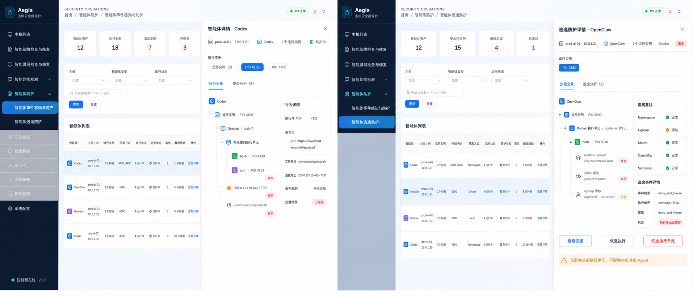

# Aegis V6.2 智能体防护前端 PRD

**版本**：6.2  
**日期**：2026-08-03
**状态**：事件/逃逸页已设计；P5 会话检测入口已纳入
**适用端**：Aegis Web 管理控制台  
**父导航**：智能体防护

## 1. PRD 目标

本 PRD 原有内容详细定义事件/逃逸两个子页面；P5 新增第三个子页面：

1. **智能体事件感知与防护**：观察 Agent 及其子进程的命令、文件、网络、
   权限等行为，展示进程主干全景树，通过规则与智能分析形成 Finding，
   并呈现真实阻断结果。
2. **智能体逃逸防护**：识别 Agent 实际使用的 namespace、容器或远程沙箱，
   对隔离基线变化、越界访问和逃逸尝试进行监控、阻断、冻结和溯源。
3. **智能体会话检测**：提取 Codex、Claude Code、OpenCode 会话，由 AI 标记
   恶意语义，并关联真实 OS 行为。完整页面以
   [agent_session_detection_frontend_prd_v6.2.md](agent_session_detection_frontend_prd_v6.2.md)
   为准。

本 PRD 解决的核心问题不是“多做几个列表”，而是让安全运营人员在一个页面内回答：

- 哪个 Agent、哪个 session、哪个执行单元、哪个 PID 发起了操作。
- 操作了什么文件、执行了什么命令、连接了哪个地址、发生了什么权限变化。
- 哪些行为命中了规则，为什么被判断为高风险或攻击链。
- 沙箱原本是什么边界，实际发生了什么漂移或越界。
- 操作是被观察、预警、拒绝、冻结，还是仅因能力不足形成 `would_deny`。
- 谁在什么时间恢复或终止了执行单元。

## 2. 当前前端实地盘点

本 PRD 不采用独立视觉方案，直接继承当前项目代码和页面截图：

| 现有实现 | 可复用设计事实 |
| --- | --- |
| [App.vue](../../frontend/src/App.vue) | 深色左侧导航、`el-sub-menu` 分组、64px 顶栏、面包屑、24px 主内容间距 |
| [aegis-theme.css](../../frontend/src/styles/aegis-theme.css) | 浅蓝渐变背景、白色卡片、蓝色主按钮、风险色、12/18px 圆角和现有字体栈 |
| [Overview.vue](../../frontend/src/views/detection/Overview.vue) | 顶部统计卡、内容卡、图表区的密度和间距 |
| [Alerts.vue](../../frontend/src/views/detection/Alerts.vue) | 筛选卡、列表、分页、批量操作和空状态 |
| [Rules.vue](../../frontend/src/views/detection/Rules.vue) | 规则筛选、状态、危险操作、批量操作 |
| [Policies.vue](../../frontend/src/views/detection/Policies.vue) | 策略表格、开关、动作列和分页 |
| [ProcessTree.vue](../../frontend/src/components/ProcessTree.vue) | PID/PPID、cmdline、父子进程和风险节点的既有表达 |

评审参考截图：

- [安全概览](../screenshots/ui-refresh/detection-overview.png)
- [告警列表](../screenshots/ui-refresh/detection-alerts.png)
- [规则管理](../screenshots/ui-refresh/detection-rules.png)
- [阻断策略](../screenshots/ui-refresh/detection-policies.png)

### 2.1 必须继承

- 左侧为深色 Aegis 导航，不改成顶部产品导航。
- 顶栏继续展示 `SECURITY OPERATIONS`、中文面包屑、状态和全局操作。
- 主工作区继续使用浅蓝渐变和白色圆角卡片。
- 查询使用蓝色主按钮，重置使用普通按钮，危险动作使用红色。
- 风险色继续使用 critical 红、high 橙、medium 黄、low/normal 绿。
- 表单、表格、开关、标签、抽屉、对话框继续使用 Element Plus。
- 最低桌面宽度沿用当前 `1280px` 设计。

### 2.2 禁止引入

- 独立的白色图标栏或第二套全局导航。
- 深色内容大屏、霓虹科幻风格或与当前系统不一致的巨大图标。
- 七个以上并列 Agent Guard 子菜单。
- 用图表替代必须展示的 PID 行为树或沙箱执行树。
- 仅靠颜色表达风险、覆盖或动作状态。

## 3. 原型图

以下 V4 原型只覆盖事件/逃逸两个既有页面，基于当前项目列表/表格页面样式，外层只展示智能体及基本信息，
点击智能体后使用右侧大抽屉展示全景和安全分析：



原型用于确认信息架构、页面密度、字段和主要交互。最终实现以当前
Element Plus 组件、主题变量和本 PRD 字段约束为准。

## 4. 用户和权限

| 角色 | 默认能力 |
| --- | --- |
| 安全观察员 | 查看统计、行为树、沙箱树、事件和脱敏证据 |
| 安全分析员 | 观察员能力 + 查看完整授权证据、标记 Finding、触发重新分析 |
| 安全管理员 | 分析员能力 + 配置规则/策略、freeze/resume/kill |
| 系统管理员 | 安全管理员能力 + 查看下发状态和主机能力降级原因 |

权限点：

```text
agent_guard:read
agent_guard:evidence:read
agent_guard:policy:write
agent_guard:finding:handle
agent_guard:action:freeze
agent_guard:action:resume
agent_guard:action:kill
```

前端隐藏无权操作只是体验控制，后端 403 是最终安全边界。

## 5. 信息架构和路由

### 5.1 侧边栏

在当前 `App.vue` 中新增与“智能异常检测”同级的父菜单：

```text
智能体防护
├── 智能体事件感知与防护
├── 智能体逃逸防护
└── 智能体会话检测
```

三个子菜单使用当前 `el-menu-item.is-active` 的蓝青渐变激活态。不得再把
“概览、策略、规则、实例、全景、流水、结论”作为并列侧边栏菜单。

### 5.2 页面路由

| 路由 | 页面/用途 |
| --- | --- |
| `/detection/agent-guard` | 重定向至事件感知与防护 |
| `/detection/agent-guard/events` | 智能体事件感知与防护 |
| `/detection/agent-guard/escape` | 智能体逃逸防护 |
| `/detection/agent-guard/sessions` | 智能体会话检测 |

详情不切换为独立页面，通过 query 打开相应 Agent 抽屉：

```text
/detection/agent-guard/events?asset_id=<id>&instance_id=<id>&detail_tab=panorama
/detection/agent-guard/events?finding_id=<id>&detail_tab=analysis
/detection/agent-guard/escape?asset_id=<id>&instance_id=<id>&detail_tab=panorama
/detection/agent-guard/escape?event_id=<id>&detail_tab=analysis
```

列表筛选写入 URL query，刷新和分享链接后可以恢复：

```text
host_id
asset_id
agent_types
asset_ids
instance_id
instance_ids
session_id
execution_unit_id
pid
severity
rule_key
status
time_from
time_to
event_id
finding_id
view
detail_tab
```

### 5.3 旧能力收纳

| 原设计能力 | 新位置 |
| --- | --- |
| 防护概览 | 事件/逃逸两个子页各自 KPI 和主卡片 |
| 防护策略 | 事件页右上角“策略配置”抽屉 |
| 五个内置规则 | 事件页规则 chips + “查看全部规则”抽屉 |
| 运行实例 | 事件页筛选与实例详情深链 |
| 行为全景 | 事件页主内容区 |
| 行为流水 | 全景树的列表模式/底部抽屉 |
| 安全结论 | 事件页 Finding 抽屉和详情深链 |
| 隔离覆盖/逃逸事件 | 逃逸防护子页 |

### 5.4 多 Agent 范围模型

同一主机允许：

- 同时安装/识别 Codex、OpenClaw、Hermes 等多个 Agent 资产。
- 同一种 Agent 同时存在多个 controller 运行实例。
- 每个运行实例拥有独立 session、execution unit 和 PID 进程树。

前端采用“列表盘点 → 单 Agent 详情”的两层交互：

| 层级 | 展示内容 | 交互 |
| --- | --- | --- |
| 外层 Agent 列表 | 全部主机上的 Agent 和基本信息 | 点击行或“查看详情” |
| Agent 详情抽屉 | 选中 Agent 的实例、全景和分析 | 顶部切换运行实例，内部切换全景/分析 |

外层一行表示 `host + Agent asset`。同一资产的多个 runtime instance 聚合
显示数量和 controller PID 摘要，不展开 session、进程、文件、外链或规则：

```text
prod-ai-01 / Codex     2 个实例  PID 4100, 4400
prod-ai-01 / OpenClaw  1 个实例  PID 5200
prod-ai-01 / Hermes    1 个实例  PID 6100
dev-ai-02  / Codex     1 个实例  PID 4300
```

只有打开详情抽屉后才展示：

```text
选中 Agent asset
└── Runtime instance selector
    └── Session / execution unit / PID / operation / finding
```

即使 Agent A 启动了 Agent B，外层仍是两个独立 Agent 行；跨 Agent
`launched_by/related` 证据只在详情分析中展示，不改变各自的主归属。

## 6. 公共页面框架

事件/逃逸两个子页都使用以下纵向布局；会话页布局见独立 P5 PRD：

```text
App 顶栏和面包屑
└── KPI 统计卡
    └── 筛选卡
        └── Agent 基本信息列表
            └── 点击 Agent
                └── 右侧大尺寸详情抽屉
                    └── 全景 / 分析
```

### 6.1 KPI 卡

- 桌面端四列，一行显示。
- 数字为主要视觉，标题为弱化文本。
- 卡片可点击时显示 hover 和可见焦点，不可点击时不伪装按钮。
- 红/橙只用于风险数字，不给整个卡片铺满高饱和背景。
- 加载时四张卡分别显示 skeleton，不能整体抖动。

### 6.2 筛选卡

- 主机允许全部、单选或多选，用于过滤外层 Agent 列表。
- Agent 类型使用多选；运行实例不作为外层必选条件。
- 第一行放 select/date range，第二行放关键字、查询和重置。
- 查询按钮为 primary；重置不使用 danger。
- 时间默认最近 24 小时。
- 筛选变化不自动发请求，点击查询或 Enter 后执行。
- `PID` 只接受正整数；非法输入在前端提示但后端仍需校验。
- 已应用筛选同步 URL query。

### 6.3 长文本

- cmdline、文件路径、URL、container ID、cgroup path 默认单行省略。
- hover tooltip 展示授权后的脱敏全值。
- 提供复制按钮时必须记录审计，不把复制内容写入 console。
- 字段无数据展示 `-`；不可观测展示明确状态，不展示 `-`。

### 6.4 Agent 基本信息列表

外层只能展示：

```text
Agent 名称/类型
主机名/IP
运行实例数量
controller PID 摘要
运行状态
防护/覆盖状态
最高风险或高危数量
最近活动时间
查看详情
```

不得在外层展示：

- session、execution unit 或进程树。
- cmdline、文件名称/路径和连接地址。
- 五规则命中明细、Finding 证据或智能分析正文。
- namespace/cgroup/mount 基线明细。
- freeze/resume/kill 动作。

列表按服务端分页。一行点击区域和“查看详情”执行相同操作，行内其他按钮
必须阻止事件冒泡。

### 6.5 详情抽屉

- 使用 `el-drawer`，桌面端建议宽度 `72%～80%`，最小 880px。
- 标题固定包含 Agent 名称；标题下展示主机、Agent 类型、实例数和防护状态。
- 同一 Agent 有多个实例时使用 PID chips/selector，默认选择最高风险或最近活动实例。
- 抽屉打开状态写入 query：`asset_id`、可选 `instance_id`、`detail_tab`。
- 关闭抽屉不清空外层筛选、分页和滚动位置。
- 抽屉内部数据懒加载，外层列表不预取完整全景树和分析证据。

## 7. 子页一：智能体事件感知与防护

### 7.1 页面目标

外层快速盘点全部 Agent 资产、运行实例和基本防护状态；点击某个 Agent 后，
在详情抽屉内以真实 PID 为主干查看行为全景和安全分析。外层不直接渲染树或
事件证据。

### 7.2 顶部统计

| 指标 | 定义 | 点击行为 |
| --- | --- | --- |
| 智能体资产 | 当前筛选范围 Agent asset 数 | 清除运行状态筛选 |
| 运行实例 | status=running 的 runtime instance 数 | 筛选存在运行实例的 Agent |
| 高危发现 | high + critical open finding 数 | 按高危数量排序 |
| 已阻断 | action 终态为 success 的 deny/freeze 数 | 筛选存在成功处置的 Agent |

“已阻断”不能统计 accepted、dispatching、running 或 `would_deny`。

### 7.3 筛选字段

```text
主机：全部 / 主机名 / IP
智能体类型：全部 / Codex / OpenClaw / Hermes / 其他
运行状态：运行中 / 无运行实例 / stale / stopped
防护状态：完整防护 / 仅监控 / 无隔离 / 不可观测 / degraded
关键字：智能体名称 / controller PID / 主机名 / IP
```

外层不提供 cmdline、文件路径、连接地址、session、execution unit 或规则
证据筛选；这些筛选只在选中 Agent 的详情抽屉内出现。

### 7.4 外层智能体列表

一行表示一台主机上的一个 Agent asset：

| 字段 | 说明 |
| --- | --- |
| 智能体 | 图标、显示名称、Codex/OpenClaw/Hermes 类型 |
| 主机/IP | 主机名和地址 |
| 运行实例 | 运行数；无实例显示“当前未运行” |
| 控制 PID | 最多显示两个 PID，更多显示 `+N` |
| 运行状态 | running/stale/stopped 聚合状态 |
| 防护状态 | coverage 最弱项及原因 tooltip |
| 高危 | open high/critical finding 数 |
| 最近活动 | 最近一个实例或事件时间 |
| 操作 | “查看详情” |

外层不显示规则 chips、事件明细、分析摘要或动作按钮。

### 7.5 智能体详情抽屉

抽屉标题：

```text
智能体详情 · <Agent display name>
```

标题下展示主机/IP、Agent 类型、运行实例数、当前防护状态。实例 selector：

```text
[全部实例（N）] [PID 4100] [PID 4400]
```

当用户从高危数量进入时，默认选中最高风险实例；普通行点击默认选择最近活动
实例。“全部实例”只在分析 tab 做聚合，在行为全景中仍以各实例为独立分支。

抽屉内部严格只有两个 tabs：

```text
[行为全景] [安全分析（Finding 数）]
```

### 7.6 抽屉 Tab：行为全景

固定关系：

```text
Selected Agent asset
└── Agent runtime instance：controller PID / start_ticks
    └── Session
        └── Execution unit
            └── Process：name / PID / PPID / cmdline
                ├── Child process：name / PID / PPID / cmdline
                ├── Command：executable / cmdline / cwd / exit
                ├── File：operation / file name / resolved path / outcome
                ├── Network：IP/domain:port / protocol / outcome
                ├── Privilege：UID/GID/capability before → after
                └── Rule/Finding：rule ID / severity / decision / action
```

节点展示要求：

| 节点 | 首行 | 次行/扩展 |
| --- | --- | --- |
| Agent asset/type | Codex/OpenClaw/Hermes、运行实例数 | 主机、asset ID、Profile、最高风险 |
| Runtime instance | display name、controller PID | start_ticks、状态、覆盖、session/unit 数 |
| Process | 名称、PID、PPID | 脱敏 cmdline |
| Command | 操作和 executable | PID、cmdline、exit code/signal |
| File | operation、file name | 完整 resolved path、outcome |
| Network | destination IP/domain:port | protocol、outcome |
| Privilege | UID/GID/capability 变化 | attempted/succeeded/inconclusive |
| Isolation | 资源和操作 | expected/observed |
| Rule/Finding | 标题、严重级别 | ID/version/source/action |

交互：

- 选择具体 PID 实例时默认展开该实例至首层 process。
- 选择“全部实例”时，各 runtime instance 是并列分支，不合并 session/unit/process；
  默认只展开存在 high/critical 的实例。
- 点击进程加载真实子进程和行为；操作不能脱离发起 PID 单独成树。
- 同一进程行为按 `occurred_at + agent_sequence` 排序。
- “仅风险”隐藏无命中行为，但保留 Agent/instance/进程祖先路径。
- 搜索命中后自动展开到节点并高亮，不重排进程关系。
- PID reuse 使用 `host + pid + start_ticks` 区分。
- 同一种 Agent 的不同 controller PID/start_ticks 必须显示为不同 runtime instance。
- 新 WebSocket 事件只给对应节点显示“有新事件”，用户确认后增量加载。
- drop、truncated、remote unobservable、tool semantics unobservable 显示在树根或受影响节点。

行为全景 tab 内部使用“左树右详情”布局。右侧根据节点类型展示：

```text
通用：时间、主机、Agent、instance、session、execution unit
进程：PID、PPID、start_ticks、exe、脱敏 cmdline、cwd、用户
文件：operation、文件名称、完整路径、分类、outcome、errno
网络：destination IP/domain/port、protocol、outcome、errno
权限：before/after、attempted/succeeded/inconclusive
规则：rule ID/version、条件、evidence、decision
动作：requested/dispatched/running/success/failed 和各时间点
```

详情中不展示文件内容、网络内容、stdin/stdout/stderr 或环境变量值。

### 7.7 抽屉 Tab：安全分析

安全分析 tab 集中展示五个内置规则概况、Finding 和智能研判：

1. 五个内置规则：rule ID/version、enabled、命中数、最高风险和 action。
2. Finding 列表：severity、verdict、confidence、decision source 和状态。
3. 选中 Finding 的攻击链、规则证据和引用的全景节点。
4. 智能分析摘要、意图假设、反证、不确定性和建议动作。
5. 证据完整性：drop、truncated、远程/工具语义盲区。
6. 动作与处置：策略版本、自动/人工动作及真实终态。

AI-only 结论必须显示：

```text
该结论来自智能分析，尚无满足自动阻断条件的确定性规则证据。
```

AI-only 结论不显示“自动阻断”按钮。

## 8. 子页二：智能体逃逸防护

### 8.1 页面目标

外层只盘点 Agent 基本隔离和防护状态；点击 Agent 后，在详情抽屉内查看
沙箱执行全景、隔离基线、逃逸分析和动作终态。只对存在隔离边界的执行单元
使用“逃逸”语义。

### 8.2 顶部统计

| 指标 | 定义 |
| --- | --- |
| 智能体资产 | 当前筛选范围 Agent asset 数 |
| 受监控实例 | 当前范围内存在本机可观测执行单元的实例 |
| 逃逸尝试 | 命中确定性逃逸规则的事件 |
| 已冻结 | execution unit 真实终态为 frozen |

`monitor_only`、`no_isolation`、`remote_unobservable` 不计入完整防护。

### 8.3 筛选字段

```text
主机：全部 / 主机名 / IP
智能体类型：全部 / Codex / OpenClaw / Hermes / 其他
运行状态：运行中 / 无运行实例 / stale / stopped
隔离方式：local / namespace / OCI container / remote
防护状态：full / monitor only / no isolation / unobservable / degraded
关键字：智能体名称 / controller PID / 主机名 / IP
```

namespace、cgroup、container ID、逃逸规则和处置状态等证据级筛选只在
选中 Agent 的详情抽屉内出现。

### 8.4 外层智能体列表

列表沿用事件子页的 Agent 基本信息字段，并增加：

| 字段 | 说明 |
| --- | --- |
| 隔离方式 | 该 Agent 各运行实例的 namespace/Docker/local/remote 摘要 |
| 逃逸事件 | open escape finding 数 |
| 当前处置 | 无/阻断中/已冻结/失败/已恢复 |

外层不展示执行单元、container ID、基线差异和动作按钮。

### 8.5 智能体逃逸防护详情抽屉

抽屉标题：

```text
逃逸防护详情 · <Agent display name>
```

标题下展示主机/IP、Agent 类型、运行实例数、隔离方式和最高风险。
同类型多个实例使用 PID selector，抽屉内部严格只有两个 tabs：

```text
[沙箱全景] [逃逸分析（Finding 数）]
```

### 8.6 抽屉 Tab：沙箱全景

固定关系：

```text
Selected Agent asset/type
└── Agent runtime instance
    └── Execution unit / container / namespace
        └── Process：PID / PPID / cmdline
            ├── runtime socket access
            ├── setns / unshare
            ├── mount/root drift
            ├── cgroup drift
            ├── capability/ptrace/BPF/module
            └── Rule / Action
```

树节点使用现有 `ProcessTree.vue` 的线、卡片和 PID tag 语言进行扩展：

- Agent 节点显示类型、controller PID、Profile 和 coverage。
- 同一 Agent 的多个实例按 controller PID 分开，不能合并 execution unit。
- Execution unit 显示类型、container/cgroup、root PID 和状态。
- Process 显示 PID、PPID、cmdline。
- 可疑操作使用红点或橙点，同时显示文字风险标签。
- 点击节点在抽屉右侧更新隔离基线和事件详情。

沙箱全景 tab 右侧固定显示隔离基线：

固定五组：

| 分组 | 关键字段 |
| --- | --- |
| Namespace | pid/mnt/net/user/uts/ipc namespace identity |
| Cgroup | expected/observed cgroup、container、漂移 |
| Mount | root、mount namespace、敏感挂载和传播属性 |
| Capability | effective/permitted/ambient、变化 |
| Seccomp | seccomp mode、no_new_privs |

状态：

- 正常：绿色图标 + “正常”。
- 漂移：橙/红图标 + “漂移”，可展开 expected/observed。
- 不可观测：灰色图标 + 原因。
- 不适用：灰色文字 + “不适用”，不能显示正常。

右侧同时展示当前选中逃逸事件：

必须展示：

- 时间、主机、Agent、execution unit。
- PID、PPID、cmdline。
- 目标 namespace/runtime socket/cgroup/mount 等资源。
- baseline expected 与 observed。
- rule ID/version、decision、evidence。
- policy version 和 capability。
- action 状态与请求/下发/执行时间。

对 `would_deny` 显示：

```text
策略期望拒绝，但该主机不具备所需内核能力。本次操作未被证明已阻断。
```

### 8.7 抽屉 Tab：逃逸分析

集中展示：

- 逃逸 Finding 列表和状态。
- namespace、cgroup、mount、capability、runtime socket 等规则命中。
- attempt 与 observed drift 的证据关联。
- 规则版本、策略版本、decision 和 action 时间线。
- 智能分析摘要、反证、不确定性和证据完整性。
- 处置历史和操作者。

### 8.8 抽屉动作

| 动作 | 显示条件 | 交互 |
| --- | --- | --- |
| 查看证据 | 有事件 ID | 打开证据抽屉 |
| Freeze | 有权限且 unit=running | 高风险确认、填写原因 |
| 恢复执行 | 有权限且 unit=frozen | 填写原因，提示 deny 策略仍生效 |
| 终止执行单元 | 有权限且 unit 可终止 | 二次确认并输入确认短语 |

API 返回 accepted 后显示 pending/dispatching，只有 Agent 回传终态才显示
“已冻结”“已恢复”或“已终止”。

动作确认必须显示 `host + Agent + runtime instance + execution unit + PID 数量`，
并固定提示“仅影响当前执行单元，不影响本机其他 Agent”。不得提供主机级
“冻结全部 Agent”操作；终止整个 Agent instance 也不能扩展到同机其他实例。

## 9. 策略和规则入口

事件/逃逸两个主页面不再增加其他侧边栏子菜单。外层内容区仍只展示 Agent 基本信息；
页面标题栏可以提供全局配置入口，不在列表卡片内展开规则内容：

- “规则配置”：打开五个内置规则抽屉。
- “防护策略”：打开策略列表抽屉或内部详情视图。
- “下发状态”：打开 PolicyDeliveryTable。

逃逸页右上角提供：

- “逃逸策略”：定位到当前策略的隔离逃逸步骤。
- “能力覆盖”：展示 full/monitor/no isolation/unobservable 主机。

published 策略不可原地编辑；编辑时创建新 draft version。发布必须先 validate，
展示目标主机、能力降级、预计命中量和 freeze/deny 风险，并要求填写发布理由。
某个 Agent 的规则命中和分析只在其详情抽屉的分析 tab 展示。

## 10. 页面状态

| 状态 | 页面行为 |
| --- | --- |
| loading | KPI、筛选和主卡片分别 skeleton |
| empty | 保留筛选卡，展示原因和下一步 |
| error | 卡片内错误 + 重试，不清空已加载数据 |
| partial/degraded | 顶部警示条 + 覆盖原因 |
| stale | 显示最后更新时间和刷新 |
| permission denied | 页面或动作级无权限说明 |
| WebSocket disconnected | 显示实时连接中断，继续允许手动刷新 |

关键空状态：

- 无 AI Agent 资产：引导到智能资产采集。
- 有资产无实例：说明“已识别安装资产，当前未观察到运行实例”。
- BPF LSM 不可用：显示 monitor-only，不推荐用户误认为 deny 已启用。
- remote unobservable：引导远端部署/关联 Aegis Agent。
- no finding：显示“当前筛选范围未形成安全结论”，不能显示“Agent 安全”。

## 11. 安全和隐私

- 默认脱敏 cmdline 中的 token、password、Authorization、cookie 和疑似密钥。
- 不采集或展示文件内容、网络 payload、stdin/stdout/stderr、环境变量值。
- 完整证据由 `agent_guard:evidence:read` 控制并记录查看审计。
- 不把完整命令、路径、URL、分析证据或模型输出写入浏览器 console。
- AI verdict 使用“研判/置信度”，不能显示为已证实事实。
- 所有 freeze/resume/kill 记录操作者、理由、目标和终态。
- API 错误不展示后端 stack trace。

## 12. 实时更新和性能

- 首屏 KPI 与 Agent 基本信息列表并行加载，筛选项使用缓存字典。
- 全景树、隔离基线和分析证据只在抽屉打开后懒加载。
- 树节点按 cursor 懒加载，不一次返回整个 session。
- 同一节点默认最多展示 100 个子节点，继续加载使用“加载更多”。
- 事件列表使用服务端分页。
- WebSocket 只发送 ID、状态和摘要；详情通过 API 获取。
- 高频行为到达时合并 UI 更新，最高每秒刷新一次计数。
- 新事件不自动抢占用户当前选中节点。
- 断线重连后按 `updated_at/cursor` 补拉，不能假设 WebSocket 无丢失。

性能验收基线：

- 1280px 桌面首屏结构稳定，无横向溢出。
- 1,000 个可见树节点使用虚拟滚动或分层卸载。
- 普通筛选响应后 300ms 内完成 DOM 稳定，不含网络时间。
- 事件持续进入时筛选、展开和抽屉交互不明显卡顿。

## 13. 响应式和可访问性

- 当前产品最低桌面宽度为 1280px，低于该宽度保持桌面画布滚动策略。
- 1280px 时 KPI 保持四列，Agent 列表允许横向滚动但固定 Agent/操作列。
- 详情统一使用右侧 drawer；宽屏时事件页树/详情建议 `2:1`，逃逸页树/右栏建议 `3:2`。
- 风险、覆盖和动作状态必须同时包含图标/文字，不仅使用颜色。
- 树节点、筛选、segmented 和动作按钮支持键盘访问与可见焦点。
- critical 确认弹窗默认焦点在取消按钮。
- Tooltip 内容可通过键盘触发。
- 长命令和路径使用等宽字体，但不缩小到不可读。

## 14. i18n

新增结构化 key：

```text
app.menu.agentGuard
app.menu.agentGuardEvents
app.menu.agentGuardEscape
routes.agentGuardEvents
routes.agentGuardEscape
agentGuard.metrics.*
agentGuard.filters.*
agentGuard.panorama.*
agentGuard.escape.*
agentGuard.rules.*
agentGuard.findings.*
agentGuard.actions.*
agentGuard.states.*
```

中文和英文 key 必须同时提交。稳定文案不写入自动生成的随机 key。
Agent 产品名、PID、PPID、cmdline、Namespace、Cgroup、Seccomp 保留技术写法。

## 15. API 依赖

事件感知页最小 API：

```text
GET /api/v1/agent-guard/overview
GET /api/v1/agent-guard/agents
GET /api/v1/agent-guard/instances
GET /api/v1/agent-guard/panorama
GET /api/v1/agent-guard/panorama/nodes/:id/children
GET /api/v1/agent-guard/behaviors/:id
GET /api/v1/agent-guard/findings
GET /api/v1/agent-guard/findings/:id
GET /api/v1/agent-guard/rules
GET /api/v1/agent-guard/policies
```

逃逸防护页最小 API：

```text
GET /api/v1/agent-guard/coverage
GET /api/v1/agent-guard/agents
GET /api/v1/agent-guard/instances
GET /api/v1/agent-guard/instances/:id
GET /api/v1/agent-guard/instances/:id/process-tree
GET /api/v1/agent-guard/execution-units/:id
GET /api/v1/agent-guard/execution-units/:id/timeline
GET /api/v1/agent-guard/behaviors?category=isolation
GET /api/v1/agent-guard/behaviors/:id
GET /api/v1/agent-guard/findings
POST /api/v1/agent-guard/execution-units/:id/freeze
POST /api/v1/agent-guard/execution-units/:id/resume
POST /api/v1/agent-guard/execution-units/:id/kill
GET /api/v1/agent-guard/actions/:id
```

具体 HTTP 契约以
[backend_api_protocol_design_v6.2.md](backend_api_protocol_design_v6.2.md)
为准；前端统一消费 `{ code, message, data }`，分页统一 `{ items, total }`。

## 16. 关键测试用例

### 16.1 导航和路由

1. 侧边栏“智能体防护”下有事件感知、逃逸防护、会话检测三个子菜单。
2. `/detection/agent-guard` 重定向事件页。
3. 三个子菜单激活态、面包屑和文档标题正确。
4. 深链刷新后能恢复详情与筛选。
5. 无权限路由按既有鉴权逻辑处理。

### 16.2 事件感知页

1. KPI 对 accepted、success、`would_deny` 的统计语义正确。
2. 外层只显示 Agent 基本信息，DOM 中不存在进程树、路径、连接地址和分析正文。
3. 同一主机 Codex/OpenClaw/Hermes 分别成行；同一 Agent 两个运行实例聚合为一行。
4. 点击 Agent 行打开详情抽屉，关闭后保留列表筛选、分页和滚动位置。
5. 抽屉实例 selector 按 controller PID/start_ticks 分开实例。
6. 抽屉只有“行为全景”和“安全分析”两个 tabs。
7. PID、cmdline、文件名/路径、连接地址可在行为全景内搜索并定位。
8. 文件和网络操作挂在真实发起 PID 下，PID reuse 不合并。
9. 五个内置规则 ID/version 稳定，定义不可删除。
10. AI-only Finding 不显示自动阻断。
11. drop/truncated/unobservable 不展示成无风险。

### 16.3 逃逸防护页

1. namespace/container/cgroup 层级和真实进程正确关联。
2. 隔离基线正常、漂移、不可观测、不适用状态正确。
3. `no_isolation` 不产生误导性“沙箱安全”结论。
4. `would_deny` 不显示已阻断。
5. freeze accepted 后保持 pending，Agent 终态后再更新。
6. resume/kill 权限、理由、二次确认和失败原因正确。
7. runtime socket、setns、mount、cgroup 漂移证据可回溯。
8. freeze/resume/kill 只影响选中 execution unit，同机其他 Agent 状态不变。
9. 外层不显示沙箱树、基线和动作；点击 Agent 后的抽屉只有“沙箱全景”和“逃逸分析”。

### 16.4 状态和安全

1. loading/empty/error/degraded/stale/403 均有稳定布局。
2. WebSocket 重连后补拉，不重复插入事件。
3. 敏感参数脱敏，console 不输出完整证据。
4. 1280px 无横向内容溢出。
5. 键盘可完成筛选、树节点选择和取消危险动作。

## 17. 前端验收标准

1. 当前 Aegis 用户能不经过学习识别新增导航、筛选、卡片、表格和动作。
2. 全局导航中出现“智能体防护”及事件、逃逸、会话三个指定子菜单。
3. 事件/逃逸两个子页外层只显示 Agent 和基本信息；点击 Agent 后才弹出全景和分析。
4. 详情抽屉清楚展示 Agent asset → runtime instance → session →
   execution unit → PID → 操作关系，并支持同机多 Agent、同 Agent 多实例。
5. 文件节点展示文件名称和完整路径，网络节点展示连接地址和端口。
6. 五个首批内置规则可见、可筛选、可配置 override，但不可删除定义。
7. 规则事实、智能分析、Finding 和动作终态可以逐项追溯。
8. 逃逸详情清楚展示实际隔离方式、基线、漂移、规则和处置。
9. monitor-only、no-isolation、remote-unobservable 和 would-deny 不被包装成已防护。
10. freeze/resume/kill 的请求、下发、执行和终态不被混为一谈，且动作范围
   不会越过选中的 execution unit 影响同机其他 Agent。
11. 页面视觉与当前安全概览、告警、规则、策略页面属于同一产品设计系统。
