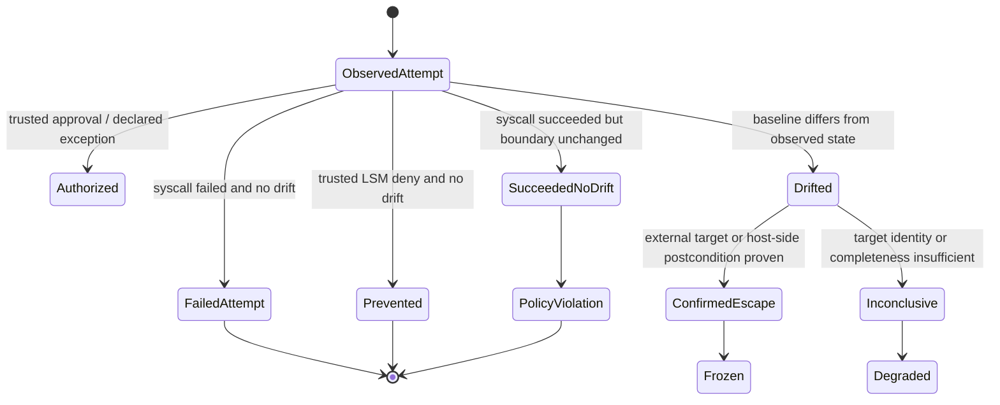
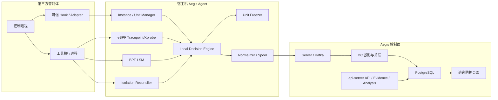

# Aegis V6.2 智能体隔离逃逸检测与响应设计

> **实现基线提示（2026-08-06）**：本文早期的隔离基线、`/proc/cgroup` 复核和旧规则名称仅保留作总体架构/历史上下文。当前生效契约见 [agent_escape_permission_first_refactor_v6.2.md](./agent_escape_permission_first_refactor_v6.2.md)：逃逸检测以 session 有效权限为第一判断条件，Full Access、明确无隔离、远端不可观测和证据不完整时不生成逃逸 finding；受限 session 必须同时具备权限边界、可信 Hook、PID/start_ticks 和 eBPF 执行结果证据。不得按本文旧规则表直接下发规则。

**版本**：6.2  
**日期**：2026-08-06  
**状态**：总体设计；当前权限优先逃逸判定已落地，真实 BPF LSM 与 freeze 发布门禁仍待专用宿主机验证
**适用平台**：Linux  
**设计主题**：识别智能体执行边界，检测权限链路绕过、沙箱策略违规和真实隔离逃逸，并在证据充分时本地阻断或冻结单个执行单元

## 0. 当前实现契约（权限优先）

当前代码不再把所有 namespace、cgroup、mount、capability 或 `no_new_privs` 变化直接判定为逃逸，也不再由 `/proc`/cgroup 隔离漂移单独生成 `agent_isolation_drift` finding。实际判定链路为：

```text
Native Hook 签名权限快照
  -> 真实 session 保存有效权限
  -> Hook tool_call 与进程 PID/start_ticks 关联
  -> eBPF 提供操作、目标和执行结果
  -> 产品边界规则评估
  -> policy_violation_attempt / confirmed_escape / 不生成 finding
```

### 0.1 有效权限分类

| 分类 | 代码语义 | 逃逸结果 |
| --- | --- | --- |
| `full_access` | 明确 Full Access、Codex `bypassPermissions`/`danger-full-access`；Claude 只有原生沙箱同时关闭时才成立 | `not_applicable`，不生成逃逸 finding；行为审计仍继续 |
| `restricted` | 权限、工作区/临时目录、网络或确认边界已完整上报 | 进入产品化边界规则检测 |
| `unknown` | 权限快照缺失或不完整 | `evidence_insufficient`，不生成逃逸 finding |
| `no_isolation` | 产品明确使用本地无隔离运行 | 不把正常暴露面误报为逃逸 |
| `remote_unobservable` | 远程后端没有可关联的远端传感器 | 不生成逃逸 finding，保留不可观测状态 |

支持的产品语义包括：Claude Code 的 `bypassPermissions` 不会覆盖仍启用的原生沙箱；OpenClaw 按 Docker/Podman/OpenShell、`workspaceAccess`、网络和 `elevated` 判断；Hermes 区分 local 无隔离、容器/远程后端和安全写入根；Zcode 使用确认模式语义，不臆造未上报的 OS 沙箱。

### 0.2 生成逃逸 finding 的必要条件

只有以下条件同时满足才生成用户可见的逃逸 finding：

1. session 权限为完整的 `restricted`，且边界不是 `no_isolation` 或 `remote_unobservable`。
2. 工具调用来自可信 Hook，并与实际进程的 PID + `start_ticks` 关联。
3. eBPF 事件提供可用的操作结果；结果未知、Hook/PID 关联失败、PID 复用或证据链不完整时直接抑制 finding。
4. 实际操作超出当前产品权限边界，或命中独立的运行时接口/进程边界规则。

越界请求被拒绝或执行失败时分类为 `policy_violation_attempt`（可疑）；越界操作成功且证据链完整时分类为 `confirmed_escape`（逃逸）。明确批准的边界扩展分类为 `authorized_boundary_expansion`，不生成逃逸 finding。

当前用户可见的逃逸事件默认以 `alert` 进入审计/告警链路；`would_deny`、`enforcement_unavailable` 等状态仍用于兼容底层能力和历史事件，不能在前端显示为“已阻断”。容器运行时 socket 和进程边界规则可以进入本地内核策略编译，但是否 deny/freeze 必须以实际 operation/hook coverage 为准。

### 0.3 当前内置逃逸规则

控制面通过独立的 `/api/v1/agent-guard/escape-rules` 只读目录提供 AGE 规则；运行时事件中的 `rule` 使用对应的内部语义键：

| 规则 | 内部语义键 | 检测边界 |
| --- | --- | --- |
| `AGE-BUILTIN-101` | `access_outside_workspace` | 工作区、临时目录或安全写入根之外的文件访问 |
| `AGE-BUILTIN-102` | `network_boundary_violation` | 网络关闭、域名不在 allowlist 或命中 denylist |
| `AGE-BUILTIN-103` | `access_container_runtime_socket` | Docker、containerd、CRI-O、Podman 控制 socket |
| `AGE-BUILTIN-104` | `process_boundary_operation` | setns、mount、ptrace、内核加载、身份/capability 变更 |
| `AGE-BUILTIN-105` | `approval_boundary_violation` | 未获确认即执行需要确认的命令、文件或网络操作 |
| `AGE-BUILTIN-106` | `protected_path_write` | Hermes 安全写入根之外的实际写入 |
| `AGE-BUILTIN-107` | `host_execution_bypass` | OpenClaw `elevated` 绕过 Docker/Podman/OpenShell 沙箱执行 |

旧的 `join_external_namespace`、`leave_expected_cgroup`、`isolation_baseline_drift` 等规则不再进入新的 escape finding；V6.2 迁移会清理无法按 session/权限解释的 `escape:v1:*` 历史 finding。

### 0.4 前端证据展示

逃逸详情按以下顺序展示，不再以 baseline/actual/diff 作为主结论：

```text
有效权限 -> Hook 工具/命令 -> 进程 PID/start_ticks -> eBPF 执行结果 -> 判定类型/建议动作
```

Full Access 显示“逃逸检测不适用”；权限未知显示“不会生成逃逸告警”；受限模式下分别展示“越界请求被拒绝（可疑）”和“越界命令已执行（逃逸）”。行为监控、逃逸告警和本地内核 deny/freeze 是不同能力，不能互相替代。

## 1. 方案结论

Aegis 不应把“智能体做了危险操作”直接等同于“智能体已经逃逸”。本方案将问题拆成四个可验证层级：

1. **工具控制面绕过**：宿主机观察到执行事实，但没有对应的可信工具调用或审批记录。
2. **沙箱策略违规**：进程尝试访问沙箱不允许的资源，操作可能成功、失败或被拒绝。
3. **隔离边界漂移**：执行单元的 namespace、cgroup、mount、capability、seccomp 或 `no_new_privs` 相对基线发生变化。
4. **已确认逃逸**：存在“越界动作成功 + 边界状态变化或宿主机侧后置事实”的组合证据。

因此，Aegis 的可信检测模型固定为：

```text
可信 Hook/Adapter：说明本来计划做什么、是否审批、预期在哪个沙箱执行
                         +
宿主机 eBPF/LSM：说明进程实际上尝试或完成了什么
                         +
/proc 与 cgroup Reconciler：说明隔离边界最终是否改变
                         =
分类结论 + 证据完整性 + 本地确定性动作
```

Hook 提供语义，但不是安全边界；eBPF 提供宿主机事实，但不能单独证明模型意图；LLM 可以解释证据，但不能参与内核同步决策。阻断和冻结必须由 Aegis Agent 在本机基于确定性规则完成，不依赖 api-server、Kafka、DC 或模型在线。

当前 Agent Guard 工具命令规则的归属另有明确约束：工具 Hook 事件由 api-server
消费并匹配内置规则，Agent eBPF/`/proc` 只提供 PID、PPID、cmdline、资源和隔离事实
用于关联；DC 对这类事件只做规范化投影，不再次生成工具规则命中。本专项中的
eBPF/LSM 规则仅负责 OS 层隔离违规、逃逸尝试和本地确定性防护。

## 2. 设计输入与项目适配

### 2.1 调研输入

本设计结合以下输入：

- 用户提供的[智能体隔离方案分析](https://chatgpt.com/share/6a7441d9-ea94-83ea-8d4f-ab61ee87ff19)，其中的关键观点是“控制进程与工具执行进程常处于不同边界，Hook 记录预期，宿主机 eBPF 观察事实”。
- [V6.2 当前实现基线](current_implementation_baseline_2026-08-06.md)。
- [V6.2 总体架构](overall_architecture_design_v6.2.md)、[Agent/eBPF 防护设计](agent_ebpf_enforcement_design_v6.2.md)、[数据库设计](database_design_v6.2.md)、[后端协议设计](backend_api_protocol_design_v6.2.md)和[前端 PRD](agent_guard_frontend_prd_v6.2.md)。
- [V6.2 实施状态](implementation_status_v6.2.md)和[实施测试发布计划](implementation_test_rollout_v6.2.md)。
- 外部产品与内核事实来源：[Codex Linux sandbox](https://github.com/openai/codex/blob/main/codex-rs/linux-sandbox/README.md)、[Claude Code sandboxing](https://code.claude.com/docs/en/sandboxing)、[OpenClaw sandboxing](https://docs.openclaw.ai/gateway/sandboxing)、[Hermes Security Model](https://github.com/NousResearch/hermes-agent/blob/main/SECURITY.md)、[Linux BPF LSM](https://docs.kernel.org/bpf/prog_lsm.html)和[Tetragon namespace access monitoring](https://tetragon.io/docs/use-cases/process-lifecycle/namespace-access/)。

### 2.2 对 Aegis 的直接含义

| 外部运行事实 | Aegis 设计约束 |
| --- | --- |
| Codex/Claude Code 常隔离命令及其子进程，而控制进程留在宿主机 | 控制进程在宿主机不是逃逸；必须识别 worker/execution unit 的真实边界 |
| OpenClaw 可关闭沙箱，也可使用 Docker、SSH、OpenShell；Gateway 留在宿主机 | 必须先识别 backend；`off/local` 是 `no_isolation`，不是“已逃逸” |
| Hermes 可使用 local、容器和远程后端 | local 只做行为监控；容器按 cgroup 归属；远端无传感器时标记 `remote_unobservable` |
| 产品可能提供显式的 unsandboxed/elevated 执行入口 | 经可信审批的边界扩展要记录为 `authorized_boundary_expansion`，不能误报为逃逸 |
| namespace 变化可被监控，但一次 `setns` 只证明尝试 | 必须关联返回值和后续状态，区分 attempted、prevented 与 confirmed |
| BPF LSM 可在 LSM Hook 返回 `-EPERM` | 只有真实加载并验证过的 LSM Hook 才能宣称 deny；tracepoint 不能宣称提前阻断 |

## 3. 目标、非目标与成功标准

### 3.1 目标

- 识别每个 Agent 资产、运行实例、真实 session 和执行单元。
- 记录执行单元创建时的隔离基线，并持续复核实际状态。
- 将工具调用、进程血缘、系统调用、资源访问和状态漂移关联到同一执行单元。
- 明确区分未隔离、不可观测、违规尝试、已阻断、边界漂移和已确认逃逸。
- 对证据充分的原子危险操作执行本地 deny，并可冻结单个 execution unit。
- 在前端提供可复核的基线、实际状态、证据链、动作状态和能力降级原因。

### 3.2 非目标

- 不建设新的智能体沙箱运行时，不替代 Codex、Claude Code、OpenClaw 或 Hermes 自身的隔离实现。
- 不将 prompt injection、模型越狱文本或恶意意图本身定义为 OS 逃逸。
- 不采集完整 prompt、stdin/stdout/stderr、文件正文或网络 payload。
- 不依赖 LLM 做同步阻断，不允许 AI-only 结论自动 freeze/kill。
- 不承诺在宿主机内核已被完全控制后仍能提供不可绕过检测。
- 不在 V6.2 首版宣称 Windows/macOS 的内核逃逸阻断能力。

### 3.3 成功标准

1. 同机多个 Agent、同类型多个实例和多个 execution unit 不串联、不重复归属。
2. 控制进程在宿主机、沙箱关闭、远端不可观测都能显示真实状态，不误报逃逸。
3. 未授权 `setns` 失败时记录 attempt；LSM 拒绝时记录 prevented；状态漂移时记录 confirmed/inconclusive 所需证据。
4. Docker/OCI worker 即使父进程是 `containerd-shim`，也能依靠 cgroup/container ID 归属。
5. deny/freeze 仅作用于一个明确 execution unit，不影响 Aegis Agent、宿主机关键服务或同机其他 Agent。
6. BPF LSM 不可用、事件丢失、FD/路径无法解析或远端无传感器时显式降级，不声称已阻断或已安全。
7. 至少在专用 Linux 测试主机完成一条真实 `EPERM + freeze + auto-resume/manual-resume` 端到端链路。

## 4. 逃逸术语与判定状态机

### 4.1 事件分类

| 分类 | 定义 | 是否称为逃逸 | 默认动作 |
| --- | --- | --- | --- |
| `no_isolation` | 产品使用 local/off backend，没有声明可验证沙箱边界 | 否，属于暴露面 | posture alert |
| `authorized_boundary_expansion` | 用户或受信策略明确批准 unsandboxed/elevated 执行 | 否 | audit，高风险资源仍单独检测 |
| `unattributed_execution` | 有 OS 执行事实，无可匹配的可信工具/审批事件 | 否，属于控制面绕过嫌疑 | alert |
| `policy_violation_attempt` | 尝试执行 Profile/策略不允许的操作，但未证明边界改变 | 否，属于逃逸尝试 | audit/alert |
| `prevented_escape` | Aegis LSM 或外部沙箱明确拒绝，返回值和状态证明未生效 | 否，属于已阻断逃逸尝试 | deny，可选 freeze |
| `boundary_drift` | namespace/cgroup/mount/capability/seccomp 基线发生异常变化 | 可能 | critical finding，通常 freeze |
| `confirmed_escape` | 越界动作成功，且状态/宿主机后置事实证明进入预期边界之外 | 是 | deny 后续动作 + freeze；人工决定 kill |
| `inconclusive` | 证据缺失或冲突，无法证明成功或失败 | 不得下结论 | alert + degraded |
| `sensor_tamper_or_host_compromise` | Aegis Agent/BPF link/map/策略完整性异常，或宿主机控制迹象 | 超出普通逃逸层级 | critical alert，交给主机自保护/外部监控 |

### 4.2 判定状态机



### 4.3 最小判定规则

系统必须分别保存三个结果，不能只使用一个 `decision` 字段代替：

```json
{
  "attempt_result": "denied|failed|succeeded|unknown",
  "boundary_result": "unchanged|drifted|unobservable|not_applicable",
  "classification": "prevented_escape|confirmed_escape|inconclusive",
  "enforcement_result": "none|would_deny|denied|denied_and_frozen|failed"
}
```

兼容现有表时，上述结构先写入 `agent_behavior_events.evidence` 和 Finding 的 `evidence_graph`；现有 `decision` 继续表达执行动作，不再承担“是否逃逸成功”的语义。

## 5. 威胁模型与信任边界

### 5.1 保护对象

- 宿主机 namespace、cgroup、mount tree、内核接口和容器运行时控制面。
- Aegis Agent、自身 systemd unit、BPF links/maps、本地 bundle 和 last-known-good 状态。
- Agent 可访问的源码、凭据、配置、持久化入口和网络身份。
- 第三方 Agent 声明的沙箱边界以及用户审批边界。
- 行为原始事实、Finding、动作结果和审计链。

### 5.2 对手能力

假设提示词注入、恶意仓库文件、网页、MCP 返回或工具输出可以诱导 Agent：

- 启动 shell、脚本解释器、编译器和任意用户态子进程。
- 调用 `setns/unshare/clone3/mount/pivot_root/chroot`。
- 访问 runtime socket、`/proc/*/ns`、`/proc/*/root` 和 cgroupfs。
- 尝试 ptrace 外部进程、改变 UID/GID/capability、加载 BPF 或内核模块。
- 绕过工具 Dispatcher，或使用产品提供的 elevated/unsandboxed 路径。

可信根仍是未被完全控制的宿主机 Linux 内核、Aegis Agent 二进制与受信发布链、api-server 权限与审计控制面。智能体控制进程、工具执行进程、下载/生成/编译的代码以及所有会话内容均不可信。

## 6. 总体架构



### 6.1 组件职责

- **Hook/Adapter**：上报真实 session、tool call、预期 sandbox ID、审批和 elevated/unsandboxed 标志；不得被当作内核事实。
- **Instance/Unit Manager**：识别 `host + controller_pid + start_ticks`，建立 execution unit，记录 Profile 与隔离族。
- **eBPF monitor**：采集尝试、返回值、PID/PPID/start_ticks、cgroup ID、目标资源和进程血缘。
- **BPF LSM**：只执行可以在 Hook 时确定目标、主体和策略的原子 deny。
- **Reconciler**：读取 `/proc/<pid>/{ns,cgroup,mountinfo,status,root}`，复核状态与基线差异。
- **Local Decision Engine**：基于主体归属、Profile allow、策略、能力和证据完整性给出动作。
- **DC**：幂等投影、跨事件关联、Finding/告警和实时通知；不参与同步 deny。
- **api-server**：消费可信工具事件并匹配 Agent Guard 工具命令规则，同时负责查询、权限、证据窗口、异步智能解释和人工动作编排；工具规则命中不由 DC 或 eBPF 生成。
- **Frontend**：展示事实、结论、覆盖、降级和动作终态，不推导后端没有提供的安全结论。

## 7. 身份归属与隔离基线

### 7.1 归属优先级

每个行为事件只允许一个主归属：

1. 已确认的 execution unit cgroup/container ID。
2. Aegis 管理的 unit token 或受信 Hook correlation token hash。
3. fork 标签传播与 `PID + start_ticks`。
4. Profile 多证据匹配和 `/proc` 校准。
5. 证据冲突时标记 `ambiguous/unattributed`，不得复制到多个实例，也不得自动 freeze。

仅凭进程名、最近活跃会话或 controller PID 不能建立 confirmed 归属。

### 7.2 基线建立时机

在 execution unit 首次达到 confirmed 后立即捕获：

- pid/mnt/net/user/uts/ipc/cgroup/time namespace inode。
- cgroup version、path、ID、container runtime 和完整 container ID。
- root mount identity、mountinfo digest、mount propagation 和敏感挂载摘要。
- capability inheritable/permitted/effective/bounding/ambient。
- seccomp mode 和 `no_new_privs`。
- Profile 声明的允许 namespace、mount、runtime socket、capability 和嵌套容器能力。
- 覆盖快照：tracepoint、BPF LSM、BTF、cgroup v2 freezer、pidfd、`/proc` 可见性。

基线必须带 `captured_at`、`process_start_ticks`、Profile version、policy version 和 completeness。基线不完整时 execution unit 不能进入 `full_enforcement`。

### 7.3 基线更新规则

- 正常进程 fork/exec 不改变 unit 基线。
- 产品官方创建新 sandbox/session 时创建新 execution unit，不修改旧 unit 基线。
- Profile 或 policy 更新只产生新版本期望，不覆盖历史事件所引用的旧基线。
- 只有受信的 unit 生命周期事件可以重建基线；检测到漂移后不得自动把 actual 提升为新 baseline。

## 8. 传感器与证据设计

### 8.1 Hook/Adapter 语义证据

建议在现有可信工具事件 attributes 中增加可选字段：

```json
{
  "sandbox_expected": true,
  "sandbox_backend": "bubblewrap|docker|ssh|openshell|local",
  "sandbox_id": "opaque-id",
  "approval_state": "not_required|approved|denied|unknown",
  "privilege_mode": "sandboxed|elevated|unsandboxed",
  "expected_cwd": "/workspace",
  "expected_network_policy_id": "opaque-id"
}
```

字段必须来自受签名 Hook、官方审计日志或受管 wrapper。普通终端文本、模型回复和命令输出不能生成这些事实。

### 8.2 eBPF monitor 证据

首批监控面沿用现有 `guard_monitor`：

- `setuid/setgid/capset`。
- `setns/unshare/clone3`。
- `mount/pivot_root/chroot`。
- `ptrace`。
- `bpf/perf_event_open/init_module/finit_module/delete_module`。
- Unix socket `connect`。

每个 entry/exit 事件至少保留：

```text
host_boot_id + monotonic_ns + pid/tid + process_start_ticks
operation + arguments/target + return_code
instance_id + execution_unit_id + attribution_confidence
policy/profile version + collection visibility + lost counter
```

`setns` 的 FD 目标在用户态通过 `/proc/<pid>/fd/<fd>` 解析时存在进程退出和 FD 复用竞态；解析失败必须标记 `target_unresolved`，不能据此认定 external namespace。后续实现可在目标内核支持时使用更可靠的 LSM/内核对象身份，但仍需保留能力探测。

### 8.3 状态复核

以下场景触发立即复核，另保留低频周期 Reconcile：

- 高风险 syscall 返回成功。
- LSM deny 或 deny_and_freeze。
- fork/exec 后出现 namespace/cgroup 与父 unit 不一致。
- controller/worker/backend 变化。
- 事件丢失、BPF link/map 异常或 unit 归属修复。

复核必须比较基线和实际值，并把不可读维度单独标记为 unavailable。不能用“读取失败”代表“未发生变化”。

## 9. 逃逸规则矩阵

### 9.1 建议规则集合

| Rule key | 关键证据 | 成功后置事实 | 默认动作 |
| --- | --- | --- | --- |
| `unattributed_execution` | OS exec 无可信 tool/session 关联 | 不适用 | alert |
| `sandbox_bypass_or_elevated` | Hook 标记 unsandboxed/elevated | 有审批则 audit；无审批则 high alert | audit/alert |
| `filesystem_policy_bypass` | resolved path 超出 Profile/Hook 声明的读写范围 | 文件操作成功 | alert；复用文件行为规则 |
| `network_policy_bypass` | eBPF connect 目标不符合 expected network policy | 连接成功 | alert；复用外链规则 |
| `join_external_namespace` | `setns` 目标 inode 不属于 unit 允许集 | namespace tuple 漂移 | deny_and_freeze |
| `leave_expected_cgroup` | 进程成员 cgroup 与 baseline 不同 | `/proc/<pid>/cgroup` 复核 | alert；确认后 freeze |
| `access_container_runtime_socket` | 连接 Docker/containerd/CRI/Podman socket | connect 成功或 LSM deny | deny_and_freeze |
| `access_host_proc_root` | 外部 PID 的 `/proc/<pid>/root` 或 namespace | 文件访问成功/后续 host path 事实 | deny |
| `write_cgroupfs` | 对 cgroup 控制文件写/迁移进程 | cgroup 配置或成员变化 | deny |
| `mount_host_sensitive_path` | mount/bind/open_tree/move_mount 指向 host-sensitive path | mountinfo/root mount 漂移 | deny_and_freeze |
| `ptrace_external_process` | source unit 与 target unit 不同 | ptrace 成功 | deny |
| `ptrace_aegis_agent` | target 为 protected Aegis PID | ptrace 成功或被 deny | deny_and_freeze |
| `load_bpf_or_module` | BPF program/BTF load 或 module syscall | 内核对象/模块状态（可见时） | deny |
| `capability_escalation` | capability 新增、UID/GID 提升 | `/proc/status` 复核 | deny_and_freeze |
| `isolation_baseline_drift` | namespace/cgroup/root/mount/capability/seccomp 漂移 | 差异本身 | critical alert/freeze |

`filesystem_policy_bypass` 和 `network_policy_bypass` 是沙箱策略违规分类，分别复用
现有文件行为与 `AGB-BUILTIN-002` 外链证据，不作为新的内核逃逸规则重复命中。
同样，runtime socket 连接成功表示已触达宿主机桥接面，应立即阻断和高危告警；只有
继续观察到容器创建、宿主挂载、宿主进程执行或等价 daemon 后置事实时，才能把结论
升级为 `confirmed_escape`。

### 9.2 Profile allow 优先于通用异常推断

不能全局禁止 `unshare/clone3/mount`。构建工具、容器运行时或嵌套 sandbox 可能合法创建更深层隔离。规则顺序为：

```text
主体与 unit 归属
  -> protected target 排除
  -> 显式用户审批/边界扩展事实
  -> Profile 允许集合
  -> policy 例外
  -> 原子 deny 规则
  -> 状态漂移/跨事件规则
```

允许“创建更深层 namespace”不等于允许“加入宿主机或其他 execution unit 的 namespace”。

### 9.3 当前实现能力与目标能力

截至 2026-08-06，仓库内 BPF LSM 的真实同步 deny 范围应按代码事实表述：

| 能力 | 当前状态 | 产品展示要求 | 后续目标 |
| --- | --- | --- | --- |
| Unix runtime socket exact path | `lsm/socket_connect` 可编译 deny | 可显示 escape enforcement，但需真实主机门禁 | 扩充受验证 runtime socket 集合 |
| `BPF_PROG_LOAD/BPF_BTF_LOAD` | `lsm/bpf` 可编译 deny | 只能显示 BPF load deny | 保持原子规则，补真实 EPERM 测试 |
| module load | monitor-only | 不能被 `load_bpf_or_module` 名称掩盖为已阻断 | 单独暴露 enforced operations；有可靠 Hook 后再提升 |
| setns/mount/ptrace/cgroupfs/proc root | monitor + 状态复核 | 显示 `would_deny` 或 audit，不显示 denied | 分规则增加经过目标内核验证的 LSM Hook |
| freeze/resume/kill | 已有代码和非破坏性测试 | 未过专用主机门禁前不得宣称生产可用 | 完成 cgroup v2/pidfd 真实链路 |

覆盖能力必须细化到 `rule + operation + hook`，不能只用主机级 `BPFLSM=true` 推导所有逃逸规则都可阻断。

## 10. 本地决策与处置

### 10.1 同步决策输入

```text
GuardSubject(PID/start_ticks/cgroup/unit)
+ Profile(version/allow conditions)
+ CompiledPolicy(version/digest/rule/action)
+ KernelCapability(rule/hook/operation)
+ ProtectedTarget registry
```

同步 LSM 路径不能调用网络、数据库、Kafka、LLM 或做无界字符串/正则匹配。glob、命令语义、跨事件链和 AI 结论全部留在用户态或服务端。

### 10.2 动作策略

| 条件 | 动作 |
| --- | --- |
| 主体未确认、归属 ambiguous、目标无法解析 | audit/alert，禁止自动 freeze |
| 规则确定、原子目标可验证、LSM capability 已证明 | deny |
| critical 原子规则 + unit 可安全冻结 + 非 protected target | deny_and_freeze |
| 仅 syscall attempt，无状态变化 | alert 或 prevented，不升级 confirmed escape |
| 边界漂移但原因不完整 | critical alert + 可人工 freeze；自动动作需策略明确授权 |
| AI-only 或 tool-only finding | alert，禁止自动 freeze/kill |

### 10.3 Freeze

- OCI/cgroup unit 优先使用 cgroup v2 `cgroup.freeze`，并读取 `cgroup.events` 确认终态。
- 非托管本地 unit 只能使用 pidfd + `SIGSTOP` fallback，并显示 `freeze_fallback`。
- freeze 前重新校验 unit、PID/start_ticks、cgroup 成员和 protected target。
- 默认 300 秒自动恢复；人工 hold 必须具备权限和审计理由。
- resume 只解除暂停，不关闭仍在生效的 deny 规则。
- kill 永不自动触发，只允许人工二次确认。

## 11. 数据、事件与 Finding 契约

### 11.1 复用现有数据模型

第一阶段不新增表，复用：

- `agent_runtime_instances`：控制进程、Profile 和覆盖状态。
- `agent_execution_units`：baseline、actual、diff、unit 状态和 coverage。
- `agent_behavior_events`：attempt、deny、drift 与原始证据引用。
- `agent_security_findings`：逃逸结论、规则命中和 evidence graph。
- `agent_guard_actions`：freeze/resume/kill 请求与终态。

### 11.2 逃逸事件建议结构

```json
{
  "event_type": "agent_sandbox_violation",
  "rule_id": "join_external_namespace",
  "subject": {
    "instance_id": "uuid",
    "execution_unit_id": "uuid",
    "pid": 1234,
    "start_ticks": 991827
  },
  "attempt": {
    "operation": "setns",
    "target": "mnt:[4026531840]",
    "return_code": -1,
    "result": "denied"
  },
  "boundary": {
    "baseline_fingerprint": "sha256:...",
    "actual_fingerprint": "sha256:...",
    "result": "unchanged",
    "completeness": "complete"
  },
  "classification": "prevented_escape",
  "decision": "deny_and_freeze",
  "enforcement": {
    "hook": "lsm/...",
    "capability_proven": true,
    "result": "denied_and_frozen"
  },
  "evidence_event_ids": ["attempt-id", "state-id", "action-id"]
}
```

### 11.3 幂等与顺序

- 原始事件继续使用 `raw_event_id` 唯一约束和 `host_boot_id + agent_sequence`。
- 同一 attempt、state reconcile 和 action 通过 `correlation_id/parent_event_id` 关联。
- Finding key 建议使用 `host + boot + unit + rule + attempt_event_id`；重放只能合并证据，不能产生重复 Finding/动作。
- 事件顺序使用 `occurred_monotonic_ns + agent_sequence`，服务端接收时间只作辅助。
- 原子 deny、escape、drift 和 action 证据不可采样。

## 12. API 与前端方案

### 12.1 API

复用现有 `/api/v1/agent-guard` 接口，并在响应中补充：

- `/coverage`：按 rule/operation 返回 `monitor|deny|freeze` 能力和具体 reason。
- `/execution-units/:id`：返回 baseline、actual、diff、completeness 和最近一次 reconcile。
- `/findings`：支持 `classification`、`rule_id`、`enforcement_result`、`has_drift` 筛选。
- `/findings/:id`：返回 attempt/state/action 三段证据，不将 AI 摘要混入原始事实。
- `/actions/:id`：返回 accepted、dispatching、running 和 terminal 时间点。

旧客户端不识别新增 JSON 字段时保持兼容；未知 schema 大版本只存原始事件，不创建自动动作。

### 12.2 前端

沿用“智能体逃逸防护”页面和两个详情 Tab：

```text
沙箱全景：Agent -> instance -> execution unit -> process -> operation/rule/action
逃逸分析：Finding -> attempt -> boundary diff -> enforcement -> action timeline
```

必须遵守以下表达规则：

- `no_isolation` 显示“未启用可验证隔离”，不能显示“安全”。
- `remote_unobservable` 显示“远端未部署/未关联传感器”，不能显示零风险。
- `would_deny` 显示“策略期望拒绝，但本机未证明具备同步阻断能力”。
- `prevented_escape` 显示“逃逸尝试已阻断”，不得显示“已逃逸”。
- `confirmed_escape` 必须同时展示成功动作和状态/宿主机后置证据。
- 经可信审批的 unsandboxed/elevated 显示“授权边界扩展”，仍展示实际高风险资源操作。
- API 返回 accepted 后只显示 pending；只有 Agent 回传终态才能显示“已冻结/已恢复/已终止”。

## 13. 智能分析边界

智能分析只处理服务端构造的有界证据窗口，输入包括：

- 规则和 Profile 版本。
- attempt、返回值、baseline/actual/diff。
- 进程链与 tool/session 关联状态。
- 证据完整性、丢失和不可观测原因。
- 允许条件、审批事实和反证。

输出固定 Schema：

```text
verdict: benign|suspicious|malicious|inconclusive
classification: policy_violation|escape_attempt|prevented_escape|confirmed_escape|unknown
confidence
evidence_event_ids[]
counter_evidence_event_ids[]
uncertainty[]
recommended_action
```

模型引用的 event ID 必须在输入窗口中真实存在；事件内容按不可信数据处理，不允许其中的指令改变系统提示或调用工具。AI 结果只能补充解释和人工优先级，不能把 `attempt` 升级为 `confirmed_escape`，也不能自动触发 deny/freeze/kill。

## 14. 安全、隐私与可运维性

- 事件不保存文件正文、网络 payload、stdin/stdout/stderr、环境变量和原始 token。
- 命令、路径、URL query、correlation token 在 Agent 侧先脱敏；join key 只保存 SHA-256。
- 普通日志只记录 host/instance/unit/rule/action ID、coverage 和错误码，不记录完整命令或证据正文。
- 详细证据要求 `agent_guard:evidence:read`；动作要求独立 action 权限并写审计。
- 本地 bundle 使用 version/digest、原子替换和 last-known-good；控制面离线时继续执行最后成功应用的确定性规则。
- BPF link/map、Agent 进程或 bundle 完整性异常时覆盖状态转为 `degraded`，并产生独立 health/tamper 事件。

建议指标：

```text
aegis_agent_guard_escape_attempts_total{rule,result}
aegis_agent_guard_escape_classifications_total{classification}
aegis_agent_guard_enforcement_total{rule,operation,result}
aegis_agent_guard_isolation_drifts_total{dimension}
aegis_agent_guard_target_resolution_total{kind,result}
aegis_agent_guard_freezes_total{method,result}
aegis_agent_guard_coverage_total{rule,level,reason}
aegis_agent_guard_event_drops_total{sensor}
```

## 15. 与当前实现的差距和最小改造

### 15.1 必须先修正的契约问题

1. 当前 `DetectEscapeAttempt` 生成的专项 violation 默认使用 `would_deny`；需要保留原始 LSM 的 `deny/deny_and_freeze` 和实际动作结果，避免已阻断事件在专项层被降写或混淆。
2. 当前 Profile 默认规则名存在 `mount_host_path`、`credential_or_capability_gain`，而检测器使用 `mount_host_sensitive_path`、`capability_escalation`；必须建立唯一、版本化的 canonical rule registry，并在启动和 migration 测试中校验。
3. 当前 `load_bpf_or_module` 名称覆盖范围大于实际 LSM 能力；coverage/API/UI 必须返回 `enforced_operations=[BPF_PROG_LOAD,BPF_BTF_LOAD]`，模块加载保持 monitor-only。
4. 主机级 `BPFLSM=true` 不足以证明每条逃逸规则可阻断；能力模型需要细化到 rule/operation/hook。
5. trusted Hook 需要显式传递 sandboxed/elevated/unsandboxed 和 approval state，才能区分授权边界扩展与绕过。

### 15.2 文件级落点

| 组件 | 主要落点 |
| --- | --- |
| Agent rule/classification | `agent/internal/agentguard/escape.go`、`types.go`、`manager.go` |
| Profile 与规则规范化 | `agent/internal/agentguard/profile.go`、`migrations/029_v6.2_agent_guard.sql` |
| rule-level capability | `agent/internal/agentguard/capability.go`、`enforcement.go` |
| monitor/LSM | `agent/internal/ebpf/bpf/guard_monitor.bpf.c`、`agent_guard_lsm.bpf.c`、`loader.go` |
| 动作 | `agent/internal/agentguard/actions.go` |
| 投影与 Finding | `dc/internal/pipeline/`、`dc/internal/repository/agent_guard_repository.go` |
| API | `api-server/internal/service/agent_guard_*`、`api-server/internal/api/handler/agent_guard_handler.go` |
| 前端 | `frontend/src/views/detection/AgentGuard/`、`frontend/src/types/agentGuard.ts` |

除非新增高频筛选证明 JSON 查询不足，第一阶段不新增表；如需 schema 变化，使用追加式 migration，不修改已发布 migration 的历史语义。

## 16. 分阶段实施

### E0：契约统一与只读判定

- 建立 canonical escape rule registry 和规则别名迁移策略。
- 增加 attempt/boundary/classification/enforcement 四段结果。
- 增加 rule-level capability API 和前端真实覆盖显示。
- 只读重放现有事件验证旧数据兼容，不启用新动作。

### E1：监控与状态复核准确性

- 完成 setns FD 目标、外部 ptrace 目标、runtime socket 和 cgroup 目标解析的完整性标记。
- 高风险成功 syscall 触发即时 `/proc` reconcile。
- 补 unattributed execution、authorized boundary expansion 和 no-isolation posture 事件。
- 完成跨实例、PID 重用、事件丢失和乱序重放测试。

### E2：Shadow / would-deny

- 所有逃逸规则先以 audit/would-deny 运行。
- 收集 Profile allow、正常构建/测试工作流和误报数据。
- 按 rule/agent/profile/host 灰度，不按“整台主机全部规则”一次开启。

### E3：原子 deny

- 先验证当前 runtime socket 和 BPF load LSM。
- 再按内核能力逐条引入 ptrace、mount、setns、cgroupfs 等可靠 LSM Hook。
- 每条规则必须具备“未生效后置状态”验证和真实 `EPERM` 测试，才能从 would-deny 提升为 deny。

### E4：freeze 与生产灰度

- 仅对 critical、confirmed attribution、单一 execution unit 开启自动 freeze。
- 先 cgroup v2，后评估 pidfd fallback；验证 timeout auto-resume。
- 单主机、单 Agent、单 rule 扩量；满足停止条件立即回退到 audit。

## 17. 测试与验收

### 17.1 核心场景

| 场景 | 预期 |
| --- | --- |
| 普通 shell 执行同样的 setns/mount 测试 | 不归属 Agent，不产生 Agent escape action |
| Codex 控制进程在宿主机、worker 在 namespace | 显示正常架构，不报逃逸 |
| OpenClaw sandbox off/local | `no_isolation` posture，不报“已逃逸” |
| 可信审批后 elevated/unsandboxed | `authorized_boundary_expansion`；高风险资源仍独立告警 |
| OS exec 无可信 tool call | `unattributed_execution`，不伪造工具名 |
| 未授权 setns 失败 | `policy_violation_attempt`，state unchanged |
| setns 被 Aegis LSM 拒绝 | `prevented_escape`，EPERM，state unchanged |
| setns 成功且 namespace tuple 进入外部边界 | `confirmed_escape`，证据含 attempt + drift |
| Docker worker 访问 fake runtime socket | cgroup 归属正确；deny 不影响 dockerd/containerd |
| cgroup 漂移 | baseline/actual/diff 完整，确认后只冻结目标 unit |
| 远端 SSH 无 Aegis Agent | `remote_unobservable`，freeze API 稳定拒绝 |
| 无 BPF LSM | `would_deny/enforcement_unavailable`，不得显示已阻断 |
| 事件丢失或 FD 解析失败 | `inconclusive/degraded`，不得升级 confirmed |
| PID 复用 | 不对新进程应用旧 unit/action |
| 同机两个 Agent | 冻结一个 unit，另一个持续运行 |

### 17.2 发布门禁

以下项目全部通过后，才可对外宣称“智能体逃逸阻断可用”：

1. 专用 Linux 主机真实加载 BPF LSM，至少一条规则返回 `EPERM`。
2. attempt、LSM deny、`/proc` 后置复核、Finding、告警和 UI 证据一致。
3. cgroup freeze、timeout auto-resume、人工 resume 全链路成功。
4. protected target 和同机其他 Agent 未受影响。
5. 无 BPF LSM、远端、no-isolation 和丢事件场景均准确降级。
6. Agent/eBPF、Server、DC、api-server、Frontend 定向测试和构建通过。
7. 专用测试仅使用临时 namespace/cgroup、fake runtime socket 和测试容器，不访问生产 socket、真实敏感路径或未知外部地址。

## 18. 灰度、停止条件与回滚

### 18.1 灰度顺序

```text
consumer/projection
  -> instance/unit/baseline
  -> monitor-only
  -> finding/alert
  -> would-deny
  -> 单规则 LSM deny
  -> 单规则 deny_and_freeze
```

### 18.2 停止扩量条件

- 非 Agent 进程被错误归属或采取动作。
- protected target 或同机其他 Agent 受到影响。
- denied 事件缺少可信 LSM 证据，或 UI 把 would-deny 显示为已阻断。
- freeze 无法确认、无法自动恢复或出现 PID/cgroup 身份漂移。
- 正常 sandbox 工作流产生不可接受的误报/阻断。
- event loss、target unresolved 或 baseline incomplete 超过阈值。
- rule key/Profile version 在 Agent、migration、API、前端之间不一致。

### 18.3 回滚

1. 恢复所有非人工 hold 的 Agent Guard frozen execution unit。
2. 关闭 `freeze_enabled`，停止新 freeze。
3. 将 escape action 统一降为 audit/would-deny。
4. 从 BPF map 清理 deny action 并 detach 新增 LSM link；可保留 monitor reader。
5. 回滚 Agent/Server/DC/api-server/Frontend 镜像。
6. 保留行为、Finding、Action、bundle 和审计数据，不在生产回滚中 DROP 表。

## 19. 最终边界

本方案能在“宿主机内核与 Aegis Agent 仍可信”的前提下，提高对智能体工具权限绕过、沙箱违规和 namespace/container 逃逸的检测与阻断能力。它不能证明一个未部署远端传感器的远程沙箱安全，也不能在宿主机内核已经被完全控制后提供绝对保证。

产品对外表达应保持三个原则：

- 看见尝试，不等于证明成功。
- 策略期望拒绝，不等于已经阻断。
- 没有可观测隔离边界，不等于没有风险。

## 20. 本次实现对齐（2026-08-06）

- 行为规则与逃逸规则已分为两个不可混用的 catalog：`/agent-guard/rules` 与 `/agent-guard/escape-rules`；Bundle 也分别携带 `builtin_rules` 和 `escape_rules`。
- 运行时设置新增 `behavior_policy_enabled`、`escape_policy_enabled`，每个 Agent 注入项新增 `behavior_enabled`、`escape_enabled`。Agent 按 `agent_type + scope` 维护 Hook 状态；两个 scope 可同时 provision，关闭一个只执行对应 scope 的 remove。
- 逃逸详情不再加载会话、沙箱全景或会话删除操作，仅显示逃逸分析。Finding 详情新增 `escape_chain`，按 Hook event IDs、进程身份、`/proc`/cgroup 证据和复核结论分段呈现；证据不完整时明确显示 gap/inconclusive。
- 原有 `enabled` 字段和旧 Hook provisioner 保留为兼容别名，仅映射行为 scope；新版本生产 Hook 命令通过 `--scope behavior|escape` 写入独立 managed source/策略。
