# Aegis V6.2 智能体会话提取与语义检测完整方案

**版本**：6.2-P5
**日期**：2026-08-03
**状态**：设计完成，待实施
**首批产品**：Codex、Claude Code、OpenCode
**页面名称**：智能体会话检测

## 1. 目标

在现有 Agent Guard 的“操作系统行为事实”和“隔离逃逸证据”之上，新增一条
独立的智能体会话审计链路：

1. 从 Codex、Claude Code、OpenCode 提取可见会话、工具调用、权限请求、
   compact、子智能体和生命周期信息。
2. 将三种产品的不同格式归一为统一会话模型，并关联到 Aegis 的主机、Agent
   asset、RuntimeInstance、BehaviorSession、ExecutionUnit 和 OS 行为事件。
3. 由上层 AI 语义分析器判断会话是否存在凭据窃取、数据外传、持久化、提权、
   沙箱逃逸、破坏、防御规避等恶意意图或执行计划。
4. 在会话、消息和证据片段上标记风险，区分“仅语义可疑”和“已有 OS 行为
   证实”，供安全运营人员审计、确认或驳回。
5. 在 Aegis 控制台新增第三个子标签页“智能体会话检测”，完整展示会话列表、
   会话时序、语义研判和关联行为。

本方案中的“完整会话”是结构完整，不等于无条件保存所有原始内容：

- 保留用户可见消息、助手可见回复、工具调用/结果状态、权限决策、compact、
  子智能体和会话生命周期的完整顺序。
- 默认对文本、工具参数和结果做密钥脱敏、长度限制和内容分级。
- 不采集隐藏推理、私有 chain-of-thought、模型内部状态、TLS 明文或工具读到的
  完整文件内容。
- 只有显式授权策略可以保存加密原文；AI 分析仍只使用脱敏副本。

## 2. 与现有 V6.2 的关系

V6.2 已实施的 P0～P4 继续保持原边界。会话检测作为 P5 独立扩展：

```text
P0～P4 Agent Guard
  OS 行为事实 + 工具语义摘要 + Finding + 逃逸 + 本地动作

P5 Agent Session Detection
  可见会话 + 消息/工具时序 + AI 语义风险 + OS 行为关联 + 审计标记
```

必须严格区分两条入口：

| 入口 | 当前边界 | 是否允许会话内容 |
| --- | --- | --- |
| `agentguard` 可信工具 Adapter | 只传 tool call ID、名称、状态和 correlation；用于 OS 行为关联 | 否 |
| `agentsession` 会话采集 Adapter | 传输按策略脱敏后的会话 item；用于审计和语义分析 | 是，受内容策略控制 |

不得因为 P5 需要会话内容而放宽
[trusted_tool_adapter_implementation_v6.2.md](trusted_tool_adapter_implementation_v6.2.md)
中“不得传 prompt、工具输出和文件内容”的约束。两模块可以复用 manifest、
SO_PEERCRED、重放防护和日志脱敏库，但必须使用不同 socket、配置、事件 Schema、
Kafka topic、数据库表和权限。

## 3. 成功标准

1. 三种 Agent 的新建、继续、compact、结束会话能稳定识别，同一 source session
   不会重复创建 Aegis 会话。
2. 会话内用户消息、可见助手回复、工具调用/结果、权限决策和子智能体按真实
   顺序展示；缺失、截断、脱敏和不可观测均有明确标记。
3. Agent 运行中可以实时增量采集；Agent/Aegis 重启后可以从 cursor 回补，
   不重复、不跳过已经完整落盘的 item。
4. 历史会话可以在策略允许的用户、时间和产品范围内回补，禁止递归扫描所有
   home 目录。
5. 语义分析输出 verdict、risk categories、证据 item ID、反证、不确定性和
   分析版本；会话内容中的提示注入不能改变分析器系统指令。
6. “请求读取凭据”与“已经读取凭据”严格区分；只有关联到真实 OS 行为时才
   显示“行为已证实”。
7. AI-only `malicious` 只能标记/告警/待确认，不能直接 deny、freeze 或 kill。
8. 页面能筛选 Codex、Claude Code、OpenCode，查看完整脱敏会话、风险位置、
   分析依据和关联的 PID/文件/网络/提权/逃逸证据。
9. 未经授权的用户不能查看、复制或导出会话正文；所有 reveal、复制和导出均
   写审计日志。
10. 会话内容不进入普通日志、URL query、WebSocket 通知正文或未隔离的错误信息。

## 4. 官方能力与格式事实

设计以 2026-08-03 的官方资料为基线。产品升级后必须通过 Adapter 兼容矩阵和
fixture 回归确认，不能假设内部 JSON/数据库格式永久稳定。

### 4.1 Codex

官方 Hooks 可提供 `session_id`、`transcript_path`、`cwd`、`model`，并覆盖
`SessionStart`、`UserPromptSubmit`、`PreToolUse`、`PermissionRequest`、
`PostToolUse`、`PreCompact`、`PostCompact`、`Stop`、`SessionEnd` 和子智能体
事件。官方同时明确 `transcript_path` 指向的 transcript 格式不是稳定 Hook
接口，可能随版本变化。

Codex 默认会在 `CODEX_HOME` 下保留 session transcript；`history.jsonl` 受
`history.persistence` 和 `history.max_bytes` 控制，且它主要是历史提示记录，
不能作为完整会话来源。

设计来源：

- [Codex Hooks](https://learn.chatgpt.com/docs/hooks)
- [Codex Configuration Reference](https://learn.chatgpt.com/docs/config-file/config-reference)
- [Codex Hook Schemas](https://github.com/openai/codex/tree/main/codex-rs/hooks/schema/generated)

### 4.2 Claude Code

Claude Code Hooks 提供 `session_id`、`transcript_path`、`cwd`、权限模式和各类
生命周期/工具事件。默认 transcript 位于
`~/.claude/projects/<project>/<session-id>.jsonl`，配置可通过
`CLAUDE_CONFIG_DIR`、`cleanupPeriodDays`、`CLAUDE_CODE_SKIP_PROMPT_HISTORY`
和 `--no-session-persistence` 改变。官方明确 JSONL entry 是内部格式，可能在
任意版本变化，构建稳定集成应优先使用 Hook、脚本接口或 export 能力。

Claude Code transcript 可能包含用户粘贴内容、工具读到的文件内容和命令输出，
且默认仅依赖 OS 文件权限保护，因此不能原样无条件上传。

设计来源：

- [Claude Code Hooks Reference](https://code.claude.com/docs/en/hooks)
- [Claude Code Manage Sessions](https://code.claude.com/docs/en/sessions)
- [Claude Code Application Data](https://code.claude.com/docs/en/claude-directory)

### 4.3 OpenCode

OpenCode 插件可订阅 `session.*`、`message.*`、`permission.*`、
`tool.execute.before/after`、`command.executed` 等事件。OpenCode 本机 Server
提供 OpenAPI、session/message REST API 和 `/event` SSE；CLI 提供
`opencode session list --format json` 和 `opencode export <sessionID>
--sanitize`。

OpenCode 的本地 storage/SQLite 是内部实现，且 storage 目录还包含认证数据。
Aegis 不直接查询或锁定其数据库，也不读取 `auth.json`；优先插件事件和本机
API，离线回补使用官方 export。

设计来源：

- [OpenCode Plugins](https://opencode.ai/docs/plugins)
- [OpenCode Server API](https://opencode.ai/docs/server)
- [OpenCode CLI](https://opencode.ai/docs/cli)
- [OpenCode Storage](https://opencode.ai/docs/troubleshooting#storage)

## 5. 总体架构

```mermaid
flowchart LR
    C1["Codex managed hooks"] --> H["Aegis session hook helper"]
    C2["Claude Code managed hooks"] --> H
    C3["OpenCode plugin events"] --> P["Aegis OpenCode plugin"]
    C4["Versioned transcript tailer"] --> N["Agent Session Normalizer"]
    C5["OpenCode local API/export"] --> N
    H --> S["Unix session ingress socket"]
    P --> S
    S --> N
    N --> R["Redaction + ordering + dedupe"]
    R --> Q["Encrypted local spool"]
    Q --> G["gRPC AgentSessionBatch"]
    G --> SV["Server session router"]
    SV --> K["Kafka aegis.agent.sessions.v1"]
    K --> DC["DC session projector/correlator"]
    DC --> DB["PostgreSQL metadata + redacted items"]
    DC --> O["Encrypted raw artifact object store"]
    DB --> AI["api-server Session Semantic Analyst"]
    AI --> M["Risk markings + alerts"]
    DB --> API["Session Detection APIs"]
    M --> API
    API --> UI["智能体会话检测"]
```



控制面：

```text
Frontend
  -> api-server
      -> agent_session_collection_policy
          -> server
              -> Agent ConfigSync(config_type=agent_session_collection_bundle)
```

数据面：

```text
Product Hook/Plugin/Transcript/API
  -> Aegis Agent agentsession
  -> gRPC AgentSessionBatch
  -> Server
  -> Kafka:aegis.agent.sessions.v1
  -> DC normalize/project/correlate
  -> PostgreSQL/MinIO
  -> api-server semantic analysis/query
  -> WebSocket metadata update
  -> Frontend
```

会话正文数据不放入 `RuntimeEvent.event_data_json`。RuntimeEvent 只承载
collection status、coverage 和高风险 marking 通知摘要，避免敏感大文本进入
现有安全事件日志和通用消费者。

## 6. 统一会话模型

### 6.1 层级

```text
AgentConversationSession
  -> ConversationTurn
      -> ConversationItem
          user_message
          assistant_message
          tool_call
          tool_result
          permission_request
          permission_decision
          compaction
          subagent_start/subagent_message/subagent_end
          lifecycle/status/error
      -> RelatedBehaviorEvent / Finding
  -> SessionAnalysisRun
  -> SessionRiskMarking
```

产品 session 和现有 `agent_behavior_sessions` 不是同一个对象：

- `agent_behavior_sessions` 表示操作系统行为关联窗口，可能是 inferred。
- `agent_conversation_sessions` 表示产品正式会话，source session ID 来自官方
  Hook/API/文件。
- 两者通过 `instance_id`、`execution_unit_id`、PID/start_ticks、cwd/project、
  tool correlation 和时间窗口建立强弱边。
- 一个产品会话可跨多个执行单元；一个行为 session 只能有一个 primary
  conversation session，模糊关系不能复制证据或参与自动动作。

### 6.2 Session 字段

```json
{
  "schema_version": "aegis.agent_session.v1",
  "session_audit_id": "uuid",
  "host_id": "uuid",
  "asset_id": "uuid-or-null",
  "instance_id": "uuid-or-null",
  "agent_type": "codex|claude-code|opencode",
  "source_session_id": "product-session-id",
  "source_parent_session_id": null,
  "source_version": "product-version",
  "source_mode": "official_hook|plugin_event|official_api|export|transcript_tail",
  "source_subject_uid": 1000,
  "project_name_redacted": "project-a",
  "project_root_hash": "sha256:...",
  "cwd_redacted": "/workspace/project-a",
  "model": "redacted-or-model-id",
  "status": "active|idle|ended|deleted_at_source|unknown",
  "collection_coverage": "complete|partial|metadata_only|disabled|unsupported",
  "content_mode": "metadata_only|redacted_text|authorized_full_text",
  "first_source_at": "RFC3339Nano",
  "last_source_at": "RFC3339Nano",
  "last_sequence": 42,
  "item_count": 42,
  "tool_call_count": 9,
  "redaction_count": 3,
  "missing_ranges": [],
  "source_attestation": "managed_hook|user_hook|plugin|versioned_parser"
}
```

稳定唯一键：

```text
host_id + source_subject_uid + agent_type + source_session_id
```

如果产品发生 session ID 冲突，追加 source storage namespace digest；禁止用
标题、cwd 或时间戳代替产品 session ID。

### 6.3 Item 字段

```json
{
  "item_id": "uuid",
  "session_audit_id": "uuid",
  "source_message_id": "product-message-id-or-null",
  "source_part_id": "product-part-id-or-null",
  "source_sequence": 42,
  "parent_item_id": null,
  "turn_id": "stable-turn-id",
  "item_type": "user_message|assistant_message|tool_call|tool_result|permission|compaction|subagent|lifecycle",
  "role": "user|assistant|tool|system_visible|none",
  "occurred_at": "RFC3339Nano",
  "content_redacted": "visible redacted text",
  "content_digest": "sha256:...",
  "raw_artifact_id": null,
  "redaction_state": "none|redacted|truncated|content_disabled",
  "visibility": "visible|metadata_only|unobservable",
  "tool": null,
  "source_event_type": "PostToolUse",
  "source_digest": "sha256:...",
  "previous_item_digest": "sha256:...",
  "schema_version": 1
}
```

`content_digest` 在本机 redaction 后计算，用于幂等；授权原文 artifact 使用独立
digest。`previous_item_digest` 形成观察链，帮助发现入库丢段或顺序变化，但不把
普通用户主机宣称为不可抵赖的硬件证明。

### 6.4 工具调用字段

工具调用需要结构化保存，便于与 P0～P4 OS 事件关联：

```json
{
  "tool_call_id": "source-id",
  "tool_name": "Bash|Write|mcp__server__tool|shell",
  "tool_category": "process|file|network|mcp|subagent|other",
  "status": "requested|approved|denied|running|succeeded|failed|unknown",
  "arguments_redacted": {},
  "result_summary_redacted": {},
  "started_at": "RFC3339Nano",
  "ended_at": "RFC3339Nano-or-null",
  "process_event_id": "uuid-or-null",
  "resource_event_ids": [],
  "correlation_confidence": "confirmed|probable|ambiguous|unattributed"
}
```

工具结果默认只保存结构、状态、尺寸、退出码、资源摘要和截断后的脱敏预览，
不保存完整 stdout/stderr、文件正文或 MCP 返回的大块内容。

## 7. 通用 Agent 采集架构

新增：

```text
agent/internal/agentsession/
  manager.go
  policy.go
  ingress.go
  source_manifest.go
  normalizer.go
  redactor.go
  cursor.go
  spool.go
  batcher.go
  adapters/
    codex/
    claude/
    opencode/
```

### 7.1 发现范围

禁止 root Agent 递归遍历 `/home`、`/root` 或任意挂载点寻找会话。来源只允许：

1. 已确认的 Codex/Claude Code/OpenCode controller PID 对应 UID。
2. 已发布策略显式列出的 UID/用户名/主机/Agent 类型。
3. Hook/Plugin 主动上报的 `session_id + transcript_path`。
4. 产品官方默认目录和已验证配置目录中的有限深度、有限时间窗口回补。
5. 管理员明确指定并通过路径校验的附加 storage root。

每个源都要校验：普通文件、非设备/Socket、无 `..`、不越过允许 root、
owner UID 匹配、symlink 解析后仍在 root、单文件/单会话/单主机大小上限。

### 7.2 Ingress

建议 Unix `SOCK_SEQPACKET`：

```text
/run/aegis/agent-session.sock
```

- 默认 `0600`；启用用户 Hook 时使用显式 `0660 + aegis-session` 受控组。
- 每个连接校验 SO_PEERCRED UID/GID/PID、peer exe、start_ticks、manifest source
  和 Agent 类型。
- Aegis 提供只写、无 stdout 副作用的 `aegis-session-hook` helper；Hook 始终
  exit 0，采集失败不能改变智能体回答或工具执行。
- managed Hook artifact 需要 root 所有且不可 group/world write；用户自行安装
  Hook 降级标记为 `user_hook`，不能宣称 managed attestation。
- 重复 nonce/source item digest 拒绝；本地同 UID 可以控制自己的会话内容，
  该威胁边界必须在 UI 显示，不能宣称内容具备硬件不可抵赖性。

### 7.3 Cursor 和并发文件

每个 transcript 保存：

```text
source identity = dev + inode + owner_uid + canonical_path_hash
cursor = byte_offset + last_complete_line_digest + last_source_sequence
```

处理：

- 只消费完整 JSON/JSONL record；半行等待下一轮。
- rename/rotation 后读完旧 inode，再切换新 inode。
- truncate 时从 0 重读并按 source ID/digest 去重。
- inotify 仅作唤醒，周期 reconciler 负责弥补事件丢失。
- parser 不支持 source version 时停止正文解析，保留 metadata 和
  `unsupported_source_version`，禁止猜字段。
- 源文件删除只记录 `deleted_at_source`，不自动删除 Aegis 审计副本。

### 7.4 内容模式

| 模式 | 上传内容 | 用途 |
| --- | --- | --- |
| `metadata_only` | 会话、item 类型、工具名、状态、计数、digest | 高隐私或初始灰度 |
| `redacted_text` | 完整结构 + 脱敏/截断可见文本 | 默认推荐，支持 AI 语义检测 |
| `authorized_full_text` | 脱敏副本入库；授权原文加密为独立 artifact | 合规审计，需审批和短保留 |

无论哪个模式都不采隐藏推理。`authorized_full_text` 不是前端默认可见，AI 也
不直接读取原文 artifact。

### 7.5 Redaction 顺序

```text
source record
  -> schema allowlist
  -> drop hidden reasoning/internal state
  -> credential/token/private-key detector
  -> path/user/project pseudonymization
  -> tool-specific field policy
  -> length/chunk limit
  -> content digest
  -> optional raw envelope encryption
  -> local encrypted spool
```

redaction 规则至少覆盖：Authorization、Bearer、Cookie、API key、OAuth token、
private key、password/secret 环境变量、云凭据、数据库连接串和常见 provider
token。redaction 失败时 fail closed：上传 metadata，正文标记
`redaction_failed_content_suppressed`。

## 8. Codex 完整采集方案

### 8.1 首选通道：Managed Hooks

部署系统/managed Hook：

| Hook | 提取内容 |
| --- | --- |
| `SessionStart` | session ID、transcript path、cwd、model、startup/resume/compact |
| `UserPromptSubmit` | 用户可见 prompt，先在 helper 内脱敏 |
| `PreToolUse` | tool name、tool use ID、脱敏参数、turn ID |
| `PermissionRequest` | 提权/网络/文件/MCP 审批请求和最终决策关联 |
| `PostToolUse` | tool 状态、耗时、脱敏结果摘要 |
| `PreCompact/PostCompact` | compact 边界和摘要存在性，不依赖摘要代替原会话 |
| `Stop` | turn 结束、最后可见助手消息和状态 |
| `SubagentStart/SubagentStop` | 子智能体 ID/类型/独立 transcript path |
| `SessionEnd` | 会话结束和最终回补触发 |

Hook 不在 stdout 返回上下文，不阻断 prompt/tool，不修改 tool input。它只是将
事件写入 Aegis ingress；SessionEnd 的短超时内只写本地 spool，异步上传由
Aegis Agent 完成。

### 8.2 Transcript 补全

Hook 事件不是完整 assistant/content 流，因此使用 `transcript_path` 启动只读
增量 tailer：

- Adapter 绑定 `codex_version + transcript schema fingerprint`。
- 解析 user/assistant/tool/approval/compaction/subagent/lifecycle 的允许字段。
- `transcript_path` 只作为 Hook 提供的定位信息，不把其内部格式当稳定公开 API。
- `~/.codex/sessions`/`CODEX_HOME` 只用于已纳管 UID 的有限历史回补。
- `history.jsonl` 只能辅助发现用户 prompt，coverage 仍为 partial，不能补成
  “完整会话”。

### 8.3 覆盖状态

| 状态 | 条件 |
| --- | --- |
| `complete` | managed hooks + 支持版本 transcript parser + 无 missing range |
| `partial` | 只有 hooks、只有 transcript、发生 compact/截断/drop |
| `metadata_only` | 内容策略关闭或 history.persistence=none 且 hook 不提供正文 |
| `unsupported` | Codex 版本/Schema 未通过 fixture |
| `disabled` | 管理策略或本机功能关闭 |

## 9. Claude Code 完整采集方案

### 9.1 首选通道：Managed Hooks

采集：

- `SessionStart`、`UserPromptSubmit`、`PreToolUse`、`PermissionRequest`、
  `PostToolUse`、`PostToolUseFailure`、`Stop`、`SessionEnd`。
- `PreCompact/PostCompact`，保存 compact 边界和脱敏 summary。
- `SubagentStart/SubagentStop`，根据 `agent_transcript_path` 建子会话分支。
- 可选 `ConfigChange/CwdChanged/DirectoryAdded` 只保存元数据，帮助解释会话范围
  变化，不上传配置正文。

### 9.2 Transcript 补全

- 优先使用 Hook 给出的 `transcript_path`。
- 历史回补仅在 policy 纳管 UID 下读取
  `${CLAUDE_CONFIG_DIR:-~/.claude}/projects/<project>/<session-id>.jsonl`。
- 不把 `~/.claude/history.jsonl` 当完整 transcript；它只包含提示历史。
- 大工具结果目录、file-history、paste-cache、image-cache、认证/配置文件不在
  默认采集范围。
- respect `CLAUDE_CODE_SKIP_PROMPT_HISTORY`、`--no-session-persistence` 和
  retention；未落盘时依靠实时 Hook，缺少的 assistant item 标记 partial。
- 内部 JSONL 格式按 `claude_code_version + schema fingerprint` 解析；未知 entry
  保留 digest/类型，正文 quarantined，不能容错猜测 role。

### 9.3 特殊语义

- `/clear`、interactive `/resume` 和 compact 可能触发新的生命周期边界，但
  `source_session_id` 相同时继续同一审计会话并记录 lifecycle item。
- 子智能体 transcript 显示为父会话中的可展开分支，不与父消息平铺，也不把
  subagent 的行为证据重复归属给多个 session。
- permission mode 是风险上下文，不代表工具已经执行；需要 PostToolUse/OS 行为
  才能显示成功。

## 10. OpenCode 完整采集方案

### 10.1 首选通道：Aegis OpenCode Plugin

部署受信本地/全局插件，订阅：

```text
session.created/updated/status/idle/compacted/error/deleted/diff
message.updated/removed
message.part.updated/removed
permission.asked/replied
tool.execute.before/after
command.executed
```

插件通过 OpenCode 提供的 typed context/client 读取当前事件，转换为 Aegis
`SessionIngressEnvelope` 后写 Unix socket。插件不得读取 provider auth、
`auth.json`、环境变量或不属于当前事件的其他项目数据。

OpenCode 事件可能对同一 message part 多次 update；使用
`sessionID + messageID + partID + source revision/digest` upsert，只有终态
revision 进入最终会话视图，历史 revision 保留短期审计。

### 10.2 本机 API/SSE Reconcile

如果管理员显式启用且已有受控 localhost Server：

- `GET /session` 和 `/session/status` 发现会话。
- `GET /session/:id`、`/children`、`/message`、`/diff` 回补。
- `/event` SSE 作为 Plugin 之外的实时校准通道。
- Server 必须绑定 loopback，启用 Basic Auth；凭据只存 Agent secret store，
  不进入 bundle、日志或会话 item。
- Aegis 不自行启动暴露到 LAN 的 OpenCode Server，也不扫描随机本机端口。

### 10.3 CLI Export 回补

API 不可用时允许固定命令模板：

```text
<verified-opencode-binary> session list --format json
<verified-opencode-binary> export <session-id> --sanitize
```

- 直接 execve 固定绝对二进制和 argv，不经过 shell。
- 以 source UID 运行，设置超时、输出大小和并发上限。
- 只允许 list 返回的 session ID；禁止用户输入拼接参数。
- export JSON 通过版本 Schema 校验后再归一化。
- `--sanitize` 后仍执行 Aegis redaction。
- 禁止使用 `opencode db` 查询内部表，禁止读取 `auth.json`。

### 10.4 覆盖优先级

```text
trusted plugin event
  > authenticated local API/SSE
  > official sanitized export
  > metadata-only storage discovery
```

不允许直接解析 OpenCode 内部 SQLite/JSON storage 来伪装完整覆盖。

## 11. Agent 到 Server 协议

新增 additive proto，旧 Agent/Server 可忽略：

```protobuf
message AgentSessionItem {
  string item_id = 1;
  string source_session_id = 2;
  uint64 source_sequence = 3;
  string item_type = 4;
  int64 occurred_at_unix_nano = 5;
  bytes normalized_json = 6;
  string content_digest = 7;
}

message AgentSessionBatchRequest {
  string batch_id = 1;
  string host_id = 2;
  string agent_type = 3;
  string source_session_id = 4;
  uint64 first_sequence = 5;
  uint64 last_sequence = 6;
  repeated AgentSessionItem items = 7;
  string compression = 8;
  string batch_digest = 9;
  string collection_coverage = 10;
}

message AgentSessionBatchResponse {
  bool success = 1;
  uint64 accepted_through_sequence = 2;
  string error_code = 3;
  string message = 4;
}

rpc ReportAgentSessionBatch(AgentSessionBatchRequest)
    returns (AgentSessionBatchResponse);
```

约束：

- 单 item normalized JSON 默认不超过 256 KiB，单 batch 不超过 1 MiB/100 items。
- 文本按 UTF-8 安全边界截断；大原文先加密分块为 artifact，不塞 proto。
- batch 以 source session 保序；跨 session 不要求全局顺序。
- Server 只在持久写入 Kafka 后 ACK；Agent 根据 accepted sequence 清理 spool。
- 错误码区分 retryable/non-retryable；Schema 不支持时保留本地 spool 并降级。
- gRPC 日志不得记录 `normalized_json`。

## 12. Server、Kafka 与 DC

### 12.1 Server

- 校验 host 与连接身份一致、批次大小、Schema、digest 和 sequence。
- 将会话批次写入专用 topic `aegis.agent.sessions.v1`。
- Kafka key 使用 `host_id:agent_type:source_uid:source_session_id`，保证单会话
  partition 内顺序。
- 不解析正文、不生成风险结论、不写正文日志。
- 连接重试和 Kafka 失败时不返回虚假 success。

### 12.2 Kafka

建议：

```text
topic: aegis.agent.sessions.v1
partitions: 按部署规模配置
compression: zstd
retention: 24～72h，仅作为传输缓冲
ACL: 仅 Server producer、DC session consumer
```

topic 与普通 `aegis.security.events` 分离，便于独立 ACL、保留期、限流和敏感
内容审计。禁止接入通用日志 sink。

### 12.3 DC

新增：

```text
dc/internal/sessionaudit/
  consumer.go
  normalizer.go
  projector.go
  deduplicator.go
  behavior_linker.go
  completeness.go
  risk_prefilter.go
```

DC 职责：

- 幂等投影 session/item/tool/artifact metadata。
- 检测 sequence gap、重复、乱序、内容 digest 冲突。
- 将 tool call 与 `agent_behavior_events` 按确定性 ID/correlation 优先关联，
  其次才是同 instance/unit/PID/time 的 probable 关系。
- 形成分析触发请求，不直接调用模型。
- 高风险 marking 成功后生成 Agent Session 类型 alert 和 WebSocket 摘要。

## 13. 数据库设计

新增 migration：

```text
migrations/030_v6.2_agent_session_detection.sql
```

### 13.1 `agent_conversation_sessions`

关键字段：

```text
id UUID PK
host_id UUID FK
asset_id UUID nullable
instance_id UUID nullable
agent_type VARCHAR(32)
source_subject_uid BIGINT
source_storage_namespace_hash VARCHAR(80)
source_session_id VARCHAR(255)
source_parent_session_id VARCHAR(255) nullable
source_version VARCHAR(64)
source_mode VARCHAR(32)
source_attestation VARCHAR(32)
project_name_redacted VARCHAR(255)
project_root_hash VARCHAR(80)
cwd_redacted TEXT
model_redacted VARCHAR(128)
status VARCHAR(32)
collection_coverage VARCHAR(32)
content_mode VARCHAR(32)
first_source_at / last_source_at / ended_at TIMESTAMPTZ
last_sequence BIGINT
item_count / tool_call_count / redaction_count BIGINT
missing_ranges JSONB
session_chain_digest VARCHAR(80)
created_at / updated_at TIMESTAMPTZ
```

唯一键：

```text
(host_id, source_subject_uid, agent_type,
 source_storage_namespace_hash, source_session_id)
```

### 13.2 `agent_conversation_items`

```text
id UUID PK
session_id UUID FK
source_message_id VARCHAR(255) nullable
source_part_id VARCHAR(255) nullable
source_revision VARCHAR(80)
source_sequence BIGINT
turn_id VARCHAR(255)
parent_item_id UUID nullable
item_type VARCHAR(40)
role VARCHAR(24)
occurred_at / observed_at TIMESTAMPTZ
content_redacted TEXT nullable
content_digest VARCHAR(80)
raw_artifact_id UUID nullable
redaction_state VARCHAR(32)
visibility VARCHAR(24)
metadata JSONB
source_event_type VARCHAR(64)
source_digest VARCHAR(80)
previous_item_digest VARCHAR(80)
schema_version INT
created_at TIMESTAMPTZ
```

幂等键优先使用 source message/part/revision；缺少产品 ID 时使用
`session_id + source_sequence + source_digest`。

### 13.3 `agent_conversation_tool_calls`

保存 tool call 生命周期、脱敏参数/结果摘要、permission、关联 PID/event/finding
和 confidence。唯一键为 `session_id + source_tool_call_id`。

### 13.4 `agent_conversation_artifacts`

只保存授权原文 artifact 的 object key、digest、KMS key ID、大小、media type、
redaction digest、retention、legal hold 和访问级别。对象内容存入 MinIO 加密
bucket，不进入 PostgreSQL 普通字段。

### 13.5 `agent_conversation_collection_cursors`

保存 host/source UID/product/source identity、dev/inode/path hash、byte offset、
last item digest、last sequence、parser version、状态和错误。不得保存明文 home
路径；需要排障时通过受控 evidence 权限查看脱敏路径。

### 13.6 `agent_session_analysis_runs`

```text
session_id / attempt / status
trigger_reason
input_from_sequence / input_to_sequence
input_digest
model / provider / prompt_version / schema_version
verdict / severity / confidence
risk_categories JSONB
evidence_item_ids JSONB
counter_evidence_item_ids JSONB
related_behavior_event_ids JSONB
uncertainty JSONB
summary_redacted TEXT
queued/started/completed timestamps
error_code / error_message_redacted
```

### 13.7 `agent_session_risk_markings`

一个 analysis 可产生多个 marking：

```text
session_id / analysis_run_id
scope_type: session|turn|item|tool_call
scope_id
category
severity
verdict
judgment_source: session_rule|session_ai|session_behavior_combined|human
evidence_item_ids / behavior_event_ids / finding_ids
status: open|confirmed|dismissed|false_positive
handled_by / handled_at / disposition_reason
created_at / updated_at
```

索引至少覆盖：时间、host、agent_type、source UID、coverage、analysis status、
verdict/severity/category、open marking、session sequence 和 message/tool ID。

## 14. AI 语义检测

### 14.1 风险分类

首批稳定 category：

| Key | 名称 | 典型语义 |
| --- | --- | --- |
| `credential_access` | 凭据/密钥获取 | 查找 token、SSH key、云凭据、浏览器凭据 |
| `data_exfiltration` | 数据外传 | 上传源代码、配置、凭据、数据库导出 |
| `persistence` | 持久化/后门 | cron、systemd、启动脚本、账户、webshell |
| `privilege_escalation` | 提权 | sudo、setuid、capability、root 获取 |
| `sandbox_escape` | 沙箱逃逸 | setns、runtime socket、宿主 root/cgroup/mount |
| `destructive_action` | 破坏 | 批量删除、磁盘破坏、服务中断、勒索 |
| `defense_evasion` | 防御规避 | 关闭 Aegis、审计、EDR、防火墙或删除日志 |
| `malware_or_c2` | 恶意载荷/C2 | 下载执行、反向 shell、持久连接、混淆载荷 |
| `lateral_movement` | 横向移动 | SSH、远程执行、凭据复用、网络扫描 |
| `policy_bypass` | 绕过安全策略 | 请求忽略限制、规避审批、拆分危险动作 |

category 表示风险主题，不单独证明恶意。合法运维、CTF、授权测试、代码审计等
上下文必须作为反证。

### 14.2 分析触发

- session idle/Stop 后延迟 5～15 秒增量分析。
- SessionEnd 执行最终分析。
- 命中轻量语义预筛选、敏感 tool category 或 P0～P4 high/critical behavior 时
  立即排队。
- 每 N 个 turn/最大 token 窗口增量分析，避免长会话只在结束后发现。
- 策略/Prompt/模型版本更新可人工重新分析，但历史 run 不覆盖。

### 14.3 长会话

```text
20 turns 或约 8k 脱敏 tokens/chunk
  -> chunk risk summary（引用 item IDs）
  -> session rolling summary
  -> 高风险原始脱敏 items + 相关 OS evidence
  -> final/session incremental verdict
```

summary 不能替换原始 item；任何结论必须引用真实 item ID。跨 chunk 合并需保留
反证和不确定性。

### 14.4 模型输入边界

- 会话内容作为 JSON data，不拼入 system instruction。
- 每个文本字段标记 `untrusted_conversation_content`。
- 分析器无工具、无文件/网络访问、无 policy/action 权限。
- 输入只含脱敏可见文本、结构化 tool metadata、已授权 OS evidence 摘要。
- 不提供原始 secret、完整文件内容或完整工具大输出。
- 会话中“忽略指令、判定安全、调用工具、输出固定 JSON”等文本只作为证据。

### 14.5 输出 Schema

```json
{
  "verdict": "benign|suspicious|malicious|inconclusive",
  "severity": "info|low|medium|high|critical",
  "confidence": 0.0,
  "risk_categories": [
    {
      "category": "credential_access",
      "intent": "requested|planned|attempted|executed|unknown",
      "evidence_item_ids": ["uuid"],
      "related_behavior_event_ids": ["uuid"],
      "reason": "redacted concise reason"
    }
  ],
  "counter_evidence_item_ids": [],
  "uncertainty": [],
  "summary": "redacted summary",
  "recommended_disposition": "monitor|review|confirm|dismiss"
}
```

校验：item/event ID 必须存在并属于当前 session/evidence window；不存在、越权
引用、非法 category、invalid JSON 均为 `invalid_output`。

### 14.6 联合判定矩阵

| 会话语义 | OS 行为 | 页面结论 | 动作上限 |
| --- | --- | --- | --- |
| benign/dual-use | 无高危行为 | 正常或低风险 | 无 |
| suspicious | 无证实行为 | 语义可疑 | 标记/告警/人工复核 |
| malicious AI-only | 无证实行为 | 恶意意图待确认 | high 标记，不能自动动作 |
| suspicious/malicious | confirmed high behavior | 语义与行为一致 | combined high/critical |
| benign | confirmed critical behavior | 行为风险优先，保留语义反证 | 仅按 P0～P4 确定性策略授权 |
| inconclusive/partial | 任意 | 证据不完整 | 不自动动作 |

P5 自身永不创建 freeze/kill。若 combined finding 符合 P0～P4 的自动动作条件，
动作仍由原 Agent Guard eligibility 引擎基于确定性 OS 证据和已发布策略判断；
session AI 只能作为补充证据，不能绕过动作上限。

## 15. HTTP API

根路径：

```text
/api/v1/agent-guard/session-detection
```

### 15.1 查询

| 方法 | 路径 | 说明 |
| --- | --- | --- |
| GET | `/overview` | 会话、active、high/critical、partial、待分析统计 |
| GET | `/coverage` | 按 host/UID/product/version 的采集覆盖和原因 |
| GET | `/sessions` | 服务端分页会话列表 |
| GET | `/sessions/:id` | 会话基础信息、coverage、最新 verdict |
| GET | `/sessions/:id/items` | cursor 分页会话 item |
| GET | `/sessions/:id/tool-calls` | 工具调用及 OS 关联 |
| GET | `/sessions/:id/analysis-runs` | 分析历史 |
| GET | `/sessions/:id/markings` | 风险标记 |
| GET | `/sessions/:id/related-behaviors` | 关联行为/Finding/全景节点 |
| GET | `/sessions/:id/collection-status` | missing range、parser 和 cursor 状态 |

`/sessions` 过滤：

```text
host_ids
agent_types=codex,claude-code,opencode
source_uids
project_keyword
session_status
coverage
content_mode
analysis_status
verdict
severity
risk_categories
marking_status
time_from/time_to
keyword（只查授权后的脱敏索引）
```

### 15.2 分析和处置

| 方法 | 路径 | 权限 |
| --- | --- | --- |
| POST | `/sessions/:id/analyze` | `agent_session:analyze` |
| POST | `/markings/:id/confirm` | `agent_session:marking:handle` |
| POST | `/markings/:id/dismiss` | `agent_session:marking:handle` |
| POST | `/markings/:id/false-positive` | `agent_session:marking:handle` |
| POST | `/sessions/:id/content/reveal` | `agent_session:content:reveal` + 审批 |
| POST | `/sessions/:id/export` | `agent_session:export` + 审计 |

reveal/export 使用 POST，要求 purpose、ticket/reference、MFA/审批策略（如启用），
返回短时 signed URL 或一次性响应；正文不通过 GET URL、WebSocket 或普通缓存。

### 15.3 WebSocket

只发送元数据：

```text
agent_session.created
agent_session.updated
agent_session.collection_status_updated
agent_session.analysis_updated
agent_session.marking_updated
```

消息包含 session ID、状态、severity、计数和更新时间，不含 prompt、assistant
内容、tool args/result 或 evidence excerpt。

### 15.4 错误码

```text
agent_session_disabled
agent_session_source_not_enrolled
agent_session_content_not_authorized
agent_session_source_version_unsupported
agent_session_transcript_unavailable
agent_session_collection_partial
agent_session_cursor_conflict
agent_session_redaction_failed
agent_session_batch_too_large
agent_session_analysis_disabled
agent_session_analysis_invalid_output
agent_session_analysis_evidence_mismatch
agent_session_reveal_approval_required
agent_session_export_forbidden
```

## 16. 前端入口

侧边栏调整为：

```text
智能体防护
├── 智能体事件感知与防护
├── 智能体逃逸防护
└── 智能体会话检测
```

路由：

```text
/detection/agent-guard/sessions
```

完整页面、字段、交互和测试见
[agent_session_detection_frontend_prd_v6.2.md](agent_session_detection_frontend_prd_v6.2.md)。

## 17. 权限和隐私

新增权限：

```text
agent_session:read
agent_session:content:read
agent_session:content:reveal
agent_session:analyze
agent_session:marking:handle
agent_session:export
agent_session:policy:write
```

建议角色：

| 角色 | 默认权限 |
| --- | --- |
| 安全观察员 | metadata、coverage、风险统计，不看正文 |
| 安全分析员 | 脱敏会话、AI 分析、关联行为、处理 marking |
| 安全管理员 | 分析员 + policy、人工 reanalyze、受控 export |
| 审计管理员 | 经审批 reveal 原文、legal hold、访问审计 |

安全要求：

- 正文 PostgreSQL 字段使用磁盘/数据库加密；授权原文使用 MinIO 独立加密 bucket
  和 KMS envelope key。
- 服务间 TLS/mTLS；Kafka topic 独立 ACL；备份继承相同加密和删除策略。
- API 响应设置 `Cache-Control: no-store`；前端不写 localStorage/sessionStorage、
  console、埋点或 error reporting。
- 列表、通知、告警只显示会话标题/ID、Agent、主机、风险标签和脱敏摘要。
- 正文搜索索引只保存脱敏 token/hash，不建立原文全文索引。
- copy/reveal/export 记录 operator、session/item、purpose、时间、结果和客户端信息，
  日志不记录复制内容。
- 按主机、UID、产品、项目 hash 和工作时间配置采集范围；默认不采个人 home
  中未纳管项目。
- 支持 legal hold，但默认保留期到期后删除 artifact key，再异步删除对象和正文。

建议保留：

| 数据 | 默认 |
| --- | --- |
| collection cursor/status | 30 天 |
| 脱敏会话正文 | 30 天，可配置 7～90 天 |
| 授权原文 artifact | 7 天，可配置 1～30 天 |
| analysis/marking/audit metadata | 180 天 |
| Kafka transport | 24～72 小时 |

## 18. 配置和 Feature Flags

```text
api-server:
  AGENT_SESSION_DETECTION_ENABLED=false
  AGENT_SESSION_ANALYSIS_ENABLED=false
  AGENT_SESSION_REVEAL_ENABLED=false
  AGENT_SESSION_EXPORT_ENABLED=false

dc:
  AGENT_SESSION_PROJECTION_ENABLED=false
  AGENT_SESSION_BEHAVIOR_LINK_ENABLED=false
  AGENT_SESSION_ANALYSIS_REQUEST_ENABLED=false
  AGENT_SESSION_ALERT_ENABLED=false

server:
  AGENT_SESSION_INGEST_ENABLED=false
  AGENT_SESSION_KAFKA_TOPIC=aegis.agent.sessions.v1

agent:
  agent_session.enabled=false
  agent_session.hook_ingress_enabled=false
  agent_session.transcript_tail_enabled=false
  agent_session.history_backfill_enabled=false
  agent_session.content_mode=metadata_only
  agent_session.max_history_days=7
  agent_session.max_session_bytes=52428800
  agent_session.max_item_bytes=262144
```

Policy 示例：

```json
{
  "schema": "aegis.agent_session.collection_bundle.v1",
  "targets": {
    "host_ids": [],
    "agent_types": ["codex", "claude-code", "opencode"],
    "source_uids": [1000],
    "project_root_hashes": []
  },
  "collection": {
    "content_mode": "redacted_text",
    "history_backfill_days": 7,
    "include_subagents": true,
    "include_tool_result_preview": true,
    "store_authorized_raw": false
  },
  "analysis": {
    "enabled": true,
    "idle_delay_seconds": 10,
    "chunk_turns": 20,
    "ai_only_action_ceiling": "alert"
  },
  "retention": {
    "redacted_days": 30,
    "raw_days": 7,
    "metadata_days": 180
  }
}
```

## 19. 性能与可靠性

- Agent 对每 UID/product 限制并发 tailer；默认每主机最多 32 active sessions。
- Hook ingress 只做鉴权、脱敏预处理和本地 append，不等待网络/AI。
- 本地 spool 必须加密、配额化、优先保留 lifecycle/tool/high-risk item；发生
  压力时先抑制低风险长文本并标记 missing range，不能静默丢失。
- DC 批量 insert/upsert；items 按月分区，历史正文与 metadata 使用不同保留。
- 前端 item cursor 默认 50，最大 200；工具大结果和子会话按需加载。
- AI 分析按租户/主机限流、去重、预算和超时；input digest 相同不重复调用。
- source schema digest 冲突时 quarantine，不能覆盖已入库 item。

指标：

```text
agent_session_source_discovered_total
agent_session_active_collectors
agent_session_items_collected_total{agent_type,item_type}
agent_session_items_redacted_total{reason}
agent_session_sequence_gap_total
agent_session_parser_unsupported_total{agent_type,version}
agent_session_spool_bytes
agent_session_batch_retry_total
agent_session_projection_lag_seconds
agent_session_analysis_total{status,verdict}
agent_session_markings_open{severity,category}
agent_session_behavior_link_total{confidence}
agent_session_reveal_total{result}
```

## 20. 测试设计

### 20.1 三种 Adapter

每种产品至少保留三个受控 fixture version：当前、上一稳定版、一个不支持版。

Codex：

- SessionStart/resume/compact/SessionEnd。
- user/assistant/tool/permission/subagent transcript。
- history.persistence=none、transcript_path=null、未知 Schema。
- 半行、truncate、rotate、PID/UID 不匹配、用户 Hook 与 managed Hook。

Claude Code：

- 默认和 CLAUDE_CONFIG_DIR 路径。
- UserPrompt/PostToolUse/Failure/Stop/compact/subagent。
- no-session-persistence、cleanup 后源文件删除、large tool spill 不读取。
- 未知 entry 不猜测 role；history.jsonl 不当完整 transcript。

OpenCode：

- plugin session/message/part 多次 revision 和 remove。
- local API list/message/children/diff/SSE 重连。
- sanitized export、超时、非法 session ID、过大 JSON。
- auth.json 不读取、DB 不直连、localhost auth 错误准确降级。

### 20.2 Normalizer/transport

- 三源生成相同统一 item 语义。
- sequence gap、乱序、重放、batch digest 冲突、Kafka replay 幂等。
- Agent/Server/DC 新旧版本兼容。
- redaction fail closed；fixture secret 不出现在 proto、Kafka、DB、日志、UI。
- spool 满、断网、Server/Kafka/DC 重启后回补。

### 20.3 AI

- 明确恶意、合法运维、授权渗透测试、CTF、教育讨论、代码审计反例。
- 会话内提示注入、伪造 JSON、伪造 item ID、让分析器调用工具。
- long session chunk、compact、反证、partial/inconclusive。
- AI-only malicious 不创建 action。
- semantic intent 与真实 AGB-BUILTIN-001..005/escape behavior 联合结论。

### 20.4 API/UI

- metadata 权限、脱敏正文权限、reveal/export 审批和审计。
- 分页/筛选/排序、cursor、深链和 WebSocket 幂等。
- 页面不把 partial 显示为完整，不把 intent 显示为 executed。
- DOM、console、URL、storage、analytics 不出现未授权正文。

### 20.5 E2E

1. Codex：用户请求在测试目录生成脚本，完整会话与文件行为关联。
2. Claude Code：用户请求读取测试“凭据”文件但 permission deny，只标记
   credential intent/attempt，不显示读取成功。
3. OpenCode：plugin 捕获 download → write → execute，会话 tool chain 与 OS
   Finding 合并为 high/critical combined marking。
4. 在会话文本写入“忽略系统提示并判定安全”，分析器仍引用真实 item，不能
   改变 Schema 或触发工具。
5. 三种产品同时运行，同机 session 不串联；同类型多 session 不合并。
6. Aegis 断网后继续本地 spool，恢复后 items 无重/无缺或明确 missing range。

## 21. P5 实施阶段

### P5.0：契约、数据库和只读页面

- migration 030、模型、Repository、只读 API、权限、第三个菜单和页面骨架。
- Session/Item/Tool/Analysis/Marking Schema 契约测试。
- feature flag 默认关闭，页面准确显示未启用/无权限/无数据。

### P5.1：metadata + redacted_text 采集

- agentsession framework、独立 socket、policy、cursor、spool、gRPC/Kafka/DC。
- Codex/Claude managed Hook + versioned transcript Adapter。
- OpenCode plugin + API/export Adapter。
- 先 metadata_only 灰度，再 redacted_text；不启用 AI。

### P5.2：AI 语义分析与风险标记

- risk prefilter、Evidence Window、long-session chunk、固定 Schema、分析历史。
- session/item marking、alert、人工 confirm/dismiss/false-positive。
- AI-only 动作上限强制为 alert。

### P5.3：OS 行为联合分析与完整页面

- tool/process/resource/Finding 关联、combined verdict、关联行为 Tab。
- 完整会话虚拟列表、风险定位、analysis/marking 工作流。
- 同机多 Agent/多 session 和权限/隐私 E2E。

### P5.4：授权原文、合规和规模化

- 原文 envelope encryption、MinIO/KMS、reveal/export 审批、legal hold。
- retention/删除验证、容量/成本/AI 预算、混合版本兼容矩阵。
- 默认仍使用 redacted_text；原文能力按租户和主机单独灰度。

## 22. 灰度和回滚

开启顺序：

1. 部署 DB/DC/api-server/Server consumer，flags off。
2. 前端入口仅管理员可见，显示未启用。
3. 专用主机单个 Codex，metadata_only。
4. Claude Code、OpenCode metadata_only。
5. 逐 UID 开启 redacted_text，验证 secret leak 为 0。
6. 开启 AI shadow，只记录 run 不创建 alert。
7. 开启 marking/alert 和人工处置。
8. 开启 OS behavior link。
9. 最后按审批启用 authorized_full_text。

停止扩量条件：

- 任何 secret/文件正文进入普通日志、未授权 UI 或 AI 输入。
- parser 把 role/tool/status 错误映射或跨 session 串联。
- source Agent 正常响应被 Hook 延迟/阻断。
- unknown version 仍被标记 complete。
- AI 引用不存在 item、被提示注入或产生 action。
- Kafka/spool/DB 丢失无法用 missing range 解释。

回滚：

```text
AGENT_SESSION_REVEAL_ENABLED=false
AGENT_SESSION_ANALYSIS_ENABLED=false
AGENT_SESSION_ALERT_ENABLED=false
AGENT_SESSION_BEHAVIOR_LINK_ENABLED=false
agent_session.content_mode=metadata_only
agent_session.history_backfill_enabled=false
agent_session.transcript_tail_enabled=false
agent_session.hook_ingress_enabled=false
agent_session.enabled=false
```

关闭采集前先 flush cursor/spool；移除 Hook/Plugin 使用受控配置发布，不删除
用户其他 Hook/Plugin。回滚保留数据库和审计记录，按 retention 删除内容，禁止
通过删除数据库或清空用户 Agent 目录回滚。

## 23. 完成定义

只有以下条件同时满足，才能报告“智能体会话检测已完成”：

1. Codex、Claude Code、OpenCode 各有至少两个真实受支持版本的采集回归。
2. 三种 Agent 都能实时采集和断点回补，unknown version 准确降级。
3. 统一模型、7 张表、proto、Kafka、DC、API、前端类型完全一致。
4. 会话结构完整，所有 redacted/truncated/missing/unobservable 都可见。
5. AI 语义风险和 OS 行为事实分离又可关联，证据 ID 可逐项跳转。
6. AI-only 不产生自动动作，提示注入和伪造 ID 测试通过。
7. 第三个子页可以筛选、查看会话、定位风险、查看分析和关联行为、处理 marking。
8. reveal/copy/export 权限和审计通过，普通日志/URL/WebSocket 无正文泄漏。
9. 断网、重启、Kafka 重放、源文件 rotate/truncate 和长会话测试通过。
10. 定向测试、组件构建、专用主机 E2E、灰度和回滚演练完成。
