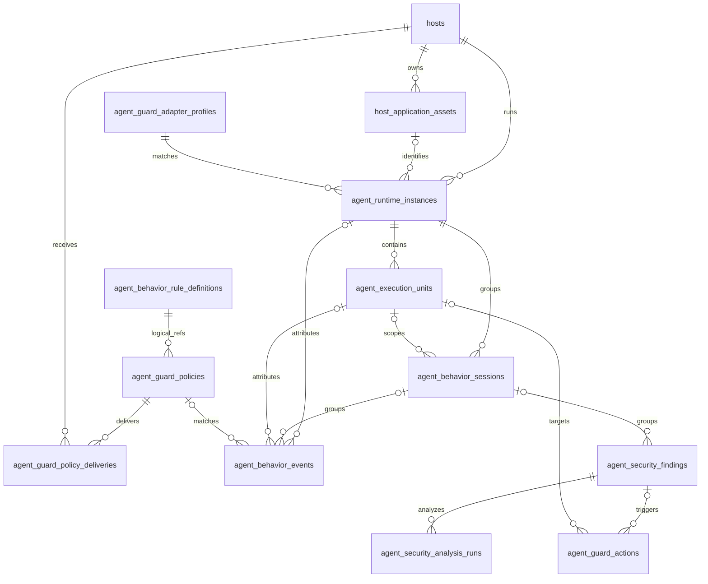

# Aegis V6.2 Agent Guard 数据库设计

**版本**：6.2  
**日期**：2026-07-30  
**状态**：设计完成，待实施  
**建议迁移**：`migrations/029_v6.2_agent_guard.sql`

## 1. 设计原则

1. 复用 `hosts` 和 `host_application_assets`，不复制静态主机/AI Agent 资产。
2. 策略/Profile 使用版本化不可变发布语义。
3. 运行实例、behavior session 和执行单元存长期可查询状态；瞬时进程成员主要保存在 Agent 内存/BPF map。
4. `runtime_events` 保存原始上报，`agent_behavior_events` 是不可变的可筛选行为投影。
5. 行为事实、规则/智能分析结论和处置动作分表；重新分析不能覆盖原始事实。
6. 所有事件、finding、analysis run 和动作使用幂等业务 ID。
7. 不保存文件内容、网络内容、stdin/stdout/stderr、密码、token 或环境变量值。
8. 外键删除不能破坏历史审计；事件对已删除/过期运行对象使用可空外键和快照字段。

## 2. 表关系



`agent_behavior_rule_definitions -> agent_guard_policies` 是 JSON 中 rule key/version 的逻辑引用，发布事务由 Service/Repository 校验；PostgreSQL 无法对 JSONB 数组元素建立普通外键，因此 compiled preview 必须保存 definition digest。

## 3. `agent_guard_adapter_profiles`

保存产品识别和隔离期望。内置 Profile 也入库，便于前端展示和版本追溯。

```sql
CREATE TABLE IF NOT EXISTS agent_guard_adapter_profiles (
    id                       UUID PRIMARY KEY DEFAULT gen_random_uuid(),
    profile_key              VARCHAR(128) NOT NULL,
    profile_version          BIGINT NOT NULL,
    agent_type               VARCHAR(64) NOT NULL,
    display_name             VARCHAR(255) NOT NULL,
    source                   VARCHAR(32) NOT NULL DEFAULT 'builtin',
    sandbox_family           VARCHAR(32) NOT NULL,
    controller_match         JSONB NOT NULL DEFAULT '[]'::jsonb,
    worker_match             JSONB NOT NULL DEFAULT '[]'::jsonb,
    backend_detectors        JSONB NOT NULL DEFAULT '[]'::jsonb,
    isolation_expectation    JSONB NOT NULL DEFAULT '{}'::jsonb,
    default_escape_rules     JSONB NOT NULL DEFAULT '[]'::jsonb,
    digest                   VARCHAR(80) NOT NULL,
    enabled                  BOOLEAN NOT NULL DEFAULT TRUE,
    created_by               VARCHAR(100),
    created_at               TIMESTAMPTZ NOT NULL DEFAULT NOW(),
    updated_at               TIMESTAMPTZ NOT NULL DEFAULT NOW(),
    CONSTRAINT uq_agent_guard_profile_version
        UNIQUE (profile_key, profile_version),
    CONSTRAINT chk_agent_guard_profile_source
        CHECK (source IN ('builtin', 'server', 'imported')),
    CONSTRAINT chk_agent_guard_profile_family
        CHECK (sandbox_family IN (
            'local_process_tree',
            'linux_namespace',
            'oci_container',
            'remote_sandbox',
            'whole_process_container'
        ))
);

CREATE INDEX IF NOT EXISTS idx_agent_guard_profiles_agent
    ON agent_guard_adapter_profiles(agent_type, enabled);
CREATE INDEX IF NOT EXISTS idx_agent_guard_profiles_key
    ON agent_guard_adapter_profiles(profile_key, profile_version DESC);
CREATE INDEX IF NOT EXISTS idx_agent_guard_profiles_match_gin
    ON agent_guard_adapter_profiles USING GIN(controller_match);
```

Profile version 发布后不可原地修改匹配语义；编辑应创建新 version。

## 4. `agent_behavior_rule_definitions`

保存版本化的内置/自定义规则定义。V6.2 首期 migration 写入五个内置规则。

```sql
CREATE TABLE IF NOT EXISTS agent_behavior_rule_definitions (
    id                       UUID PRIMARY KEY DEFAULT gen_random_uuid(),
    rule_key                 VARCHAR(128) NOT NULL,
    rule_version             BIGINT NOT NULL,
    name                     VARCHAR(255) NOT NULL,
    description              TEXT,
    source                   VARCHAR(24) NOT NULL DEFAULT 'builtin',
    engine                   VARCHAR(32) NOT NULL,
    categories               JSONB NOT NULL DEFAULT '[]'::jsonb,
    default_enabled          BOOLEAN NOT NULL DEFAULT TRUE,
    default_severity         VARCHAR(20) NOT NULL,
    default_action           VARCHAR(40) NOT NULL,
    recommended_action       VARCHAR(40) NOT NULL,
    parameters_schema        JSONB NOT NULL DEFAULT '{}'::jsonb,
    default_parameters       JSONB NOT NULL DEFAULT '{}'::jsonb,
    required_evidence        JSONB NOT NULL DEFAULT '[]'::jsonb,
    allow_conditions         JSONB NOT NULL DEFAULT '[]'::jsonb,
    mitre                    JSONB NOT NULL DEFAULT '[]'::jsonb,
    immutable                BOOLEAN NOT NULL DEFAULT TRUE,
    digest                   VARCHAR(80) NOT NULL,
    created_at               TIMESTAMPTZ NOT NULL DEFAULT NOW(),
    updated_at               TIMESTAMPTZ NOT NULL DEFAULT NOW(),
    CONSTRAINT uq_agent_behavior_rule_version
        UNIQUE (rule_key, rule_version),
    CONSTRAINT chk_agent_behavior_rule_source
        CHECK (source IN ('builtin', 'custom', 'imported')),
    CONSTRAINT chk_agent_behavior_rule_engine
        CHECK (engine IN (
            'agent_atomic',
            'dc_single_event',
            'dc_correlation',
            'agent_and_dc'
        )),
    CONSTRAINT chk_agent_behavior_rule_severity
        CHECK (default_severity IN ('info', 'low', 'medium', 'high', 'critical')),
    CONSTRAINT chk_agent_behavior_rule_action
        CHECK (default_action IN ('audit', 'alert', 'deny', 'deny_and_freeze')),
    CONSTRAINT chk_agent_behavior_rule_recommended_action
        CHECK (recommended_action IN ('audit', 'alert', 'deny', 'deny_and_freeze'))
);

CREATE INDEX IF NOT EXISTS idx_agent_behavior_rules_source
    ON agent_behavior_rule_definitions(source, rule_key, rule_version DESC);
CREATE INDEX IF NOT EXISTS idx_agent_behavior_rules_categories
    ON agent_behavior_rule_definitions USING GIN(categories);
```

内置 seed：

```text
AGB-BUILTIN-001@1 操作敏感目录
AGB-BUILTIN-002@1 外部网络连接
AGB-BUILTIN-003@1 文件生成
AGB-BUILTIN-004@1 敏感命令执行
AGB-BUILTIN-005@1 提权行为
```

migration 使用 `ON CONFLICT (rule_key, rule_version) DO NOTHING`。应用启动时校验数据库 digest 与内置 manifest；不一致时拒绝覆盖并上报 `builtin_rule_digest_mismatch`。

完整定义见
[builtin_behavior_rules_and_panorama_tree_v6.2.md](builtin_behavior_rules_and_panorama_tree_v6.2.md)。

## 5. `agent_guard_policies`

策略同时包含采集、原子行为、跨事件关联、智能分析和逃逸规则，避免下发时跨表拼出不一致版本。

```sql
CREATE TABLE IF NOT EXISTS agent_guard_policies (
    id                       UUID PRIMARY KEY DEFAULT gen_random_uuid(),
    policy_key               VARCHAR(128) NOT NULL,
    version                  BIGINT NOT NULL,
    name                     VARCHAR(255) NOT NULL,
    description              TEXT,
    status                   VARCHAR(32) NOT NULL DEFAULT 'draft',
    priority                 INT NOT NULL DEFAULT 100,
    targets                  JSONB NOT NULL DEFAULT '{}'::jsonb,
    collection_policy        JSONB NOT NULL DEFAULT '{}'::jsonb,
    builtin_rule_overrides   JSONB NOT NULL DEFAULT '[]'::jsonb,
    atomic_rules             JSONB NOT NULL DEFAULT '[]'::jsonb,
    correlation_rules        JSONB NOT NULL DEFAULT '[]'::jsonb,
    analysis_policy          JSONB NOT NULL DEFAULT '{}'::jsonb,
    escape_rules             JSONB NOT NULL DEFAULT '[]'::jsonb,
    freeze_timeout_seconds   INT NOT NULL DEFAULT 300,
    compiled_preview         JSONB NOT NULL DEFAULT '{}'::jsonb,
    digest                   VARCHAR(80),
    created_by               VARCHAR(100) NOT NULL,
    published_by             VARCHAR(100),
    published_at             TIMESTAMPTZ,
    disabled_by              VARCHAR(100),
    disabled_at              TIMESTAMPTZ,
    created_at               TIMESTAMPTZ NOT NULL DEFAULT NOW(),
    updated_at               TIMESTAMPTZ NOT NULL DEFAULT NOW(),
    CONSTRAINT uq_agent_guard_policy_version
        UNIQUE (policy_key, version),
    CONSTRAINT chk_agent_guard_policy_status
        CHECK (status IN ('draft', 'published', 'superseded', 'disabled')),
    CONSTRAINT chk_agent_guard_policy_priority
        CHECK (priority >= 0 AND priority <= 10000),
    CONSTRAINT chk_agent_guard_freeze_timeout
        CHECK (freeze_timeout_seconds BETWEEN 30 AND 900)
);

CREATE INDEX IF NOT EXISTS idx_agent_guard_policies_status
    ON agent_guard_policies(status, priority DESC);
CREATE INDEX IF NOT EXISTS idx_agent_guard_policies_key
    ON agent_guard_policies(policy_key, version DESC);
CREATE INDEX IF NOT EXISTS idx_agent_guard_policies_targets_gin
    ON agent_guard_policies USING GIN(targets);
```

状态流：

```text
draft -> published -> superseded
draft -> disabled
published -> disabled
```

published 行不可更新规则内容，只能创建新 version。发布新版本时旧 published 转 superseded。

### 5.1 `targets` 示例

```json
{
  "host_ids": [],
  "host_group_ids": ["uuid"],
  "agent_types": ["codex", "openclaw", "hermes"],
  "profile_keys": []
}
```

### 5.2 `collection_policy` 与规则示例

```json
{
  "categories": [
    "process",
    "file",
    "network",
    "identity",
    "persistence",
    "isolation",
    "kernel",
    "ipc",
    "tool",
    "control"
  ],
  "command_argv": "redacted",
  "file_content": "disabled",
  "network_content": "disabled",
  "aggregation": {
    "file_read_write_seconds": 2
  }
}
```

`builtin_rule_overrides` 示例：

```json
[
  {
    "rule_key": "AGB-BUILTIN-001",
    "rule_version": 1,
    "enabled": true,
    "severity_override": "high",
    "action_override": "alert",
    "parameters": {
      "resource_groups": ["credential", "privilege_policy"]
    },
    "exceptions": []
  }
]
```

Repository 发布策略时必须确认每个 rule key/version 存在，parameters 符合对应 Schema，并把 rule definition digest 写入 compiled preview。`atomic_rules` 保存额外的自定义主机规则；`correlation_rules` 保存额外的 DC 序列/聚合规则；`analysis_policy` 保存分析触发条件、证据窗口和 AI-only 动作上限。

### 5.3 `escape_rules` 示例

```json
[
  {
    "rule_id": "uuid",
    "rule": "join_external_namespace",
    "parameters": {},
    "action": "deny_and_freeze",
    "severity": "critical",
    "enabled": true
  }
]
```

## 6. `agent_guard_policy_deliveries`

按主机记录 bundle，而不是每条 policy 单独记录。一个 bundle 可以包含多条 published policy 和 Profile。

```sql
CREATE TABLE IF NOT EXISTS agent_guard_policy_deliveries (
    id                       UUID PRIMARY KEY DEFAULT gen_random_uuid(),
    host_id                  UUID NOT NULL REFERENCES hosts(id) ON DELETE CASCADE,
    bundle_version           BIGINT NOT NULL,
    bundle_digest            VARCHAR(80) NOT NULL,
    policy_versions          JSONB NOT NULL DEFAULT '[]'::jsonb,
    profile_versions         JSONB NOT NULL DEFAULT '[]'::jsonb,
    builtin_rule_versions    JSONB NOT NULL DEFAULT '{}'::jsonb,
    status                   VARCHAR(32) NOT NULL DEFAULT 'pending',
    capability_snapshot      JSONB NOT NULL DEFAULT '{}'::jsonb,
    coverage_level           VARCHAR(40),
    error_code               VARCHAR(100),
    error_message            TEXT,
    generated_at             TIMESTAMPTZ NOT NULL DEFAULT NOW(),
    dispatched_at            TIMESTAMPTZ,
    received_at              TIMESTAMPTZ,
    applied_at               TIMESTAMPTZ,
    last_reported_at         TIMESTAMPTZ,
    created_at               TIMESTAMPTZ NOT NULL DEFAULT NOW(),
    updated_at               TIMESTAMPTZ NOT NULL DEFAULT NOW(),
    CONSTRAINT uq_agent_guard_delivery
        UNIQUE (host_id, bundle_version),
    CONSTRAINT chk_agent_guard_delivery_status
        CHECK (status IN (
            'pending',
            'dispatching',
            'received',
            'applied',
            'degraded',
            'failed',
            'stale',
            'unsupported_agent_version'
        ))
);

CREATE INDEX IF NOT EXISTS idx_agent_guard_deliveries_host_status
    ON agent_guard_policy_deliveries(host_id, status, bundle_version DESC);
CREATE INDEX IF NOT EXISTS idx_agent_guard_deliveries_status
    ON agent_guard_policy_deliveries(status, updated_at DESC);
```

状态不能仅由 gRPC 发送成功改为 `applied`。只有 Agent `agent_guard_config_status` 携带相同 version/digest 后才能 applied/degraded。

## 7. `agent_runtime_instances`

```sql
CREATE TABLE IF NOT EXISTS agent_runtime_instances (
    id                       UUID PRIMARY KEY,
    host_id                  UUID NOT NULL REFERENCES hosts(id) ON DELETE CASCADE,
    asset_id                 UUID REFERENCES host_application_assets(id) ON DELETE SET NULL,
    adapter_profile_id       UUID REFERENCES agent_guard_adapter_profiles(id) ON DELETE SET NULL,
    profile_key              VARCHAR(128) NOT NULL,
    profile_version          BIGINT NOT NULL,
    agent_type               VARCHAR(64) NOT NULL,
    display_name             VARCHAR(255),
    controller_pid           INT NOT NULL,
    controller_start_ticks   NUMERIC(20,0) NOT NULL,
    controller_exe           TEXT,
    controller_cmdline       TEXT,
    run_uid                  INT,
    run_user                 VARCHAR(255),
    detection_confidence     VARCHAR(32) NOT NULL DEFAULT 'candidate',
    status                   VARCHAR(32) NOT NULL DEFAULT 'running',
    coverage_level           VARCHAR(40) NOT NULL DEFAULT 'monitor_only',
    coverage_reasons         JSONB NOT NULL DEFAULT '[]'::jsonb,
    metadata                 JSONB NOT NULL DEFAULT '{}'::jsonb,
    first_seen_at            TIMESTAMPTZ NOT NULL,
    last_seen_at             TIMESTAMPTZ NOT NULL,
    stopped_at               TIMESTAMPTZ,
    created_at               TIMESTAMPTZ NOT NULL DEFAULT NOW(),
    updated_at               TIMESTAMPTZ NOT NULL DEFAULT NOW(),
    CONSTRAINT uq_agent_runtime_process
        UNIQUE (host_id, controller_pid, controller_start_ticks),
    CONSTRAINT chk_agent_runtime_confidence
        CHECK (detection_confidence IN ('candidate', 'probable', 'confirmed')),
    CONSTRAINT chk_agent_runtime_status
        CHECK (status IN ('running', 'stale', 'stopped', 'unknown')),
    CONSTRAINT chk_agent_runtime_coverage
        CHECK (coverage_level IN (
            'full_enforcement',
            'behavior_monitor_escape_enforce',
            'monitor_only',
            'no_isolation',
            'remote_unobservable',
            'unsupported_profile',
            'degraded'
        ))
);

CREATE INDEX IF NOT EXISTS idx_agent_runtime_instances_host
    ON agent_runtime_instances(host_id, status, last_seen_at DESC);
CREATE INDEX IF NOT EXISTS idx_agent_runtime_instances_type
    ON agent_runtime_instances(agent_type, status, last_seen_at DESC);
CREATE INDEX IF NOT EXISTS idx_agent_runtime_instances_asset
    ON agent_runtime_instances(asset_id);
CREATE INDEX IF NOT EXISTS idx_agent_runtime_instances_coverage
    ON agent_runtime_instances(coverage_level, status);
```

`controller_cmdline` 入库前沿用当前资产采集脱敏逻辑。禁止存入环境变量。

### 7.1 同机多 Agent 与归属约束

`host_id` 与 `asset_id` 都是一对多关系：

- 一台主机可以关联多个 `host_application_assets(category=ai_agent)`。
- 一个 Agent 资产可以同时对应多个 `agent_runtime_instances`。
- 相同 `agent_type` 不得作为唯一键；同类型实例通过
  `host_id + controller_pid + controller_start_ticks` 区分。
- 前端和 API 不能按 `host_id + agent_type` 聚合后覆盖实例记录。

每个行为事件只允许一个主 `instance_id` 和一个主 `execution_unit_id`。
Agent 侧归属优先级为：

1. 已确认 execution unit/container cgroup 身份。
2. controller fork/exec 标签传播。
3. PID/start_ticks 与 Profile 多证据匹配。
4. 仅进程名或证据冲突时标记 `ambiguous/unattributed`。

归属置信度和候选摘要写入 behavior 的 `collection/evidence` JSON；有歧义时
`instance_id` 可以为空，但不得把同一事件复制到多个 Agent 造成重复计数。
`ambiguous/unattributed` 事件默认只能 audit/alert，不能自动 freeze。

Agent A 启动 Agent B 时，B 仍建立独立 runtime instance。跨 Agent
`launched_by/related` 关系通过 controller 进程身份、`correlation_id`、
`parent_event_id` 和 evidence 快照表达，不改变 B 后续事件的主归属。

## 8. `agent_execution_units`

```sql
CREATE TABLE IF NOT EXISTS agent_execution_units (
    id                       UUID PRIMARY KEY,
    host_id                  UUID NOT NULL REFERENCES hosts(id) ON DELETE CASCADE,
    instance_id              UUID NOT NULL REFERENCES agent_runtime_instances(id) ON DELETE CASCADE,
    unit_type                VARCHAR(40) NOT NULL,
    fingerprint              VARCHAR(160) NOT NULL,
    root_pid                 INT,
    root_start_ticks         NUMERIC(20,0),
    cgroup_id                VARCHAR(32),
    cgroup_path              TEXT,
    container_id             VARCHAR(128),
    container_runtime        VARCHAR(64),
    remote_backend           VARCHAR(64),
    remote_execution_id      VARCHAR(255),
    remote_host_ref          VARCHAR(255),
    isolation_baseline       JSONB NOT NULL DEFAULT '{}'::jsonb,
    isolation_actual         JSONB NOT NULL DEFAULT '{}'::jsonb,
    isolation_diff           JSONB NOT NULL DEFAULT '{}'::jsonb,
    coverage_level           VARCHAR(40) NOT NULL,
    coverage_reasons         JSONB NOT NULL DEFAULT '[]'::jsonb,
    status                   VARCHAR(32) NOT NULL DEFAULT 'observed',
    first_seen_at            TIMESTAMPTZ NOT NULL,
    last_seen_at             TIMESTAMPTZ NOT NULL,
    frozen_at                TIMESTAMPTZ,
    stopped_at               TIMESTAMPTZ,
    created_at               TIMESTAMPTZ NOT NULL DEFAULT NOW(),
    updated_at               TIMESTAMPTZ NOT NULL DEFAULT NOW(),
    CONSTRAINT uq_agent_execution_unit_fingerprint
        UNIQUE (host_id, fingerprint),
    CONSTRAINT chk_agent_execution_unit_type
        CHECK (unit_type IN (
            'local_process_tree',
            'linux_namespace',
            'oci_container',
            'remote_sandbox',
            'whole_process_container'
        )),
    CONSTRAINT chk_agent_execution_unit_status
        CHECK (status IN (
            'observed',
            'healthy',
            'violating',
            'freezing',
            'frozen',
            'resuming',
            'stopped',
            'stale',
            'unobservable',
            'degraded'
        )),
    CONSTRAINT chk_agent_execution_unit_coverage
        CHECK (coverage_level IN (
            'full_enforcement',
            'behavior_monitor_escape_enforce',
            'monitor_only',
            'no_isolation',
            'remote_unobservable',
            'unsupported_profile',
            'degraded'
        ))
);

CREATE INDEX IF NOT EXISTS idx_agent_execution_units_instance
    ON agent_execution_units(instance_id, status, last_seen_at DESC);
CREATE INDEX IF NOT EXISTS idx_agent_execution_units_host
    ON agent_execution_units(host_id, status, last_seen_at DESC);
CREATE INDEX IF NOT EXISTS idx_agent_execution_units_container
    ON agent_execution_units(container_id)
    WHERE container_id IS NOT NULL AND container_id <> '';
CREATE INDEX IF NOT EXISTS idx_agent_execution_units_cgroup
    ON agent_execution_units(cgroup_id)
    WHERE cgroup_id IS NOT NULL AND cgroup_id <> '';
CREATE INDEX IF NOT EXISTS idx_agent_execution_units_baseline_gin
    ON agent_execution_units USING GIN(isolation_baseline);
```

`fingerprint` 由 Agent 生成：

```text
local: host + instance + root pid/start
namespace: host + instance + namespace tuple + root start
container: host + runtime + full container ID
remote: host + instance + backend + remote execution ID
```

## 9. `agent_behavior_sessions`

session 用于把同一次 Agent task/run/conversation 或推导活动窗口中的行为关联起来。

```sql
CREATE TABLE IF NOT EXISTS agent_behavior_sessions (
    id                       UUID PRIMARY KEY,
    host_id                  UUID NOT NULL REFERENCES hosts(id) ON DELETE CASCADE,
    instance_id              UUID NOT NULL REFERENCES agent_runtime_instances(id) ON DELETE CASCADE,
    execution_unit_id        UUID REFERENCES agent_execution_units(id) ON DELETE SET NULL,
    external_session_id      VARCHAR(255),
    source                   VARCHAR(32) NOT NULL,
    confidence               VARCHAR(20) NOT NULL,
    correlation_token_hash   VARCHAR(80),
    status                   VARCHAR(24) NOT NULL DEFAULT 'active',
    behavior_count           BIGINT NOT NULL DEFAULT 0,
    finding_count            BIGINT NOT NULL DEFAULT 0,
    completeness             JSONB NOT NULL DEFAULT '{}'::jsonb,
    started_at               TIMESTAMPTZ NOT NULL,
    last_seen_at             TIMESTAMPTZ NOT NULL,
    ended_at                 TIMESTAMPTZ,
    created_at               TIMESTAMPTZ NOT NULL DEFAULT NOW(),
    updated_at               TIMESTAMPTZ NOT NULL DEFAULT NOW(),
    CONSTRAINT chk_agent_behavior_session_source
        CHECK (source IN (
            'agent_official',
            'adapter_hook',
            'aegis_wrapper',
            'execution_unit',
            'activity_window'
        )),
    CONSTRAINT chk_agent_behavior_session_confidence
        CHECK (confidence IN ('confirmed', 'probable', 'inferred')),
    CONSTRAINT chk_agent_behavior_session_status
        CHECK (status IN ('active', 'ended', 'stale'))
);

CREATE INDEX IF NOT EXISTS idx_agent_behavior_sessions_instance_time
    ON agent_behavior_sessions(instance_id, started_at DESC);
CREATE INDEX IF NOT EXISTS idx_agent_behavior_sessions_unit_time
    ON agent_behavior_sessions(execution_unit_id, started_at DESC);
CREATE INDEX IF NOT EXISTS idx_agent_behavior_sessions_external
    ON agent_behavior_sessions(host_id, external_session_id)
    WHERE external_session_id IS NOT NULL;
```

`external_session_id` 可能包含第三方 Agent 会话标识，API 默认只返回 hash/短摘要。只有 `source=agent_official|adapter_hook|aegis_wrapper` 可以使用 confirmed/probable；时间窗口推导必须是 inferred。

## 10. `agent_behavior_events`

`runtime_events` 是原始事件表，Behavior 表用于业务查询和关联分析。`raw_event_id` 对应 `RuntimeEvent.event_id`，投影记录不可被规则或模型更新。

```sql
CREATE TABLE IF NOT EXISTS agent_behavior_events (
    id                       UUID PRIMARY KEY DEFAULT gen_random_uuid(),
    raw_event_id             VARCHAR(100) NOT NULL UNIQUE,
    host_id                  UUID NOT NULL REFERENCES hosts(id) ON DELETE CASCADE,
    host_boot_id             VARCHAR(100) NOT NULL,
    agent_sequence           BIGINT NOT NULL,
    instance_id              UUID REFERENCES agent_runtime_instances(id) ON DELETE SET NULL,
    session_id               UUID REFERENCES agent_behavior_sessions(id) ON DELETE SET NULL,
    execution_unit_id        UUID REFERENCES agent_execution_units(id) ON DELETE SET NULL,
    policy_id                UUID REFERENCES agent_guard_policies(id) ON DELETE SET NULL,
    policy_version           BIGINT,
    rule_id                  VARCHAR(100),
    schema_version           VARCHAR(64) NOT NULL DEFAULT 'aegis.agent_behavior.v1',
    correlation_id           VARCHAR(100),
    parent_event_id          VARCHAR(100),
    agent_type               VARCHAR(64),
    profile_key              VARCHAR(128),
    profile_version          BIGINT,
    category                 VARCHAR(32) NOT NULL,
    operation                VARCHAR(64) NOT NULL,
    outcome                  VARCHAR(24) NOT NULL,
    errno                    INT,
    decision                 VARCHAR(40) NOT NULL DEFAULT 'audit',
    severity                 VARCHAR(20) NOT NULL DEFAULT 'info',
    pid                      INT,
    ppid                     INT,
    process_start_ticks      NUMERIC(20,0),
    process_name             VARCHAR(255),
    process_exe              TEXT,
    command_argv             JSONB NOT NULL DEFAULT '[]'::jsonb,
    command_cwd              TEXT,
    command_visibility       VARCHAR(24) NOT NULL DEFAULT 'complete',
    process_chain            JSONB NOT NULL DEFAULT '[]'::jsonb,
    resource_type            VARCHAR(32),
    resource_identity        TEXT,
    resource_identity_hash   VARCHAR(80),
    resource_classification  VARCHAR(64),
    resource                 JSONB NOT NULL DEFAULT '{}'::jsonb,
    isolation                JSONB NOT NULL DEFAULT '{}'::jsonb,
    collection               JSONB NOT NULL DEFAULT '{}'::jsonb,
    evidence                 JSONB NOT NULL DEFAULT '{}'::jsonb,
    occurred_at              TIMESTAMPTZ NOT NULL,
    occurred_monotonic_ns    NUMERIC(20,0),
    received_at              TIMESTAMPTZ NOT NULL DEFAULT NOW(),
    created_at               TIMESTAMPTZ NOT NULL DEFAULT NOW(),
    CONSTRAINT chk_agent_behavior_category
        CHECK (category IN (
            'process',
            'file',
            'network',
            'identity',
            'persistence',
            'isolation',
            'kernel',
            'ipc',
            'tool',
            'control'
        )),
    CONSTRAINT chk_agent_behavior_outcome
        CHECK (outcome IN ('success', 'failure', 'denied', 'unknown')),
    CONSTRAINT chk_agent_behavior_decision
        CHECK (decision IN (
            'allow',
            'audit',
            'alert',
            'deny',
            'deny_and_freeze',
            'would_deny',
            'enforcement_unavailable'
        )),
    CONSTRAINT chk_agent_behavior_severity
        CHECK (severity IN ('info', 'low', 'medium', 'high', 'critical'))
);

CREATE INDEX IF NOT EXISTS idx_agent_behavior_events_host_time
    ON agent_behavior_events(host_id, occurred_at DESC);
CREATE UNIQUE INDEX IF NOT EXISTS uq_agent_behavior_events_host_sequence
    ON agent_behavior_events(host_id, host_boot_id, agent_sequence);
CREATE INDEX IF NOT EXISTS idx_agent_behavior_events_instance_time
    ON agent_behavior_events(instance_id, occurred_at DESC);
CREATE INDEX IF NOT EXISTS idx_agent_behavior_events_session_time
    ON agent_behavior_events(session_id, occurred_at ASC);
CREATE INDEX IF NOT EXISTS idx_agent_behavior_events_unit_time
    ON agent_behavior_events(execution_unit_id, occurred_at DESC);
CREATE INDEX IF NOT EXISTS idx_agent_behavior_events_category_time
    ON agent_behavior_events(category, operation, occurred_at DESC);
CREATE INDEX IF NOT EXISTS idx_agent_behavior_events_decision_time
    ON agent_behavior_events(decision, severity, occurred_at DESC);
CREATE INDEX IF NOT EXISTS idx_agent_behavior_events_policy
    ON agent_behavior_events(policy_id, policy_version, occurred_at DESC);
CREATE INDEX IF NOT EXISTS idx_agent_behavior_events_resource_hash
    ON agent_behavior_events(resource_identity_hash, occurred_at DESC);
CREATE INDEX IF NOT EXISTS idx_agent_behavior_events_resource_gin
    ON agent_behavior_events USING GIN(resource);
CREATE INDEX IF NOT EXISTS idx_agent_behavior_events_collection_gin
    ON agent_behavior_events USING GIN(collection);
```

命令 argv、路径、URL 入库前必须使用 redaction。`collection` 保存 sensor、visibility、truncated fields 和 drop counter，使查询方知道证据是否完整。前端默认折叠，导出功能不在第一版范围。

## 11. `agent_security_findings`

Finding 是规则和智能分析结论的事实源，不把每个行为事件升级为告警。

```sql
CREATE TABLE IF NOT EXISTS agent_security_findings (
    id                       UUID PRIMARY KEY,
    finding_key              VARCHAR(255) NOT NULL UNIQUE,
    host_id                  UUID NOT NULL REFERENCES hosts(id) ON DELETE CASCADE,
    instance_id              UUID REFERENCES agent_runtime_instances(id) ON DELETE SET NULL,
    session_id               UUID REFERENCES agent_behavior_sessions(id) ON DELETE SET NULL,
    execution_unit_id        UUID REFERENCES agent_execution_units(id) ON DELETE SET NULL,
    policy_id                UUID REFERENCES agent_guard_policies(id) ON DELETE SET NULL,
    policy_version           BIGINT,
    title                    VARCHAR(500) NOT NULL,
    severity                 VARCHAR(20) NOT NULL,
    verdict                  VARCHAR(24) NOT NULL DEFAULT 'suspicious',
    confidence               NUMERIC(5,4) NOT NULL DEFAULT 0,
    status                   VARCHAR(24) NOT NULL DEFAULT 'open',
    decision_sources         JSONB NOT NULL DEFAULT '[]'::jsonb,
    rule_hits                JSONB NOT NULL DEFAULT '[]'::jsonb,
    evidence_event_ids       JSONB NOT NULL DEFAULT '[]'::jsonb,
    evidence_graph           JSONB NOT NULL DEFAULT '{}'::jsonb,
    attack_stages            JSONB NOT NULL DEFAULT '[]'::jsonb,
    summary                  TEXT,
    recommended_action       VARCHAR(64),
    latest_analysis_id       UUID,
    handled_by               VARCHAR(100),
    handled_note             TEXT,
    handled_at               TIMESTAMPTZ,
    first_observed_at        TIMESTAMPTZ NOT NULL,
    last_observed_at         TIMESTAMPTZ NOT NULL,
    created_at               TIMESTAMPTZ NOT NULL DEFAULT NOW(),
    updated_at               TIMESTAMPTZ NOT NULL DEFAULT NOW(),
    CONSTRAINT chk_agent_security_finding_severity
        CHECK (severity IN ('info', 'low', 'medium', 'high', 'critical')),
    CONSTRAINT chk_agent_security_finding_verdict
        CHECK (verdict IN ('benign', 'suspicious', 'malicious', 'inconclusive')),
    CONSTRAINT chk_agent_security_finding_confidence
        CHECK (confidence >= 0 AND confidence <= 1),
    CONSTRAINT chk_agent_security_finding_status
        CHECK (status IN ('open', 'investigating', 'contained', 'resolved', 'dismissed'))
);

CREATE INDEX IF NOT EXISTS idx_agent_security_findings_host_time
    ON agent_security_findings(host_id, last_observed_at DESC);
CREATE INDEX IF NOT EXISTS idx_agent_security_findings_instance_time
    ON agent_security_findings(instance_id, last_observed_at DESC);
CREATE INDEX IF NOT EXISTS idx_agent_security_findings_session_time
    ON agent_security_findings(session_id, last_observed_at DESC);
CREATE INDEX IF NOT EXISTS idx_agent_security_findings_status
    ON agent_security_findings(status, severity, last_observed_at DESC);
CREATE INDEX IF NOT EXISTS idx_agent_security_findings_rule_hits
    ON agent_security_findings USING GIN(rule_hits);
```

`finding_key` 使用 rule version + instance/session/unit + correlation bucket 生成。迟到事件可以增加 open finding 的 evidence；已关闭 finding 不原地改写结论，而是记录 revision 或创建新的 finding。

## 12. `agent_security_analysis_runs`

```sql
CREATE TABLE IF NOT EXISTS agent_security_analysis_runs (
    id                       UUID PRIMARY KEY,
    finding_id               UUID NOT NULL REFERENCES agent_security_findings(id) ON DELETE CASCADE,
    attempt                  INT NOT NULL,
    status                   VARCHAR(24) NOT NULL DEFAULT 'pending',
    provider                 VARCHAR(64),
    model                    VARCHAR(128),
    prompt_version           VARCHAR(64) NOT NULL,
    input_digest             VARCHAR(80) NOT NULL,
    evidence_event_ids       JSONB NOT NULL DEFAULT '[]'::jsonb,
    evidence_summary         JSONB NOT NULL DEFAULT '{}'::jsonb,
    output                   JSONB NOT NULL DEFAULT '{}'::jsonb,
    verdict                  VARCHAR(24),
    attack_probability       NUMERIC(5,4),
    confidence               NUMERIC(5,4),
    error_code               VARCHAR(100),
    error_message            TEXT,
    requested_by             VARCHAR(100),
    queued_at                TIMESTAMPTZ NOT NULL,
    started_at               TIMESTAMPTZ,
    completed_at             TIMESTAMPTZ,
    created_at               TIMESTAMPTZ NOT NULL DEFAULT NOW(),
    CONSTRAINT uq_agent_security_analysis_attempt
        UNIQUE (finding_id, attempt),
    CONSTRAINT chk_agent_security_analysis_status
        CHECK (status IN (
            'pending',
            'running',
            'succeeded',
            'failed',
            'invalid_output',
            'inconclusive',
            'cancelled'
        )),
    CONSTRAINT chk_agent_security_analysis_verdict
        CHECK (
            verdict IS NULL OR
            verdict IN ('benign', 'suspicious', 'malicious', 'inconclusive')
        ),
    CONSTRAINT chk_agent_security_analysis_probability
        CHECK (
            attack_probability IS NULL OR
            attack_probability BETWEEN 0 AND 1
        ),
    CONSTRAINT chk_agent_security_analysis_confidence
        CHECK (confidence IS NULL OR confidence BETWEEN 0 AND 1)
);

CREATE INDEX IF NOT EXISTS idx_agent_security_analysis_finding
    ON agent_security_analysis_runs(finding_id, attempt DESC);
CREATE INDEX IF NOT EXISTS idx_agent_security_analysis_status
    ON agent_security_analysis_runs(status, queued_at);
CREATE INDEX IF NOT EXISTS idx_agent_security_analysis_digest
    ON agent_security_analysis_runs(input_digest, model, prompt_version);
```

`evidence_summary` 只能保存脱敏后的结构化摘要，不保存模型完整提示词、文件内容或工具原始输出。`output` 必须是 Schema 校验通过或明确标记失败的原始结构化输出。

在两个表创建后增加 latest analysis 外键：

```sql
ALTER TABLE agent_security_findings
    ADD CONSTRAINT fk_agent_security_findings_latest_analysis
    FOREIGN KEY (latest_analysis_id)
    REFERENCES agent_security_analysis_runs(id)
    ON DELETE SET NULL;
```

## 13. `agent_guard_actions`

```sql
CREATE TABLE IF NOT EXISTS agent_guard_actions (
    id                       UUID PRIMARY KEY,
    command_id               VARCHAR(100) UNIQUE,
    trigger_behavior_event_id UUID REFERENCES agent_behavior_events(id) ON DELETE SET NULL,
    trigger_finding_id       UUID REFERENCES agent_security_findings(id) ON DELETE SET NULL,
    host_id                  UUID NOT NULL REFERENCES hosts(id) ON DELETE CASCADE,
    instance_id              UUID REFERENCES agent_runtime_instances(id) ON DELETE SET NULL,
    execution_unit_id        UUID REFERENCES agent_execution_units(id) ON DELETE SET NULL,
    action                   VARCHAR(40) NOT NULL,
    source                   VARCHAR(32) NOT NULL,
    status                   VARCHAR(32) NOT NULL DEFAULT 'pending',
    reason                   TEXT NOT NULL,
    requested_by             VARCHAR(100),
    hold_requested           BOOLEAN NOT NULL DEFAULT FALSE,
    freeze_timeout_seconds   INT,
    result                   JSONB NOT NULL DEFAULT '{}'::jsonb,
    error_code               VARCHAR(100),
    error_message            TEXT,
    requested_at             TIMESTAMPTZ NOT NULL,
    dispatched_at            TIMESTAMPTZ,
    completed_at             TIMESTAMPTZ,
    expires_at               TIMESTAMPTZ,
    created_at               TIMESTAMPTZ NOT NULL DEFAULT NOW(),
    updated_at               TIMESTAMPTZ NOT NULL DEFAULT NOW(),
    CONSTRAINT chk_agent_guard_action
        CHECK (action IN (
            'deny',
            'freeze_execution_unit',
            'resume_execution_unit',
            'hold_execution_unit',
            'kill_execution_unit',
            'kill_agent_instance',
            'auto_resume'
        )),
    CONSTRAINT chk_agent_guard_action_source
        CHECK (source IN (
            'local_policy',
            'correlation_policy',
            'manual',
            'timeout',
            'system'
        )),
    CONSTRAINT chk_agent_guard_action_status
        CHECK (status IN (
            'pending',
            'dispatching',
            'running',
            'success',
            'failed',
            'expired',
            'cancelled'
        ))
);

CREATE INDEX IF NOT EXISTS idx_agent_guard_actions_host_time
    ON agent_guard_actions(host_id, requested_at DESC);
CREATE INDEX IF NOT EXISTS idx_agent_guard_actions_unit_time
    ON agent_guard_actions(execution_unit_id, requested_at DESC);
CREATE INDEX IF NOT EXISTS idx_agent_guard_actions_status
    ON agent_guard_actions(status, requested_at DESC);
CREATE INDEX IF NOT EXISTS idx_agent_guard_actions_behavior
    ON agent_guard_actions(trigger_behavior_event_id);
CREATE INDEX IF NOT EXISTS idx_agent_guard_actions_finding
    ON agent_guard_actions(trigger_finding_id);
```

行为和 finding 通过 action 的 trigger 字段关联，不在不可变行为表中回写 `action_id`。查询时间线时按 trigger 和 instance/session/unit 组装。

## 14. 运行状态事件如何入库

以下 RuntimeEvent 不写入 `agent_behavior_events` 行为表，而是更新状态表：

| event_type | 数据库动作 |
| --- | --- |
| `agent_guard_config_status` | 更新 delivery |
| `agent_instance_started/updated/stopped` | upsert runtime instance |
| `agent_execution_unit_started/updated/stopped` | upsert execution unit |
| `agent_guard_action_status` | upsert action，并更新 unit 状态 |
| `agent_guard_health` | 更新 delivery capability/coverage 或 host status |

所有类型仍先写 `runtime_events` 原始事件。

`agent_behavior` 写入 `agent_behavior_events`；DC 规则命中创建/更新 `agent_security_findings`；智能分析任务写入 `agent_security_analysis_runs`。三者均先有 raw runtime event 或明确的派生来源，不允许跳过证据直接创建“已攻击”事实。

## 15. 状态机约束

### 15.1 Delivery

```text
pending -> dispatching -> received -> applied
                                  -> degraded
                     -> failed
applied/degraded -> stale
```

### 15.2 Instance

```text
running -> stale -> running
running/stale -> stopped
```

### 15.3 Execution Unit

```text
observed -> healthy -> violating
healthy/violating -> freezing -> frozen
frozen -> resuming -> healthy/violating
* -> stale/stopped/degraded
remote_sandbox without sensor -> unobservable
```

### 15.4 Behavior Session

```text
active -> ended
active -> stale -> active/ended
```

### 15.5 Finding

```text
open -> investigating -> contained -> resolved
open/investigating -> dismissed
contained -> investigating
```

`dismissed` 不删除证据；重新出现满足规则的新行为时创建新 finding 或新 revision。

### 15.6 Analysis Run

```text
pending -> running -> succeeded
                   -> failed
                   -> invalid_output
                   -> inconclusive
pending/running -> cancelled
```

### 15.7 Action

```text
pending -> dispatching -> running -> success
                                -> failed
pending/dispatching -> cancelled/expired
```

Repository 层必须实现允许迁移集合，不能用任意字符串 UPDATE。

## 16. 数据保留

建议默认：

| 数据 | 保留 |
| --- | --- |
| 普通、已聚合行为事件 | 默认 30 天 |
| Finding 引用、高危、deny、escape 行为事件 | 180 天 |
| finding 和 analysis run | 180 天；审计策略可延长 |
| action 和策略发布记录 | 365 天或按审计要求 |
| stopped instance/session/unit | 90 天，存在 finding/动作时随证据保留 |
| raw runtime event | 沿用平台统一保留策略 |

保留策略通过 `system_configs` 配置，不在本迁移硬编码清理任务。

清理顺序：

1. 无 finding/action 引用且无保留要求的低危 `agent_behavior_events`。
2. 已过期且不再引用行为的 analysis run/finding。
3. 已无行为/finding/action 引用且过期的 ended session 和 stopped execution unit。
4. 已无 session/unit/behavior/finding/action 引用且过期的 stopped instance。
5. 内置 rule definition、Profile 和 policy version 不物理删除，只停用或归档。

## 17. 数据量与分区

第一版只采集归属 Agent 的安全语义行为，并在主机侧聚合高频 I/O，不采集全主机 syscall；数据量仍明显大于原敏感文件专项方案。普通表和复合索引只适用于首期小规模灰度，迁移必须预留按 `occurred_at` 月分区的演进路径。

当单表超过约定容量或查询出现明显退化时，再按 `occurred_at` 月分区。启用分区前需处理：

- 分区表主键/唯一约束必须包含分区键。
- `raw_event_id` 全局幂等需要独立去重表或 hash 分区。
- GORM 自动迁移不能代替显式分区迁移。

## 18. 与现有表的关系

### 18.1 `host_application_assets`

不新增 Agent Guard 运行字段到资产表，避免把短生命周期状态写入周期资产。

关联：

```text
agent_runtime_instances.asset_id -> host_application_assets.id
```

资产详情可通过 API 查询当前/最近实例。

### 18.2 `runtime_events`

- 继续保存所有 Agent Guard 原始 RuntimeEvent。
- Agent Guard 投影失败不删除 raw event。
- investigation/Assistant 可以继续从 runtime events 获取原始证据。

### 18.3 `alerts`

高危 finding 复用 alerts，不把所有行为事件复制成告警。

建议写入：

```text
rule_id = finding primary rule id
mitre_id = 可选映射
judgment_source = agent_guard_rule / agent_guard_ai / agent_guard_combined
process_tree = finding 证据进程链
description = 规则、verdict、confidence、证据和 action 摘要
```

具体行为从 `agent_behavior_events` 查询，结论从 `agent_security_findings/agent_security_analysis_runs` 查询。

### 18.4 `block_records` / audit log

现有 block record 可以保存人工 kill 等通用处置摘要；Agent Guard 细粒度状态以 `agent_guard_actions` 为事实源。所有人工写操作继续进入统一审计日志。

## 19. GORM 模型与 Repository

推荐：

```text
api-server/internal/model/agent_guard.go
api-server/internal/repository/agent_guard_*_repo.go
dc/internal/model/agent_guard.go
dc/internal/repository/agent_guard_repository.go
```

api-server 和 DC 模型字段必须与迁移一致。不能只依赖 `AutoMigrate` 创建核心约束。

Repository 必须提供：

- builtin rule list/get version/digest verify；禁止 delete/update immutable 定义。
- policy/profile version create/list/get active。
- delivery upsert by host+bundle_version。
- instance/session/unit idempotent upsert。
- behavior create-on-conflict-do-nothing。
- finding create/update by correlation idempotency key。
- analysis run create/status update and evidence reference validation。
- action monotonic state update。
- time/filter pagination。
- retention batch delete。

## 20. 迁移与回滚

### 20.1 升级

1. 先执行 `029_v6.2_agent_guard.sql`。
2. 幂等插入五个内置规则和首批内置 Profile。
3. 部署可识别新表但功能开关关闭的 api-server/DC。
4. 部署 Server。
5. 部署 V6.2 Agent。
6. 部署 Frontend。
7. 开启 monitor-only。

### 20.2 回滚

- 关闭 `AGENT_GUARD_ENABLED` 和前端入口。
- Agent 停止加载 Agent Guard BPF 并保留本地 bundle 备查。
- 回滚 api-server/server/dc/frontend/Agent 镜像。
- 保留新增表，不在生产回滚时 DROP，避免丢失审计。
- 旧组件忽略新的 RuntimeEvent event_type。

### 20.3 迁移测试

- 空库执行。
- 从当前全部 migration 顺序升级。
- 重复执行幂等。
- 外键和 check constraints。
- event/action 循环外键建表顺序。
- 五个内置规则 seed 重复执行幂等、ID/version/digest 稳定。
- immutable 内置规则不能被 Repository 删除或原地修改。
- GORM model 与 SQL 字段一致。
- 回滚镜像连接包含新表的数据库不报错。
