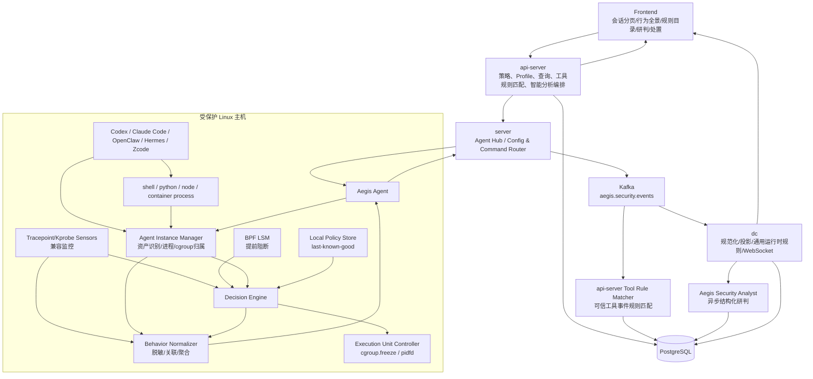
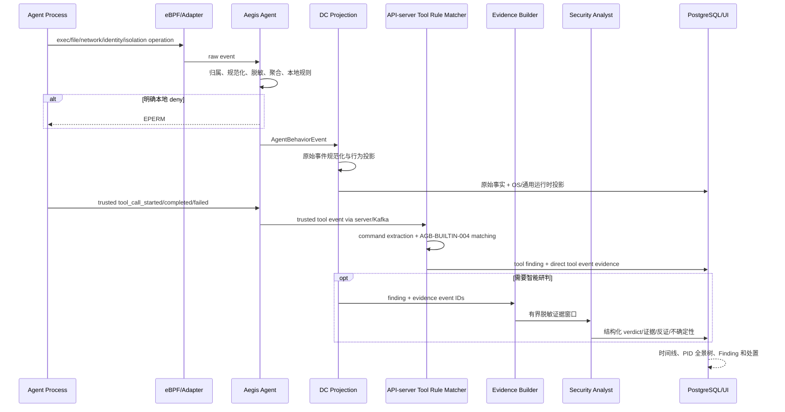
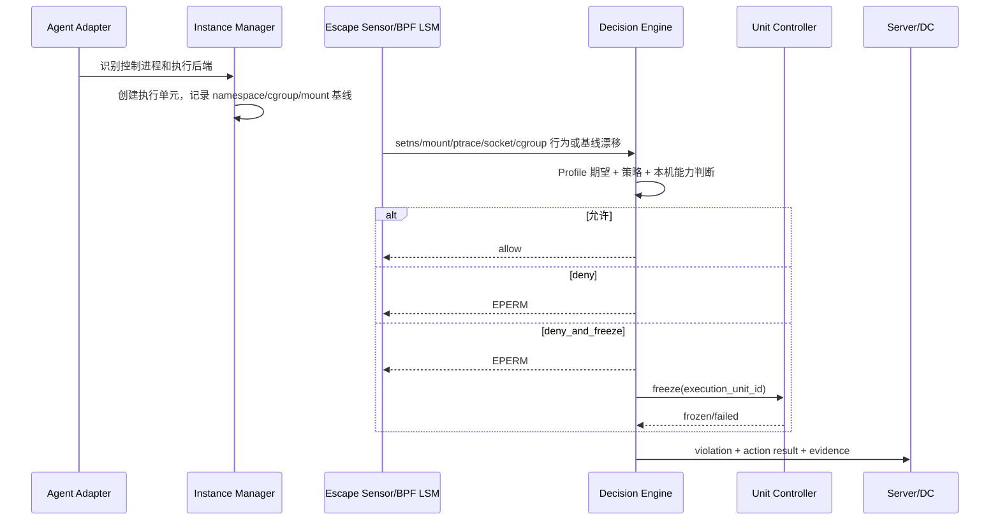
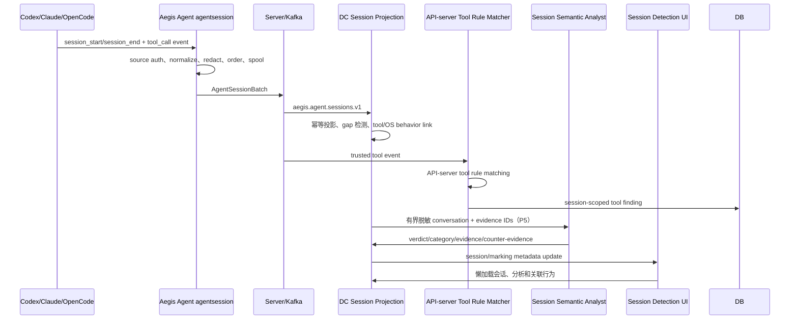

# Aegis V6.2 智能体运行防护总体架构设计

**版本**：6.2  
**日期**：2026-08-06
**状态**：Agent Guard 工具事件/规则命中和内置策略目录已按当前实现更新；完整 P5 会话正文检测仍待实施

> 当前实现优先级：本文的目标架构受 [current_implementation_baseline_2026-08-06.md](current_implementation_baseline_2026-08-06.md) 约束。尤其是工具命中归属：Agent eBPF 只做 OS 事实和 PID/PPID 关联，DC 只做 Agent Guard 行为投影，API-server 基于可信工具命令事件匹配规则。

## 1. 背景与问题

Codex、OpenClaw、Hermes 等 AI Agent 会根据模型决策启动 shell、Python、Node、编译器、MCP 进程或容器。仅识别 Agent 安装资产无法回答：

- 当前哪个 Agent 正在运行。
- Agent 连续执行了哪些命令，操作了哪些文件、网络端点、身份权限和隔离资源。
- 某个操作是否由 Agent 的控制进程、子进程或容器执行进程发起。
- 多个看似正常的离散操作是否组成下载执行、凭据访问、持久化、横向移动或清痕攻击链。
- Agent 实际是否启用了 OS 沙箱。
- 沙箱内进程是否尝试加入宿主机 namespace、访问容器运行时 socket 或离开预期 cgroup。
- 规则和智能分析分别依据了哪些真实证据，危险操作能否在发生前阻断。

V6.2 建立一个主机侧、内核优先、服务端可配置并可追溯的“行为事实平面 +
会话审计平面 + 安全分析平面 + 防护执行平面”。

## 2. 目标与非目标

### 2.1 目标

1. 把主机上的 AI Agent 静态资产映射为实时运行实例。
2. 持续维护 session、控制进程、本地后代进程、namespace worker、容器/cgroup 和远程执行单元的归属关系。
3. 对已归属 Agent 采集具有安全语义的进程/命令、文件、网络、身份权限、持久化、内核和隔离控制行为。
4. 将离散行为关联成时间线、进程链和 PID 主干行为全景树，保留行为结果及证据完整性。
5. 对 Agent Guard 工具命令事件由 API-server 进行规则匹配；Agent eBPF 只提供关联事实，DC 只负责规范化投影；其他通用运行时 Sigma/eBPF 链路保持独立。
6. 识别真实隔离类型，建立 namespace、cgroup、mount、capability、seccomp 等基线。
7. 检测隔离逃逸尝试和边界漂移，并在支持 BPF LSM 时本地提前拒绝。
8. 对有明确证据的高危行为按策略暂停执行单元，并允许服务端人工恢复或终止。
9. 在前端呈现策略、覆盖能力、运行实例、操作链、安全结论、隔离基线和处置时间线。
10. 对字段截断、事件丢失、不支持阻断、工具语义缺失或远程不可观测的环境诚实降级。
11. 支持同一主机多种 Agent 并存和同一种 Agent 多运行实例，归属、统计、
    全景展示和处置目标互不串扰。
12. 当前接入 Codex、Claude Code、OpenClaw、Hermes、Zcode 的真实 session lifecycle
    Hook 和工具事件；完整会话正文与 AI 语义检测仍按 P5 独立设计实施。

### 2.2 非目标

- 在 Agent 执行前同步拦截提示词、替换模型输入或建设通用越狱文本网关；P5
  只做会话审计、异步语义标记和行为关联。
- 拦截大模型 API 请求。
- 通用 MCP Gateway 或第三方 Agent 工具审批。
- 捕获完整 stdin/stdout/stderr、文件内容或 TLS 明文。
- 在没有可信 Hook 时根据进程名猜测 Agent 工具调用语义。
- 修补未知内核漏洞或在宿主机内核已经被完全控制后保证传感器不可绕过。
- V6.2 第一版支持 Windows/macOS 的内核阻断。
- 依赖 LLM 做内核同步安全决策，或允许 AI-only 结论默认自动阻断。
- 采集隐藏推理、私有 chain-of-thought，或无条件保存未脱敏工具大输出和文件正文。

## 3. 威胁模型

### 3.1 保护对象

- Agent 可访问的凭据、源码、配置、可执行文件、持久化入口、网络目标和系统控制资源。
- 宿主机 namespace、cgroup、mount、容器运行时 socket 和关键内核接口。
- Aegis Agent 自身进程、配置、eBPF maps 和本地策略。
- AI Agent 原本声明的沙箱边界。
- Agent 行为原始证据、规则结论、智能分析结论和处置审计链。

### 3.2 对手能力

假设攻击者可以通过提示词注入或恶意上下文影响 AI Agent，使其：

- 启动任意用户态子进程。
- 使用 shell、脚本语言、编译器和 Agent 暴露的工具。
- 尝试访问当前用户或容器权限允许的文件。
- 尝试执行 namespace、mount、ptrace、cgroup、BPF、容器 socket 等逃逸动作。

### 3.3 信任边界

可信：

- 宿主机 Linux 内核尚未被完全控制。
- Aegis Agent 二进制、内置 BPF 对象和服务端签名发布链路。
- api-server 的认证、授权和数据库。

不可信：

- Agent 接收的提示词、项目文件、网页、邮件、MCP 返回和工具输出。
- AI Agent 控制进程及其启动的执行进程。
- 由 AI Agent 下载、生成或编译的代码。

如果攻击者已经获得内核任意代码执行或可以停止/修改 Aegis Agent，本方案不能提供绝对保证；此类情况应由 Aegis 自保护、主机完整性和外部监控进一步覆盖。

## 4. 核心领域模型

### 4.1 AgentAsset

周期采集得到的静态资产，继续存储在 `host_application_assets`：

```text
host_id + category=ai_agent + name + config_paths + related_pids + container_id
```

它回答“主机上安装/识别了什么 Agent”，不代表 Agent 当前运行。

### 4.2 AgentRuntimeInstance

一次 Agent 控制进程运行：

```text
instance_id
host_id
asset_id
adapter_profile
controller_pid + controller_start_time
run_user
first_seen_at / last_seen_at
```

### 4.3 AgentExecutionUnit

Agent 执行命令或工具的实际隔离单元：

```text
local_process_tree
linux_namespace
oci_container
remote_sandbox
whole_process_container
```

一个实例可以有多个短生命周期执行单元。

### 4.4 GuardedProcess

Agent 控制进程或执行单元内的具体进程。主机本地以 PID、启动代次、cgroup ID 和执行单元标签识别。该对象主要存在于 Agent 内存和 BPF map，不为每次 fork 单独写数据库。

### 4.5 BehaviorSession / AgentBehaviorEvent

- `BehaviorSession` 表示 Agent Hook 明确上报的真实 session 生命周期；没有可信 session ID 时只能建立未归属的行为索引，不能把进程活动伪造成某个会话。
- `AgentBehaviorEvent` 表示一个规范化 OS/工具控制面行为事实，包含 actor、operation、resource、outcome、isolation 和 collection completeness。
- 工具事件使用 `tool_call_started/completed/failed`，并以 `tool_call_id` 将生命周期事件幂等合并。

### 4.6 AgentGuardPolicy

服务端仍保留版本化策略和 Bundle 模型，用于兼容历史下发链路；当前前端策略入口不再编辑它，而是展示内置策略目录。服务端策略包含：

- Agent/主机选择器。
- 行为采集范围、聚合和保留规则。
- 单事件、序列、资源与例外规则。
- 隔离逃逸规则。
- 动作模式。
- 智能分析启用条件和 AI-only 动作上限。
- 冻结超时和发布版本。

内置策略目录是五条不可变内置规则的只读产品分组，不是数据库中的 draft/published
策略版本。Hook 开关通过 `agent_guard_runtime_settings.v1` 即时下发。

### 4.7 SecurityFinding / AnalysisRun / AgentGuardAction

- Finding 表达一个或多个行为事实组成的安全结论，并引用全部证据事件。
- AnalysisRun 保存智能分析输入摘要、模型/提示词版本、结构化输出和失败状态。
- Action 表达 deny、freeze、resume、kill 的请求与结果。
- 原始行为事实、finding 和 action 分表保存，重新分析不能覆盖历史事实。

### 4.8 多 Agent 共存与唯一归属

一台 Host 可以拥有多个 AgentAsset；一个 AgentAsset 可以拥有多个并发
AgentRuntimeInstance。运行实例不能仅用 `agent_type` 识别，稳定身份为：

```text
host_id + controller_pid + controller_start_ticks
```

每个进程/行为事件只保留一个主 instance/unit 归属。归属顺序优先采用已确认
execution unit/container cgroup，其次采用 fork 标签传播和 PID/start_ticks
多证据 Profile。证据冲突时标记 ambiguous/unattributed，不复制事件、不自动
freeze。

Agent A 启动 Agent B 时，B 建立独立 runtime instance；两者的
`launched_by/related` 关系作为关联证据保存，不把 B 的后续进程树合并进 A。
所有自动或人工动作只定位到一个 execution unit 或一个明确 instance，不提供
Host 级 freeze/resume/kill。

### 4.9 AgentConversationSession / ConversationItem / SessionRiskMarking

- `AgentConversationSession` 表示 Codex、Claude Code 或 OpenCode 的产品正式
  会话，稳定身份包含 host、source UID、Agent type 和 source session ID。
- `ConversationItem` 表示用户可见消息、助手可见回复、工具调用/结果、权限、
  compact、子智能体或生命周期 item，并保留真实顺序和采集完整性。
- `SessionRiskMarking` 表示会话 AI、会话规则、OS 行为联合或人工形成的风险
  标记，引用真实 item/event/finding ID。
- 产品会话与 `BehaviorSession` 分开保存，通过 instance/unit/PID/tool
  correlation 建立强弱关系；语义风险不能代替 OS 执行事实。

## 5. 总体组件架构



## 6. 四条核心业务链路

### 6.1 行为采集、关联与攻击性分析链路



本链路的详细事件和研判契约见
[agent_behavior_telemetry_and_analysis_design_v6.2.md](agent_behavior_telemetry_and_analysis_design_v6.2.md)。

### 6.2 隔离逃逸监控与暂停链路



阻断不依赖 api-server、Kafka 或 DC 在线。控制面中断时，Agent 使用最后一次成功应用的策略。

### 6.3 策略发布链路

```text
Frontend draft/validate
  -> api-server 规范化采集、规则、例外、分析和动作配置
  -> 生成不可变 policy version 与主机 bundle digest（兼容历史策略链路）
  -> Server ConfigSync
  -> Agent 校验并原子应用
  -> config status event
  -> DC/DB delivery applied/failed/stale

当前 Hook 与工具适配器使用 `agent_guard_runtime_settings.v1` 作为即时控制面：
前端开关保存后由 api-server 立即经 Server ConfigSync 下发，Agent 在线时立即应用并
注入/清理 Native Hook；Agent 不在线时记录 `pending_reconnect`。策略 Bundle 是
兼容历史策略和本地逃逸/通用规则链路，不再是前端启停 Hook 的唯一开关。
```

“配置已发送”不等于“Agent 已应用”。只有 Agent 上报匹配 version/digest 的 `applied` 才能进入生效状态。

### 6.4 会话采集、语义检测与行为关联链路



会话内容使用独立 agentsession 通道，不进入禁止 prompt/output 的可信工具
Adapter，不进入普通 RuntimeEvent 正文或 WebSocket 通知。详细契约见
[agent_session_detection_design_v6.2.md](agent_session_detection_design_v6.2.md)。

## 7. 四类隔离适配器

| 隔离族 | 识别方式 | 成员归属 | 逃逸基线 | 阻断能力 |
| --- | --- | --- | --- | --- |
| `local_process_tree` | 控制进程特征 | fork 标签传播 + `/proc` 校准 | 无 OS 沙箱；只监控权限/namespace 异常变化 | BPF LSM 可限制危险操作；暂停使用托管 cgroup 或 pidfd fallback |
| `linux_namespace` | bubblewrap/sandbox helper/namespace 差异 | PID + namespace tuple + 可选 cgroup | mnt/pid/user/net ns、mount、seccomp、capability | BPF LSM deny；托管 cgroup 或进程树暂停 |
| `oci_container` | Docker/containerd 命令、label、container ID | cgroup ID 为主，container ID 为证据 | namespace、cgroup、mount、capability、runtime socket | BPF LSM deny；`cgroup.freeze` |
| `remote_sandbox` | SSH/Modal/Daytona/OpenShell backend | 远程 execution/session ID | 由远端 Agent 建立 | 远端部署 Aegis Agent 时完整；否则不可观测 |

“支持所有通用 Agent”的含义是：所有 Agent 都映射到上述隔离族之一，并通过 Profile 描述产品特征。未匹配 Profile 的 Agent 显示 `unsupported_profile`，不允许默认假设为安全。

## 8. 首批产品 Profile

| Agent | 控制面 | 可选执行方式 | V6.2 判断 |
| --- | --- | --- | --- |
| Codex Linux | 宿主机 Codex 进程 | bubblewrap/Linux namespace | 控制进程与 worker 分离；对 worker 建 namespace 执行单元 |
| OpenClaw | Gateway/Agent host process | sandbox off、local、Docker、SSH/OpenShell | 先识别 backend；Docker 用 cgroup，远程需要远端传感器 |
| Hermes | Python Agent process | local、Docker、Singularity、SSH、Modal、Daytona、whole-process wrapper | local 标记无隔离；容器和远程分别适配 |

Profile 包含：

```json
{
  "profile_key": "codex-linux",
  "profile_version": 1,
  "agent_type": "codex",
  "controller_match": {},
  "worker_match": {},
  "backend_detection": [],
  "sandbox_family": "linux_namespace",
  "expected_isolation": {},
  "default_escape_rules": []
}
```

Profile 只能描述匹配和期望，不能携带任意 eBPF 代码或 shell 命令。

## 9. 覆盖等级

每台主机、每个实例和执行单元都必须暴露覆盖等级：

| 状态 | 含义 |
| --- | --- |
| `full_enforcement` | 实例归属完整、BPF LSM 已加载、策略可在内核侧拒绝、执行单元可暂停 |
| `behavior_monitor_escape_enforce` | 行为全景可监控，只有明确文件/逃逸原子规则可内核拒绝 |
| `monitor_only` | tracepoint/kprobe 可观测，但无法可靠提前拒绝 |
| `no_isolation` | Agent 使用 local/off backend，没有可验证沙箱边界 |
| `remote_unobservable` | 执行发生在远端且远端未部署/未关联 Aegis Agent |
| `unsupported_profile` | 发现疑似 Agent，但没有可用产品 Profile |
| `degraded` | 原本能力加载失败、策略失效或事件丢失超过阈值 |

覆盖状态必须包含原因，例如：

```json
{
  "level": "monitor_only",
  "reasons": ["kernel_bpf_lsm_unavailable", "cgroup_v2_freezer_unavailable"]
}
```

## 10. 策略模型

```yaml
policy_key: ai-agent-production
version: 7
status: published
priority: 100
targets:
  agent_types: [codex, openclaw, hermes]
  host_ids: []
  host_groups: [production]

collection:
  categories: [process, file, network, identity, persistence, isolation, kernel, ipc, tool, control]
  command_argv: redacted
  file_content: disabled
  network_content: disabled
  aggregation:
    file_read_write_seconds: 2

atomic_rules:
  - rule: protected_resource_access
    resource:
      type: file
      path: /etc/shadow
      match: exact
    operations: [read, write, delete, rename]
    action: deny

correlation_rules:
  - rule: download_write_chmod_execute
    window_seconds: 120
    action: alert
  - rule: credential_access_then_external_connect
    window_seconds: 300
    action: alert

analysis:
  enabled: true
  trigger_severities: [medium, high, critical]
  ai_only_action_ceiling: alert
  evidence_window_seconds: 300

escape_rules:
  - rule: join_external_namespace
    action: deny_and_freeze
  - rule: access_container_runtime_socket
    action: deny_and_freeze
  - rule: write_cgroupfs
    action: deny

freeze_timeout_seconds: 300
```

### 10.1 首批内置规则

V6.2 首批随版本提供：

| Rule ID | 名称 | 主要执行位置 | 默认动作 |
| --- | --- | --- | --- |
| `AGB-BUILTIN-001` | 操作敏感目录 | Agent 原子匹配 + DC 风险分层 | alert |
| `AGB-BUILTIN-002` | 外部网络连接 | Agent 网络事实 + DC 地址/上下文分类 | alert |
| `AGB-BUILTIN-003` | 文件生成 | Agent 文件创建事实 + DC 风险分层 | audit |
| `AGB-BUILTIN-004` | 敏感命令执行 | API-server 可信工具事件命令行匹配；Agent eBPF 仅做 PID/PPID 关联 | alert |
| `AGB-BUILTIN-005` | 提权行为 | Agent credential/capability 事实 + DC 状态验证 | alert |

规则定义不可删除或原地修改，策略通过 rule key/version 引用并覆盖范围、参数、severity、action 和例外。五个规则可以在同一 session/process chain 中关联成攻击链；单点命中默认不直接 freeze。

详细语义、默认资源和全景树见
[builtin_behavior_rules_and_panorama_tree_v6.2.md](builtin_behavior_rules_and_panorama_tree_v6.2.md)。

文件资源路径匹配第一版支持：

- `exact`
- `prefix`
- 有限 `glob`，仅允许路径段中的 `*` 和末尾 `/**`

不允许正则直接进入 BPF；服务端保存时编译并验证，Agent 只接收规范化规则。

采集策略不能关闭以下不可采样证据：

- 本地 deny/freeze 对应事件。
- namespace/cgroup/mount/capability 基线漂移。
- high/critical finding 引用的原始事件。
- 配置和动作状态事件。

Agent Guard 工具命令规则由 api-server 执行，不在 Agent 或 DC 重复命中；Agent eBPF
只提供进程、命令行、PID/PPID、start_ticks 和 tool-to-process 关联事实。DC 对这类
事件只做规范化、幂等投影和 WebSocket 数据流，不调用 Agent Guard 工具规则执行器。
通用运行时 Sigma/eBPF 规则和隔离逃逸本地决策仍可保留原有执行位置。

## 11. 逃逸规则分类

### 11.1 隔离控制面操作

- `setns`
- `unshare`
- `clone/clone3` 中未授权的 `CLONE_NEW*`
- `mount/umount`
- `pivot_root/chroot`
- `open_tree/move_mount`

### 11.2 宿主机桥接面

- `/proc/*/ns/*`
- `/proc/1/root`
- `/sys/fs/cgroup`
- `/var/run/docker.sock`
- `/run/containerd/containerd.sock`
- CRI socket、Podman socket

### 11.3 提权与横向控制

- ptrace Agent 外部进程或 Aegis Agent。
- 获取 Profile 未声明 capability。
- `bpf`、`perf_event_open`、内核模块加载。
- setuid/setgid 或 credential 提升。

### 11.4 基线漂移

- 子进程离开执行单元 cgroup。
- namespace tuple 与基线不一致。
- 新增宿主机敏感 bind mount。
- seccomp/no_new_privs/capability 状态弱于基线。

行为事件和状态漂移必须同时保留，避免只记录一次 syscall 而无法证明是否成功。

## 12. 组件职责

### 12.1 frontend

- 展示只读的内置策略目录和完整规则详情；当前不提供新建、编辑、发布或下发历史策略的入口。
- 内置目录按“行为监控”和“工具命令”两个视图展示五个稳定规则的中英文名称、版本、描述、严重级别、动作、执行位置、证据要求、允许条件、MITRE 和参数 Schema。
- 在 AgentGuard 设置中提供工具调用适配器、会话 Hook 和五类智能体 Native Hook 开关；开启即请求 Agent 应用并开始上报，关闭即请求 Agent 清理 Hook 并停止上报。
- 实例与隔离覆盖展示。
- 命令、文件、网络、权限、隔离和工具事件查询。
- 外层按 host + Agent asset 展示基本信息列表，不直接暴露进程树和证据。
- 点击 Agent 后先按真实 Hook 会话 ID 分页选择；行为全景展示该会话的行为事件，
  进程关联节点显示实际 PID/PPID/cmdline。安全分析严格按选中会话过滤，只展示
  命中规则的工具、工具输入/输出、命令行和可关联 PID/PPID，不展示全量进程树。
- 运行实例、会话 ID 和事件列表均支持分页，安全分析页签不再把命中数量拼在标题上。
- session 时间线和 finding 证据展示。
- 区分规则结论、智能研判和已经证实的动作结果。
- freeze/resume/kill 人工操作。
- 动作确认明确 target instance/unit，并提示不影响同机其他 Agent。
- 不在浏览器端判断是否具有攻击性、是否越狱或是否阻断成功。

### 12.2 api-server

- Profile、采集策略、分析规则和动作策略事实源。
- 策略校验、版本化、发布、主机范围展开和下发。
- 消费可信工具事件，匹配 `tool_call_started/completed/failed`，按 `tool_call_id`
  合并事件并写入会话范围的 `agent_security_findings`；Finding 直接引用工具事件，
  eBPF 关联信息只作为补充证据。
- 提供只读内置规则目录和 `agent_guard_runtime_settings.v1` 即时下发。
- 实例/session/执行单元/事件/finding/analysis/action 查询。
- 智能分析任务编排、证据窗口读取、结构化输出校验和审计。
- 人工处置鉴权、审计和 Server 命令调用。
- 不参与每次 OS 操作的同步判断。

### 12.3 server

- Agent 在线连接管理。
- 配置和人工动作转发。
- Agent 事件进入 Kafka。
- Agent 重连时补发当前 published bundle。
- 不复制策略判断逻辑。

### 12.4 Agent

- 本机能力探测。
- 产品 Profile 匹配。
- 实例和执行单元管理。
- 进程/命令、文件、网络、身份权限、内核与隔离行为采集。
- Native Agent Hook 会话边界与工具事件采集；支持 Codex、Claude Code、OpenClaw、Hermes、Zcode。
- eBPF/`/proc` 只负责 OS 事实、PID/PPID/start_ticks/cmdline 和工具到进程的关联，
  不创建 Agent Guard 工具命令规则命中。
- 事件规范化、脱敏、短窗口聚合、BPF maps 更新和本地决策。
- deny/freeze/resume/kill。
- last-known-good 策略持久化。
- 结构化状态和事件上报。

### 12.5 dc

- 解析和规范化 Agent Behavior/Guard 事件。
- 原始事件写入 `runtime_events`。
- 幂等投影到 `agent_behavior_events`、`agent_behavior_sessions`、`agent_runtime_instances`、`agent_execution_units` 和 `agent_guard_actions`。
- 对 Agent Guard 工具事件做规范化、幂等投影、会话/执行单元关联和 WebSocket 推送，
  不执行 `AGB-BUILTIN-004` 或创建同一工具命中的重复 Finding。
- 通用 OS/资源/序列规则和历史运行时规则链路仍按各自数据源执行。
- 为需要研判的 finding 生成有界 evidence window。
- 高危 finding 生成/更新 alerts，普通行为事件不制造告警风暴。
- WebSocket 推送实例、事件、finding、analysis 和动作变化。

### 12.6 PostgreSQL

- 保存 Profile、五个内置规则定义、历史策略/Bundle、运行时设置、下发状态、运行实例、session、执行单元、行为事件、finding、analysis run 和动作；工具 Finding 的直接证据是 Hook 工具事件 ID，并保留 API-server 规则归属和 eBPF 关联状态。
- 不保存每次 fork 的完整瞬时进程表。
- 不保存文件内容、网络内容、stdin/stdout/stderr、环境变量值或凭据。

## 13. 本地决策原则

1. 内核 Hook 只使用预编译 BPF maps，不调用网络或用户态 LLM。
2. 策略 bundle 校验失败时保留 last-known-good。
3. 没有明确 deny 规则时不得默认拒绝业务操作。
4. `deny_and_freeze` 只用于明确高危规则。
5. freeze 默认带安全超时；超时后可自动恢复执行，但 deny 规则继续生效。
6. Aegis Agent、systemd、containerd 等受保护基础进程不能被普通 Agent Guard 动作终止。
7. Agent 发现自己处于目标 Agent 的进程树或 cgroup 时必须拒绝错误归属，避免自锁。
8. AI-only `malicious` 默认只能告警或等待人工确认，不能单独触发 deny/freeze。
9. DC 通用序列规则只有在策略显式授权且引用证据完整时才能请求自动 freeze；Agent Guard 工具命令命中由 api-server 形成 Finding，不能由 DC 重复命中或直接改变本地执行决策。

## 14. 性能与可靠性目标

| 指标 | 目标 |
| --- | --- |
| 行为事件过滤 | 未归属 Agent 的进程在内核/最早用户态直接丢弃 |
| 阻断依赖 | 不依赖服务端往返 |
| Agent Guard 增量 CPU | 正常 Agent 工作负载平均不超过单核 8%，以压测结果为验收 |
| Agent Guard 增量内存 | 默认配置不超过 192MB，包含进程图和本地聚合 |
| 进程归属校准 | 启动全量一次，之后事件驱动并按配置低频校准 |
| 事件丢失 | ringbuf/perf 丢失可计量；超过阈值转 `degraded` |
| 策略更新 | 原子替换，失败不破坏现行 bundle |
| 事件幂等 | `event_id` 全链路唯一，DC 重放不产生重复投影 |
| 规则 finding | P95 不超过事件到达后 10 秒 |
| 智能分析 | 异步，默认 60 秒超时，失败不影响规则结论 |

## 15. 兼容与降级

- Linux 4.18+：至少进程、文件和部分网络基础监控，具体取决于内核 Hook 能力。
- 支持 CO-RE/BTF 时优先使用 CO-RE。
- ringbuf 不可用时沿用 V5.7/V5.8 perf fallback。
- BPF LSM 不可用时禁止把 `deny` 显示为已执行，事件 decision 为 `would_deny` 或 `enforcement_unavailable`。
- cgroup v2 freezer 不可用时，本地进程树可使用 pidfd/SIGSTOP fallback，并显示 `freeze_fallback`。
- 远程 backend 没有传感器时只记录控制面调用和远程目标，不记录虚假的远程进程/文件/网络事件。
- Agent 没有可信工具 Hook 时标记 `tool_semantics_unobservable`，但 OS 行为覆盖状态单独计算。
- 智能分析不可用时保留规则 finding，并显示 `analysis_unavailable`，不把失败解释为 benign。

## 16. 成功标准

### 16.1 功能

- 三个首批 Agent 在 local/namespace/container/remote 适用场景下能被正确分类。
- 五个内置规则具有稳定 ID/version，默认行为、例外和灰度语义一致。
- 命令、文件、网络、权限和隔离事件能关联到实例、session、执行单元、进程链和策略版本。
- 全景树的每个行为节点挂在真实发起 PID 下，并展示 cmdline、文件名/路径或连接地址。
- 跨事件攻击链形成 finding，并逐项引用原始事件、反证和可观测性限制。
- 智能分析输出符合结构化契约，不能基于 AI-only 结论自动阻断。
- namespace/container 逃逸规则产生完整基线与差异证据。
- BPF LSM 支持主机可提前拒绝；freeze/resume 状态与实际执行单元一致。

### 16.2 失败行为

- 未识别 Agent 不被错误归属。
- 策略下发失败保留旧版本并可见。
- Agent 离线显示 stale/offline，不显示 applied。
- 不支持阻断时明确降级，不返回伪 success。
- 用户态上报失败不影响本地 deny 策略继续工作。

### 16.3 可追溯

任一高危事件可以从前端追溯：

```text
策略版本
  -> 主机下发状态
  -> Agent 实例
  -> Behavior session
  -> 执行单元隔离基线
  -> 进程链
  -> 命令/文件/网络/权限/逃逸行为
  -> 规则 finding
  -> 智能分析结论、反证与不确定性
  -> 本地 decision
  -> freeze/deny 结果
  -> 人工 resume/kill 操作与操作者
```
