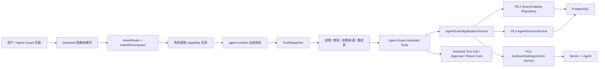

# Aegis V6.3 智能体模式集成 V6.2 Agent Guard 全能力设计

**版本**：V6.3 方案版  
**日期**：2026-08-11  
**状态**：设计完成；Assistant 高层工具第一阶段已实现，权限/共享应用服务/前端上下文仍待验收  
**目标入口**：`/assistant` 智能体模式  
**关联版本**：V6.2 Agent Guard P0～P4；V6.2 P5 由 V6.3 会话感知承接

## 1. 结论

V6.3 在智能体模式中新增 `agent_guard` 工具域，使用户可以通过自然语言完成
V6.2 Agent Guard 的查询、研判、配置和受控处置。集成不复制 Agent Guard
业务表，不新建第二套规则或动作链路，也不通过 api-server 自调用 HTTP 接口；目标是让
Assistant 工具与现有 HTTP Handler 共享应用服务、权限、脱敏、范围校验和状态机，业务
结果继续写入 V6.2 原表。第一阶段先以窄 service facade 和窄 DTO 落地高层工具，HTTP/tool
parity 与细粒度授权在后续门禁完成前不能宣称已完成。

目标链路为：

```text
用户 -> /assistant
  -> 通用意图拆解（exact capability）
  -> 按角色裁剪后的 Agent Guard 工具目录
  -> agent-runtime 动态规划
  -> Assistant ToolDispatcher（权限、审批、参数来源、审计）
  -> AgentGuardApplicationService
  -> V6.2 repository/service/gRPC
  -> 现有 Agent Guard 表、Server、Agent 和 WebSocket
```

“集成 V6.2 的所有功能”按
[V6.2 当前实现基线](../aegis_system_design_v6.2/current_implementation_baseline_2026-08-06.md)
解释，包含当前产品化的 P0～P4 能力和配置检测；V6.2 已声明为历史兼容、当前页面不再
提供的策略草稿/发布接口，不因本次集成重新成为模型可调用功能。V6.2 P5 当时未完成，
其正文采集和语义分析由 V6.3“智能体会话感知”实现，本设计将其作为 V6.3 扩展阶段接入。

## 2. 当前代码事实

### 2.1 V6.2 已有能力

| 能力 | 当前代码入口 | 数据/执行事实 |
| --- | --- | --- |
| 概览、覆盖和主机状态 | `AgentGuardQueryRepository` | `agent_runtime_instances`、delivery/capability 快照 |
| Agent、实例、行为会话和执行单元 | `agent_guard_query_repo.go` | V6.2 11 张事实表 |
| PID 主干全景和行为事件 | `AgentGuardHandler.GetPanorama/ListBehaviors` | Agent/eBPF → Server → Kafka → DC |
| 五条行为规则和逃逸规则 | `AgentGuardCatalogRepository`、内置 manifest | 内置定义只读，稳定 key/version/digest |
| Finding 和异步 AI 研判 | `AgentGuardAnalysisService` | AI 无工具、无动作回调；AI-only 不阻断 |
| 配置安全扫描 | `AgentConfigSecurityService` | Agent 有界读取，api-server 规则评分 |
| Native Hook/运行时设置 | `AgentGuardRuntimeSettingsService` | `system_configs` + ConfigSync |
| freeze/resume/kill | `AgentGuardActionService` | 单 execution unit/instance，异步 action 状态机 |
| 会话删除 | `AgentGuardQueryRepository.DeleteSessions` | 管理员权限，级联业务数据 |

### 2.2 V6.3 已有会话感知能力

当前代码已经存在 `agentsession` 静态扫描、`ReportAgentSessionBatch`、Kafka topic
`aegis.agent.sessions.v1`、`agent_conversation_*` 表、规则分析、AI 分析和前端
“智能体会话感知”。它是 V6.2 P5 目标在 V6.3 的收敛实现，不应与 V6.2 P4 的
Native Hook 工具事件混成同一个工具或数据契约。

### 2.3 当前缺口

- `api-server/internal/assistant/tools/` 没有 Agent Guard 工具注册文件。
- `ToolDomain` 没有 `agent_guard` 域，capability 目录无法选择 Agent Guard 能力。
- Assistant 调用 service 时没有与 Agent Guard HTTP 路由等价的细分权限硬门。
- Agent Guard Handler 内仍包含部分脱敏、scope 和详情组装逻辑，工具若直接访问
  repository 会绕过这些边界。
- Agent Guard 页面没有向 `/assistant` 传递受信对象引用的入口。
- 高风险动作的前端确认语义尚未映射到 Assistant 的审批/确认卡。

### 2.4 按 V6.1 修正工具抽象层级

V6.1 的“高层业务工具”原则适用于本专项。`AgentGuardApplicationService` 只是 HTTP
和 Assistant 共用的领域应用边界，还不是模型看到的工具层。若把 23 个领域操作逐项
平铺给模型，仍会让模型理解行为事件、策略目录、证据、动作状态和内部 ID，不符合
V6.1 的渐进暴露设计。

本专项采用三层契约：

| 层 | 模型是否可见 | 典型内容 | 责任 |
| --- | --- | --- | --- |
| Model-facing primary | 是 | `assess_agent_guard_posture`、`investigate_agent_guard_scope`、`assess_agent_guard_configuration`、`analyze_agent_guard_finding`、明确的 settings/action/delete 能力 | 用户目标和单一业务闭环；后端完成解析、前置条件、审批、轮询和终态验真 |
| contextual/companion | 按上下文或主工具契约追加 | Agent/Finding/Conversation 摘要、`AgentGuard.Operation.Get`、受限状态查询 | 只读、分页、低风险，不能扩展写授权 |
| internal | 否 | 原子行为查询、raw evidence、配置证据、规则装载、动作 dispatch、策略解析 | 仅由高层领域编排器通过短期 grant 调用，不能被模型猜名调用 |

因此，本文后续的 23 个条目是 Agent Guard 的**领域 capability/服务契约清单**，不是
默认全部注入模型的目录。实现时必须生成本轮 Model-facing exposure snapshot；
`internal` 和未命中的 `contextual/companion` 不进入意图模型目录。

“隐藏策略”具体指隐藏策略实现细节，而不是隐藏安全结论：

- 不向模型暴露 policy draft/publish、策略图、阈值实现、规则装载路径、内部策略 ID
  选择器或可改变策略的原子工具；
- 默认只返回语义化的 coverage、保护模式、命中规则摘要、风险和证据缺口；
- 用户明确询问“依据哪条规则”时，才通过受权限控制的 contextual catalog 返回稳定
  rule key/version/severity/说明，且不能据此自动获得写授权；
- 所有策略、scope、目标状态和动作权限仍由后端硬校验，隐藏不能替代授权。

### 2.5 基线与漏洞 Assistant 实现参照

本设计已对照现有实现，而不是只按 V6.1 文档抽象推演：

| 参照 | 已验证做法 | Agent Guard 采用方式 |
| --- | --- | --- |
| 基线合规 | `Baseline.Compliance.Run` 是 `primary` 高层工具；后端解析主机和模板、服务端枚举 `all_rules`、创建 `AssistantOperation`，再由 `Operation.Get` 作为 companion 轮询终态 | 作为主要样板：调查/配置评估/研判等多步骤能力返回统一 operation reference，内部完成解析、状态机和结果验真 |
| 漏洞查询/修复 | `Vulnerability.Script.Generate/Execute` 通过 `ExecutionContract` 声明 completion/discovery/prerequisite；`VulnerabilityRemediationCompiler` 绑定 POC/FIX、脚本状态和主机引用 | 复用“声明式 completion、前置条件和 previous-step 绑定”；但不把漏洞侧所有平铺工具都直接暴露给 Agent Guard 模型 |
| 通用暴露层 | `ToolExposureResolver` 过滤 `primary/contextual`，只追加声明的低风险 companion；Dispatcher 拒绝 `internal` 直调；Gateway 校验 Mapping-bound step | Agent Guard 使用现有机制，新增领域分层和高层 workflow 注册，不另造一套隐藏规则 |

因此，基线合规回答了“高层封装如何落地”，漏洞实现回答了“配套状态和前置条件如何
声明”，两者共同作为 Agent Guard 的实现依据；策略/规则内部细节仍按本设计的
`internal` 边界处理。

### 2.6 第一阶段实现快照

当前代码已完成以下最小可运行闭环：

- `ToolDomain` 新增 `agent_guard`，并在 `cmd/main.go` 的现有 registry 初始化之后注册高层工具；
- `AgentGuard.Posture.Assess`、`AgentGuard.Scope.Investigate`、`AgentGuard.Evidence.List`、配置评估、目录摘要、Finding 分析/查询、动作/运行时设置、会话查询/采集/分析和会话删除均复用 V6.2 service/repository；
- Scope、配置、Finding、Action 和 Conversation 输出使用 Assistant 窄 DTO；不返回 policy JSON、命令行、cgroup/隔离 JSON、原始配置内容或未脱敏会话正文；
- 写操作统一标记为审批、高风险或不可自动调用，并通过现有 `ToolDispatcher`/`ToolPolicyService`；策略写入工具没有注册；
- `agent_guard_tools_test.go` 与全量模型英文契约测试覆盖注册、暴露层级、审批标记和策略写入不暴露。

以下设计项尚未在本阶段声称完成：共享 `AgentGuardApplicationService` 与 HTTP/tool parity、`agent_guard:*` 细粒度 RBAC 过滤、Assistant 身份 `auth_username` 修正、033 审计迁移、页面上下文按钮和 kill/delete 硬确认卡。这些是下一阶段上线门禁，不得用本阶段测试结果替代。

## 3. 目标、非目标和成功标准

### 3.1 目标

1. 用户可在智能体模式查询 V6.2 当前页面可见的所有 Agent Guard 事实。
2. 用户可对 Finding 发起 AI 研判，并基于真实 analysis ID 查询终态。
3. 管理员可在审批后更新运行时 Hook 设置、删除行为会话和执行受控动作。
4. Agent Guard 页面可携带 Agent、session、finding、execution unit 等上下文进入
   智能体模式，服务端重新解析对象，客户端不能伪造快照。
5. 智能体回答明确区分事实、规则命中、AI 研判、动作请求和动作终态。
6. V6.2 P0～P4 和 V6.3 会话感知共用智能体入口，但继续使用独立的数据面。

### 3.2 非目标

- 不让 Assistant 自己匹配 `AGB-BUILTIN-001..005` 或逃逸规则。
- 不把会话文本、Finding 或 AI 输出直接变成 deny/freeze/kill。
- 不开放 V6.2 当前基线已取消的前端策略草稿、编辑和发布体验。
- 不用 Assistant 工具替代 Agent 本地 BPF LSM、freeze timeout 或 protected target。
- 不将大段原始行为、配置文件或会话正文无界注入模型上下文。
- 不为 Agent Guard 编写固定业务计划；执行顺序继续由通用 agent-runtime 根据实时
  工具结果决定。

### 3.3 成功标准

1. V6.2 功能矩阵中的每项都有可验证的 Assistant capability 或明确的不暴露理由。
2. 同一操作经 HTTP 页面和 Assistant 工具得到相同的 scope、脱敏和状态语义。
3. `security_analyst`、`security_developer`、`admin` 的工具可见性和执行权限与现有
   `agent_guard:*` 权限完全一致。
4. 未授权工具在模型目录不可见，在 ToolDispatcher 仍会二次拒绝。
5. freeze/resume/kill、运行时设置和删除操作不能仅凭模型生成参数执行。
6. 异步分析/动作只有读到真实终态后才能在回答中称为完成。
7. Agent Guard 原始证据、配置和会话内容不进入普通日志、URL、通知或工具参数摘要。
8. 关闭集成 feature flag 后，V6.2/V6.3 普通页面和数据面不受影响。

## 4. 功能覆盖边界

| V6.2/V6.3 功能 | 智能体模式行为 | 结论 |
| --- | --- | --- |
| 概览、覆盖、主机状态 | 查询并解释 coverage reason，不把 degraded 说成已防护 | 必须接入 |
| Agent、实例、真实 session、execution unit | 分页查询、详情和上下文引用 | 必须接入 |
| 行为事件和全景 | 有界查询；敏感详情走 evidence 权限 | 必须接入 |
| 内置行为/逃逸/Profile/配置规则 | 只读目录；展示 key/version/digest/证据要求 | 必须接入 |
| 配置检测 | 连接主机后有界扫描；默认只返回摘要和 Finding | 必须接入 |
| Finding、证据和分析历史 | 按 session/instance scope 查询 | 必须接入 |
| 发起 Finding AI 研判 | 异步操作，轮询真实 analysis 状态 | 必须接入 |
| 运行时 Hook 设置 | 展示变更前后 diff，按主机更新并报告 dispatch 状态 | 必须接入 |
| freeze/resume/kill unit、kill instance | 审批、确认、目标重校验、异步状态 | 必须接入 |
| 行为 session 删除 | 精确 ID、影响数量、不可恢复确认 | 必须接入 |
| 历史 policy draft/validate/publish | 不注册 Assistant 写工具 | 明确不暴露 |
| P5 会话正文、规则/AI 分析 | 复用 V6.3 session awareness 服务 | V6.3 扩展接入 |
| 原文 reveal/export | V6.3 当前范围未实现 | 不暴露 |

## 5. 总体架构



### 5.1 共享应用服务边界

新增 `AgentGuardApplicationService`，作为 HTTP Handler 和 Assistant Tool 的共同
业务边界。它负责：

- UUID、枚举、分页、时间范围和组合筛选校验；
- `agent_scope_key`、asset/instance/session 归属验证；
- 外层摘要、分析详情和 raw evidence 的分级脱敏；
- Finding 详情、matched rule、counter evidence、escape chain 的一致组装；
- action target、coverage、状态和所有权重校验；
- 输出大小限制和 `partial/gaps/next_page`；
- 将 repository/service 错误映射为稳定内部错误码。

Handler 只负责 HTTP 绑定和状态码，Assistant Tool 只负责工具参数/结果契约。禁止：

- 工具调用 Gin Handler；
- api-server 携带用户 token 自调用自身 HTTP；
- 工具直接返回 repository 的未脱敏 GORM model；
- 在 Assistant 侧复制 action 或 analysis 状态机。

### 5.2 身份和权限

Assistant 请求的身份事实必须来自 `AuthRequired` 写入的 `auth_username`，不能使用
模型参数中的 `requested_by`。工具目录裁剪和执行硬门共用同一 `RoleRepo`：

```text
auth_username
  -> RoleRepo.GetRole
  -> RoleRepo.HasPermission
  -> role-aware exposure（减少模型可见工具）
  -> dispatcher authorization filter（强制执行）
  -> domain service requested_by
```

审批恢复时重新读取当前角色和目标状态。角色在等待审批期间被撤销、目标换属、状态
改变或 coverage 降级时，原审批不能继续执行。

## 6. Assistant capability 与模型暴露目录

工具模型侧描述、capability、参数名和枚举使用英文；面向用户的最终回答跟随会话语言。
所有查询默认 `page=1&page_size=20`，最大 100。工具结果必须返回稳定 ID，供后续步骤
绑定，禁止模型从标题或自然语言中猜 ID。

### 6.0 模型面对的高层能力

下列能力是普通助手首先看到的业务目标；它们可以在内部调用本节的领域 capability，
但内部调用必须经过同一 Mapping、scope、RBAC、审批和 `WorkflowExecutionGrant`，
不能由 ToolGateway 按工具名暗中补跑：

| Model-facing capability | 用户语义 | 内部允许的典型能力 |
| --- | --- | --- |
| `assess_agent_guard_posture` | 评估当前智能体防护态势、覆盖和降级原因 | Overview、Agent.List、RuntimeSettings.Get |
| `investigate_agent_guard_scope` | 调查一个 Agent/实例/行为会话/执行单元的行为和风险 | Agent.Inspect、Behavior.Query、Finding.Query、Evidence.Get |
| `assess_agent_guard_configuration` | 对指定在线主机执行配置安全检测并解释结果 | Configuration.Scan、Configuration.Evidence.Scan、Finding.Query |
| `analyze_agent_guard_finding` | 对指定 Finding 发起并跟踪 AI 研判 | Finding.Query、Finding.Analyze、Analysis.Get |
| `analyze_agent_conversation` | 分析指定会话正文和规则结果 | Conversation.Query、Content.Get、Conversation.Analyze |

settings、freeze/resume/kill、session delete 和 conversation collect 仍是用户明确请求的
高风险或有副作用能力，保留为独立 primary capability；不能藏在上述只读调查流程中
自动执行。

本表之外的低层 capability 仍可注册、审计和被 HTTP 页面使用，但只按
`primary/contextual/companion/internal` 暴露规则进入 Assistant。`Tool.Search` 只检索
本轮可见的 Model-facing 能力，不能搜索全量注册表。

### 6.1 V6.2 P0～P4 查询和研判工具

| 工具 | Capability | 作用 | 权限 | 风险/暴露 |
| --- | --- | --- | --- | --- |
| `AgentGuard.Overview.Get` | `get_agent_guard_overview` | 概览、coverage 汇总；可按 host/agent type 筛选 | `agent_guard:read` | readonly / primary |
| `AgentGuard.Agent.List` | `list_agent_guard_agents` | Agent 资产列表和风险计数 | `agent_guard:read` | readonly / primary |
| `AgentGuard.Agent.Inspect` | `inspect_agent_guard_agent` | 按 Agent/instance/session/unit 查询摘要、主机状态和分页子资源 | `agent_guard:read` | readonly / contextual |
| `AgentGuard.Catalog.List` | `list_agent_guard_catalog` | `profile/behavior_rule/escape_rule/configuration_rule` 只读目录 | `agent_guard:read` | readonly / contextual |
| `AgentGuard.RuntimeSettings.Get` | `get_agent_guard_runtime_settings` | 查询某主机 Hook/策略开关和 dispatch 状态 | `agent_guard:read` | readonly / companion |
| `AgentGuard.Behavior.Query` | `query_agent_guard_behaviors` | 行为列表或 session 全景根节点 | `agent_guard:read` | readonly / contextual |
| `AgentGuard.Evidence.Get` | `get_agent_guard_evidence` | execution unit 详情、行为详情/raw、全景子节点 | `agent_guard:evidence:read` | readonly / contextual |
| `AgentGuard.Finding.Query` | `query_agent_guard_findings` | Finding 列表/详情及规则、反证、不确定性 | `agent_guard:analysis:read` | readonly / primary |
| `AgentGuard.Analysis.Get` | `get_agent_guard_analysis` | Finding 分析历史或单个 analysis 终态 | `agent_guard:analysis:read` | readonly / companion |
| `AgentGuard.Action.Query` | `query_agent_guard_actions` | action 列表、单项详情和 execution unit timeline | `agent_guard:read` | readonly / companion |
| `AgentGuard.Configuration.Scan` | `scan_agent_guard_configuration` | 有界扫描并返回 Agent/file/hook/Finding 摘要 | `agent_guard:read` | low / contextual |
| `AgentGuard.Configuration.Evidence.Scan` | `scan_agent_guard_configuration_evidence` | 返回经二次脱敏和截断的配置证据 | `agent_guard:evidence:read` | low / contextual |
| `AgentGuard.Finding.Analyze` | `analyze_agent_guard_finding` | 创建异步 AI 研判 | `agent_guard:analysis:run` | medium / contextual |

`AgentGuard.Agent.Inspect` 使用枚举 `view=summary|instances|sessions|execution_units`，
一次只返回一个有界视图；它不返回 isolation baseline、完整命令行或 raw evidence。

`AgentGuard.Evidence.Get` 使用枚举
`evidence_type=execution_unit|behavior|raw_behavior|panorama_children`。工具必须校验
资源与 host/instance/session 的所有权，raw 内容统一标记为不可信数据并限制输出大小。

### 6.2 V6.2 写操作工具

| 工具 | Capability | 权限 | 风险 | 完成证据 |
| --- | --- | --- | --- | --- |
| `AgentGuard.RuntimeSettings.Update` | `update_agent_guard_runtime_settings` | `agent_guard:settings` | high | settings version + `dispatch_status`；`dispatched` 不等于 Agent 已应用 |
| `AgentGuard.Session.Delete` | `delete_agent_guard_behavior_sessions` | `agent_guard:session:delete` | critical | 精确 deleted count；不可恢复 |
| `AgentGuard.ExecutionUnit.Freeze` | `freeze_agent_guard_execution_unit` | `agent_guard:action:freeze` | high | action ID 进入 `success` 且状态证据表明 frozen |
| `AgentGuard.ExecutionUnit.Resume` | `resume_agent_guard_execution_unit` | `agent_guard:action:resume` | high | action ID 进入 `success` 且状态证据表明 resumed |
| `AgentGuard.ExecutionUnit.Kill` | `kill_agent_guard_execution_unit` | `agent_guard:action:kill` | critical | action ID 进入 `success` 且 `state_changed=true` |
| `AgentGuard.Instance.Kill` | `kill_agent_guard_instance` | `agent_guard:action:kill` | critical | action ID 进入 `success`；不得扩成 host-wide kill |

共同约束：

- 参数必须含精确 target UUID 和 8～500 字符的用户原因。
- target ID 只能来自用户原文、受信 page context 或前序工具真实结果。
- Tool handler 调用现有 `AgentGuardActionService`，不直接发 gRPC。
- 返回 `dispatching/running` 时工具业务结果为 pending，Runtime 使用
  `AgentGuard.Action.Query` 轮询；超时只能报告仍在进行。
- freeze 的 `hold=true` 必须在审批卡中显式展示。
- resume 可能恢复恶意进程，风险不得降为 readonly/low。
- kill unit、kill instance 和 session delete 使用不可被 `full_access` 绕过的硬确认；
  确认值必须来自用户输入或审批 UI，模型生成值无效。

### 6.3 V6.3 会话感知扩展工具

下列能力承接 V6.2 P5，但数据源是 V6.3 `AgentSessionService`：

| 工具 | Capability | 权限 | 说明 |
| --- | --- | --- | --- |
| `AgentGuard.Conversation.Query` | `query_agent_conversations` | `agent_guard:read` | 会话列表/详情、规则命中和 AI 分析元数据 |
| `AgentGuard.Conversation.Content.Get` | `get_agent_conversation_content` | `agent_guard:evidence:read` | 有界、脱敏 item 页；不返回隐藏推理 |
| `AgentGuard.Conversation.Collect` | `collect_agent_conversations` | `agent_guard:read` | 对在线主机发起 Claude/Codex 静态采集 |
| `AgentGuard.Conversation.Analyze` | `analyze_agent_conversation` | `agent_guard:analysis:run` | 复用 V6.3 分段 AI 分析；AI-only 不创建 action |

Conversation 和 behavior session 是两个对象：前者是静态会话正文，后者是 Hook/eBPF
行为范围。工具结果必须使用 `conversation_session_id` 和 `behavior_session_id` 两个
字段，禁止统一叫 `session_id` 后让模型猜测。

## 7. 参数、结果和状态契约

### 7.1 通用查询结果

```json
{
  "summary": "...",
  "items": [],
  "total": 0,
  "page": 1,
  "page_size": 20,
  "partial": false,
  "gaps": [],
  "route_path": "/detection/agent-guard/events",
  "context_refs": []
}
```

- `summary` 是后端生成的事实摘要，不是 LLM verdict。
- `partial=true` 时必须说明截断、权限不足、remote unobservable、事件丢失或超时。
- `route_path` 只使用站内固定路由，不拼接正文、token 或命令行。
- `context_refs` 只包含类型、ID、标题和短摘要，不包含 raw evidence。

### 7.2 异步操作结果

```json
{
  "operation_ref": {
    "kind": "agent_guard_action",
    "id": "uuid"
  },
  "operation_status": "dispatching",
  "terminal": false,
  "target": {
    "kind": "execution_unit",
    "id": "uuid"
  },
  "route_path": "/detection/agent-guard/escape"
}
```

终态映射：

| 领域状态 | Assistant operation status | terminal |
| --- | --- | --- |
| `pending/dispatching/running` | `pending` | false |
| `success/succeeded/inconclusive` | `succeeded` | true |
| `failed/invalid_output/expired/cancelled` | `failed` | true |

`inconclusive` 表示分析已完成但结论不确定，不得渲染成“未执行”或“安全”。

### 7.3 运行时设置语义

更新工具必须先读取当前版本并返回字段级 diff。请求携带 `expected_version`，防止审批
期间覆盖其他管理员的新配置。`pending_reconnect` 表示目标 Agent 离线；`dispatched`
只证明控制面已发出，不能写成 Hook 已生效。没有独立 Agent applied 证据前，最终回答
必须保留该证据缺口。

## 8. 页面上下文集成

在以下页面和详情区域加入“问问助手”：

| 页面/对象 | `object_type` | `object_id` |
| --- | --- | --- |
| Agent 列表项 | `agent_guard_agent` | `agent_scope_key` |
| 运行实例 | `agent_guard_instance` | instance UUID |
| 行为会话 | `agent_guard_behavior_session` | behavior session UUID |
| 执行单元 | `agent_guard_execution_unit` | unit UUID |
| Finding | `agent_guard_finding` | finding UUID |
| Action | `agent_guard_action` | action UUID |
| 会话感知会话 | `agent_conversation_session` | conversation UUID |

客户端只发送对象类型和 ID。`ContextLoader` 从数据库重新读取、校验权限，并生成有界
快照。对于 `agent_scope_key`，服务端必须验证签名和归属；不能接受客户端提交的
hostname、PID、finding severity 或 coverage 作为受信事实。

推荐预填提示只描述用户目标，例如“分析这个 Finding 的证据和处置建议”，不携带
命令行、配置正文或会话正文。进入 `/assistant` 后，结果卡提供返回原页面的链接。

## 9. 权限、审批和安全

### 9.1 RBAC 映射

| 角色 | 可用能力 |
| --- | --- |
| `security_analyst` | 概览、Agent、规则、Finding/分析读取、配置摘要扫描、会话元数据 |
| `security_developer` | analyst + evidence + 发起分析；不允许 publish/delete/action/settings |
| `admin` | 全部已注册能力；关键写操作仍受审批和确认约束 |

工具默认可见性只是体验优化。真正授权在 dispatcher 执行前和审批恢复时各检查一次。
`assistant.tool_approval_mode=full_access` 不能赋予用户原本没有的 `agent_guard:*` 权限。

### 9.2 硬确认

以下操作必须使用后端生成的确认挑战：

- `KILL UNIT <unit-id-last8>`；
- `KILL AGENT <instance-id-last8>`；
- `DELETE <count> AGENT SESSIONS`。

挑战值进入审批卡，不进入模型工具描述。后端只接受用户直接提交或审批 UI 回传的值，
并在执行前重新计算；模型在 tool args 中生成相同字符串也不能满足确认。

### 9.3 不可信内容隔离

命令行、文件路径、tool input/output、配置内容、会话文本和 Finding evidence 都是
不可信数据。它们：

- 只能出现在工具结果的数据区，不能拼入 system prompt；
- 不能修改工具目录、审批模式、参数 schema 或下一步授权；
- 不能触发 shell、网络、MCP 或 Agent Guard action；
- 需要截断、脱敏并标记来源；
- 不写入普通日志、tool args summary、通知正文或浏览器 URL。

### 9.4 数据量边界

- 列表每页最多 100，默认 20。
- 单次 panorama 最多 100 nodes，继续展开需再次调用。
- 单次 evidence 输出默认不超过 64 KiB；超限返回 digest、truncated fields 和续查方式。
- 配置证据按文件最多 8 KiB，整次最多 32 KiB；secret pattern 再次脱敏。
- 会话正文按 item 分页和 Token 预算返回，不允许一次加载完整长会话。

## 10. Feature Flag、兼容和回滚

建议新增：

```text
AGENT_GUARD_ASSISTANT_ENABLED=false
AGENT_GUARD_ASSISTANT_WRITE_ENABLED=false
AGENT_GUARD_ASSISTANT_ACTION_ENABLED=false
AGENT_GUARD_ASSISTANT_SESSION_AWARENESS_ENABLED=false
```

- master flag 关闭时不向模型暴露任何新工具。
- write/action flag 不能覆盖底层 `cfg.AgentGuard.*Enabled`。
- 先启用 readonly，再启用 analysis/config scan，最后按管理员小范围启用 settings/action。
- 回滚只需关闭工具 feature flag；V6.2/V6.3 数据面、普通页面和历史工具审计保留。
- 已下发 action 不能靠关闭 flag 撤销；freeze 应通过现有 timeout/人工 resume 处理。
- kill 和 session delete 不可回滚，审批卡必须明确这一点。

## 11. 验收场景

1. **全局态势**：分析员询问“当前有哪些智能体处于降级监控”，工具返回真实 coverage
   和 reason，不把 `monitor_only` 说成 `full_enforcement`。
2. **会话范围 Finding**：从 Agent 详情带入 behavior session，查询 tool/escape Finding，
   结果不混入同机其他实例或 session。
3. **配置检测**：对在线主机扫描，普通分析员只看到脱敏摘要；开发者有 evidence 权限
   时才能读取截断证据，secret fixture 不出现在回答和日志。
4. **异步研判**：发起 Finding 分析后得到 analysis ID；provider timeout 时报告 failed，
   `inconclusive` 不报告为 benign。
5. **freeze**：管理员审批后目标仍 running 且 coverage 支持，创建 action 并轮询到终态；
   目标变更或主机离线时拒绝执行。
6. **kill 硬确认**：即使 Assistant 为 `full_access`，没有用户提供的挑战响应也不能执行。
7. **session 删除**：审批卡列出精确 IDs 和级联影响；重复请求幂等地报告已不存在，
   不能扩大为按 host 全删。
8. **运行时设置**：更新时发现 `expected_version` 冲突，返回 current settings 和冲突，
   不静默覆盖。
9. **P5 会话感知**：conversation content 与 behavior evidence 使用不同 ID；AI-only 会话
   风险不能直接选择 action capability。
10. **回归**：关闭所有新 flag 后，Agent Guard 页面、Kafka/DC、Native Hook、LSM 和
    会话感知行为与集成前一致。

## 12. 设计决定

| 编号 | 决定 |
| --- | --- |
| AGI-D01 | 通过 Assistant Tool Registry 集成，不建设 Agent Guard 专用聊天运行时 |
| AGI-D02 | HTTP 和工具共享应用服务，不允许工具直接绕过 Handler 中的 scope/脱敏语义 |
| AGI-D03 | 工具目录按 RBAC 裁剪，dispatcher 和审批恢复仍强制二次授权 |
| AGI-D04 | 继续使用通用 exact capability + agent-runtime 动态规划，不编写固定 Agent Guard 工作流 |
| AGI-D05 | 历史 policy draft/publish API 不向模型开放，内置策略和规则保持只读 |
| AGI-D06 | 动作和分析复用现有状态机；pending 不能被总结为完成 |
| AGI-D07 | kill/delete 使用独立硬确认，不能被 Assistant `full_access` 绕过 |
| AGI-D08 | V6.2 behavior session 与 V6.3 conversation session 保持两个领域对象 |
| AGI-D09 | 不修改 V6.2 migration/proto/Kafka 契约；Assistant 只新增控制面适配和审计字段 |
| AGI-D10 | AI/规则结论只提供研判和建议，动作必须由用户明确选择并通过动作权限 |
| AGI-D11 | 23 个领域 capability 不等于 23 个模型工具；模型优先看到高层业务能力，原子工具按 contextual/companion/internal 分层 |
| AGI-D12 | 隐藏策略实现细节和策略写工具，但保留受权限控制的规则摘要、coverage、风险和证据缺口 |
| AGI-D13 | 高层工具内部调用必须使用 Mapping-bound `WorkflowExecutionGrant`，不得由 ToolGateway 按名称隐式补跑 |
