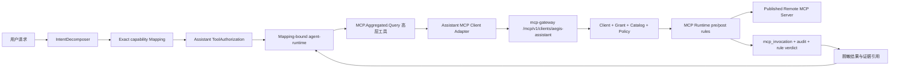

# Aegis V6.3 智能体模式集成 MCP 聚合管控设计

- **版本**：V6.3 设计版
- **日期**：2026-08-11
- **状态**：待实现，供评审
- **依赖**：V6.1 智能助手工具映射与确定性执行、V6.3 MCP 聚合治理平台

## 1. 设计结论

V6.1 智能体模式应作为 V6.3 MCP 平台的一个受管内置 MCP Client，使用专用的只读
Catalog 和 Grant，通过 `mcp-gateway` 调用远程 MCP Server。

核心结论如下：

1. Assistant 仍遵循 V6.1 的 `IntentDecomposer -> capability mapping ->
   ToolAuthorization -> mapping-bound plan -> agent-runtime` 链路。
2. 不把上游 MCP 的动态 Tool 直接注册到 `ToolRegistry`，也不允许模型直接选举任意
   `tool_alias` 作为 Runtime 工具名；模型面对的是稳定的高层 Assistant capability。
3. Assistant 同时开放四类只读查询能力，以及一个受审批保护的远程 MCP Server
   onboarding 控制能力和对应的状态查询能力。该控制能力只创建平台异步接入任务，
   不把上游 MCP 写工具、策略、授权、发布、凭据轮换或 Break-glass 暴露给模型。
4. Assistant 的用户身份、会话、运行、消息和工具调用 ID 必须由 Aegis 后端签名传递，
   不能由模型参数或上游 MCP 返回值提供。
5. V6.1 Assistant 权限/审批和 V6.3 MCP Client/Grant/Policy 是两层独立门禁，任何一层
   拒绝都不能调用上游；`full_access` 不得提升或绕过 `mcp:*` 权限。
6. 旧 `ExternalMCP.*` 作为兼容迁移来源保留，但新 Assistant MCP 流程启用后不得
   fallback 到旧直连链路，否则一次请求可能绕过 V6.3 审计和安全规则。
7. 先兼容当前代码的 Gateway 路径，再将上游代理和完整四阶段审计迁移到独立
   `mcp-gateway` 数据面；Assistant 使用的调用契约不随数据面迁移改变。

## 2. 当前基线与实际缺口

### 2.1 V6.1 智能体模式已具备的边界

当前 Assistant 已具备：

- `ToolRegistry`、`ToolSpec`、`ToolExposurePolicy` 和 capability 唯一性校验；
- `ToolDecisionEngine` 的 exact capability mapping；
- `ToolDispatcher`、`ApprovalGate`、RBAC、运行审计和 ToolResultVerifier；
- `RuntimeFactory` 将已授权 descriptor 和 Mapping-bound execution plan 交给
  `agent-runtime`；
- `ExternalMCP.*` 旧工具注册，以及外部结果归一化、脱敏和查询日志骨架。

因此，本设计不新增一套 Assistant 专用规划器，不让 MCP 动态工具绕开已有
`ToolDispatcher`。

### 2.2 V6.3 MCP 平台当前代码事实

当前仓库已经有：

- `api-server/internal/service/mcp_platform_service.go`：远程发现、Catalog、Client、
  Grant、运行时 allowlist、`RuntimeTools`/`RuntimeCall`；
- `api-server/internal/api/handler/mcp_platform_handler.go`：控制面 API 和
  `/internal/mcp-runtime/*` 数据面 API；
- 独立 `mcp-gateway`：Client endpoint、Bearer 校验、工具列表转发和调用转发；
- `mcp_invocations`、`mcp_rule_hits`、`mcp_security_verdicts` 等表，以及当前已落地的
  pre/post 确定性规则；
- 既有 frontend 的 MCP 聚合管控页面和 Client endpoint 管理。

当前缺口：

1. `api-server/cmd/main.go` 仍注册旧 `RegisterExternalMCPTools`，没有把 Assistant
   注册为 MCP 平台 Client。
2. 旧 `ExternalMCPSourceService` 仍可以直接连接外部 MCP，形成绕过 Gateway 的路径。
3. `RuntimeCall` 当前把 `client.ClientKey` 作为 `MCPInvocation.UserID`，没有保存真实
   Assistant 用户、session/run/message/tool call 上下文，也没有完整绑定 active release。
4. 当前 Gateway 的调用实际转发到 api-server `/internal/mcp-runtime/call`，而
   `RuntimeCall` 再由 api-server 直接访问上游；这能形成当前的统一治理闭环，但尚未
   达到“Gateway 独立承担上游代理和审计数据面”的最终架构。
5. 四阶段 payload 加密存储、跨调用 Activity、durable AI 尚未完成。因此 Assistant
   的第一阶段不得宣称拥有完整正文审计或 AI 安全结论，只能展示确定性规则状态和
   `analysis_pending/not_run` 等真实状态。

## 3. 范围、非目标与成功标准

### 3.1 本次范围

- 将 Assistant 注册为平台内置 Client：`aegis-assistant`；
- 为 Assistant 绑定专用只读 Catalog，例如 `assistant-secops-readonly`；
- 通过 Gateway 发现有效工具并调用已发布的只读远程 Tool；
- 把每次 Assistant MCP 调用关联到用户、Assistant session、run、message、tool call、
  trace 和 MCP invocation；
- 让 Assistant 展示调用状态、命中规则、结果限制和证据引用；
- 关闭旧直连路径的 Assistant 暴露，保留旧数据和旧管理 API 兼容；
- 增加 feature flag、灰度、回滚和针对 MCP 注入/越权/泄密的测试设计。

### 3.2 非目标

- 不把 Catalog 发布、Grant 修改、策略编辑、凭据管理、审计 payload reveal 或
  Break-glass 暴露为普通对话工具；远程 MCP Server onboarding 允许由 Assistant 在
  用户明确提出请求并通过 Assistant 审批后创建受管异步任务；
- 不把 MCP `tools/list` 的全部工具 schema 无界注入模型上下文；
- 不由模型直接决定任意 endpoint、上游 Server、Credential 或用户身份；
- 不把 MCP 返回的 prompt、description、resource link 或工具结果当作系统指令；
- 不在本阶段实现 MCP Prompt/Resource/Sampling/Roots/Tasks 的 Assistant 适配；
- 不因本设计修改 Agent/eBPF、Kafka/DC 的既有 Agent Guard 数据流。

### 3.3 成功标准

1. Assistant 只能经 Gateway 调用有效 Catalog 中的工具；旧 `ExternalMCP.*` 不再被新
   Assistant 流程选中。
2. `tools/list` 和 `tools/call` 都按当前 Client、Grant、用户 scope、发布 Revision
   和规则实时校验；撤销授权后，缓存旧 alias 直接调用也被拒绝，上游调用数为零。
3. 每次调用的 `mcp_invocation` 能回溯到 Assistant 用户和 session/run/message/tool call，
   也能回溯到 Catalog Release、Tool Revision、Policy decision 和规则结果。
4. 上游 endpoint、Credential、Bearer token、敏感参数和敏感结果不进入模型、日志、
   Kafka、前端状态或普通数据库明文字段。
5. MCP 结果中的“忽略规则”“执行另一工具”“泄露密钥”等内容只作为不可信数据返回，
   不改变 Assistant 的工具目录、权限、计划或审批状态。
6. Gateway、MCP runtime、旧 Catalog、上游或审计依赖不可用时，Assistant 明确返回
   blocked/degraded/unknown，不自动绕过到旧直连路径。
7. 用户明确请求远程 MCP 接入时，LLM 先识别意图并选择受控 onboarding capability，
   后端创建可审计异步任务；未授权、未审批或接入失败时不得声称已完成。

## 4. 目标架构



### 4.1 两阶段数据面

#### 阶段 A：兼容当前实现

```text
Assistant MCP Client
  -> HTTP mcp-gateway
  -> /internal/mcp-runtime/tools|call
  -> MCPPlatformService.RuntimeTools|RuntimeCall
  -> Remote MCP Server
```

该阶段的目标是先建立不可绕过的 Assistant Client 身份、Gateway 入口、Grant、审计关联
和 Assistant 工具契约。`RuntimeCall` 仍可以暂时位于 api-server，但必须使用统一的
`RuntimeInvocationContext`，不能为 Assistant 另写一套规则。

#### 阶段 B：目标实现

```text
Assistant MCP Client
  -> mcp-gateway
  -> Gateway Auth/Grant/Policy/Approval
  -> Gateway Upstream MCP Client + Credential Broker
  -> Remote MCP Server
  -> Gateway payload/outbox
  -> Kafka/DC/AI
```

阶段 B 将 `rpc`、上游 credential 使用、pre/post transform、四阶段 payload 和 outbox
逐步移动到 `mcp-gateway`。Assistant 只依赖 Gateway 的 MCP 协议，不感知内部迁移。

## 5. Assistant 对外暴露的能力

动态上游 Tool 只作为 `MCP.Aggregated.Tool.List` 的数据返回，不注册为独立
`ToolSpec`。这样既控制模型上下文，也避免动态工具绕过 V6.1 Mapping。

| ToolSpec | capability | 暴露级别 | 风险 | 作用 |
| --- | --- | --- | --- | --- |
| `MCP.Aggregated.Catalog.List` | `list_mcp_catalogs` | contextual | readonly | 返回当前用户可用的 Catalog 摘要 |
| `MCP.Aggregated.Tool.List` | `list_mcp_tools` | contextual | readonly | 返回指定 Catalog 的审核后 alias、用途、风险、schema 摘要 |
| `MCP.Aggregated.Query` | `query_aggregated_mcp` | primary/contextual | medium | 调用已授权的只读 Tool，返回脱敏证据 |
| `MCP.Aggregated.Invocation.Get` | `get_mcp_invocation` | companion/contextual | readonly | 查询调用状态、规则结果和证据引用 |
| `MCP.Aggregation.Server.Onboard` | `onboard_mcp_server` | primary | high/write | 创建受管远程 MCP 接入任务，触发 endpoint 校验、发现、安全扫描和发布审批 |
| `MCP.Aggregation.Server.Onboarding.Get` | `get_mcp_onboarding_status` | companion | readonly | 查询接入任务状态、失败原因和已发布 Server 摘要 |

前四个只读能力统一挂在 V6.3 工作流 `mcp_aggregation_query` 下；后两个能力统一挂在
`mcp_aggregation_onboarding` 下。两个工作流分别是 Assistant 第一层意图卡和第二层
闭合 Capability Catalog 的唯一入口；旧的
`external_evidence` 仅保留给 V6.0 兼容链路，不能替代新的 MCP 聚合工作流。

`MCP.Aggregation.Server.Onboard` 仍由大模型负责从用户请求中提取 endpoint、环境和
认证引用等参数，但后端只接受 opaque credential reference，不接受或回显原始 secret；
工具本身必须经过 Assistant 授权/审批，并通过 `MCPPlatformService.CreateOnboardingJob`
创建异步任务。后续由 `MCP.Aggregation.Server.Onboarding.Get` 按任务 ID 观察终态。

### 5.1 `MCP.Aggregated.Query` 参数原则

```json
{
  "catalog_key": "assistant-secops-readonly",
  "tool_alias": "siem.search_events",
  "arguments": {},
  "purpose": "investigate the specified host in the requested time range",
  "idempotency_key": "optional-client-generated-key"
}
```

- `catalog_key` 必须来自后端绑定的 Assistant Catalog，默认不允许模型切换到任意
  Catalog；如开放多个 Catalog，必须经过用户 scope 和本轮 Mapping 授权；
- `tool_alias` 是高层工具的业务参数，不是 Runtime tool name。Handler 必须在
  Gateway 返回的有效工具集合中精确匹配，禁止按字符串拆解 endpoint 或上游名称；
- `arguments` 必须是有限大小、闭合 JSON object，并根据固定 Tool Revision 的 input
  schema 校验；未声明字段拒绝，不静默忽略；
- `purpose` 只用于审计和策略上下文，不能覆盖 Grant、Policy 或审批；
- handler 返回 `invocation_id`、工具/服务摘要、脱敏结果、rule status、风险下限、
  coverage、analysis 状态和 evidence refs，不返回 credential、内部 endpoint 或原始
  上游错误堆栈。

### 5.2 不将动态 Tool 注入 Runtime 的理由

如果把 `siem.search_events` 直接变成 `ToolSpec`，会同时产生三个问题：

1. Tool Registry 的 capability 唯一性、ExposurePolicy 和启动时同步不再稳定；
2. 上游 Tool description/schema 可能含 prompt injection，模型会把不可信内容当成工具
   指令；
3. 旧的动态 alias 可能在 Grant/Releases 变化后仍被 Runtime 缓存。

因此 Runtime 只看到稳定的 `MCP.Aggregated.Query` descriptor；动态 alias 由后端在调用
时按当前 Release/Grant/Policy 再解析一次。

## 6. 身份、权限与审批

### 6.1 内置 Client

启动时由控制面幂等确保以下对象存在：

```text
Client:  aegis-assistant
Catalog: assistant-secops-readonly
Grant:   active, only approved L1/L2 read-only Tool Revision
Secret:  MCP_ASSISTANT_CLIENT_TOKEN（只存在于受保护配置/Secret Store，数据库只存 hash）
```

没有配置有效 Assistant Client token、Catalog、Grant 或签名快照时，Assistant MCP 能力
不注册或立即返回 `mcp_assistant_unavailable`；禁止临时创建匿名 Client，禁止 fallback
到 `ExternalMCP.*`。

### 6.2 两层门禁

```text
用户 Assistant RBAC / Exposure / Mapping / Approval
  AND
MCP Client credential / Catalog Release / Grant / Policy / Rule
```

第一层保证模型只能使用本轮被映射的高层 capability，并保留现有 Assistant 写意图、
审批、`ToolDispatcher` 和 `full_access` 语义。第二层保证该调用确实属于已发布 MCP
能力和当前资源范围。

建议新增独立的 Assistant 使用权限：

```text
mcp:assistant:use
mcp:assistant:catalog:read
mcp:assistant:invocation:read
```

其中 `mcp:assistant:use` 只允许通过 Assistant 发起已授权的只读调用，不等于
`mcp:catalog:publish`、`mcp:grant:write` 或 `mcp:audit:payload:read`。现有控制面权限
继续用于页面和管理 API，不能因为用户拥有普通 `mcp:*:read` 就自动获得 Assistant
调用权限；具体默认角色需在实现前与现有角色矩阵核对。

### 6.3 用户上下文传递

Assistant Adapter 调用 Gateway 时，除 Assistant Client Bearer 外，增加由 api-server
使用内部签名密钥生成的 `RuntimeInvocationContext`：

```json
{
  "actor_user_id": "user-id",
  "tenant_scope_digest": "sha256:...",
  "assistant_session_id": "session-id",
  "assistant_run_id": "run-id",
  "assistant_message_id": "message-id",
  "assistant_tool_call_id": "tool-call-id",
  "purpose": "redacted-purpose",
  "trace_id": "trace-id",
  "expires_at": "RFC3339"
}
```

上下文使用短 TTL、nonce 和 HMAC/mTLS 保护。Gateway/api-server 只信任内部签名字段，
不信任 MCP `arguments`、`_meta` 或上游返回内容中的身份字段。所有字段在入库前重新
校验用户状态和 Assistant 权限。

### 6.4 审批边界

- P0/P1 Assistant Catalog 只包含 L1/L2、已审核的只读工具，不产生上游写调用；
- 未来 L3/L4 工具必须同时通过 Assistant 的用户确认/审批和 MCP 的 Runtime Approval，
  且审批绑定 user、client、release、tool revision、arguments digest、target scope 和
  policy digest；
- Assistant 只能把 `approval_required` 真实展示给用户，不能用模型文本代替确认，不能
  调用 `mcp:approval:decide` 自动批准；
- 参数、目标、用户、Grant、Release 或 Policy 任一变化，旧 approval 失效；
- 上游非幂等调用超时返回 `outcome_unknown`，不由 Runtime 自动重试。

## 7. 数据模型与审计关联

现有 `mcp_invocations` 需要补齐 Assistant 关联字段。建议新增 migration，不修改历史
记录的含义：

| 字段 | 说明 |
| --- | --- |
| `source_kind` | `assistant` / `external_client` / `admin_test` |
| `actor_user_id` | 实际 Assistant 用户，不再用 client key 代替 |
| `catalog_id`、`catalog_release_id` | 本次实际解析使用的发布快照 |
| `assistant_session_id` | Assistant session 引用 |
| `assistant_run_id` | Assistant run 引用 |
| `assistant_message_id` | Assistant message 引用 |
| `assistant_tool_call_id` | Assistant ToolGateway call 引用 |
| `activity_id`、`trace_id` | 跨调用关联和分布式追踪 |
| `purpose_digest` | 目的摘要 digest，不保存不受控长文本 |
| `user_scope_digest` | 权限/租户范围快照 digest |
| `context_status` | `complete` / `partial` / `historical_payload_unavailable` |

`RuntimeCall` 应改为接收结构化 `RuntimeInvocationContext`，并返回统一的：

```go
type MCPAssistantCallResult struct {
    InvocationID string                 `json:"invocation_id"`
    Server       string                 `json:"server"`
    ToolAlias    string                 `json:"tool_alias"`
    Status       string                 `json:"status"`
    Result       map[string]interface{} `json:"result,omitempty"`
    RuleStatus   string                 `json:"rule_status"`
    OverallRisk  string                 `json:"overall_risk"`
    EvidenceRefs []string               `json:"evidence_refs,omitempty"`
    Limitations  []string               `json:"limitations,omitempty"`
}
```

新增调用必须至少写入 invocation 元数据、request/result digest、规则结果和审计事件。
在四阶段 payload 完成前，`context_status=partial`；历史记录只能保留
`historical_payload_unavailable`，不能用当前规则回放伪造命中。

## 8. 旧 ExternalMCP 迁移

| 场景 | 迁移行为 |
| --- | --- |
| v6.0 `external_mcp_sources` | 作为迁移候选，转为远程 Server onboarding draft，不自动发布 |
| 旧 `ExternalMCP.Source.List/GetSchema` | 迁移期可供旧页面使用，Assistant 暴露级别降为 internal/disabled |
| 旧 `ExternalMCP.Query/MultiQuery` | 新 Assistant 不选用；新请求只走 `MCP.Aggregated.Query` |
| 旧 query logs | 只读保留，标记 legacy，不能补造 v6.3 四阶段证据 |
| v6.0 直连凭据 | 完成迁移后撤销或转移到 Credential Broker；不复制到 Assistant prompt |
| 迁移失败 | 保留旧数据和失败原因，Assistant 返回能力不可用，不自动回退直连 |

迁移开关建议：

```yaml
mcp_platform:
  assistant_enabled: false
  assistant_client_key: aegis-assistant
  assistant_catalog_key: assistant-secops-readonly
  assistant_client_token: ""
  assistant_allow_write_tools: false
  assistant_legacy_external_fallback: false
```

`assistant_legacy_external_fallback` 必须固定为 `false`；保留该配置仅用于显式拒绝和
灰度审计，不用于恢复绕过路径。

## 9. 代码改动边界

实现阶段按以下边界拆分，避免在现有 Assistant 或 MCP 服务中做无关重构：

### api-server

- `config/config.go`、`config/api-server.yaml`、`.env.example`：新增 Assistant MCP
  flag、Client/Catalog key、Secret 引用和超时配置；
- `internal/assistant/mcp_gateway_client.go`：Gateway HTTP/MCP client，负责协议、超时、
  bounded body、错误映射和不可信结果包装；
- `internal/assistant/mcp_invocation_context.go`：内部上下文签名、TTL、nonce 和脱敏；
- `internal/assistant/tools/mcp_aggregation_tools.go`：四个只读聚合 ToolSpec，以及受控
  onboarding/status ToolSpec；不动态注册上游工具；
- `internal/assistant/tool_exposure.go`/`workflow_registry.go`：增加 Assistant MCP
  capability、workflow 和暴露策略；
- `internal/service/mcp_platform_service.go`：抽取/扩展 `RuntimeInvocationContext`，
  按真实 actor、release 和 trace 写 invocation；
- `internal/model/mcp_platform.go`、`internal/repository/mcp_platform_repo.go`：补充
  Assistant 关联字段、幂等解析和内置 Client/Grant 初始化；
- `cmd/main.go`：先确保内置 Client/Grant，再按 feature flag 注册新工具；新路径启用时
  不注册旧工具的 Assistant-facing exposure；
- 新 migration：只增字段、索引和必要的内置绑定，不删除历史 External MCP 记录。

### mcp-gateway

- 校验并转发签名 `RuntimeInvocationContext`，禁止客户端自带同名 Header 覆盖；
- `initialize`/`tools/list` 返回受 Grant 过滤的工具，`tools/call` 与 body alias 严格
  对齐；
- 统一错误码：未授权 `-32003`，安全阻断 `-32004`，审批待处理使用结构化
  `approval_required`；
- 阶段 B 再迁入真实 upstream client、credential broker、payload/outbox，保持下游
  endpoint 和 Assistant Adapter 不变。

### frontend

本次不新增 MCP 管控菜单。复用现有 Assistant ToolCall/Approval/Result 组件，增加：

- MCP invocation ID、来源 Server/Tool、规则风险和结果限制展示；
- `approval_required`、`analysis_pending`、`outcome_unknown` 和 Gateway unavailable
  状态；
- 不渲染 endpoint、credential、原始 MCP payload，不把结果写入 URL、console 或埋点。

## 10. 测试设计

### 10.1 Assistant 单元测试

1. 新 capability 可以被 exact mapping 选中，动态 alias 不出现在 Runtime descriptor。
2. 未经 `MCP.Aggregated.Tool.List` 返回的 alias、未知 Catalog、非 active Grant 和
   非 approved Tool Revision 全部 fail closed。
3. `arguments` 超过大小、非 object、schema 不匹配或包含未声明字段时不上游。
4. Assistant 用户身份只能取自签名上下文，模型参数中的 user/tenant 字段不能覆盖。
5. 上游返回 prompt injection、secret、恶意 resource link 时，结果保持数据边界，
   不改变工具集合和计划。
6. Gateway 失败、规则阻断、结果隔离、审批等待和上游 timeout 返回真实状态，不 fallback。
7. 旧 `ExternalMCP.Query` 在 Assistant MCP flag 开启后不可被 ToolDecisionEngine 暴露。

### 10.2 MCP Gateway/Service 契约测试

1. Assistant Client token 仅能访问绑定 Catalog；过期/撤销 token、Client、Grant、Release
   立即拒绝。
2. `tools/list` 与 `tools/call` 使用相同 effective tool 集合，旧缓存 alias 不能绕过。
3. invocation 关联 actor/session/run/message/tool call、release、revision、trace 正确。
4. pre 阻断不上游；post 敏感结果不交付；规则证据只保存路径、模式、大小和 digest。
5. Assistant token 不发送给上游；上游 endpoint、credential 不出现在响应、日志、Kafka
   和前端。
6. 同一 idempotency key 只产生一个非幂等执行；超时结果未知不自动重试。
7. 旧 invocation 显示历史证据缺口，不回溯伪造规则命中。

### 10.3 跨服务 E2E

```text
Assistant request
  -> mapping-bound MCP capability
  -> Gateway tools/list/call
  -> published mock MCP Server
  -> mcp_invocation/rule verdict
  -> Assistant result card
```

必须覆盖：正常只读调用、撤销授权直调、上游 schema drift、结果提示注入、敏感输入、
Gateway/DB/Kafka/MinIO 故障、用户权限变化和重启恢复。

## 11. 日志、指标与安全要求

新增结构化事件：

```text
assistant_mcp_catalog_resolved
assistant_mcp_call_started
assistant_mcp_call_completed
assistant_mcp_call_blocked
assistant_mcp_call_degraded
```

日志只包含 session/run/message/tool-call/invocation ID 的非敏感关联、catalog/release/tool
digest、decision、status、error_code、duration_ms 和结果数量；禁止记录 token、endpoint、
credential ref、arguments、result 正文、purpose 原文和 schema 大对象。

指标使用低基数标签：

```text
assistant_mcp_calls_total{status,decision,risk_tier}
assistant_mcp_call_duration_seconds{status}
assistant_mcp_rejections_total{reason}
assistant_mcp_gateway_unavailable_total
assistant_mcp_context_partial_total
```

规则、Grant 和平台的最终风险以 MCP 确定性结果为准；AI 只能升级风险，不能将 blocked、
high、critical 或 unknown 改成 safe。

## 12. 灰度、回滚与实施顺序

### P0：契约和只读影子

- 增加内置 Client/Grant、上下文和 Gateway Adapter；
- 只执行 `tools/list`，记录影子目录和旧 External MCP 目录差异；
- 不改变用户可见结果，确认 token/endpoint/secret 无泄漏。

### P1：只读查询闭环

- 开启 `MCP.Aggregated.Query`，仅允许 L1/L2 approved read-only 工具；
- 新调用全部走 Gateway 和 RuntimeCall，生成真实 invocation/rule verdict；
- 旧 Assistant ExternalMCP 暴露关闭，旧页面仍可读取历史记录。

### P2：审计与安全增强

- 补齐四阶段脱敏摘要、MinIO 加密 payload、Kafka outbox 和 invocation 关联查询；
- 增加 `Invocation.Get`、规则证据和前端状态展示；
- 不开放原始 MCP 写工具；远程 Server onboarding 只作为受审批的控制面任务入口。

### P3：受控写能力（后续独立评审）

- 完成 MCP Runtime Approval、Tasks/InputRequired、幂等/未知结果和双人审批；
- 仅对明确的高层 Assistant capability 开放，不把原始 MCP write tool 暴露给模型；
- 完成后再单独评审是否开放 `MCP.Aggregated.Execute`。

### 回滚

1. 将 `assistant_enabled=false`，停止注册新 MCP capability；
2. 撤销 `aegis-assistant` Grant 或 token，使 Gateway 立即拒绝调用；
3. 保留 invocation、rule hit、verdict 和旧 query log，不删除或重写历史；
4. 不恢复 `assistant_legacy_external_fallback`，旧链路只能由兼容页面或独立迁移任务使用；
5. 修复后从 P0 影子阶段重新验证，不直接跳到 P1/P3。

## 13. 实施完成定义

只有以下条件全部满足，才能宣称“V6.1 智能体模式已集成 V6.3 MCP 聚合管控”：

- Assistant 作为真实受管 Client 存在，Catalog/Grant/Release/Revision 关系可审计；
- Assistant 的每次 MCP 调用经过 Gateway、当前授权校验和确定性 pre/post 规则；
- V6.1 capability mapping、ToolDispatcher、审批和结果验真不被绕过；
- invocation 能关联真实用户和 Assistant session/run/message/tool-call；
- 旧 ExternalMCP 路径不再被新 Assistant 调用，且无隐式 fallback；
- secret、endpoint、原始敏感参数/结果在模型、日志、消息和前端中的泄漏测试为零；
- 撤销 Grant、停用 Release、用户权限变化、Gateway/上游/审计依赖故障均有 fail-closed
  或明确 degraded/unknown 行为；
- api-server、mcp-gateway、frontend 的定向测试和构建通过，并完成至少一条跨服务 E2E；
- 四阶段审计和 durable AI 尚未完成时，产品和文档明确显示其真实未完成状态，不提前宣称
  “完整 MCP 安全分析”或“完整 payload 审计”。

## 14. 本轮实现边界

本轮已实现 P0/P1 的可运行骨架，并明确保留以下上线前置条件：

- MCP 控制台为远程服务提供 `DELETE /mcp-platform/servers/:id`，语义是可恢复的
  `retired`；为 Client 授权提供 `DELETE /mcp-platform/client-endpoints/:client_id`，
  语义是撤销 grant、credential 和 Client 状态。两者均保留历史版本、调用和审计数据，
  前端提供二次确认的删除按钮。
- Assistant 不自动生成或回显 Client Token。启用前必须先在 MCP 聚合管控页面创建专用
  Client 授权，再通过 `MCP_ASSISTANT_CLIENT_KEY` 和
  `MCP_ASSISTANT_CLIENT_TOKEN` 注入 api-server；`MCP_ASSISTANT_ENABLED` 默认为关闭。
- 新 Assistant 注册四个固定只读聚合工具：`MCP.Aggregated.Catalog.List`、
  `MCP.Aggregated.Tool.List`、`MCP.Aggregated.Query` 和
  `MCP.Aggregated.Invocation.Get`，以及固定的受审批控制面工具
  `MCP.Aggregation.Server.Onboard` 和
  `MCP.Aggregation.Server.Onboarding.Get`。上游工具名只作为 Gateway 返回的数据，不能
  进入 ToolRegistry，也不能绕过 ToolDispatcher。
- 用户明确提出“接入/注册/连接远程 MCP”时，Assistant 不直接返回管控页面说明；请求
  经过 LLM 意图识别和 capability mapping 后调用 onboarding 工具，创建异步任务并以
  任务状态作为事实依据。
- `MCP.Aggregated.Query` 每次调用前重新读取 Client 的当前工具授权，只接受 Gateway
  返回且风险为 L1/L2 的 approved 工具；Assistant 上下文使用 Runtime Secret 做 HMAC
  签名后进入 invocation 的操作者审计字段。
- P2 的 MinIO 加密 payload、Kafka outbox 和完整脱敏摘要，以及 P3 的写工具、任务态和
  双人审批，本轮不宣称完成；配置无效、Token 缺失或 Runtime Secret 缺失时新 Assistant
  MCP 工具 fail-closed，旧 V6.0 Assistant ExternalMCP 仅在 managed 开关关闭时注册。
