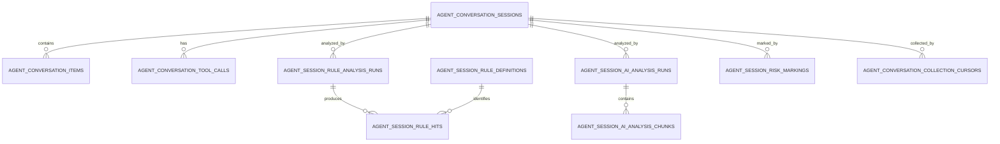

# Aegis V6.3 智能体会话感知数据库设计

## 1. 迁移

新增：

```text
migrations/032_v6.3_agent_session_awareness.sql
```

不能使用 V6.2 旧草案中的 030：当前仓库的 030、031 已分别用于 Zcode Profile
和逃逸权限优先重构。

迁移只新增表、索引、约束、内置规则和权限；不修改现有
`agent_behavior_sessions` 或 `agent_security_findings` 的语义。

## 2. 关系



## 3. `agent_conversation_sessions`

核心列：

```text
id UUID PK
host_id UUID NOT NULL FK hosts
asset_id UUID NULL FK host_application_assets
instance_id UUID NULL FK agent_runtime_instances
behavior_session_id UUID NULL FK agent_behavior_sessions
agent_type VARCHAR(32) NOT NULL
source_subject_uid BIGINT NOT NULL
source_storage_namespace_hash VARCHAR(80) NOT NULL
source_session_id VARCHAR(255) NOT NULL
source_parent_session_id VARCHAR(255) NULL
source_version VARCHAR(64)
source_mode VARCHAR(32) NOT NULL
source_attestation VARCHAR(32) NOT NULL
project_name_redacted VARCHAR(255)
project_root_hash VARCHAR(80)
cwd_redacted TEXT
model_redacted VARCHAR(128)
status VARCHAR(24) NOT NULL
collection_coverage VARCHAR(24) NOT NULL
content_mode VARCHAR(24) NOT NULL
first_source_at TIMESTAMPTZ NOT NULL
last_source_at TIMESTAMPTZ NOT NULL
ended_at TIMESTAMPTZ NULL
last_sequence BIGINT NOT NULL DEFAULT 0
item_count BIGINT NOT NULL DEFAULT 0
turn_count BIGINT NOT NULL DEFAULT 0
tool_call_count BIGINT NOT NULL DEFAULT 0
redaction_count BIGINT NOT NULL DEFAULT 0
missing_ranges JSONB NOT NULL DEFAULT '[]'
session_chain_digest VARCHAR(80)
visible_token_estimate BIGINT NOT NULL DEFAULT 0
token_estimation_method VARCHAR(64) NOT NULL DEFAULT 'aegis_visible_v1'
tokenizer_version VARCHAR(64) NOT NULL DEFAULT '1'
token_estimated_at TIMESTAMPTZ NULL
source_input_tokens BIGINT NULL
source_output_tokens BIGINT NULL
source_cache_creation_input_tokens BIGINT NULL
source_cache_read_input_tokens BIGINT NULL
source_usage_coverage VARCHAR(16) NOT NULL DEFAULT 'none'
latest_rule_run_id UUID NULL
latest_ai_run_id UUID NULL
overall_risk VARCHAR(20) NOT NULL DEFAULT 'unknown'
created_at / updated_at TIMESTAMPTZ NOT NULL
```

唯一键：

```text
(host_id, source_subject_uid, agent_type,
 source_storage_namespace_hash, source_session_id)
```

约束：

- `agent_type IN ('claude-code','codex')`；
- `source_mode IN ('static_scan','static_backfill')`；
- `source_attestation = 'versioned_static_parser'`；
- status 属于 active_inferred/idle_inferred/ended_observed/ended_inferred/unknown；
- coverage 属于 complete/partial/metadata_only/unsupported/source_not_found/disabled；
- content mode 属于 metadata_only/redacted_text；
- Token 非负；usage coverage 为 none/partial/complete；
- `overall_risk` 是投影，不作为唯一安全事实。

## 4. `agent_conversation_items`

```text
id UUID PK
session_id UUID NOT NULL FK sessions ON DELETE CASCADE
source_message_id VARCHAR(255) NULL
source_part_id VARCHAR(255) NULL
source_revision VARCHAR(80) NOT NULL
source_sequence BIGINT NOT NULL
turn_id VARCHAR(255)
parent_item_id UUID NULL
item_type VARCHAR(40) NOT NULL
role VARCHAR(24) NOT NULL
occurred_at TIMESTAMPTZ NOT NULL
observed_at TIMESTAMPTZ NOT NULL
content_redacted TEXT NULL
content_digest VARCHAR(80) NOT NULL
redaction_state VARCHAR(24) NOT NULL
visibility VARCHAR(24) NOT NULL
visible_token_estimate BIGINT NOT NULL DEFAULT 0
token_estimation_method VARCHAR(64) NOT NULL DEFAULT 'aegis_visible_v1'
source_input_tokens BIGINT NULL
source_output_tokens BIGINT NULL
source_cache_creation_input_tokens BIGINT NULL
source_cache_read_input_tokens BIGINT NULL
metadata JSONB NOT NULL DEFAULT '{}'
source_event_type VARCHAR(64)
source_digest VARCHAR(80) NOT NULL
previous_item_digest VARCHAR(80)
schema_version INT NOT NULL DEFAULT 1
created_at / updated_at TIMESTAMPTZ NOT NULL
```

幂等：

```text
UNIQUE(session_id, source_sequence, source_digest)
UNIQUE(session_id, source_message_id, source_part_id, source_revision)
  WHERE source_message_id IS NOT NULL
```

更新 source revision 时保留当前终态，旧 revision 不需要长期保存正文；审计以
run input digest 和 source digest 追踪。

## 5. `agent_conversation_tool_calls`

```text
id UUID PK
session_id UUID NOT NULL
source_tool_call_id VARCHAR(255) NOT NULL
turn_id VARCHAR(255)
call_item_id UUID NULL
result_item_id UUID NULL
tool_name VARCHAR(255) NOT NULL
tool_category VARCHAR(32) NOT NULL
status VARCHAR(24) NOT NULL
arguments_redacted JSONB NOT NULL DEFAULT '{}'
result_summary_redacted JSONB NOT NULL DEFAULT '{}'
permission_summary JSONB NOT NULL DEFAULT '{}'
started_at / ended_at TIMESTAMPTZ
behavior_event_ids JSONB NOT NULL DEFAULT '[]'
finding_ids JSONB NOT NULL DEFAULT '[]'
correlation_confidence VARCHAR(24) NOT NULL DEFAULT 'unattributed'
created_at / updated_at TIMESTAMPTZ NOT NULL
UNIQUE(session_id, source_tool_call_id)
```

## 6. `agent_conversation_collection_cursors`

该表保存中心侧 coverage/cursor 投影；Agent 的真实 byte cursor 仍在本地加密状态。

```text
id UUID PK
session_id UUID NULL
host_id UUID NOT NULL
source_subject_uid BIGINT NOT NULL
agent_type VARCHAR(32) NOT NULL
source_identity_hash VARCHAR(80) NOT NULL
canonical_path_hash VARCHAR(80) NOT NULL
device_id VARCHAR(64)
inode VARCHAR(64)
byte_offset BIGINT NOT NULL DEFAULT 0
last_file_size BIGINT NOT NULL DEFAULT 0
last_file_mtime TIMESTAMPTZ NULL
last_complete_line_digest VARCHAR(80)
last_source_sequence BIGINT NOT NULL DEFAULT 0
parser_version VARCHAR(64)
schema_fingerprint VARCHAR(80)
status VARCHAR(24) NOT NULL
error_code VARCHAR(100)
last_scan_at / last_seen_at / updated_at TIMESTAMPTZ NOT NULL
UNIQUE(host_id, source_subject_uid, agent_type, source_identity_hash)
```

不保存明文 home/transcript path。

## 7. `agent_session_rule_definitions`

```text
id UUID PK
rule_key VARCHAR(128) NOT NULL
rule_version BIGINT NOT NULL
name VARCHAR(255) NOT NULL
description TEXT
category VARCHAR(64) NOT NULL
default_severity VARCHAR(20) NOT NULL
target_item_types JSONB NOT NULL
target_roles JSONB NOT NULL
matchers JSONB NOT NULL
sequence_logic JSONB NOT NULL DEFAULT '{}'
allow_conditions JSONB NOT NULL DEFAULT '[]'
immutable BOOLEAN NOT NULL DEFAULT TRUE
enabled BOOLEAN NOT NULL DEFAULT TRUE
digest VARCHAR(80) NOT NULL
created_at / updated_at TIMESTAMPTZ NOT NULL
UNIQUE(rule_key, rule_version)
```

内置 ASR-PROMPT-001..010 通过 migration 插入并由 manifest digest 校验。前端
V6.3 只读；策略只允许 enable/threshold override，不原地修改内置定义。

## 8. `agent_session_rule_analysis_runs`

```text
id UUID PK
session_id UUID NOT NULL
status VARCHAR(24) NOT NULL
input_from_sequence BIGINT NOT NULL
input_to_sequence BIGINT NOT NULL
input_digest VARCHAR(80) NOT NULL
rule_catalog_digest VARCHAR(80) NOT NULL
normalizer_version VARCHAR(64) NOT NULL
matched_rule_count INT NOT NULL DEFAULT 0
highest_severity VARCHAR(20)
lease_owner VARCHAR(100)
lease_expires_at TIMESTAMPTZ
attempt INT NOT NULL DEFAULT 0
queued_at / started_at / completed_at TIMESTAMPTZ
error_code VARCHAR(100)
error_message_redacted TEXT
created_at / updated_at TIMESTAMPTZ NOT NULL
UNIQUE(session_id, input_to_sequence, input_digest, rule_catalog_digest)
```

状态：pending/running/succeeded/failed/superseded。

## 9. `agent_session_rule_hits`

```text
id UUID PK
session_id UUID NOT NULL
run_id UUID NOT NULL FK rule runs ON DELETE CASCADE
rule_definition_id UUID NOT NULL
rule_key VARCHAR(128) NOT NULL
rule_version BIGINT NOT NULL
item_id UUID NOT NULL
turn_id VARCHAR(255)
severity VARCHAR(20) NOT NULL
start_codepoint INT NULL
end_codepoint INT NULL
matched_signal VARCHAR(100) NOT NULL
evidence_excerpt_redacted TEXT
confidence NUMERIC(5,4) NOT NULL
hit_digest VARCHAR(80) NOT NULL
status VARCHAR(24) NOT NULL DEFAULT 'open'
handled_by VARCHAR(100)
handled_at TIMESTAMPTZ
disposition_reason TEXT
created_at / updated_at TIMESTAMPTZ NOT NULL
UNIQUE(run_id, hit_digest)
```

offset 约束：均为 null，或 `0 <= start < end`。API 返回 hit 前再次确认 item/session
归属。

## 10. `agent_session_ai_analysis_runs`

```text
id UUID PK
session_id UUID NOT NULL
run_type VARCHAR(24) NOT NULL  -- incremental|final|manual
trigger_reason VARCHAR(64) NOT NULL
status VARCHAR(24) NOT NULL
input_from_sequence BIGINT NOT NULL
input_to_sequence BIGINT NOT NULL
input_digest VARCHAR(80) NOT NULL
provider VARCHAR(64)
model VARCHAR(128)
prompt_version VARCHAR(64) NOT NULL
schema_version VARCHAR(64) NOT NULL
context_window_tokens INT NOT NULL
chunk_target_tokens INT NOT NULL
chunk_hard_tokens INT NOT NULL
chunk_count INT NOT NULL DEFAULT 0
completed_chunk_count INT NOT NULL DEFAULT 0
verdict VARCHAR(24)
severity VARCHAR(20)
confidence NUMERIC(5,4)
summary_redacted TEXT
risk_categories JSONB NOT NULL DEFAULT '[]'
evidence_item_ids JSONB NOT NULL DEFAULT '[]'
counter_evidence_item_ids JSONB NOT NULL DEFAULT '[]'
related_behavior_event_ids JSONB NOT NULL DEFAULT '[]'
uncertainties JSONB NOT NULL DEFAULT '[]'
recommended_disposition VARCHAR(24)
analysis_input_tokens BIGINT NULL
analysis_output_tokens BIGINT NULL
analysis_cached_tokens BIGINT NULL
usage_coverage VARCHAR(16) NOT NULL DEFAULT 'unavailable'
requested_by VARCHAR(100)
lease_owner VARCHAR(100)
lease_expires_at TIMESTAMPTZ
attempt INT NOT NULL DEFAULT 0
queued_at / started_at / completed_at TIMESTAMPTZ
error_code VARCHAR(100)
error_message_redacted TEXT
created_at / updated_at TIMESTAMPTZ NOT NULL
```

幂等索引：

```text
UNIQUE(session_id, input_to_sequence, input_digest, prompt_version, model)
WHERE status NOT IN ('failed','cancelled')
```

状态：pending/chunking/running/reducing/succeeded/inconclusive/failed/
invalid_output/cancelled。

## 11. `agent_session_ai_analysis_chunks`

```text
id UUID PK
run_id UUID NOT NULL FK AI runs ON DELETE CASCADE
chunk_index INT NOT NULL
fragment_group VARCHAR(100)
first_sequence BIGINT NOT NULL
last_sequence BIGINT NOT NULL
input_digest VARCHAR(80) NOT NULL
estimated_input_tokens INT NOT NULL
hard_budget_tokens INT NOT NULL
status VARCHAR(24) NOT NULL
attempt INT NOT NULL DEFAULT 0
provider_input_tokens BIGINT NULL
provider_output_tokens BIGINT NULL
provider_cached_tokens BIGINT NULL
verdict VARCHAR(24)
severity VARCHAR(20)
confidence NUMERIC(5,4)
result JSONB NOT NULL DEFAULT '{}'
evidence_item_ids JSONB NOT NULL DEFAULT '[]'
rolling_summary_redacted TEXT
lease_owner VARCHAR(100)
lease_expires_at TIMESTAMPTZ
started_at / completed_at TIMESTAMPTZ
error_code VARCHAR(100)
error_message_redacted TEXT
created_at / updated_at TIMESTAMPTZ NOT NULL
UNIQUE(run_id, chunk_index)
```

不保存完整模型 request/response。`result` 只保存通过 schema 和 evidence ownership
验证的结构化输出。

## 12. `agent_session_risk_markings`

```text
id UUID PK
session_id UUID NOT NULL
scope_type VARCHAR(24) NOT NULL -- session|turn|item|tool_call
scope_id VARCHAR(255) NOT NULL
source_type VARCHAR(24) NOT NULL -- rule|ai|behavior|combined|human
source_id UUID NULL
category VARCHAR(64) NOT NULL
severity VARCHAR(20) NOT NULL
verdict VARCHAR(24) NOT NULL
evidence_item_ids JSONB NOT NULL DEFAULT '[]'
behavior_event_ids JSONB NOT NULL DEFAULT '[]'
finding_ids JSONB NOT NULL DEFAULT '[]'
status VARCHAR(24) NOT NULL DEFAULT 'open'
handled_by VARCHAR(100)
handled_at TIMESTAMPTZ
disposition_reason TEXT
created_at / updated_at TIMESTAMPTZ NOT NULL
```

## 13. 索引与分区

必要索引：

```text
sessions(host_id, last_source_at DESC)
sessions(agent_type, last_source_at DESC)
sessions(collection_coverage, last_source_at DESC)
sessions(overall_risk, last_source_at DESC)
sessions(visible_token_estimate DESC)
items(session_id, source_sequence, id)
items(session_id, turn_id)
items(content_digest)
tool_calls(session_id, started_at)
rule_hits(session_id, severity, created_at DESC)
rule_hits(rule_key, created_at DESC)
ai_runs(session_id, created_at DESC)
ai_runs(status, queued_at)
ai_chunks(status, lease_expires_at)
markings(status, severity, created_at DESC)
```

`agent_conversation_items` 预留按 `occurred_at` 月分区；首版可先普通表，但上线
规模估算超过单月 1,000 万 item 时必须在 GA 前启用分区。不能在无验证情况下
为 `content_redacted` 建全文索引。

## 14. 保留与删除

默认：

| 数据 | 保留 |
| --- | --- |
| 脱敏会话 items/tool summaries | 30 天，可配置 7～90 天 |
| session metadata/cursor status | 90 天 |
| rule/AI run、hit、marking | 180 天 |
| 审计日志 | 按现有审计策略，至少 180 天 |
| Kafka transport | 24～72 小时 |

删除顺序：先停止新分析并取消 pending runs，再按 session cascade 删除正文和
analysis；审计日志保留对象 ID/hash 和删除动作，不保留正文。

## 15. 回滚

代码回滚顺序：

1. 关闭 AI auto/manual；
2. 关闭规则 request/worker；
3. 关闭 DC projection 和 Server ingest；
4. 下发 Agent collection disabled 并 flush cursor/spool；
5. 回滚服务代码。

数据库表不在紧急回滚中 DROP。待保留期和数据导出决策完成后，另写显式向下
迁移；禁止通过删除用户 Claude/Codex transcript 完成 Aegis 回滚。

## 16. 迁移测试

- 空库和已有 V6.2 数据库均可执行 032；
- migration 可重复执行或明确由 migration runner 保证一次性；
- 所有 check/unique/FK/index 与 GORM tag 一致；
- 内置规则 digest 与代码 manifest 一致；
- rollback flags off 后旧 Agent Guard API/UI 不受影响；
- retention job 不会误删 `agent_behavior_sessions` 或用户原始 transcript。
