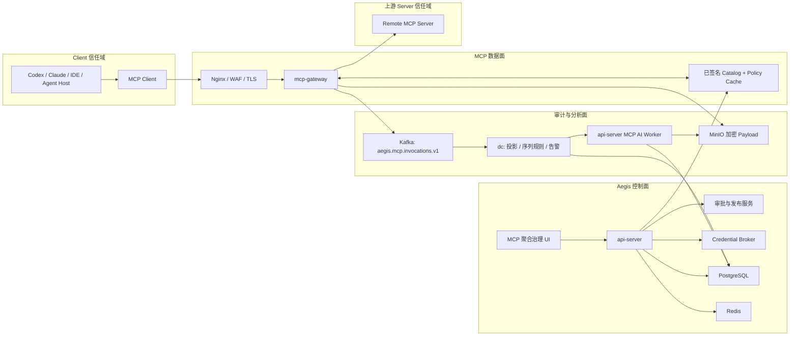
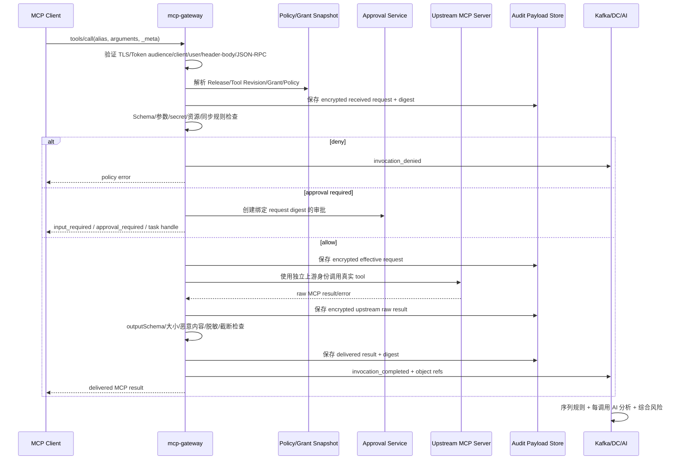

# Aegis V6.3 MCP 聚合治理平台总体设计

- **版本**：V6.3 方案版
- **日期**：2026-08-11
- **状态**：目标设计，尚未实现
- **协议基线**：MCP `2026-07-28`；兼容 `2025-11-25`、`2025-06-18`
- **专项定位**：把 Aegis 从“可配置少量外部 MCP 数据源”升级为组织级 MCP Registry、Gateway、审批发布、工具治理、全链路审计与安全分析平台

## 1. 问题与目标

当前企业中的 MCP Server 往往由不同团队分别部署，Client 直接保存 endpoint 和凭据，
导致以下问题：

- 无统一准入标准，无法判断 Server、工具描述和 Tool Annotation 是否可信；
- 工具列表、Schema、版本、负责人、数据分类和健康状态不可统一查看；
- Client 可以绕过平台直连，授权范围难以收敛；
- Server 或工具变更后可能静默漂移，原审批结论失效；
- 发布审批和每次高风险调用审批混在一起，无法绑定具体参数和目标；
- 请求、上游原始结果、下游实际结果缺少同一条证据链；
- 安全规则只能看单次命令，不能分析跨工具调用链、数据外流和提示注入；
- AI 分析缺少受控输入、结构化结论、版本证据和不可降权约束。

V6.3 的目标是建立一个组织级 MCP 中枢：

```text
所有受管 MCP Client -> Aegis MCP Gateway -> 已准入并已发布的 MCP Server
```

“所有”指组织纳管范围内的 MCP，不表示自动信任或自动接入互联网中的任意 Server。
Server 必须完成登记、发现、测试、安全评估、审批和发布；Client 必须完成身份登记、
目录订阅和工具授权。只有二者的有效授权交集才能执行。

## 2. 成功标准

1. 组织内受管 Client 只配置 Aegis 的 MCP endpoint，不持有上游 Server endpoint 或凭据。
2. 管理员能查看 Server、协议、传输、认证、负责人、版本、工具、Schema、风险、审批、
   发布、调用、健康、漂移和安全分析信息。
3. Server 与工具分别具备准入、审批、发布、暂停、退役状态；Schema 或行为漂移不会自动
   进入已发布目录。
4. `tools/list` 只返回“目录发布快照 ∩ Client Grant ∩ 用户 Scope ∩ 当前策略”中的工具。
5. 每次 `tools/call` 都经过身份、Schema、参数、资源范围、速率、风险、审批和上游状态校验。
6. 审计链能关联 Client 请求、策略决策、审批、实际发往上游的请求、上游原始结果、
   脱敏后下游结果和最终安全结论。
7. 请求与结果正文按策略完整留存，但 Token/密码/私钥永不以明文进入日志、数据库或消息。
8. 所有调用都执行同步确定性规则；所有已受理调用都进入异步 AI 安全分析，不使用抽样代替。
9. AI 只能提高风险或建议更严格处置，不能覆盖确定性 deny、越权批准或把 unknown 变成 safe。
10. 控制面、网关、Kafka、上游 Server、对象存储或 AI 不可用时具有明确的 fail-closed/degraded
    行为，页面不得把待分析、缺证据或超时显示为安全。

## 3. 范围与非目标

### 3.1 V6.3 范围

- 上游 MCP Server 注册、发现、连接测试、版本快照、漂移检测和健康检查；
- Server/工具准入审查、四眼审批、目录编排、不可变发布版本和紧急下架；
- Client/Service Principal 登记、OAuth Scope、目录订阅和工具级 Grant；
- 对 Client 暴露受管 Streamable HTTP MCP endpoint；
- 远程 Streamable HTTP 上游代理；遗留 HTTP+SSE 只做迁移兼容；
- 远程 MCP Server 一键接入编排：连接、发现、验证、风险分类、审批和发布；
- 工具发现、命名消歧、输入/输出 Schema 验证、参数约束、速率和并发控制；
- 发布审批、调用审批、完整审计、规则分析、AI 分析、告警和调查；
- 统一管理页面和只读审计查询 API。

### 3.2 非目标

- 不允许对话中的模型临时添加任意 endpoint 或任意 command；
- 不纳管 stdio、本地 command、本地进程或 MCP Runner；这类能力留待后续独立版本设计；
- 不向 Client 透传上游 Token，也不把 Client Token 透传给上游；
- 不以 Server 自报的 Tool Annotation 代替 Aegis 的独立评估；
- 不在首个发布阶段代理 Sampling、Roots 或 Logging；这些能力已进入协议弃用周期；
- 首个发布阶段只对下游暴露 Tools。Prompts、Resources 和 Extensions 先完成资产展示，
  待独立风险模型和权限语义完成后再发布；
- 不承诺一个 endpoint 无差别暴露全部工具。Client 必须选择已发布目录并取得授权；
- AI 不直接执行阻断、撤销授权、修改策略或调用任何业务工具。

## 4. 当前实现基线与差距

### 4.1 可复用能力

- `external_mcp_sources` 已保存 endpoint、transport、auth type、credential ref、
  allowed tools、schema cache、query limits 和数据分类；
- `/api/v1/assistant/mcp-sources` 已有配置、测试、同步和查询日志接口骨架；
- `ExternalMCPClientFactory` 已定义 Streamable HTTP/SSE Client 抽象；
- Assistant 已具备 Tool Registry、工具选择、审批、RBAC、脱敏和 LLM worker 模式；
- PostgreSQL、Redis、Kafka、MinIO、WebSocket 和 DC 分析链可复用；
- Agent 已能发现 Codex/Claude 等本机 MCP 配置；其中 URL 类型远程 Server 可转化为
  “待准入候选”，command 类型只展示资产，不进入 V6.3 纳管；
- `tools/aegis-mcp` 已证明 Aegis 能作为本地只读 MCP Server 暴露内部能力。

### 4.2 迁移基线与当前落地状态

以下是旧 v6.0 骨架与当前 v6.3 实现的边界，不能混为同一事实源：

- 旧连接测试使用 `/ping` 占位，不能作为 v6.3 MCP 协议发现结果；
- v6.3 已提供远程 MCP Gateway、Server/Tool Revision、发布目录、Client Grant 和运行时 allowlist；
- v6.3 `RuntimeCall` 已执行同步 pre/post 规则并生成 rule hit/verdict；
- 旧 `external_mcp_query_logs` 只保存查询摘要，不能回溯生成 v6.3 四阶段规则证据；
- v6.3 当前尚未完成完整四阶段 payload 持久化、跨调用 Activity 规则和 durable AI；
- `tools/aegis-mcp` 已提供远程 Streamable HTTP 和 `2025-11-25` 握手，可作为 dev 环境的普通远程 Server 接入；stdio 仅保留开发兼容模式。

因此 V6.3 采用增量迁移：新调用走 Gateway 和运行时规则链，历史旧记录只读保留，不对缺失
上下文进行猜测性补全。

## 5. 关键术语

| 术语 | 含义 |
| --- | --- |
| 上游 Server | 实际提供 Tools/Prompts/Resources 的第三方或内部 MCP Server |
| 下游 Client | Codex、Claude、IDE、Agent 平台或业务应用内的 MCP Client |
| Server Revision | 一次发现得到的协议、能力、工具和 Schema 不可变快照 |
| Tool Revision | 工具名称、说明、输入/输出 Schema、平台风险元数据的不可变版本 |
| Catalog | 面向一类消费场景编排的工具集合，例如 `secops-readonly` |
| Catalog Release | Catalog 的不可变发布快照，是 `tools/list` 的事实来源 |
| Client Grant | 某 Client/用户可使用哪些 Catalog/Tool/资源范围的授权 |
| Admission Review | Server/Tool 是否允许进入平台的供应侧审查 |
| Runtime Approval | 某一次调用是否允许执行的需求侧审批 |
| Invocation | 一次 MCP RPC；`tools/call` 是需要完整审计和分析的核心 Invocation |
| Effective Request | 经 Schema 校验、默认值、参数约束和策略变换后实际发往上游的请求 |
| Delivered Result | 经验证、截断、脱敏和内容安全处理后实际返回给 Client 的结果 |

## 6. 方案选择

### 6.1 备选方案

| 方案 | 优点 | 缺点 | 结论 |
| --- | --- | --- | --- |
| Client 直连，上报旁路日志 | 改造小 | 可绕过、凭据分散、无法执行前置控制 | 拒绝 |
| 把所有外部工具复制进 Assistant Tool Registry | 可复用内部助手 | 不能服务通用 MCP Client，工具漂移和命名冲突难治理 | 拒绝 |
| api-server 同时承担管理和高并发代理 | 初期部署少 | 控制面与数据面故障耦合，长响应风险高 | 仅 PoC |
| 独立 Gateway + Aegis 控制面 + 审计分析面 | 可集中治理、隔离扩缩容、支持强制路径 | 新增服务和发布复杂度 | 采用 |

### 6.2 核心决策

1. 新增独立 Go 服务 `mcp-gateway`，同时实现下游 MCP Server 与上游 MCP Client。
2. `api-server` 是控制面事实源，负责注册、评审、发布、Client、Grant、Policy 和审批。
3. `mcp-gateway` 只执行已签名的 Catalog/Policy 快照，不在数据面临时解释管理员草稿。
4. `dc` 消费 MCP 调用事件，执行异步序列规则、投影、告警和证据关联。
5. `api-server` 的 durable AI worker 对每次调用及调用链做安全分析；AI 不拥有工具。
6. 完整敏感 payload 使用信封加密写 MinIO；PostgreSQL 保存索引、摘要、digest 和 object ref。
7. V6.3 的上游和下游都只采用远程 HTTP 传输；生产首选 HTTPS Streamable HTTP，
   遗留 HTTP+SSE 仅作限期迁移兼容。
8. Catalog Release 固定 Tool Revision，运行中不跟随上游 `tools/list` 自动变化。

## 7. 目标架构



### 7.1 组件职责

| 组件 | 职责 | 禁止事项 |
| --- | --- | --- |
| `mcp-gateway` | 协议适配、认证、工具目录过滤、策略决策、审批门禁、代理、验证、审计采集 | 不管理草稿，不持久保存上游明文凭据，不调用 LLM |
| `api-server` | Server/Tool/Catalog/Client/Grant/Policy/Approval CRUD、RBAC、签名发布、查询 | 不作为高并发响应流代理，不启动任意 command |
| `dc` | Kafka 幂等投影、跨调用规则、风险聚合、告警/WebSocket 元数据通知 | 不把 AI 结论作为确定性授权依据 |
| AI Worker | 逐调用和活动窗口语义分析、结构化 verdict、模型用量和失败状态 | 无工具、无网络搜索、不能改变权限和调用结果 |
| Credential Broker | 读取上游专用 secret ref，短期下发给指定 Gateway 实例 | 不向 Client、模型、日志或 API 响应返回 secret |

### 7.2 部署与端口建议

| 服务 | 容器内端口 | 暴露方式 |
| --- | --- | --- |
| `mcp-gateway` | `8084` | 只经 frontend Nginx/WAF 的 HTTPS `/mcp/*` 暴露，不直接映射公网 |
| `api-server` | 沿用 `8082` | 新增 `/api/v1/mcp-platform/*` 控制面 API |

Gateway 无需为每个 Catalog 监听独立端口，Catalog 由 HTTPS path 和独立 OAuth resource URI
区分。生产 mTLS、NetworkPolicy、egress proxy 和 health endpoint 需同步进入 Docker Compose、
离线发布包、环境模板和反向代理配置。

## 8. 信任边界与身份链

一次调用必须同时保留并区分以下身份：

```text
resource_owner/user_id
  -> downstream_client_id
  -> catalog_id + release_id
  -> exposed_tool_revision_id
  -> upstream_server_revision_id
  -> upstream_service_identity
```

- 下游 Aegis MCP endpoint 是 OAuth Resource Server，Token audience 必须绑定该 endpoint；
- Client Token 只用于 Aegis，绝不传给上游；
- Gateway 访问上游使用独立的 server credential 或用户委托 credential；
- 用户委托场景必须保存 `user + client + upstream account + scopes` 的逐 Client consent；
- service-to-service Client 使用短期 Client Credentials/mTLS，并仍受 Client Grant 约束；
- 每个 opaque handle、task、approval、cursor 都必须在每次访问时重新校验用户、Client 和 Catalog，
  handle 不是能力凭据。

## 9. MCP Server 准入准则

### 9.1 准入材料

Server Owner 提交以下信息：

| 类别 | 必填信息 |
| --- | --- |
| 归属 | 组织、负责人、值班组、仓库/供应商、许可证、业务用途 |
| 部署 | 环境、区域、HTTPS endpoint、版本、变更窗口、SLA |
| 协议 | protocol versions、transport、capabilities、extensions、分页/缓存/任务支持 |
| 认证 | auth type、issuer、audience、scopes、credential ref、轮换和失效方式 |
| 网络 | DNS/IP、重定向规则、出站目的、代理、私网/公网、数据驻留 |
| 数据 | 输入/输出分类、PII/secret 可能性、保留要求、跨境限制 |
| 工具 | 每个 Tool 的用途、Schema、副作用、幂等性、资源范围、最大响应、超时 |
| 风险 | 文件/命令/SQL/网络/消息发送/删除/支付/权限变更等能力声明 |
| 保障 | 测试账号、回滚、故障码、审计支持、事故联系人 |

Server 自报信息只用于候选视图；Aegis 独立探测得到的事实和安全评审结果才可参与发布。

### 9.2 自动门禁

1. endpoint 只允许 `https`；开发环境 loopback 例外必须显式标记；
2. DNS 解析、每次 redirect 和最终地址均执行 SSRF allowlist，拒绝 metadata、link-local、
   loopback、未批准私网和解析漂移；
3. 验证 `server/discover` 或旧版 `initialize`、`tools/list`、分页、错误语义和版本协商；
4. 工具名、长度、字符集和 JSON Schema 合法；未知/递归/无界 Schema 进入人工审查；
5. Tool 名称碰撞生成稳定平台 alias，不采用 `serverInfo.name` 作为唯一键；
6. 输入/输出 Schema、description、annotations、icons、resource links 分别做内容安全检查；
7. `x-mcp-header` 只允许非敏感 primitive 参数，敏感参数禁止镜像为 HTTP Header；
8. 缺少 Output Schema 的写工具默认提高一个风险等级；响应仍须做大小和内容校验；
9. 验证超时、取消、并发、速率、4xx/5xx、畸形 JSON-RPC、超大和流式响应；
10. Tool Annotation 默认不可信；只有评审通过的值才写入 `verified_annotations`；
11. 测试凭据和测试数据不得复用生产凭据或生产个人数据。

### 9.3 风险分级

| 等级 | 典型能力 | 发布要求 | 默认调用控制 |
| --- | --- | --- | --- |
| L1 低 | 固定范围只读、无敏感数据、closed world | Owner + 平台管理员 | 自动允许，仍审计/限速 |
| L2 中 | 内部数据查询、PII、开放网络读取 | Owner + 安全审核 | 参数/资源约束，必要时确认 |
| L3 高 | 写入、消息发送、代码执行、SQL、文件修改 | Owner + 安全 + 业务双人 | 每次或按短期授权审批 |
| L4 严重 | 删除、权限变更、支付、生产控制面、凭据操作 | 安全负责人 + 系统负责人 | 默认禁止；Break-glass 单次审批 |

任何未声明副作用、缺少负责人、无凭据轮换、endpoint 不符合网络策略或无法稳定完成协议
发现的 Server 都不能进入 Published。

### 9.4 状态机

```text
discovered_candidate
  -> draft
  -> validating
  -> review_required
  -> approved
  -> published
  -> suspended
  -> retired

任意已发布 Revision 发生 drift
  -> drift_detected
  -> quarantine（新调用停止或按策略降级）
  -> 新 Revision 重新验证/审批/发布
```

- `approved` 表示某 Revision 可被 Catalog 引用，不等于已对 Client 可见；
- `published` 必须通过 Catalog Release 才对 Client 可见；
- `suspended` 立即阻止新调用，但保留审计和历史 Release；
- `retired` 不可恢复原 Revision，只能以新 Revision 重新准入。

### 9.5 一键接入远程 Server

管理页面提供“接入远程 MCP”向导。用户只提交：

```text
名称、HTTPS endpoint、认证配置或 credential ref、负责人、环境、目标 Catalog
```

点击一次“开始接入”后创建异步 `MCPOnboardingJob`，自动完成：

```text
endpoint/SSRF 预检
  -> OAuth/凭据验证
  -> MCP 版本协商
  -> server/discover 或旧版 initialize
  -> tools/list 全量分页
  -> Tool/Schema/Annotation 快照与命名消歧
  -> 协议、响应限制和内容安全测试
  -> Server/Tool 风险分级
  -> 生成 Catalog Release 草稿
  -> 按风险自动审批或等待人工审批
  -> 原子发布并启用健康/漂移检测
```

任务状态为：

```text
created -> validating_endpoint -> authenticating [-> awaiting_auth] -> discovering
  -> validating_tools -> security_scanning -> classifying
  -> building_release -> awaiting_approval -> publishing -> active
```

- L1 内部只读 Server 可由可信接入模板自动审批和发布，形成真正的一键上线；
- L2-L4 自动完成技术检测，但必须按风险进入对应人工审批；
- API key/bearer/mTLS 使用已有 credential ref 或一次性 Secret 表单写入 Credential Store；
  OAuth 尚未授权时 Job 进入 `awaiting_auth`，用户完成授权回调后自动续跑，平台不保存授权码明文；
- 任一步失败只留下 Draft Revision 和稳定错误码，不向 Client 暴露部分工具；
- 重试使用同一 onboarding job/idempotency key，不重复创建 Server、Revision 或 Release；
- command/stdio 配置即使由 Agent 发现，也只显示“本期不支持”，不能提交接入任务。

## 10. 工具目录、发布与暴露

### 10.1 为什么使用 Catalog

把所有工具放在单一目录会造成模型上下文过大、权限过宽和组合风险不可控。V6.3 使用
面向用途的虚拟 MCP Server：

```text
https://aegis.example.com/mcp/v1/catalogs/secops-readonly
https://aegis.example.com/mcp/v1/catalogs/devops-controlled
```

Client 接入时选择一个或多个 Catalog endpoint；每个 endpoint 具有独立 OAuth resource URI、
Scope、发布版本和安全策略。

### 10.2 发布流程

1. Catalog Owner 从已批准 Tool Revision 中选择工具；
2. 为工具设置稳定 alias、说明、资源范围模板、配额和审批模式；
3. 运行冲突、Schema、组合风险和回归测试；
4. 生成不可变 Release manifest 与 digest；
5. 双人审批后签名发布；
6. Gateway 拉取并原子切换，新旧快照不可混用；
7. 发布 `tools/list_changed`/TTL 变更，但旧客户端仍在下一次列表刷新时收敛；
8. 回滚只切换到已签名旧 Release，不原地修改已发布 Release。

### 10.3 工具命名和展示

默认 alias：

```text
<stable_server_slug>.<upstream_tool_name>
```

- alias 必须在 Catalog Release 内唯一、稳定且不超过 128 字符；
- 超长或冲突名称使用可读前缀加短 digest，映射必须入库；
- 上游改名视为新 Tool Revision，不自动复用旧授权；
- `tools/list` 返回平台审核后的 title、description、input/output schema；
- 上游原始说明和 annotations 在管理页面独立显示，不能覆盖平台审核字段；
- `_meta.com.aegis/*` 可携带 revision、risk tier、data class 和 approval mode，
  但所有真正强制控制仍在 Gateway Policy Engine 中完成。

### 10.4 有效工具集合

```text
effective_tools =
  catalog_release_tools
  ∩ active_client_grants
  ∩ authenticated_user_scopes
  ∩ environment/resource_constraints
  ∩ healthy_non_suspended_revisions
  ∩ current_policy_allowlist
```

`tools/list` 和 `tools/call` 必须使用相同函数计算。即使 Client 记住了过去的工具名，
`tools/call` 也必须重新授权，不能以“曾经列出过”为依据。

## 11. Client 接入与授权

### 11.1 Client 准入

Client Owner 提交名称、类型、负责人、redirect URI、运行环境、用户群、数据分类、
目标 Catalog、预计 QPS、是否支持 MRTR/Tasks/structuredContent 和事故联系人。

Client 状态：

```text
draft -> approved -> active -> suspended -> revoked
```

生产环境默认不开放匿名 Client 或无限制动态注册。优先使用预注册 Client 或
Client ID Metadata Document；兼容 DCR 时仍必须套用 Aegis trust policy 和逐 Client consent。

### 11.2 Grant 维度

Grant 至少绑定：

- `client_id`、用户/组/Service Principal；
- `catalog_id` 与可选固定 `release_id`；
- Tool allow/deny；
- environment、tenant、project、host、namespace 等资源范围；
- 参数约束和敏感字段处理；
- 时间窗、过期时间、速率、并发、成本预算；
- 调用审批模式；
- purpose 和 ticket/change reference。

Scope 只表达粗粒度能力，Grant/Policy 才表达工具和资源边界。`full_access` 之类上层模式
不能补齐缺失的 `mcp:*` 权限。

## 12. 调用数据流



### 12.1 前置决策顺序

1. 网络边界、Origin、协议版本和 Header/Body 一致性；
2. Token 签名、issuer、audience、expiry、Client 和用户状态；
3. Catalog Release、Tool alias、Revision、Server 健康和暂停状态；
4. Scope、Grant、资源范围、purpose、时间窗和配额；
5. 输入 JSON Schema、大小、深度、字符集和内容类型；
6. deterministic pre-call rules；
7. runtime approval；
8. 参数变换与上游调用；
9. output Schema、大小、类型、敏感信息、注入和资源链接检查；
10. 返回、异步序列规则、AI 和告警。

任一步失败都必须形成 invocation record。认证失败在无法确定用户时仍记录去标识化 Client/IP
摘要，但不能保存未认证明文 payload。

## 13. 审批设计

### 13.1 两类审批不可混用

| 审批 | 绑定对象 | 目的 |
| --- | --- | --- |
| 发布审批 | Server/Tool Revision 或 Catalog Release digest | 判断某能力是否可以进入目录 |
| 调用审批 | user + client + release + tool revision + arguments digest + target scope | 判断这一请求是否可以执行 |

发布过的高风险工具仍可要求逐次调用审批。

### 13.2 调用审批绑定

审批记录必须包含：

```text
approval_id
invocation_id
subject_user_id + client_id
catalog_release_id + tool_revision_id
canonical_arguments_digest
target_resource_digest
policy_bundle_digest
risk_snapshot
expires_at
approver + decision + reason
```

批准后执行前必须重新校验用户、Client、Grant、Release、Tool Revision、Server 健康和 Policy。
任一变化都使审批失效，防止以低风险参数获批后替换为高风险参数。

### 13.3 协议表现

- 支持 MCP `2026-07-28` MRTR 的 Client：本地用户确认可返回 `InputRequiredResult`；
- 组织级异步审批且 Client 支持 Tasks Extension：返回 task handle，由 Client 轮询；
- 不支持上述能力的 Client：返回结构化 `AEGIS_MCP_APPROVAL_REQUIRED`，包含 approval ID、
  状态 URL 和过期时间，批准后 Client 用同一幂等键重试；
- L4 Break-glass 必须在 Aegis UI 完成强身份认证和双人批准，模型生成的“我确认”无效。

## 14. 工具控制策略

### 14.1 策略动作

```text
allow
allow_with_transform
require_user_confirmation
require_org_approval
deny
quarantine_result
```

前置策略决定是否调用上游；后置策略决定结果是否可释放。`quarantine_result` 返回安全错误或
脱敏摘要，同时保留受限原始结果供授权分析员查看。

### 14.2 策略输入

- 用户、组、Client、认证强度、网络区、设备状态；
- Catalog/Release、Server/Tool Revision、risk tier、verified annotations；
- 参数类型、目标资源、敏感数据、路径、URL、SQL/command 摘要；
- 时间、QPS、并发、预算、历史失败和近期风险；
- Activity 窗口的 taint 状态：是否已读取私密数据、接收不可信内容、具备外发能力；
- 上游健康、漂移、凭据有效期和分析系统 backlog。

策略采用版本化声明式文档与确定性解释器。策略草稿必须通过 fixture、影子评估和审批后生成
签名 bundle；不允许直接在 Gateway 节点手工改规则。

## 15. 全量审计与 payload 存储

### 15.1 四阶段证据

每个 `tools/call` 至少记录：

1. `client_request_received`：Client 提交的逻辑请求；
2. `upstream_request_effective`：策略变换后实际发送的请求；
3. `upstream_response_received`：服务方原始逻辑结果或错误；
4. `client_response_delivered`：脱敏/截断/隔离后实际交付结果。

另记录认证、Policy、Approval、Retry、Cancel、Timeout、Schema Validation 和 Analysis 事件。

### 15.2 存储规则

- PostgreSQL：可检索元数据、摘要、状态、风险、digest、object ref，不存大段正文；
- MinIO：完整逻辑 payload，经 envelope encryption、压缩、content type allowlist 后保存；
- Kafka：只传受控大小的摘要、digest 和 object ref，不传无限制完整结果；
- bearer token、cookie、Authorization、私钥、密码字段先抑制再持久化，不能依靠查看权限补救；
- request/result 分别保存 raw-restricted 与 redacted-audit 视图；普通审计员只看后者；
- object 使用保留策略、legal hold 和不可变模式时，删除必须通过专用合规流程；
- 每条 invocation 使用 canonical digest，关键事件形成前向 hash chain 并定期签名 checkpoint；
- 所有 payload reveal 都要求 `mcp:audit:payload:read`、purpose、二次认证并再次写审计。

“完整记录”是指除强制抑制的认证秘密外，能够重建四阶段逻辑消息；不等于在应用日志中打印
原始 JSON。

### 15.3 当前实现校准：上下文可用性与历史记录

当前 P0/P1/P2 实现已经在 `RuntimeCall` 生命周期内取得 Client、Grant、Tool、参数、上游
结果/错误、调用状态和 digest，并将这些上下文交给同步规则引擎。新调用的命中会写入
`mcp_rule_hits`，安全判定通过规则命中表关联返回真实规则名称。

规则上线前的旧 Invocation 只有元数据和 digest，没有可供规则引擎重放的参数/结果上下文。
这类记录只能显示 `historical_payload_unavailable` 历史投影，不能回溯判定为命中或未命中。
后续补齐完整上下文时，必须采用“内存实时评估、PostgreSQL 脱敏摘要、MinIO 加密受限正文”
三层模型，并保存截断、抑制字段和证据完整性状态。

## 16. 安全规则分析

### 16.1 分层

| 层 | 时机 | 目的 | 是否阻断 |
| --- | --- | --- | --- |
| Pre-call | 上游调用前同步 | 越权、危险参数、secret、SSRF、SQL/命令/路径风险 | 是 |
| Post-call | 返回 Client 前同步 | Schema、结果大小、secret/PII、恶意链接、提示注入 | 可隔离/脱敏 |
| Sequence | Kafka 投影后异步 | 多工具组合、横向移动、数据读取后外发、低频慢速攻击 | 告警/撤销后续授权 |

### 16.2 首批规则目录

| 规则键 | 说明 | 默认动作 |
| --- | --- | --- |
| `MCP-AUTH-001` | Client/用户/资源 Scope 越权 | deny |
| `MCP-INPUT-001` | 参数中出现 Token、私钥、密码或高敏 PII | redact/deny |
| `MCP-INPUT-002` | command/shell/SQL 注入或危险操作 | approval/deny |
| `MCP-NET-001` | URL/redirect/DNS 指向未批准网络或 metadata | deny |
| `MCP-FILE-001` | 路径穿越、workspace/tenant 范围外访问 | deny |
| `MCP-TOOL-001` | Tool Schema/description/annotation 漂移 | quarantine |
| `MCP-OUTPUT-001` | 输出不符合 Output Schema 或类型伪造 | quarantine |
| `MCP-OUTPUT-002` | 输出包含 credential/secret/受限 PII | redact/quarantine |
| `MCP-OUTPUT-003` | 输出包含提示注入、恶意资源链接或隐藏指令 | taint/quarantine |
| `MCP-SEQUENCE-001` | 私密读取 + 不可信输入 + 对外发送组合 | critical alert |
| `MCP-SEQUENCE-002` | 大量枚举后压缩/上传/消息发送 | critical alert |
| `MCP-ABUSE-001` | 速率、并发、成本或失败模式异常 | throttle/suspend |

规则命中必须引用 invocation/event/payload offset，不只保存自然语言摘要。规则版本、参数、
Policy bundle digest 和评估耗时必须可追溯。

当前已落地的同步规则使用 `mcp_rule_definitions` 中的 `definition.matcher` 执行：
`tool_risk_at_least`、`sensitive_input_keys`、`input_patterns`、`sensitive_output_keys`、
`output_patterns`、`response_size_bytes` 和 `call_failed`。规则匹配失败不代表上下文完整；
若上下文缺失，应使用 `partial`/`historical_payload_unavailable` 证据状态，不能将缺证据显示
为绿色安全。

## 17. AI 安全分析

### 17.1 分析范围

- 每个已受理 `tools/call` 都创建 AI run，包括 success、tool error、policy denied、timeout；
- `tools/list` 等目录请求只做确定性审计，除非命中漂移/投毒规则；
- 同一 Activity 的调用结果增量进入调用链分析；没有显式 Activity ID 时按
  `user + client + catalog + bounded time window` 建立推断窗口并标记 inferred；
- 协议本身无会话状态，不能依赖连接或旧 `Mcp-Session-Id` 作为安全会话边界。

### 17.2 输入安全

AI 只接收：

- Client 意图摘要（存在时）、工具的审核后说明、脱敏参数；
- 规则命中、Grant/Policy 摘要、上游结果的脱敏分段；
- 前后调用的结构化摘要和引用 ID；
- 数据分类、来源可信度、完整性和截断标记。

AI 不接收凭据、无限制二进制、任意 resource 自动抓取或系统内部策略全文。所有工具输出都包在
不可执行的数据边界中；AI worker 的 Agent Runtime 禁用工具和网络访问，只接受 JSON Schema 输出。

### 17.3 结构化输出

```json
{
  "verdict": "safe|low|medium|high|critical|unknown",
  "score": 0,
  "confidence": 0.0,
  "categories": ["prompt_injection", "data_exfiltration"],
  "intent_alignment": "aligned|partially_aligned|misaligned|unknown",
  "findings": [
    {
      "title": "string",
      "severity": "low|medium|high|critical",
      "evidence_refs": ["invocation-event-id"],
      "reason": "string",
      "recommended_action": "string"
    }
  ],
  "uncertainties": ["string"]
}
```

无效 JSON、未知 evidence ref、模型超时、内容被大幅抑制或上下文不完整时，run 必须是
`unknown/failed`，不能回退为 safe。

### 17.4 综合风险

```text
final_severity = max(
  admission_risk_floor,
  deterministic_rule_severity,
  ai_verdict_severity,
  sequence_risk_severity,
  evidence_incompleteness_floor
)
```

- AI 不能降低规则或准入风险；
- AI 可以把低风险调用升级为高风险并触发后续 Grant 暂停或人工调查；
- 已经返回 Client 的结果不会因异步 AI 自动“撤回”，因此高风险硬控制必须由同步规则/审批完成；
- backlog 超过阈值时页面显示 `analysis_delayed`，L3/L4 新调用可按策略转为 require approval；
- 模型、prompt、redactor、chunker 和输出 Schema 版本都必须入库。

## 18. 协议与兼容策略

### 18.1 主协议

V6.3 以 MCP `2026-07-28` 为主：

- 每次请求携带 protocol version、Client info 和 capabilities；
- 下游 Streamable HTTP 校验 `Mcp-Method`、`Mcp-Name` 与 body 一致；
- 使用 `server/discover` 做显式能力发现；
- `tools/list` 返回确定性顺序、`ttlMs` 和适当 `cacheScope`；
- 支持 `InputRequiredResult`；长任务通过 opt-in Tasks Extension；
- 使用 W3C Trace Context 关联 Client、Gateway 和上游 span。

### 18.2 兼容矩阵

| 方向 | `2026-07-28` | `2025-11-25` | `2025-06-18` | legacy HTTP+SSE |
| --- | --- | --- | --- | --- |
| 下游 Client | 首选 | 过渡支持 | 过渡支持 | 不新增，只给迁移期限 |
| 上游 Server | 首选 | 支持 | 支持 | 只读迁移适配器 |

兼容适配器负责有状态/无状态协议差异，但不能放宽授权。旧协议 Client 无法表达新审批/Task
能力时采用结构化错误和幂等重试，不静默自动批准。

## 19. 主要安全威胁与控制

| 威胁 | 控制 |
| --- | --- |
| Token passthrough / confused deputy | audience 绑定；下游/上游 Token 分离；逐 Client consent；issuer 校验 |
| SSRF / DNS rebinding / redirect 绕过 | endpoint allowlist、Origin 校验、逐跳 DNS/IP 校验、禁止 metadata、固定代理出口 |
| Server/tool poisoning | Revision 快照、description/schema diff、签名 Release、漂移隔离 |
| 命名碰撞 | 稳定 server UUID + 持久化 alias，不信任 serverInfo.name 唯一性 |
| Prompt injection in result | 输出视为不可信数据、同步规则、taint、AI 无工具、资源链接不自动读取 |
| 组合型数据外流 | Activity taint、sequence rule、私密读取与 open-world 写工具互斥/审批 |
| 审批重放/TOCTOU | 参数/目标/Revision/Policy digest 绑定，短 TTL，执行前重校验，幂等键 |
| 审计篡改 | append-only event、payload digest、hash chain、签名 checkpoint、对象不可变策略 |
| 大结果/压缩炸弹 | content-length/stream limit、解压预算、深度/条数/token 上限、超限截断/隔离 |
| 跨租户 handle/cursor | opaque ID 不是能力；每次按 user/client/catalog/tenant 重授权 |

## 20. 可用性、性能与失败行为

### 20.1 目标指标

| 指标 | 目标 |
| --- | --- |
| Gateway 可用性 | 月度 99.95%，多实例无黏性路由 |
| `tools/list` | p95 < 300 ms（本地发布快照） |
| 同步治理附加延迟 | p95 < 100 ms，不含审批与上游耗时 |
| 审计元数据入队 | p99 < 200 ms |
| 规则分析 | pre/post 同步各 p95 < 50 ms；sequence p95 < 30 s |
| AI 分析 | 入队后单调用 p95 < 5 min；明确 backlog 状态 |
| payload 完整性 | invocation 与四阶段 object/digest 可对账率 100% |

### 20.2 失败矩阵

| 故障 | L1/L2 只读 | L3/L4 或写操作 |
| --- | --- | --- |
| 控制面不可用 | 已签名快照在 TTL 内可继续；不接受新发布 | fail closed |
| Redis 不可用 | 使用本地签名快照，限速转本机保守值 | fail closed 或单次审批 |
| Kafka 不可用 | 先写 durable outbox；outbox 满则停止新调用 | 立即 fail closed |
| MinIO 不可用 | 无法保证完整审计时停止需要 payload 留存的调用 | fail closed |
| 上游不可用 | 返回 tool error，可按 verified idempotency 重试 | 不自动重试非幂等写 |
| AI 不可用 | 调用标记 `analysis_pending/degraded` | 同步规则仍生效；可升级审批 |
| Policy bundle 过期/签名失败 | fail closed | fail closed |
| 漂移检测命中 | 保持旧 Revision，但停止向漂移实例转发 | quarantine |

任何 fail-open 例外必须是显式、限时、可审计的 Break-glass Policy；默认不存在。

## 21. 管理页面信息架构

```text
MCP 聚合治理
├── 总览
├── Server 准入
│   ├── 待发现候选
│   ├── Server / Revision
│   ├── Tools / Schema / 风险
│   └── 健康与漂移
├── 目录与发布
│   ├── Catalog
│   ├── Release Diff
│   └── 发布/回滚记录
├── Client 与授权
│   ├── Client Registry
│   ├── Grant / Scope
│   └── 凭据状态
├── 审批中心
│   ├── 准入审批
│   ├── 发布审批
│   └── 调用审批
├── 调用审计
│   ├── 调用列表
│   ├── 四阶段证据
│   └── 分布式 Trace
├── 安全分析
│   ├── 规则命中
│   ├── AI Verdict
│   ├── Activity 调用链
│   └── 告警/调查
└── 策略与设置
```

Server 详情至少显示：Owner、环境、endpoint 脱敏值、transport、auth、protocol、capabilities、
extensions、版本、凭据过期、健康、SLA、工具数量、Schema diff、数据分类、
风险等级、审批、Catalog、Client 数、调用量、错误率、p95、最近风险和最近漂移。

Tool 详情至少显示：upstream name、平台 alias、title/description、input/output Schema、原始 annotations、
verified annotations、副作用、资源范围、审批模式、速率/响应上限、Revision diff、消费 Client、规则和
AI 风险趋势。

V6.3 前端不把上述工作区拆成多个侧边栏菜单，而是在“系统配置”下只新增一个
“MCP 聚合管控”入口，并用同页内部标签组织这些工作区。菜单、路由、一键接入、状态、权限、
安全查看器和响应式细节见
[MCP 聚合管控前端设计](mcp_aggregation_platform_frontend_design_v6.3.md)。

## 22. 与 Aegis 既有能力的关系

- v6.0 `external_mcp_sources` 作为迁移来源，不再是长期平台事实源；
- Assistant 注册为平台内置 Client，使用专用 Catalog/Grant，通过 Gateway 调用外部 MCP，
  不再由 `ExternalMCPSourceService` 绕过审计；
- `tools/aegis-mcp` 的 HTTPS/HTTP Streamable HTTP 部署形态按普通远程 Server 完成准入；
  stdio 仅作为开发兼容模式，不进入 Gateway；
- Agent 采集到的 URL 类型 MCP 资产可进入 `discovered_candidate`，但绝不自动连接或发布；
  command/stdio 类型只作为资产展示；
- V6.2 Agent Guard 的可信工具事件和 v6.3 会话正文可与 Invocation 通过 trace/tool_call ID 关联，
  但 MCP Gateway 审计仍是服务调用事实源；
- 现有 Assistant Approval 可复用审批框架和 UI 模式，但 MCP Approval 使用独立领域表和 digest，
  不复用不完整的业务语义。

## 23. V6.3 新增决策

| 编号 | 决策 |
| --- | --- |
| V63-D16 | Aegis 新增独立 `mcp-gateway`，控制面与数据面故障、凭据和扩缩容隔离 |
| V63-D17 | Client 只接入按用途发布的 Catalog endpoint，不提供默认全工具 endpoint |
| V63-D18 | Catalog Release 和 Tool Revision 不可变；上游漂移必须重新准入，不自动发布 |
| V63-D19 | 以 MCP `2026-07-28` 为主协议，旧协议只通过兼容适配器和明确迁移期限支持 |
| V63-D20 | 发布审批与调用审批分离；调用审批绑定参数、目标、Revision 和 Policy digest |
| V63-D21 | 完整请求/上游结果/交付结果加密存 MinIO，PostgreSQL 保存摘要、索引、digest 和引用 |
| V63-D22 | 每次调用都执行规则和 AI 分析；AI 不能降低确定性风险或直接改变权限/执行动作 |
| V63-D23 | V6.3 只纳管远程 MCP Server，不支持 stdio、本地 command 或 Runner |
| V63-D24 | Server 自报 annotations 仅作参考；工具控制使用平台审核的 verified metadata 和 Policy |
| V63-D25 | v6.0 外部 MCP 与 Assistant 迁入新平台；`tools/aegis-mcp` 以远程 HTTP 形态按普通 Server 接入，stdio 仅作开发兼容 |
| V63-D26 | 前端仅在“系统配置”新增一个“MCP 聚合管控”入口，所有治理工作区使用同页内部标签 |

## 24. 参考规范

- [MCP 2026-07-28 Specification](https://modelcontextprotocol.io/specification/2026-07-28)
- [MCP 2026-07-28 Tools](https://modelcontextprotocol.io/specification/2026-07-28/server/tools)
- [MCP 2026-07-28 Transports](https://modelcontextprotocol.io/specification/2026-07-28/basic/transports)
- [MCP 2026-07-28 Authorization](https://modelcontextprotocol.io/specification/2026-07-28/basic/authorization)
- [MCP Security Best Practices](https://modelcontextprotocol.io/docs/2026-07-28/tutorials/security/security_best_practices)
- [MCP 2026-07-28 Release Notes](https://blog.modelcontextprotocol.io/posts/2026-07-28/)
