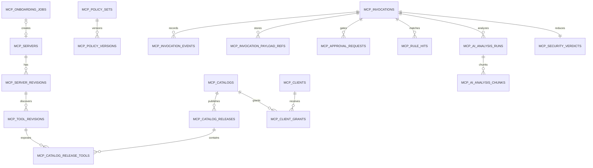

# Aegis V6.3 MCP 聚合平台 API、协议与数据库设计

- **依赖文档**：[MCP 聚合治理平台总体设计](mcp_aggregation_governance_platform_design_v6.3.md)
- **状态**：目标设计，尚未实现
- **迁移逻辑名建议**：`v6.3_mcp_platform_control_plane`、`v6.3_mcp_platform_audit_analysis`；
  实施时先检查并行 V6.3 migration，分配两个未占用的连续编号

## 1. 模块边界

### 1.1 新增服务与目录

```text
mcp-gateway/
  cmd/main.go
  internal/
    protocol/          # 2026-07-28 与旧版兼容
    downstream/        # Aegis 作为 MCP Server
    upstream/          # Aegis 作为 MCP Client
    catalog/           # 签名发布快照
    authn/             # OAuth audience/client/user
    policy/            # Grant/Policy/同步规则
    approval/          # 调用审批门禁
    audit/             # outbox、payload、Kafka
    transform/         # 输入约束、输出验证/脱敏
    transport/         # Streamable HTTP / legacy SSE adapter

api-server/internal/mcpplatform/
  server_service.go
  onboarding_service.go
  discovery_service.go
  review_service.go
  catalog_service.go
  release_service.go
  client_service.go
  grant_service.go
  policy_service.go
  approval_service.go
  invocation_query_service.go
  security_analysis_service.go
  bundle_signer.go

api-server/internal/api/handler/
  mcp_platform_server_handler.go
  mcp_platform_catalog_handler.go
  mcp_platform_client_handler.go
  mcp_platform_approval_handler.go
  mcp_platform_audit_handler.go

dc/internal/pipeline/mcp/
  invocation_consumer.go
  sequence_rule_engine.go
  risk_projector.go
```

V6.3 不要求立即拆独立代码仓库，但 `mcp-gateway` 必须是独立进程和镜像。本期不新增
`mcp-runner`，也不在任何服务中启动 stdio/local command。

## 2. 数据关系



所有表继续使用 UUID 主键和 `TIMESTAMPTZ`。对外展示使用随机 UUID/slug，不暴露自增 ID。

## 3. 控制面数据模型

### 3.1 `mcp_servers`

保存逻辑 Server 身份，不保存随发现变化的 Schema。

| 字段 | 类型 | 约束/说明 |
| --- | --- | --- |
| `id` | UUID | PK |
| `server_key` | VARCHAR(100) | 全局唯一稳定键，不使用自报 serverInfo.name |
| `display_name` | VARCHAR(160) | 管理页面名称 |
| `owner_team_id` | UUID | 必填 |
| `owner_user_id` | UUID | 必填，离职时必须转移 |
| `source_kind` | VARCHAR(32) | `internal/third_party/discovered_asset/builtin` |
| `environment` | VARCHAR(32) | `dev/test/staging/prod` |
| `transport` | VARCHAR(32) | `streamable_http/legacy_sse` |
| `endpoint_ciphertext` | BYTEA | endpoint 可能含敏感路径，受限保存 |
| `endpoint_display` | VARCHAR(255) | 脱敏 host/path |
| `credential_ref` | VARCHAR(255) | 只存 secret manager ref |
| `auth_type` | VARCHAR(32) | `none/oauth2/bearer/api_key/basic/mtls`；prod `none` 默认拒绝 |
| `network_policy_id` | UUID | SSRF/egress allowlist |
| `data_classification` | VARCHAR(32) | 最高数据等级 |
| `risk_tier` | VARCHAR(16) | `l1/l2/l3/l4` |
| `lifecycle_status` | VARCHAR(32) | 状态机值 |
| `active_revision_id` | UUID | 当前被允许引用的 Revision，可空 |
| `legacy_source_id` | VARCHAR(100) | v6.0 迁移关联，可空 |
| `created_by/updated_by` | UUID | 操作者 |
| `created_at/updated_at/deleted_at` | TIMESTAMPTZ | soft delete；已发布对象不可物理删除 |

索引：`server_key UNIQUE`、`owner_team_id`、`lifecycle_status`、`risk_tier`、
`environment`、`legacy_source_id UNIQUE WHERE NOT NULL`。

### 3.2 `mcp_server_revisions`

一次协议发现和评审的不可变快照。

| 字段 | 说明 |
| --- | --- |
| `server_id` | 逻辑 Server |
| `revision_no` | Server 内单调递增，`UNIQUE(server_id, revision_no)` |
| `protocol_version` | 发现使用的版本 |
| `server_info_json` | 自报信息，标记 untrusted |
| `capabilities_json` | tools/prompts/resources/extensions/task 等 |
| `transport_snapshot_json` | endpoint digest、TLS、redirect、DNS/egress 事实 |
| `auth_snapshot_json` | issuer/audience/scopes/metadata digest，不含 secret |
| `discovery_digest` | canonical 全快照 digest，唯一漂移依据 |
| `compatibility_status` | `pass/degraded/fail` |
| `security_status` | `pending/pass/fail/quarantined` |
| `review_status` | `draft/submitted/approved/rejected/expired` |
| `valid_from/valid_until` | 评审有效期 |
| `created_at` | Revision 创建后不更新事实字段 |

### 3.3 `mcp_tool_revisions`

| 字段 | 说明 |
| --- | --- |
| `server_revision_id` | FK |
| `upstream_name` | 区分大小写的真实名称 |
| `upstream_title/description` | 原始不可信字段 |
| `input_schema_json/output_schema_json` | 完整 Schema |
| `schema_dialect` | 默认 JSON Schema 2020-12 或显式版本 |
| `upstream_annotations_json` | 原始 hints |
| `verified_annotations_json` | 平台审核结果 |
| `side_effect_class` | `read/write/destructive/external_effect/privilege` |
| `data_inputs_json/data_outputs_json` | 数据分类 |
| `resource_scope_schema_json` | 可约束的 tenant/project/path/host 等 |
| `timeout_ms/max_request_bytes/max_response_bytes` | 硬限制 |
| `idempotency_class` | `verified/unverified/non_idempotent` |
| `task_support` | `forbidden/optional/required` |
| `risk_tier` | Tool 独立风险下限 |
| `tool_digest` | canonical definition digest |
| `status` | `candidate/approved/rejected/quarantined/retired` |

`UNIQUE(server_revision_id, upstream_name)`。禁止用 JSONB 覆盖已发布 Tool Revision；任何变化
新建 Revision。

### 3.4 评审记录

`mcp_admission_reviews` 保存供应侧评审：

- `subject_type=server_revision|tool_revision`、`subject_id`；
- 自动检查摘要和 finding refs；
- required roles、quorum、separation-of-duties；
- reviewer、decision、reason、evidence refs、expires_at；
- `subject_digest`，防止审批后内容变化。

Owner 不能同时满足安全审批角色；L3/L4 至少两名不同人员。

### 3.5 `mcp_catalogs`

| 字段 | 说明 |
| --- | --- |
| `catalog_key` | 唯一 slug，形成 endpoint path |
| `display_name/description` | 用途说明 |
| `owner_team_id` | 目录 Owner |
| `environment/data_classification` | 目录边界 |
| `oauth_resource_uri` | 规范 resource URI，不能发布后静默改变 |
| `default_policy_set_id` | 默认策略 |
| `status` | `draft/active/suspended/retired` |

### 3.6 `mcp_catalog_releases` 与 `mcp_catalog_release_tools`

Release：

- `catalog_id`、`version`、`manifest_json`、`manifest_digest`；
- `policy_bundle_digest`、`signature`、`signing_key_id`；
- `review_status`、`published_at/by`、`supersedes_release_id`；
- `status=staged/active/rolled_back/revoked`。

Release Tool：

- `release_id`、`tool_revision_id`；
- `exposed_name`、审核后的 title/description/schema；
- `approval_mode`、`rate_limit_json`、`resource_constraint_json`；
- `request_transform_json`、`response_transform_json`；
- `display_order`；
- `UNIQUE(release_id, exposed_name)`。

`manifest_digest` 必须覆盖所有子项、顺序和 Policy digest。

### 3.7 `mcp_clients`

| 字段 | 说明 |
| --- | --- |
| `client_key` | Aegis 内唯一稳定键 |
| `oauth_client_id` | issuer 内唯一；只展示脱敏值 |
| `client_type` | `public/confidential/service` |
| `application_type` | `native/web` |
| `owner_team_id/owner_user_id` | 责任人 |
| `redirect_uris_json` | 精确匹配；localhost 只允许 native 开发 Client |
| `allowed_issuers_json` | issuer 绑定，禁止跨 issuer 复用注册 |
| `supported_protocols_json/capabilities_json` | 兼容判断 |
| `risk_tier/environment` | Client 风险 |
| `status` | `draft/approved/active/suspended/revoked` |
| `secret_ref/certificate_ref` | 不存 secret 明文 |
| `last_seen_at` | 使用状态 |

### 3.8 `mcp_client_grants`

| 字段 | 说明 |
| --- | --- |
| `client_id` | 必填 |
| `subject_type/subject_id` | user/group/service principal |
| `catalog_id` | 必填 |
| `pinned_release_id` | 可空；高风险建议固定 |
| `allowed_tool_ids_json/denied_tool_ids_json` | Tool Revision/alias 范围 |
| `resource_constraints_json` | tenant/project/host/path 等 |
| `parameter_constraints_json` | enum/range/regex/field deny |
| `scopes_json` | OAuth Scope 映射 |
| `approval_override` | 只能变严格，不能放宽 Release 下限 |
| `quota_json` | QPS、并发、日调用、字节、成本 |
| `purpose/ticket_ref` | 使用目的 |
| `valid_from/expires_at/status` | 生命周期 |
| `approved_by/approved_at` | 授权证据 |

有效 Grant 查询必须包含时间、Client/User 状态和 Catalog 状态，不能只查 `status=active`。

### 3.9 Policy

`mcp_policy_sets` 保存逻辑策略集；`mcp_policy_versions` 保存不可变策略文档：

- `version`、`language_version`、`source_json`；
- `compiled_bundle_ref/digest`；
- `test_report_json`、`shadow_report_json`；
- `status=draft/approved/published/revoked`；
- `signature/signing_key_id`。

Gateway 只加载 `published` 且签名有效的 bundle。

### 3.10 `mcp_onboarding_jobs`

驱动远程 Server 一键接入的异步状态机：

| 字段 | 说明 |
| --- | --- |
| `id` | Onboarding job ID |
| `idempotency_key` | 操作者范围内唯一，防止双击和重试重复创建 |
| `requested_by` | 发起人 |
| `display_name/owner_team_id/environment` | 接入请求 |
| `endpoint_ciphertext/endpoint_display` | 受限 endpoint 与脱敏展示值 |
| `credential_ref/auth_type` | 只引用 secret，不保存明文 |
| `target_catalog_id` | 可空；空值时只完成准入，不自动创建发布草稿 |
| `publish_policy` | `draft_only/auto_if_l1/always_require_review` |
| `status` | 接入状态机当前状态 |
| `progress_percent/current_step` | UI 进度 |
| `server_id/server_revision_id/release_id` | 各阶段生成对象，可空 |
| `risk_tier/auto_checks_json` | 自动检测结果摘要 |
| `error_code/error_summary` | 稳定错误，不保存上游敏感正文 |
| `attempt_count/next_retry_at` | 可恢复重试 |
| `created_at/started_at/completed_at` | 生命周期 |

约束：`UNIQUE(requested_by, idempotency_key)`。Job 通过 durable worker 执行，每个 step 在事务中
检查当前状态和已生成对象；重复消息只能继续或返回既有结果，不能重复生成 Revision/Release。

## 4. 调用、审批和审计数据模型

### 4.1 `mcp_invocations`

一行表示一个 JSON-RPC request/notification；`tools/call` 保存完整治理字段。

| 字段 | 说明 |
| --- | --- |
| `id` | 全局 invocation ID，在接收后立即生成 |
| `trace_id/span_id/parent_span_id` | W3C Trace Context |
| `client_request_id` | JSON-RPC id 的安全字符串表示 |
| `idempotency_key` | Client 提供或平台生成；与 subject/tool/args digest 联合使用 |
| `protocol_version/method/exposed_name` | MCP 事实 |
| `client_id/user_id/service_principal_id` | 身份链 |
| `catalog_id/catalog_release_id` | 发布事实 |
| `server_id/server_revision_id/tool_revision_id` | 上游事实 |
| `activity_id/activity_boundary` | explicit/inferred/window |
| `request_digest/effective_request_digest` | 四阶段关联 |
| `upstream_result_digest/delivered_result_digest` | 四阶段关联 |
| `policy_bundle_digest/policy_decision` | 决策事实 |
| `approval_status/approval_id` | 审批事实 |
| `status` | `received/denied/approval_required/dispatching/succeeded/tool_error/protocol_error/timeout/cancelled/quarantined` |
| `risk_status` | `pending/complete/degraded/failed` |
| `final_severity/final_score` | 综合结果，不覆盖原始规则/AI |
| `request_bytes/upstream_bytes/delivered_bytes` | 容量 |
| `gateway_latency_ms/upstream_latency_ms/total_latency_ms` | 性能 |
| `received_at/dispatched_at/completed_at` | 时间 |

分区：按 `received_at` 月分区。关键索引：

```text
(client_id, received_at DESC)
(user_id, received_at DESC)
(server_id, tool_revision_id, received_at DESC)
(catalog_id, final_severity, received_at DESC)
(activity_id, received_at ASC)
(trace_id)
(status, received_at DESC)
```

`idempotency_key` 不能全局唯一；使用 `UNIQUE(client_id, user_or_service, tool_revision_id,
idempotency_key)` 并设置时间窗/归档策略。

#### 4.1.1 当前实现字段边界与上下文状态

当前已落地的 MCP 运行时先保存 invocation 元数据、`request_digest`、`result_digest`、状态和
完成时间；参数与上游结果对象只在本次调用生命周期内提供给同步规则评估器。新调用的规则
证据写入 `mcp_rule_hits.evidence`，安全判定通过规则定义关联返回 `matched_rules`。

历史 invocation 如果没有四阶段上下文或脱敏 payload ref，API 必须返回空的 `matched_rules`，
并从 verdict evidence 读取 `historical_payload_unavailable`。不得使用规则当前版本对历史摘要
进行猜测性重放。

后续上下文增强可以复用 `mcp_invocation_payload_refs`，建议为每个阶段增加脱敏摘要、大小、
截断/抑制字段和保留状态；完整正文只进入受限加密对象，不能直接扩展列表 API 返回正文。

### 4.2 `mcp_invocation_events`

Append-only 事件：

```text
request_received
authentication_succeeded|failed
authorization_allowed|denied
policy_allowed|denied|transformed
approval_created|approved|rejected|expired
upstream_dispatched
upstream_result_received
result_transformed|quarantined|delivered
cancelled|timed_out
rule_matched
ai_queued|completed|failed
verdict_reduced
```

字段包含 `invocation_id`、`event_seq`、`event_type`、`event_time`、`actor_type/id`、
`summary_json`、`prev_hash`、`event_hash`。`UNIQUE(invocation_id, event_seq)`。

### 4.3 `mcp_invocation_payload_refs`

| 字段 | 说明 |
| --- | --- |
| `invocation_id` | FK |
| `stage` | `received_request/effective_request/upstream_result/delivered_result` |
| `view` | `raw_restricted/redacted_audit` |
| `object_key` | MinIO key，不在 URL 直接暴露 |
| `content_type/encoding/compression` | 解析信息 |
| `plaintext_digest/ciphertext_digest` | 完整性 |
| `wrapped_dek/key_version` | envelope encryption |
| `size_bytes/truncated/suppressed_fields_json` | 内容状态 |
| `retention_class/legal_hold` | 合规 |
| `created_at/expires_at` | 生命周期 |

`UNIQUE(invocation_id, stage, view)`。写 object、写 payload ref、发 outbox 需要可恢复的 saga；
不能先向 Client 返回成功再完全不留审计证据。

上下文阶段与 MCP 协议的对应关系如下：

| 阶段 | 最小可审计字段 | 规则用途 |
| --- | --- | --- |
| `received_request` | protocol version、method、tool alias、脱敏参数摘要、request digest | pre 参数和授权规则 |
| `effective_request` | 上游工具名、策略变换摘要、上游身份引用、digest | 证明实际发送内容 |
| `upstream_result` | 成功/错误状态、结果大小、脱敏结果摘要、result digest | post 输出和失败规则 |
| `delivered_result` | 交付状态、隔离/裁剪标志、交付 digest | 证明 Client 实际收到的内容 |

Token、Authorization、密码、私钥和 API key 的值必须在进入持久化、Kafka、日志、前端或 AI
输入前抑制。上下文缺失时记录证据缺口，不把缺失解释为安全。

### 4.4 `mcp_approval_requests`

字段对应总体设计中的绑定对象，另含：

- `approval_type=user_confirmation/org_approval/break_glass`；
- `required_roles_json/quorum`；
- `state=pending/approved/rejected/expired/invalidated/executed`；
- `request_state_ciphertext`，用于 MRTR/Task 恢复；
- `decision_events_json` 或独立 child table；
- `executed_invocation_id`，保证一次批准最多触发一次非幂等执行。

### 4.5 Kafka Outbox

`mcp_invocation_outbox`：

- `event_id`、`invocation_id`、`event_type`；
- `payload_json` 只含摘要和 object refs；
- `partition_key=activity_id`，缺失时使用 invocation ID；
- `publish_status/attempts/next_retry_at/published_at`；
- `UNIQUE(event_id)`。

Gateway 本地 durable outbox 可使用专用 PostgreSQL schema；跨区域时每区域独立 outbox，
DC 以 `event_id` 幂等。

## 5. 安全分析模型

### 5.1 `mcp_rule_definitions` 与 `mcp_rule_hits`

Rule Definition：`rule_key`、`version`、`phase`、`severity`、`matcher_type`、
`definition_json`、`required_evidence_json`、`default_action`、`enabled`、`digest`。

Rule Hit：

- `invocation_id/activity_id`、`rule_definition_id`；
- `phase=pre/post/sequence`；
- `severity/action/decision`；
- `evidence_refs_json`，引用 event/payload stage/JSON Pointer/字符区间；
- `match_summary`、`engine_version`、`created_at`；
- 幂等键：`rule_version + invocation/activity + canonical evidence digest`。

### 5.2 `mcp_ai_analysis_runs` 与 chunks

Run：

- `scope=invocation/activity`、`scope_id`；
- `trigger=all_calls/rule_escalation/manual/retry`；
- `status=queued/running/completed/failed/inconclusive`；
- `model_config_id/model_name/provider`；
- `prompt_version/redactor_version/chunker_version/schema_version`；
- `input_digest`、`verdict`、`score`、`confidence`；
- `categories/findings/uncertainties` JSON；
- `input_tokens/output_tokens/duration_ms/error_code`；
- `created_at/started_at/completed_at`。

Chunk：`run_id`、`chunk_index`、`input_refs_json`、`input_digest`、`token_estimate`、
`status`、`result_json`、provider usage 和错误。超长结果按 content block/JSON item 边界切分，
不在 UTF-8 字符或 JSON token 中间切断。

### 5.3 `mcp_security_verdicts`

保存综合结果：

- `scope_type=invocation/activity`、`scope_id UNIQUE`；
- `admission_floor/rule_severity/ai_severity/sequence_severity/completeness_floor`；
- `final_severity/final_score`；
- `rule_hit_ids/ai_run_ids`；
- `status=complete/pending/degraded/failed`；
- `reducer_version/evidence_digest/updated_at`。

综合表是读模型，不删除底层规则或 AI 结果。

## 6. MCP 下游协议

### 6.1 Endpoint

```text
POST https://<aegis-host>/mcp/v1/catalogs/{catalog_key}
GET  https://<aegis-host>/.well-known/oauth-protected-resource/mcp/v1/catalogs/{catalog_key}
```

MCP `2026-07-28` 的现代 endpoint 只接受 POST；单次流式响应和 `subscriptions/listen` 都由
对应 POST response 返回 SSE。对旧版 Streamable HTTP/HTTP+SSE 的 GET/DELETE 支持放在独立的
兼容路由和适配器中，不能改变现代 endpoint 的无会话语义。

Nginx/WAF 只做 TLS、body/header 基础限制、Origin 和连接保护；最终协议 Header/Body、
Token audience、Catalog 和 Tool 授权必须由 Gateway 重验。

### 6.2 `server/discover`

返回 Catalog 级能力，不暴露上游 endpoint：

```json
{
  "serverInfo": {"name": "aegis-secops-readonly", "version": "6.3"},
  "capabilities": {"tools": {"listChanged": true}},
  "_meta": {
    "com.aegis/catalogRelease": "2026.08.11.1",
    "com.aegis/policyDigest": "sha256:..."
  }
}
```

Client-specific authorization只影响有效工具集合；Catalog release 事实本身不随连接变化。

### 6.3 `tools/list`

- 按 `exposed_name` 确定性排序；
- 支持 opaque cursor；cursor 绑定 user/client/catalog/release/filter，过期或主体变化拒绝；
- `cacheScope=private`，除非 Catalog 明确与身份无关；默认 TTL 60 秒；
- 只返回审核后说明和 Schema；
- unentitled tool 隐藏，不返回“存在但禁止”的旁路信息；
- 若 Revision 被 suspended，立即从列表移除并发布 list changed；
- `_meta.com.aegis` 不包含上游 endpoint、credential ref 或内部网络信息。

### 6.4 `tools/call`

必须校验：

```text
MCP-Protocol-Version
Mcp-Method == body.method == tools/call
Mcp-Name == params.name
Mcp-Param-* == inputSchema x-mcp-header 对应的 arguments 值
Content-Type / Accept / Origin
_meta clientInfo/clientCapabilities
Authorization audience/issuer/scope
JSON Schema / size / depth / resource constraint
```

Gateway 在参数变换前校验下游 `Mcp-Param-*` 与 Client body；形成 Effective Request 后，按固定
Tool Revision 的 `x-mcp-header` 重新生成上游 Header，不能把未经验证的 Client Header 原样透传。

返回错误分层：

| 场景 | 表现 |
| --- | --- |
| JSON-RPC/协议/未知工具 | JSON-RPC protocol error |
| 输入 Schema/业务/上游错误 | tool result `isError=true` |
| 身份失败 | HTTP 401 + OAuth challenge |
| 授权失败 | HTTP 403 或不泄露工具存在性的统一错误 |
| 审批需要 | InputRequired/Task/结构化 approval required |
| 结果隔离 | `isError=true` + `AEGIS_RESULT_QUARANTINED`，不返回原始正文 |

Gateway 不把内部 Policy、规则表达式、上游错误堆栈或 endpoint 返回 Client。

### 6.5 上游映射

映射键是 `catalog_release_tool_id -> tool_revision_id -> server_revision_id -> upstream_name`。
绝不根据 Client 提交的前缀字符串临时拆解 endpoint/tool。上游返回必须与发送时固定 Revision
对比；发现 runtime drift 时停止该实例并触发 quarantine。

## 7. 控制面 HTTP API

所有接口位于 `/api/v1/mcp-platform`，响应沿用 Aegis 统一 envelope、cursor/page 规范和错误码。

```text
GET    /overview
```

`overview` 返回当前操作者数据范围内的远程 Server、已发布 Tool、有效 Client、待本人审批和
24 小时高危调用计数，并包含各计数的 `updated_at` / `unavailable` 状态。该接口不返回 endpoint、
credential、payload 或高基数明细，供“MCP 聚合管控”单页首屏使用。

### 7.1 Server/Tool

```text
POST   /onboarding-jobs
GET    /onboarding-jobs
GET    /onboarding-jobs/{job_id}
POST   /onboarding-jobs/{job_id}/retry
POST   /onboarding-jobs/{job_id}/cancel
GET    /servers
POST   /servers
GET    /servers/{server_id}
PUT    /servers/{server_id}
POST   /servers/{server_id}/discover
POST   /servers/{server_id}/test
POST   /servers/{server_id}/submit-review
POST   /servers/{server_id}/suspend
POST   /servers/{server_id}/retire
GET    /servers/{server_id}/revisions
GET    /server-revisions/{revision_id}
GET    /server-revisions/{revision_id}/diff/{other_revision_id}
GET    /server-revisions/{revision_id}/tools
GET    /tool-revisions
GET    /tool-revisions/{tool_revision_id}
PUT    /tool-revisions/{tool_revision_id}/review-metadata
POST   /tool-revisions/{tool_revision_id}/submit-review
```

`POST /onboarding-jobs` 是“一键接入”入口，请求包含 remote endpoint、credential ref、Owner、
environment、目标 Catalog 和 publish policy，并要求 `Idempotency-Key`。`discover/test` 也都是
异步 operation；HTTP handler 不得等待上游完成。

```json
{
  "display_name": "production-github",
  "endpoint_url": "https://mcp.example.com/mcp",
  "auth_type": "oauth2",
  "credential_ref": "credential-uuid-or-empty",
  "owner_team_id": "team-uuid",
  "environment": "prod",
  "target_catalog_id": "catalog-uuid",
  "publish_policy": "auto_if_l1"
}
```

若 OAuth 尚未授权，响应返回 `status=awaiting_auth` 和只对当前操作者有效的短期授权流程 ID；
OAuth callback 校验 state、PKCE 和 issuer 后唤醒原 Job。API key/bearer/mTLS 私密材料使用独立
一次性 Secret 写入接口，onboarding 请求和数据库只携带 `credential_ref`。

### 7.2 评审与发布

```text
GET    /admission-reviews
POST   /admission-reviews/{review_id}/approve
POST   /admission-reviews/{review_id}/reject

GET    /catalogs
POST   /catalogs
GET    /catalogs/{catalog_id}/snapshot
GET    /catalogs/{catalog_id}
PUT    /catalogs/{catalog_id}
POST   /catalogs/{catalog_id}/releases:validate
POST   /catalogs/{catalog_id}/releases
GET    /catalogs/{catalog_id}/releases
GET    /catalog-releases/{release_id}
GET    /catalog-releases/{release_id}/diff/{other_release_id}
POST   /catalog-releases/{release_id}/submit-review
POST   /catalog-releases/{release_id}/publish
POST   /catalogs/{catalog_id}/rollback
```

`publish` 要求请求携带 `expected_manifest_digest`，防止 UI 查看后对象已变化。

### 7.3 Client/Grant

```text
GET    /clients
POST   /clients
GET    /clients/{client_id}
PUT    /clients/{client_id}
POST   /clients/{client_id}/activate
POST   /clients/{client_id}/suspend
POST   /clients/{client_id}/revoke
POST   /clients/{client_id}/credentials:rotate

GET    /grants
POST   /grants
GET    /grants/{grant_id}
PUT    /grants/{grant_id}
POST   /grants/{grant_id}/approve
POST   /grants/{grant_id}/revoke
POST   /grants:simulate
```

Credential rotate 只返回一次性 secret delivery handle 或完成状态，不在普通 JSON response 中
回显 secret。

### 7.4 Runtime Approval

```text
GET    /approvals
GET    /approvals/{approval_id}
POST   /approvals/{approval_id}/approve
POST   /approvals/{approval_id}/reject
POST   /approvals/{approval_id}/cancel
```

approve 请求必须含 `expected_request_digest`、reason 和二次认证上下文；L4 使用 quorum，单次
POST 只形成一个 approver decision，不直接在未满足 quorum 时变为 approved。

### 7.5 Audit/Security

```text
GET    /invocations
GET    /invocations/{invocation_id}
GET    /invocations/{invocation_id}/events
GET    /invocations/{invocation_id}/payloads/{stage}?view=redacted_audit
POST   /invocations/{invocation_id}/payload-reveal-requests
GET    /activities/{activity_id}
GET    /activities/{activity_id}/graph
GET    /rule-hits
GET    /ai-analysis-runs
POST   /invocations/{invocation_id}/ai-analysis:retry
GET    /security-verdicts
```

列表永不包含 raw payload。payload read 使用短期流式下载，禁止生成可长期转发的公开 URL。

## 8. RBAC

```text
mcp:onboarding:read
mcp:onboarding:create
mcp:onboarding:operate
mcp:server:read
mcp:server:write
mcp:server:discover
mcp:server:review
mcp:catalog:read
mcp:catalog:write
mcp:catalog:publish
mcp:client:read
mcp:client:write
mcp:grant:write
mcp:approval:read
mcp:approval:decide
mcp:invocation:read
mcp:audit:payload:read
mcp:security:read
mcp:security:ai:retry
mcp:policy:read
mcp:policy:write
mcp:policy:publish
mcp:break_glass
```

约束：

- `mcp:server:write` 不包含 `review`；Owner 不审批自己的 Revision；
- `mcp:onboarding:create` 只能引用操作者可使用的 Owner team、Credential 和 Catalog；
  `operate` 只能 retry/cancel，不能绕过 admission/release approval；
- `mcp:catalog:write` 不包含 `publish`；
- `mcp:approval:read` 只允许查看数据范围内的审批，不能形成 approver decision；
- `mcp:invocation:read` 只看元数据和脱敏摘要；
- payload reveal、Break-glass、credential rotate 均要求二次认证；
- Assistant `full_access`、系统 admin 或上层通配权限不能隐式获得这些细粒度权限；
- 数据/tenant scope 必须在 Repository 查询中生效，不能只在前端隐藏。

## 9. Kafka 事件契约

Topic：

```text
aegis.mcp.invocations.v1
aegis.mcp.catalog.changes.v1
aegis.mcp.security.findings.v1
```

调用事件 envelope：

```json
{
  "schema_version": "mcp-invocation-event.v1",
  "event_id": "uuid",
  "event_type": "invocation_completed",
  "event_time": "RFC3339Nano",
  "invocation_id": "uuid",
  "activity_id": "uuid",
  "trace_id": "hex",
  "client_id": "uuid",
  "user_id": "uuid-or-null",
  "catalog_release_id": "uuid",
  "server_revision_id": "uuid",
  "tool_revision_id": "uuid",
  "status": "succeeded",
  "policy_decision": "allow",
  "request_digest": "sha256:...",
  "result_digest": "sha256:...",
  "payload_refs": ["opaque-object-ref"],
  "data_classifications": ["internal"],
  "integrity": {"truncated": false, "missing_stages": []}
}
```

- 不包含 endpoint、credential、Authorization、cookie 或无限正文；
- producer 以 event ID 幂等，consumer 保存已处理 event ID；
- `activity_id` 作为首选 partition key 以保持调用链局部有序；
- 跨 partition 不假设全局顺序，使用 event_time + event_seq + trace 归并；
- schema 新字段向后兼容，破坏性变化发布新 topic/version。

## 10. 配置

```yaml
mcp_platform:
  enabled: false
  gateway:
    public_base_url: "https://aegis.example.com"
    accepted_protocol_versions: ["2026-07-28", "2025-11-25", "2025-06-18"]
    max_request_bytes: 1048576
    max_response_bytes: 10485760
    max_json_depth: 64
    policy_bundle_ttl_seconds: 300
    audit_outbox_max_bytes: 1073741824
  upstream:
    connect_timeout_seconds: 5
    default_timeout_seconds: 30
    max_redirects: 0
    dns_recheck: true
  audit:
    payload_capture_enabled: true
    raw_retention_days: 30
    redacted_retention_days: 180
    object_lock_enabled: false
  analysis:
    rules_enabled: true
    ai_enabled: false
    ai_all_calls: true
    max_queue_delay_seconds: 300
```

生产启动时若 payload capture、encryption key、Policy verify key 或 OAuth resource metadata
缺失，Gateway 健康检查必须失败，不能退化为无审计代理。

## 11. v6.0 数据迁移

1. 新表和新服务先部署，旧 `/assistant/mcp-sources` 继续可读；
2. 将每条 `external_mcp_sources` 导入为 `mcp_servers`，状态固定为 `draft`，保存
   `legacy_source_id`；
3. `allowed_tool_names/schema_cache` 只作为候选材料，不创建 approved Tool Revision；
4. 对旧 source 执行真实 MCP discover/test，生成新 Revision；
5. 人工评审、创建 `aegis-assistant-external-readonly` Catalog 和专用 Grant；
6. Assistant 查询切到 Gateway 后进行双写审计对账，禁止双执行上游调用；
7. 旧 `external_mcp_query_logs` 保持只读历史，不迁移伪造缺失的 raw result；
8. 所有生产 Client 切到 Gateway 并验证无旁路后，旧写 API 返回 deprecation error；
9. 至少一个发布周期后再移除旧执行路径，表不在 v6.3 物理删除。

`tools/aegis-mcp` 的远程 Streamable HTTP 部署形态通过 `/onboarding-jobs` 按普通远程 Server
接入；stdio 仅保留开发兼容模式，不进入平台准入路径。

## 12. 保留、删除与回滚

- Catalog Release、Admission Review、Invocation、Approval、Rule Hit 和 AI Run 只追加/状态变化，
  不允许级联删除历史；
- Server/Client 删除使用 retire/revoke；引用历史 Invocation 的 Revision 永久保留最小元数据；
- payload 按 retention 到期由合规 worker 删除 object，并写 tombstone event；
- legal hold 覆盖 retention；
- 回滚数据库时先暂停受影响 Server/Tool/Catalog/Grant 并切回上一签名 Release；
- MCP 平台的两个 migration 只新增对象，回滚不自动 DROP 含审计数据的表；物理清理由单独
  审批脚本完成；
- Gateway Release 回滚到最后一个已签名镜像和 Catalog/Policy bundle，不能回滚到未签名草稿。
