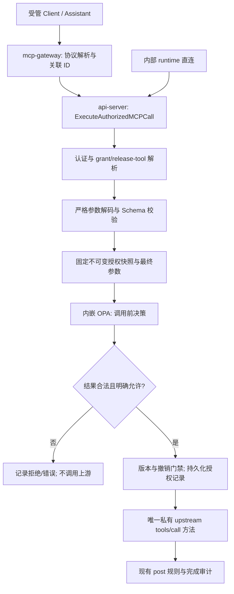

# Aegis V6.3 MCP 调用前 OPA 授权设计

- 日期：2026-09-16；状态：设计提案，尚未实现。
- 代码基线：`develop @ 312a62110a921c154aba88216aa1828abd53c3b0`。
- 需求：对 MCP 网关调用，按可信身份、已发布工具、最终参数决定是否允许执行。
- 文档归属：V6.3 MCP 聚合专项；V6.4 当前主题是独立的 Skill 安全，不据目录数字迁移本专项。
- 本次交付仅为代码排查与设计，不改业务代码、不提交或推送。本文中“新增”“目标”均不代表现有能力。

## 1. 推荐决策与成功标准

**在 api-server 的统一 MCP 执行入口内嵌 OPA Go 求值器，保留 mcp-gateway 作为协议入口；先补齐可信上下文、release 工具解析和参数校验，再让 OPA 执行受控规则包的调用前授权。**

本期只允许平台提供的 Rego 模板与管理员填写的有界结构化规则数据，不开放上传任意 Rego。原有 credential、grant、工具发布状态与 SSRF 防护仍由 Go 执行；OPA 不能覆盖这些拒绝。确定性拒绝优先，只有完整、合法的 `allow: true` 才能调用上游。认证失败、参数非法、策略无结果、故障及过期版本都不放行。

验收结果：

1. 所有受管 `tools/call`，包括直接访问内部 runtime API，均经过同一授权入口；调用前硬门禁或 OPA 拒绝/故障场景，上游调用次数严格为 0。现有 post block 发生在上游调用后，不适用此断言。
2. 同一请求固定 credential/client、grant、release-tool、tool revision、schema、参数与策略 revision；审计能够说明依据哪个版本放行或拒绝。
3. 服务身份来自数据库验证过的 credential；用户身份只来自受信认证链。客户端参数、工具描述、模型推断和旧 `operator` 字段不能提升权限。
4. 规则可表达 client/可信用户限制、固定工具版本限制、参数字段存在性、类型、枚举、范围、字符串与资源集合限制；不依赖 LLM 同步判断。
5. 策略更新具有校验、测试、签名、版本、原子激活、故障保留与显式回滚；多副本不能以未获授权的旧策略继续接收新调用。

不纳入 MVP：配额/QPS 业务控制、跨调用关联、调用审批工作流扩展、响应扫描/改写、流式响应阻断、主机封禁、Agent/DC 改造。现有 post 规则继续执行，但不归入本次 OPA 调用前决策；调用前允许不等于响应安全，也不能撤销已经发生的上游副作用。

## 2. 当前实际执行与缺口

以下路径和行号固定对应本基线提交；后续实现时应重新核对。代码行为优先于既有总体文档的目标描述。

| 事实 | 可追溯代码位置 | 对方案的影响 |
| --- | --- | --- |
| 网关接收 client endpoint 的 Bearer 和 `tools/call`，将 alias/arguments 转发到 api-server | `mcp-gateway/cmd/mcp-gateway/main.go:187–315` | 当前网关进程没有独立策略执行器，不能仅在这里增加检查 |
| 内部 runtime 路由绕过普通 JWT 中间件，handler 检查共享 secret 与 Bearer | `api-server/internal/api/router.go:96–118`；`api-server/internal/api/middleware/middleware.go:66–87`；`api-server/internal/api/handler/mcp_platform_handler.go:427–441` | 直连 API 仍须受到统一服务层授权；共享 secret 不是终端用户认证 |
| token 哈希查 credential，再解析 active client/grant/release、server published 与 active revision 指针 | `api-server/internal/service/mcp_platform_service.go:1517–1552`；`api-server/internal/repository/mcp_platform_repo.go:546–552` | 复用服务身份与授权边界；明确校验工具/revision 发布关系，不能把 server 状态描述成已检查 revision.status |
| `RuntimeCallAs` 先查 grant alias 与 approved tool，再执行 pre 规则，上游调用后执行 post 规则 | `api-server/internal/service/mcp_platform_service.go:1587–1674` | 已有真实阻断，OPA 是替换/增强调用前规则能力，不是首次引入 enforcement |
| runtime 从 server revision 全量工具解析 alias，没有经 release-tool 映射 | `api-server/internal/service/mcp_platform_service.go:1551,1595–1602`；对照 `api-server/internal/model/mcp_platform.go:198–219` | 当前 grant alias 可引用未纳入 release 的 approved 工具；OPA 前必须修复 |
| 参数仅检查 JSON object 与 1 MiB 大小，没有执行工具 JSON Schema | `api-server/internal/service/mcp_platform_service.go:1603–1619` | 必须针对已固定的 schema 校验，不能让策略判断与实际执行对象不同 |
| Assistant HMAC context 只提取 operator，缺时效/nonce/用户认证绑定；代码注释明确它仅为审计元数据 | `api-server/internal/api/handler/mcp_platform_handler.go:394–415`；`api-server/internal/assistant/mcp_gateway_client.go:170–192` | 不能把该 operator 升级成可信用户 principal；缺失时 client key 写入 UserID 也不等于真实用户 |
| 规则是 Go matcher；`block` 命中才阻断；坏 JSON warning 后跳过，未知 matcher 无命中且静默跳过 | `api-server/internal/service/mcp_platform_service.go:1677–1805` | 现状不是 OPA；目标把配置错误提前挡在发布阶段，运行时异常阻断 |
| policy set/version 表及 bundle/digest/signature 字段已存在，未发现对应执行链 | `api-server/internal/model/mcp_platform.go:263–296`；`migrations/033_v6.3_mcp_platform_control_plane.sql` | 可扩展这些结构，不宣称已有编译、签名加载或策略发布 |
| invocation 在选定工具及基础参数检查后才创建；early deny 无完整调用记录 | `api-server/internal/service/mcp_platform_service.go:1620–1629`；`api-server/internal/repository/mcp_platform_repo.go:618–693,792–805` | 增加调用尝试与授权决策审计，避免只记录执行成功后的路径 |
| 旧 snapshot endpoint 的 `tools/call` 固定拒绝；默认未开启 managed Assistant 时仍注册 ExternalMCP 工具 | `mcp-gateway/cmd/mcp-gateway/main.go:133–185`；`api-server/cmd/main.go:635–679` | snapshot 不应新增独立执行能力；旧 ExternalMCP 查询当前为空结果占位，不误称其正在真实绕过执行上游 |
| 上游连接已做 endpoint/解析/redirect 限制；网关默认 `ListenAndServe`，TLSConfig 不会自动开启 TLS | `api-server/internal/service/mcp_platform_service.go:521–623`；`mcp-gateway/cmd/mcp-gateway/main.go:53–91`；`docker-compose.yml:321–358` | 保留 SSRF 校验；生产需网关 TLS 终止与内部路由网络限制，OPA 不负责传输认证 |

既有 V6.3 文档已提出严格 release alias、动态 schema、可信用户上下文等目标，详见 [聚合治理总体设计](mcp_aggregation_governance_platform_design_v6.3.md) 与 [Assistant 聚合集成设计](assistant_mcp_aggregation_integration_design_v6.3.md)。本文收敛到调用前授权，不把其中所有长期能力并入本期。

## 3. 目标调用链与唯一执行点



将 `RuntimeCall`/`RuntimeCallAs` 收敛为新服务方法的兼容包装；handler、Assistant 和后续接入方不持有可绕过的业务 `tools/call` 方法。发现/健康检查仍可使用 MCP `initialize`/`tools/list`，但不允许通过公共通用 RPC 函数接受任意客户端 method。调用上游的私有函数接受服务内部构造的 `AuthorizedCall`，其字段不从 HTTP 反序列化。

执行顺序：

1. 生成 server-side `attempt_id`/`decision_id`，解析有界 envelope；解析失败也产生安全的结构化事件。
2. 验证入口共享凭据/受信网络链路及 client credential，读取可信 client/grant；记录 credential ID，绝不记录 token。
3. 由 grant 的 catalog 获取 active release，按 `(release_id, exposed_name)` 唯一解析 release-tool，关联指定 tool/server revision。禁止用客户端 upstream name、URL 或另一个 release 的 alias 兜底。
4. 验证 grant exact alias、release-tool active、tool approved、revision 与 server active 状态；无效 schema、缺失发布记录或重复 alias 均拒绝。
5. 构建不可变 `EffectiveCall`，严格解码与验证最终参数；产生精确待发送 bytes/digest。默认不注入 schema default、不强制类型转换、不偷偷删除字段。
6. 选择该作用域的策略部署版本、读取已准备的内存快照，构造固定 schema 的 input，在请求 deadline 内执行一次 named decision。
7. 严格验证 decision，只有明确允许才进入最终 DB 授权门禁。该事务验证期望 deployment generation、grant/credential/release/server 的版本与有效期，持久化允许记录及关联信息，然后提交。
8. 事务提交是调用获准的线性化点；提交前发生的撤销/发布变化必须阻止旧快照获准，变化后不以旧结果重试。已获准或已在上游执行的调用可完成，不能承诺撤销既有副作用。超长排队不得发生在门禁之后；超时则重新从认证开始。
9. 用同一 `EffectiveCall` 的工具和参数调用上游一次；继续既有 post 流程与完成审计。网络错误不可自动重放可能有副作用的调用。

发布/撤销事务与授权门禁锁定同一部署/授权记录或等价版本栅栏，锁顺序固定。不能仅“先查 epoch、无条件记 allow”然后声称具备并发撤销保证。endpoint 或 credential ref 的变更也须有版本号；连接处继续执行 SSRF 校验，不把连接安全转交给 Rego。

`tools/list` 使用相同 credential/grant/release-tool 解析器，并应用同版本策略的身份/工具可见性入口。此入口不假装知道未来参数：参数依赖规则留到 call 时评估。列表是有条件可调用的候选集合，列出不构成后续放行承诺；不能用 `{}` 去跑 call 策略导致所有带必填参数的工具消失。缺失策略时返回服务不可用，不返回未经授权的全量列表。客户端缓存旧列表时，call 始终重新验证。

旧 `ExternalMCP.Query` 保持历史记录可读，执行注册下线或适配到统一入口后才开放；不得为保留旧界面恢复直接连接。snapshot 调用入口继续拒绝。

## 4. 身份、工具与参数的可信边界

### 4.1 身份

MVP 必有 **service principal**：由 token 哈希命中的 credential → client ID，并验证 client key 绑定、active、expiry 和 grant。`client_key` 是展示/路由标识，授权使用不可变 client ID。现有模型没有通用 tenant 字段，本期不从 header 虚构租户；若需多租户，要另行引入可信 tenant 关联与全链路隔离。

用户级规则需要 **delegated user principal**，按两步实现：

- 首个切片支持可信 client 身份；要求用户身份的策略在 `user.verified=false` 时明确拒绝。旧 `operator` 可作为 `unverified_actor_hint` 审计字段，不能进入授权主体。
- 随后在已验证 JWT 的 Assistant 调用上下文中，由服务端构造短时 delegation：`issuer/audience/sub/client_id/iat/exp/jti/request_digest`，绑定实际已认证用户和最终调用内容，使用独立密钥签名。runtime 验证固定算法、受信 issuer/audience、client、时效、单次 jti，并从权限库重新解析用户 active 与角色。建议有效期 30 秒、允许时钟偏差 5 秒；防重放存储不可用则拒绝需要 delegation 的调用。先确定最终参数再签摘要；任何服务端规范化必须采用相同契约。

独立签名凭据不授予 mcp-gateway；持有网关共享 secret 的入口方不能伪造用户。将 operator 从聊天文本或模型 tool arguments 复制进 token 不构成认证。外部客户端没有受信用户 delegation 时只获得 client 权限；不得用用户缺失触发更宽松的人类用户默认角色。服务账号规则与要求真实用户的规则由发布配置显式区分。

### 4.2 固定工具标识

策略主键使用 `catalog_release_id + release_tool_id + tool_revision_id`，并保留 `server_revision_id`、schema digest 与 exposed alias 供解释。工具风险等级使用平台审核的 revision 元数据，不使用上游自报注释或 LLM 的风险评价。新 release、新 schema、新风险信息不继承针对旧 revision 的放行，发布时显式重新绑定并测试。

先用 release-tool 的公开 schema 校验，再按固定 tool revision 的上游 schema 校验；发布时应保证两者相同或显式定义收窄关系，MVP 直接要求 digest 相同。错误配置不得运行时任选一个 schema。工具描述和调用正文不参与可信身份判定。

### 4.3 最终上游参数

- 对 JSON 使用保留数字精度的 decoder；拒绝重复键、尾随 JSON、非对象、超深/超节点结构；HTTP 网关与 API 内部入口都设 body 上限，直连不能跳过。
- 校验 `required/type/enum/范围/字符串/数组/对象` 等所支持 dialect 的约束。工具 schema 在发现/发布阶段完成编译；固定支持的 dialect，禁止联网解析 `$ref`，不支持的 dialect/关键字组合不得静默通过发布。
- `additionalProperties` 按 schema 本身语义执行；若要禁止未知字段，在发布 schema/工具参数规则中显式收窄，不谎称 JSON Schema 默认禁止未知字段。
- 缺省 arguments 可按 MCP 历史行为规范化成 `{}`，随后仍执行 schema 与策略。缺字段、`null`、`false`、`0`、空字符串和空数组必须区分，不能使用字符串化或 Go 零值兜底。
- MVP 不做参数重写。若将来加入默认值/受控转换，必须在构造 policy input 前完成，并对转换后的对象重新执行 schema；授权之后不可修改参数或工具。
- OPA 接收需要判断的最终 arguments 对象，内容可能敏感，只存在评估内存中；不得在输入中加入 token、upstream credential、整个会话或无关响应。不能为脱敏先把授权依赖参数改成 `***` 再判断。
- `path/url/project_id` 等比较必须使用与工具语义一致的受控校验器；拒绝危险歧义编码和重复解码，不以字符串前缀模拟文件系统目录约束。路径字符串检查不能证明远端符号链接后的实际文件位置，远端工具仍须自身授权。

## 5. Policy input 与严格 decision 契约

### 5.1 输入 v1

示例 ID 为文档简写；生产以实际不可变 ID 填充。所有顶层身份、工具、时刻、grant 和 snapshot 字段由服务端构造；只有 `arguments` 是经过验证但仍不可信的业务数据。

```json
{
  "contract_version": "aegis.mcp.authz.input.v1",
  "operation": "tools/call",
  "request": {"attempt_id": "attempt-example", "decision_id": "decision-example", "received_at_unix_ms": 1789516800000},
  "principal": {
    "client_id": "client-secops",
    "credential_id": "credential-17",
    "user": {"verified": false, "id": "", "roles": []}
  },
  "grant": {"id": "grant-23", "version": 4, "resource_scope": {"project_ids": ["project-a"]}},
  "tool": {
    "catalog_release_id": "release-7",
    "release_tool_id": "release-tool-11",
    "tool_revision_id": "tool-revision-9",
    "server_revision_id": "server-revision-5",
    "exposed_name": "secops.search",
    "upstream_name": "search",
    "input_schema_digest": "sha256:example",
    "risk_tier": "l2"
  },
  "arguments": {"project_id": "project-a", "limit": 20},
  "snapshot": {"deployment_generation": 12, "policy_revision": "policy-42"}
}
```

Go 先验证 input DTO 完整性与类型；禁止额外顶层属性，并复制冻结嵌套结构，避免共享 map 被并发修改。grant 中 `resource_scope` 必须是发布时验证过的受控结构，不能无界地把旧 JSON 数据直接注入。示例要求项目范围字段；未配置范围不是“所有项目”，由策略明确决定拒绝或使用显式全局范围许可。

### 5.2 输出 v1

唯一决策路径：`data.aegis.mcp.authz.decision`；返回一个对象：

```json
{
  "contract_version": "aegis.mcp.authz.decision.v1",
  "allow": false,
  "reason_code": "POLICY_DENIED",
  "deny_rule_ids": ["parameter.project_scope"],
  "audit_rule_ids": [],
  "policy_revision": "policy-42"
}
```

固定 6 个必需字段，不允许额外字段：

| 字段 | 约束 |
| --- | --- |
| `contract_version` | 精确等于 v1 常量 |
| `allow` | 必须是 JSON boolean，缺失/null/`"true"`/1 均错误 |
| `reason_code` | `POLICY_ALLOWED` 或 `POLICY_DENIED`；与 allow 一致 |
| `deny_rule_ids` | 唯一、排序的 string 数组，≤64 项，ID ≤128 bytes；allow 时必须为空，deny 时至少一项 |
| `audit_rule_ids` | 同样有界的 ID 数组，不影响放行 |
| `policy_revision` | 非空且精确匹配当前所持快照，不信任策略自报其他版本 |

先做结构/大小与键存在检查，再解析成 typed Go DTO；不能仅 `json.Unmarshal` 到 `bool` 后把缺字段当 `false` 掩盖契约错误。总输出上限建议 16 KiB，不返回用户参数或自由文本 reason。命中超过上限用预定义 `RULE_HIT_LIMIT` 拒绝并标记统计，不为缩短结果丢弃阻断项。限额是初始工程预算，需基准校准。

应用层补充 `decision_id/attempt_id/policy_digest/deployment_generation/elapsed/outcome`；策略返回值不能决定最终 version、HTTP 状态、网络目标或参数改写。OPA 的底层 query 必须恰有一个表达式结果且为该对象；0 个、多结果、undefined、null 都是决策故障。Go SDK 对 undefined 报错；若以后使用 Data API，HTTP 200 但无 `result` 同样是故障，不能当允许。[OPA REST API](https://www.openpolicyagent.org/docs/rest-api)、[官方 SDK 实现](https://github.com/open-policy-agent/opa/blob/main/v1/sdk/opa.go)

### 5.3 规则组合与默认语义

硬门禁 `H` 是 Go 的认证、grant、release、schema、撤销和审计持久化检查。策略由固定基线与该 catalog/client 作用域绑定的数据组合为一个有效 bundle；没有运行时任意追加可覆盖模块。

```text
effective_allow = H
                  AND 存在精确匹配主体、工具、条件的 permit
                  AND 所有要求的约束集均通过
                  AND 没有任何 block 命中
```

- 基线 deny 与所有绑定的 deny 取并集；任意 deny 胜过所有 permit。
- 同一许可集合内 permit 可取 OR；多个 required 约束集合取 AND。缺少所要求的集合或数据属于无效包，禁止激活。
- 未配置规则、空许可集合、未匹配许可、新 client/tool、无有效策略绑定：默认拒绝。`audit` 只记录，不能产生许可。
- 为兼容当前“有效 grant 且未命中 block 即允许”，迁移时生成一个**显式 compatibility permit**，对列举的 client/release-tool 绑定生效，并保留现有 pre block。这是可审查的版本化策略，不是 `default allow=true`，不跨新 release 自动继承。
- grant allowlist 是最大权限边界，OPA permit 不能扩大它；旧表 `enabled=false` 不代表全局允许。策略包内部必须使用唯一 rule ID；冲突、未知 action、错误类型在发布时拒绝。

### 5.4 可执行 Rego v1 示例

下面是最小完整的单 client/单工具/项目参数示例，展示默认拒绝、deny 优先和用户身份门槛。完整产品模板仍须加入迁移规则及所有必需集合；此例不代表已实现引擎，也不复现现有字符串扫描。

`policy.rego`：

```rego
package aegis.mcp.authz
import rego.v1
default permit := false
subject_ok(permission) if {
    permission.require_user == false
}
subject_ok(permission) if {
    permission.require_user == true
    input.principal.user.verified == true
    input.principal.user.id in permission.user_ids
}
permit if {
    input.contract_version == "aegis.mcp.authz.input.v1"
    input.operation == "tools/call"
    input.snapshot.policy_revision == data.aegis_config.meta.revision
    permission := data.aegis_config.permissions[input.principal.client_id][input.tool.release_tool_id]
    input.tool.catalog_release_id == permission.catalog_release_id
    input.tool.tool_revision_id == permission.tool_revision_id
    subject_ok(permission)
    input.arguments.project_id in input.grant.resource_scope.project_ids
    input.arguments.project_id in permission.project_ids
    is_number(input.arguments.limit)
    input.arguments.limit == floor(input.arguments.limit)
    input.arguments.limit >= 1
    input.arguments.limit <= permission.max_limit
}
deny_ids contains "baseline.block_l4" if {
    input.tool.risk_tier == "l4"
}
deny_ids contains "NO_MATCHING_PERMIT" if {
    not permit
}
default allow := false
allow if {
    permit
    count(deny_ids) == 0
}
reason_code := "POLICY_ALLOWED" if allow
reason_code := "POLICY_DENIED" if not allow
decision := {
    "contract_version": "aegis.mcp.authz.decision.v1",
    "allow": allow,
    "reason_code": reason_code,
    "deny_rule_ids": sort(deny_ids),
    "audit_rule_ids": [],
    "policy_revision": data.aegis_config.meta.revision,
}
```

对应 `data.json`：

```json
{
  "aegis_config": {
    "meta": {"revision": "policy-42"},
    "permissions": {
      "client-secops": {
        "release-tool-11": {
          "catalog_release_id": "release-7",
          "tool_revision_id": "tool-revision-9",
          "require_user": false, "user_ids": [],
          "project_ids": ["project-a"], "max_limit": 100
        }
      }
    }
  }
}
```

使用第 5.1 节 input 得到 allow；project 改为 `project-b`、limit 改为 101/字符串、client/tool/release 不匹配得到 deny；risk 改为 l4 时，即使 permit 匹配也 deny。把 `require_user` 改为 true 并配置 user_ids 后，只有 verified 的对应用户允许。缺失 meta revision 导致输出无定义时，由执行器判为错误拒绝；发布校验应更早发现。

`import rego.v1` 是语言语法声明，不是 Go import；OPA 1.x 默认采用 v1 语法，保留声明可明确模板意图。[OPA v1 迁移说明](https://www.openpolicyagent.org/docs/v0-upgrade)

## 6. 嵌入式执行、sidecar 与资源边界

| 考量 | api-server 内嵌 Go OPA | 独立本地 OPA sidecar |
| --- | --- | --- |
| 当前适配 | 授权数据和上游调用都在 Go 服务，可直接构造可信 input、共享请求取消 | 仍需 api-server PEP，另加 HTTP 传输/认证/故障映射 |
| 延迟/依赖 | 无求值 RPC，无额外在线服务 | 多一次本地调用；需 sidecar readiness、连接与超时治理 |
| 隔离 | 不能把恶意/失控 Rego 与 API 进程资源隔离 | 可独立 CPU/内存、文件系统、网络和进程权限 |
| 生命周期 | OPA 升级需要 API 二进制升级；策略仍可热更新 | 引擎独立升级，可用官方管理插件 |
| 离线交付 | API 镜像加固定 Go 依赖、规则包与公钥 | 增加 OPA 镜像、离线导出、配置、数据卷与生命周期 |

选择**内嵌、受控模板**，不选择远程共享 PDP。应用适配器暴露 `Evaluate(ctx, immutableSnapshot, input) -> Decision`，业务服务不依赖特定 OPA 类型。实现优先使用 `github.com/open-policy-agent/opa/v1/rego` 的预编译 query，并用对应 `v1/ast` capabilities 在编译及装载时约束能力；启动/更新时 prepare，单次调用只 eval。使用不可变 compiler/data store 构造独立 PreparedSnapshot，避免共享 store 动态更新导致规则与数据跨版本混用。

编译启用 strict 检查；求值必须启用严格 builtin 错误处理（固定版本对应的 `rego.StrictBuiltinErrors(true)`），避免部分 builtin 失败被当作 undefined 后跳过某条 deny、其余 permit 仍成立。模板对缺字段/类型显式守卫；普通未匹配条件与 builtin 执行错误分开，后者一律 error 阻断。严格模式及选项需纳入引擎兼容测试。

这里选择自行管理应用快照、包验签和原子替换，**不声称调用 rego API 就自动获得 SDK 的 Bundle/Status/Decision Logs 插件**。官方 `v1/sdk` 适合启用这些管理插件时使用；如后续替换，需在适配层提供同一快照与契约保证，不能同时启用两套竞争的激活器。[OPA Go 集成](https://www.openpolicyagent.org/docs/integration)

引擎版本在实施时选择经过项目 Go 1.25 工具链兼容验证的固定 OPA 1.x tag，锁定 module/checksum、构建工具镜像、capabilities digest；不使用 `latest` 或以在线文档 main 为生产版本。离线构建缓存/镜像在联网构建阶段准备，运行时不访问公网获取规则或模块。

安全约束：

- 规则作者只能填写类型化模板字段；文本值作为 JSON data 编码，不拼入 Rego 源码。模板升级受代码评审和发布控制；不允许上传 module、`with` 覆盖、任意自定义 builtin 或修改 decision 包。
- capabilities 采用最小正向 allowlist，仅放行模板所需确定性内建。禁用 `http.send`、`net.lookup_ip_addr`、`opa.runtime`、`time.now_ns`、随机类、打印/trace 与非必要扩展；网络请求既可能 SSRF，也可能带出 arguments。时间以受信 input 传入。构建及运行时准备使用同一 capabilities，并校验摘要，不能只在 UI 禁止函数名。
- `allow_net` 可限制部分联网 builtin，但本期直接从能力表移除联网函数；不依赖 `allow_net` 隔离任意策略。OPA 不是 OS sandbox。[Capabilities](https://www.openpolicyagent.org/docs/operations)、[HTTP builtin](https://www.openpolicyagent.org/docs/policy-reference/builtins/http)、[Runtime builtin](https://www.openpolicyagent.org/docs/policy-reference/builtins/opa)
- 初始预算：最终 arguments ≤1 MiB、嵌套深度 ≤32、JSON 节点 ≤10,000；整个 OPA input ≤约 1.1 MiB；单包解压总量 ≤8 MiB、规则 ≤500；评估 deadline 20 ms、等待槽位 ≤5 ms、并发上限按 CPU 与压力测试配置（初始 32）。超限均拒绝或阻止发布，不截断输入后作允许决定。网关 envelope 1 MiB 上限仍优先，需文档说明 arguments 可用空间略小。
- 解压器限制文件数、路径、单文件/总大小及压缩比例，拒绝路径穿越、符号链接和重复文件。编译/测试在受限构建任务内进行；api-server 装载已签名产物仍限制大小、单次激活并发及新旧快照的内存峰值。
- deadline/cancellation 能约束求值流程，但不是硬 CPU/内存沙箱；Go 内嵌 OPA 与 API 共用进程，内存耗尽仍可能影响 API。模板语法、输入规模、并发隔离和基准门禁是选此方案的前提。`GOMEMLIMIT`/容器 limit 是进程级边界，不是单次 eval 配额。[OPA 性能与资源说明](https://www.openpolicyagent.org/docs/policy-performance)
- 若后续明确要求不可信租户编写任意 Rego，必须先迁移到隔离进程/容器执行和隔离编译：只读根目录、无业务密钥、禁止外网、最小 capabilities、CPU/内存/PID 限制、超时可杀进程与重建。普通同 Pod sidecar 如果共享网络/凭据，仍不是充分隔离。此需求不在 MVP。

不做授权结果缓存；仅缓存不可变准备结果与签名包。相同参数的下一次请求也必须重新检查 credential、grant、状态和部署 generation，防止撤销后复用旧 allow。

## 7. 故障、空值与执行语义

| 情况 | 是否调用上游 | 分类与对外结果 |
| --- | --- | --- |
| Bearer/credential 无效、已撤销或过期 | 否 | 认证拒绝；内部 HTTP 401；不泄露具体 token 是否存在 |
| grant、release-tool、用户条件或规则明确拒绝 | 否 | 授权拒绝；内部 HTTP 403，安全 reason code |
| JSON/schema 不合法、参数超限 | 否 | 参数错误；内部 400/413，字段路径需脱敏 |
| 无绑定、空 permit 集合 | 否 | 显式配置拒绝；403，`NO_MATCHING_PERMIT`/`NO_POLICY_BINDING` |
| 绑定存在但包缺失、无法编译、未就绪或版本不符 | 否 | policy unavailable；503，可重试但不能旁路 |
| 决策 undefined/null/空对象/缺字段/错误类型/矛盾字段/过大 | 否 | decision contract error；503，记录内部类型错误 |
| 求值错误、context deadline、队列满、请求取消 | 否 | evaluator unavailable/canceled；503 或连接取消；不存在超时默认放行 |
| 新包验签或测试失败，旧包仍是 DB 授权生效版本 | 按旧包结果 | 保留旧版并标记更新失败，不能谎报新包已发布 |
| 新版已激活，某副本只有旧包 | 否 | generation mismatch；该副本 runtime readiness 失败 |
| 策略来源暂不可用，本地有与 DB 生效版本一致的有效包 | 可评估 | Last Known Good 仅保证加载可用性，仍执行全部在线授权门禁 |
| DB 不可用，无法验证当前 credential/grant/generation 或写入允许审计 | 否 | dependency unavailable；不从本地缓存推断撤销状态 |
| 上游已调用后完成审计失败 | 已发生 | 不伪装为“已阻断”；标记 outcome unknown/persistence failure、报警、禁止自动重放 |

OPA 的 undefined/failure 到业务 allow/deny 映射由应用负责，OPA 本身不会替网关执行阻断。[OPA failure modes](https://www.openpolicyagent.org/docs/operations)

网关将内部分类映射成稳定 JSON-RPC error：参数错误用 `-32602`；授权拒绝 `-32003`；策略暂不可用 `-32053`（两者为本平台 server error 约定）。`error.data` 仅带安全 `reason_code/decision_id/retryable`；Bearer 缺失沿用 HTTP 401。版本/schema 变化需兼容既有客户端测试，不透传 Rego 堆栈、源代码或命中的参数值。

MVP 不提供 fail-open 开关或运行时“禁用 OPA 即允许”。`shadow` 仅用于迁移比较，仍受现有 Go pre 规则与全部硬门禁保护；发布环境最终必须进入 enforce。

## 8. 策略包、配置组合与发布生命周期

### 8.1 产物与配置分工

一份不可变 bundle 包含：受信 `policy.rego` 模板、类型化规则 `data.json`、manifest（policy revision、模板版本、input/output contract、OPA 兼容版本、capabilities digest、作用域和 release 绑定）、测试报告引用及签名文件。采用完整快照包，MVP 不使用 delta bundle 或运行时从多个来源合并重叠 data roots。

OPA 原生 bundle 约定、manifest/revision 和签名格式可复用；如果通过 OPA bundle reader 装载必须显式启用验签，使用原生验证能力或经验证的等价验证流程，不能只比对数据库自报 digest。验签确认完整文件集合、每个文件 hash、算法/key ID/scope；信任公钥来自离线部署配置，不随待验包更新。签名私钥在发布构建环境/密钥服务中，runtime 不持有。[OPA Bundle 签名](https://www.openpolicyagent.org/docs/management-bundles)

bundle digest 是外部整个产物标识，不放入产物内部导致自引用；policy_revision 是独立 ID，可包含在 manifest/data。数据库签名字段用作元数据；实际被验的 bytes、manifest 和 signer 必须与不可变对象一致。MinIO 以 digest 寻址，禁止覆盖已发布对象。

运行配置只控制模式、固定决策路径、资源预算、缓存目录、可信公钥、版本兼容窗口与部署身份；业务许可、拒绝、资源范围和绑定随版本发布。不把“某环境不启用认证”作为 policy data。每个有效策略快照组合 global baseline 与其 required scope rules；配置变更也有独立 digest 纳入部署身份，避免相同 policy revision 在不同副本具有不同关键执行语义。

建议新增配置：`mcp.authorization.mode`（shadow/enforce）、`decision_timeout_ms`、`max_concurrent_evaluations`、`cache_dir`、`trusted_signing_keys`、`capabilities_digest`。生产将 mode 固定 enforce；影子模式只在已登记的迁移阶段可用。所有上限在 startup 验证，配置无效阻止 runtime readiness。

### 8.2 生命周期与原子切换

```text
draft -> validated -> tested -> approved -> staged -> active -> superseded
                          \-> rejected        \-> activation_failed
显式 rollback：发布新的 deployment generation，指向历史已验证 revision
```

1. 管理员创建草稿，表单生成数据；验证规则类型、引用、预算及 scope，编译检查并运行正反例/回归/基准。
2. 审核者查看有效工具与规则差异、放宽/收紧影响、测试证据；发布权限与日常工具调用权限分离。生产放宽权限建议执行四眼发布，审批复用现有控制面结构并绑定 digest。
3. 生成不可变 bundle、digest 与签名，写 MinIO 和 policy version；校验对象读回一致后进入 staged。
4. 各服务副本下载到临时文件，验签/兼容/预算校验，建立独立 store/compiler/prepared query，跑本地 smoke。成功后记录 `prepared_revision/digest`，原子 rename 缓存文件；失败不替换活动快照。
5. 控制面确认所有将接收流量的 runtime 副本已准备（失联副本先摘除），以 DB CAS 更新绑定的 active revision、config digest 与递增 generation，并写发布审计。并发发布只能一个成功，另一个返回 409。
6. 副本以单一原子指针切换 `PreparedSnapshot{policy, data, metadata, config}`；请求只持有一个快照至结束。不得先替换 data 再替换 policy。旧快照待引用释放后回收。
7. 每次授权门禁从权威 DB 验证 generation；落后副本即使尚未收到通知也不能以旧包放行。轮询/通知只是加速刷新，不承担一致性保证。prepared 与 active 状态分开显示，未跟上者的 MCP runtime readiness 失败，不影响其他 API 健康状态。

原生 OPA bundle 轮询是最终一致，不提供上述跨实例发布栅栏；这些是 Aegis 必须实现的控制面能力。不能用多个副本都“最终会拉到新包”描述紧急撤销保证。[OPA 管理架构](https://www.openpolicyagent.org/docs/management-introduction)

### 8.3 Last Known Good、启动与回滚

- 本地缓存目录权限最小化，仅存签名包/manifest/激活元数据，不存请求、token 或策略决定；每次启动重新验签和兼容检查，不信任缓存文件名。
- 没有可验证的包时 MCP runtime 不 ready；其他业务 API 可继续启动。API 服务没有因为监听端口成功就视为 OPA 可用。
- 断网重启可用本地包，但仍须数据库确认该 revision/digest/generation 是当前授权状态；不能在 DB 断连时以历史 grant 离线执行。这里的“离线发布”指不依赖公网，不指绕过本地数据库与身份控制。
- 更新失败可继续使用尚未被替代/撤销、未过 valid_until 的旧版本；一旦 DB 激活新版本，旧版不再是合法降级选项。LKG 不会覆盖紧急暂停/撤销。
- 回滚写新的递增 generation，指向历史 immutable revision；重跑兼容性/绑定测试，保留当前 credential/grant 撤销与 server 下架状态。回滚策略不会自动恢复旧权限数据。
- 首次进入 enforce 后，不把开关切回 legacy/shadow 作为常规回滚，否则会丢失新增身份/参数限制。回滚到前一个通过验收的 OPA 包；引擎代码坏版则部署兼容旧包的上一支持 OPA 的 API 镜像。回退到不支持 OPA 的历史镜像前，停止受管 MCP 入口并完成独立变更审核。
- 签名密钥轮换先分发新公钥、再签发新包、确认全部活动/可回滚包可验证后撤销旧钥；密钥泄露须撤销对应包并重新签发，不以“本地有缓存”为由继续信任。

## 9. 现有规则迁移与兼容

迁移以 `migrations/036_v6.3_mcp_security_rules.sql` 与线上 enabled definitions 的实际快照为准，不把迁移 seed 当线上唯一配置。

| 当前规则/行为 | 本期处理 |
| --- | --- |
| `tool_risk_at_least` pre | 编译到受控风险映射与 block/audit；未知 risk/threshold 在配置或调用校验拒绝，避免 rank=0 掩盖错误 |
| `sensitive_input_keys` pre | 保留当前大小写折叠、trim、key substring、递归对象/数组语义；模板生成确定性判断与安全 rule ID |
| `input_patterns` pre | 首次迁移仍为当前字符串子串规则，不悄悄改成 regex 或宣称能完整识别注入；有界遍历与命中上限按用例确认 |
| 现有 pre `action=audit` | 仅记录，不因迁移变成 deny 或 permit |
| post sensitive/output/size/failure | 保留既有 Go post 处理与审计，本次不搬入 OPA pre 输入 |
| JSON 错误、未知 matcher/action、无效 threshold | 生成迁移报告并禁止相应新包激活；不继承“跳过错误等于通过”的运行语义 |
| 规则 enabled 开关 | pre 规则修改生成新 policy version，经验证发布后生效；不再直接改数据库马上影响每次调用。post 保持现有行为并标明所属引擎 |

先生成 compatibility permit 和迁移包，用合成或经许可脱敏的回放输入做双引擎比较。上线 shadow 时旧 pre 规则仍 enforce，OPA 只记录差异；只对实际到达 OPA 的请求比较，不能宣称覆盖因旧规则提前阻断而没有执行的输入。补充离线拒绝样例以覆盖这些分支。

灰度 enforce 以 client/catalog 明确绑定，同一请求不会因随机实例选中不同引擎；新的身份/参数限制只在切换到 enforce 后显示“已生效”。双执行期间 `legacy deny OR OPA deny`，不会因 OPA allow 放松旧 block。验证一致后停止该作用域的旧 pre 执行，避免长期重复命中与双重发布路径。每个 rule hit 保留 legacy rule ID/version → new rule ID/version 映射。

## 10. 权限、审计与可观测性

新增权限动作建议为 `mcp.policy.read/edit/test/publish/rollback` 与 `mcp.decision.read`，按现有 RBAC 注册，默认不授予普通工具调用者。用户只能查看自身授权范围的调用解释；运营审计可以看主体 ID、规则 ID、版本和安全参数路径，不能获取原始参数、凭据或无关用户信息。

每次调用尝试至少记录：attempt/decision/invocation ID、可信 client/credential/user（及 verified 标识）、grant/release/tool IDs、policy revision/digest/generation、输入/参数摘要、决定/故障码、命中规则 ID、引擎耗时、上游是否开始、最终执行状态。早期无法识别 client 的拒绝记录可空关联，不伪造身份。

允许决定必须在调用上游前同步持久化；失败则不执行。拒绝审计保存失败时仍拒绝，并通过受限结构化事件及指标暴露缺失，不能为补写日志允许调用。已执行的 completion 写失败保留 started/authorized 记录，后续协调标记 unknown；不将网络超时解释成上游一定未执行。

参数 digest 对低熵敏感值仍可能遭字典枚举；建议审计采用带 key ID 的 HMAC 摘要，签名请求绑定所需 SHA-256 保持进程/受信链路内部。普通日志不输出 arguments、input、result、token、delegation、Rego evaluation trace；规则命中路径也可能含用户提供的敏感 key，映射为 schema 已知路径或受限摘要。reason 使用固定码。

MVP 关闭 OPA 原始 decision logs，使用 Aegis 最小化审计；若后续启用插件，必须提供 `data.system.log.mask` 并实测 input/结果/错误日志脱敏，不能以 mask 替代入参最小化。OPA 默认决策日志可能包含 input 和 bundle 元数据。[OPA Decision Logs](https://www.openpolicyagent.org/docs/management-decision-logs)

指标采用低基数标签：allow/deny/error、reason class、eval latency、slot wait、timeout、active/prepared generation 差异、激活失败、审计失败；不把 client ID、rule ID、工具参数当高基数指标标签。发布/回滚/拒绝异常可用 decision ID 关联，成功日志按现有运行日志规范避免逐项重复刷屏。

## 11. API、数据、前端与部署影响

| 位置 | 目标变更 |
| --- | --- |
| `api-server/internal/service/mcp_platform_service.go` | 统一执行、release-tool/schema 校验、冻结 EffectiveCall、授权栅栏；迁移 pre，保留 post |
| 新 `api-server/internal/mcpauthz/`（建议） | typed 契约、模板数据验证、OPA 适配、capabilities、签名包/不可变快照与资源限制 |
| runtime handler 与 mcp-gateway | trusted principal builder、安全错误码与关联 ID、严格 body 解析；网关不增第二套策略 |
| Assistant MCP client/工具注册 | 受信 delegation；关闭旧执行入口或适配到统一服务 |
| repository/model/migrations | 版本引用、激活 CAS、撤销 version、早期决策审计与实例状态 |

管理 API 沿用已核实的 `/api/v1/mcp-platform` 前缀。新增策略版本草稿、validate/test、部署 activate/rollback、部署及实例状态查询、脱敏 decision 查询。草稿仅接收结构化规则；测试不调用上游。激活/回滚请求带 `version_id + expected_generation + idempotency_key`，返回 rollout 状态，并发冲突 409。rollback 另需原因。runtime 继续只接收 alias/arguments，不接受客户端提供完整 OPA input 或覆盖生效 revision；decision ID 不赋予审计查询权限。

数据库复用 `mcp_policy_sets/mcp_policy_versions`，采用新的 additive migration（实施时选择实际空闲序号，不覆盖既有 033/036/037）：

- version 补齐 contract/template/capabilities/OPA 兼容字段、validated/tested/approved 元数据及可选 valid_until；发布后不可改内容，只增 revision。
- 新 `mcp_policy_deployments` 保存唯一 catalog/client 作用域、active version、config digest、generation、mode、操作者；新实例状态表保存 prepared/active digest/generation、heartbeat/error。
- 新 `mcp_authorization_decisions` 保存第 10 节字段，nullable invocation/client/tool 外键支持 early deny；decision ID 唯一，按 client/time、outcome/time、policy revision 建索引。
- grant/credential/server 状态变更增加 version 或等价栅栏；增加或确认 `(release_id, exposed_name)` 唯一约束。存量重复 alias、缺映射先报告修复，不静默挑一条。
- invocation 填写已有 CatalogReleaseID，关联 decision 与 upstream_started/unknown 状态；历史 UserID 标为 legacy，不能回填成 verified user。

激活指针、generation 与发布审计同事务；不可变对象先上传并读回验证，未引用产物随后清理。不存原始参数/响应，不新增 Kafka/DC 执行依赖，不改 agent/server proto；历史调用不反向补造决策。

UI 在 `frontend/src/views/settings/MCPAggregationControl.vue` 增加身份/工具/参数条件表单、测试/差异预览、待发布与生效版本、各副本状态和回滚。区分“调用前 OPA / 调用后现有规则”“draft / shadow / enforce”；拒绝详情展示可信身份状态、工具/策略版本、reason/rule/decision ID；引擎故障显示“无法完成授权”，不能显示“安全”。不提供任意 Rego 编辑器或原始 input 浏览。

离线发行无需新增 OPA runtime 镜像：API 镜像锁定依赖，发行包携带初始模板/签名 bundle、公钥配置、迁移和缓存目录初始化；构建测试镜像携带固定 OPA CLI。runtime 不持有签名私钥；缓存卷仅挂 api-server，MinIO 按 digest 存包。TLS 终止、内部 runtime ACL、共享 secret 轮换纳入部署验收；后续 mTLS 是独立传输认证工作，不属于 OPA 自带能力。

## 12. 分阶段实施与可执行验收

实施按依赖顺序推进，每阶段先固定失败用例，再完成最小代码。以下为后续实施计划，本轮未执行这些开发任务。

| 阶段 | 实施内容 | 出口条件 |
| --- | --- | --- |
| P0 调用事实固定 | 收敛入口；release-tool 映射与发布状态检查；严格 JSON/schema；可信 client DTO；早期审计；关闭旧调用旁路 | 所有 hard deny 的 mock upstream 计数为 0，list/call 同一映射 |
| P1 受控 OPA 引擎 | typed input/decision、模板/数据、capabilities、默认 deny、资源限额；本地静态签名包；compatibility permit 与 pre 规则迁移对照 | Rego 单测/Go 契约测试/基准通过，坏输出与超时一律不执行 |
| P2 发布闭环与撤销 | additive DB、管理 API、包签名、LKG、准备/激活 CAS、generation 栅栏、多副本/重启、最小 UI | 可发布/拒绝坏包/显式回滚，无旧版本副本错误放行 |
| P3 可信用户委托 | JWT 到 delegation、独立钥、请求摘要绑定、nonce/TTL、动态用户权限校验；用户条件 UI | 伪造/重放/跨 client/过期/角色撤销全拒绝；无用户按配置拒绝 |
| P4 迁移与交付 | shadow 差异修正、作用域灰度 enforce、停止旧 pre、完整 UI、离线包和运行文档 | 默认 enforce，回归/故障注入/离线重启验收通过 |

若业务只需 service client 身份，可在 P2 后交付该明确范围的版本；完整“按真实用户身份”能力必须完成 P3，不能用 operator 字符串冒充已满足。

必须覆盖的测试矩阵：

| 类别 | 关键用例与断言 |
| --- | --- |
| 正常授权 | client + release-tool + 项目参数命中 permit，无 deny；上游恰 1 次，参数 bytes/工具与决策快照一致 |
| 默认拒绝/组合 | 无绑定、空 permits、新 client、新 revision、deny+permit 同时命中、audit-only；只有明确许可且全部约束通过才调用 |
| 可信身份 | 假 operator、arguments 内 roles/admin、伪签名、错误 issuer/aud、过期/未来 iat、重复 nonce、摘要/client 不符、用户被禁用；全部 0 次上游 |
| 凭据与授权 | credential/grant 过期或撤销；非 active client/server；release-tool 缺失、重复 alias、错 revision、非 approved tool；list 隐藏、call 拒绝 |
| 参数 | 缺 required、额外字段按 schema 语义、null/空/0、数字边界及大整数、Unicode、重复键、尾随 JSON、嵌套/节点/字节超限、不支持 schema/远程 ref |
| 最终参数 | 改写发生在授权前且重验；授权后修改被禁止；同名工具新 release 不沿用旧 allow；SSRF 校验不被 OPA allow 绕过 |
| 决策契约 | undefined、`{}`、null、`allow:"true"`、缺数组、额外字段、版本错、allow+deny_ids 冲突、超长输出、多结果；builtin 错误发生在 deny 分支时也必须 error 阻断 |
| 内建/资源 | `http.send`、DNS、runtime、time、print/trace、未知 builtin 在准备/发布被拒绝；巨包、解压炸弹、昂贵策略、并发饱和/取消不拖垮其他 API |
| 更新与一致性 | 错签名/坏 hash/缺文件/过期包/不兼容能力保留合法旧版；新激活后旧副本拒绝；并发发布 CAS；读取到旧 grant 后撤销的竞争测试 |
| 回滚/离线 | 断公网运行、仅本地包启动、缓存损坏、DB 不可用、MinIO 不可用、显式 rollback generation 增长、撤销状态不复活 |
| 审计 | early deny 有 attempt；allow 审计失败上游 0 次；执行后审计失败标 unknown；日志/数据库无 token、参数正文、可泄露的自由 reason |
| 入口回归 | gateway HTTP、内部 API 直连、Assistant、旧 ExternalMCP、snapshot；拒绝不能通过另一入口执行 |
| 旧规则迁移 | 大小写/trim/递归数组、敏感 key 子串、字符串模式、命中上限、audit action、pre/post 分界；解释已知收紧，不默改语义 |

Rego 示例验证命令（将文档代码保存到临时目录的 `policy.rego/data.json/input.json`；使用与构建锁定的 OPA CLI）：

```bash
opa check --strict policy.rego
opa eval --fail --data policy.rego --data data.json --input input.json 'data.aegis.mcp.authz.decision'
opa test . -v
opa bench --data policy.rego --data data.json --input input.json 'data.aegis.mcp.authz.decision'
```

`opa test` 需要实施阶段新增的测试模块，不能把“无测试文件命令成功”当作回归通过。生产包 check/build 还须传固定 capabilities 文件并验证 bundle。基准应覆盖最大 input/规则与并发，而非只运行本页两字段例子。

实施验证遵循项目 `aegis-build-test`：api-server 定向 `mcpauthz`、service、handler/repository 测试与受影响构建，mcp-gateway 测试/构建，前端相关测试与 build，最后双 API 实例 + PostgreSQL + MinIO + mock MCP 上游集成。此修改不要求 agent eBPF 构建。初始性能验收建议：真实目标硬件、已准备快照、正常输入下 OPA eval p99 <10 ms；最大合法输入在 20 ms deadline 内是否可接受必须实测，达不到则调整受控规模/预算，不能切换 fail-open。

停止灰度条件：任何调用前 hard deny/OPA deny 或故障仍调用上游、旧 generation 放行、身份可伪造、发布/回滚丢失规则、审计暴露敏感值，或资源耗尽影响 API。现有调用后 post block 不视为违反调用前零执行保证。停止时暂停受影响作用域并回滚到已验证策略 revision，不放宽授权。

## 13. 本轮验证与剩余工作

本轮已落地第一版 P0/P1 代码：`api-server/internal/mcpauthz` 提供 typed input/decision 契约、固定受控 Rego 模板、严格 builtin 错误、显式 `(client, release-tool)` compatibility permit、严格 JSON Schema 子集及参数预算；`RuntimeCallAs` 和 `RuntimeTools` 共用 active release-tool 映射、schema digest 与调用前 evaluator；调用前拒绝路径不进入上游；`039_v6.3_mcp_opa_authorization.sql` 增加 deployment/instance、decision 审计及版本栅栏；runtime handler 已加 body 限制与稳定错误分类。

当前可操作的策略入口为 `POST /api/v1/mcp-platform/authorization/policies`（`mcp:policy:publish`）。请求只能是结构化 `Policy`：`revision`、`permissions[client_id][release_tool_id]` 下的 `catalog_release_id`、`tool_revision_id`、`require_user`、`user_ids`、`project_ids`、`max_limit`，以及可选 `block_risk_at_least`；不接受 Rego 源码。服务先严格校验并编译固定模板，再写入 `mcp_policy_sets/mcp_policy_versions`，旧 active 版本标记 superseded，成功后切换当前进程 PreparedSnapshot；失败保留旧快照。重启从 `mcp-runtime-authorization` 的 active 版本加载。此首版是单 api-server 进程的可操作发布闭环，尚未实现跨副本 CAS/签名 bundle/LKG 和独立 rollback API。

首版使用步骤如下：先用已有控制面接口创建并发布 server/catalog/release，再从 `GET /api/v1/mcp-platform/clients`、`GET /api/v1/mcp-platform/catalogs/:id/snapshot` 及 client endpoint 响应中取得真实的 `client_id`、`catalog_release_id`、`release_tool_id` 和 `tool_revision_id`；不要使用客户端自报的名称猜 UUID。具有 `mcp:policy:publish` 的操作员携带用户会话调用发布接口，例如：

```json
{
  "revision": "ops-2026-09-16-001",
  "permissions": {
    "<client-uuid>": {
      "<release-tool-uuid>": {
        "catalog_release_id": "<release-uuid>",
        "tool_revision_id": "<tool-revision-uuid>",
        "require_user": false,
        "user_ids": [],
        "project_ids": ["project-a"],
        "max_limit": 100
      }
    }
  },
  "block_risk_at_least": "l4"
}
```

该例只允许指定 client 调用指定 immutable release-tool、且参数中的 `project_id` 必须同时属于 grant resource scope 和 `project-a`；`limit` 必须是 1–100 的整数；l4 工具仍被阻断。需要真实用户委托时将 `require_user` 设为 `true` 并填写 `user_ids`，当前 runtime 入口没有 verified delegation，因此这类 permit 会安全拒绝，直到 P3 用户委托完成。发布请求先做 schema/字段/重复值校验和 PreparedSnapshot 编译，编译或数据库写入失败返回 422，旧 active 快照继续服务；成功才写入新 version、supersede 旧 version 并切换当前单进程快照。进程重启时只加载 `mcp-runtime-authorization` 最新 active version，没有可加载版本则保持空 OPA 快照并默认拒绝。

本轮没有 rollback API。恢复历史规则时，运维应从 `mcp_policy_versions` 读取目标历史 version 的 `source`（只读），复核 release/tool/schema 当前仍匹配后，以新的 `revision` 将同一结构化 JSON 重新 POST 发布；不要直接把数据库 status 改回 active，以免绕过编译和进程快照切换。跨副本 generation/CAS、签名 bundle 与 LKG、历史版本/回滚查询、可信 delegation、策略管理 UI 仍属于 P2–P4；首版按单个 api-server 进程使用，扩容前必须完成这些一致性能力。

本工作区宿主没有 Go/Docker，定向测试、go.sum 生成、api-server 构建和 Compose 验证由环境 Luna 在 Go 1.25/Compose 容器中完成。仍需在环境验证中确认固定 OPA 版本的依赖锁定、039 migration 已挂载、PostgreSQL 上的 decision 审计，以及多副本 generation CAS、签名 bundle/LKG、可信用户 delegation 和管理 API/UI；这些属于 P2/P3/P4，当前第一版不将旧 `operator` 当作用户主体，也不提供任意 Rego 编辑入口。

## 9. 实现后的 Rego 源码管理边界

实现保留 typed `permissions` 作为兼容路径，同时允许策略版本携带 `rego_source`。有源码时，api-server 使用 OPA Go SDK 的 `rego.PreparedEvalQuery` 编译单 module，并把 `data.aegis_config.meta.revision` 注入为只读策略数据；运行时仍使用本设计第 5 节的固定 input 与 decision contract。编译、contract probe、持久化和内存快照切换按发布顺序执行，任何失败均保留旧 active 版本。

源码上限为 256 KiB，HTTP body 上限为 1 MiB；强制 `package aegis.mcp.authz`、固定 query `data.aegis.mcp.authz.decision`，拒绝未知 JSON 字段、尾随 JSON 和多 module。OPA capabilities 移除网络/JWT/运行时等不需要的能力，并显式拒绝 `http.send`、`opa.runtime`、`opa.eval`、`io.jwt`。源码策略无法安全推断工具可见性时只跳过 OPA 的列表预过滤，不能跳过调用前决策；Go credential、grant、release/tool、schema、撤销和审计门禁仍优先执行。

管理端新增 `POST /authorization/policies/validate`，与发布共用编译和契约校验但不写库、不更新 evaluator。`GET` 对有读取权限的账号返回已存源码和摘要；无权限账号获得 403，前端显示只读授权提示。旧结构化版本可继续加载；源码版本激活后旧版本变为 superseded，可通过重新发布已审查源码恢复。
