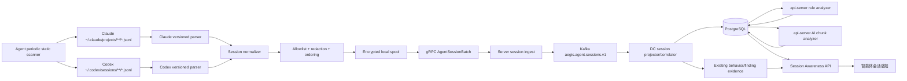
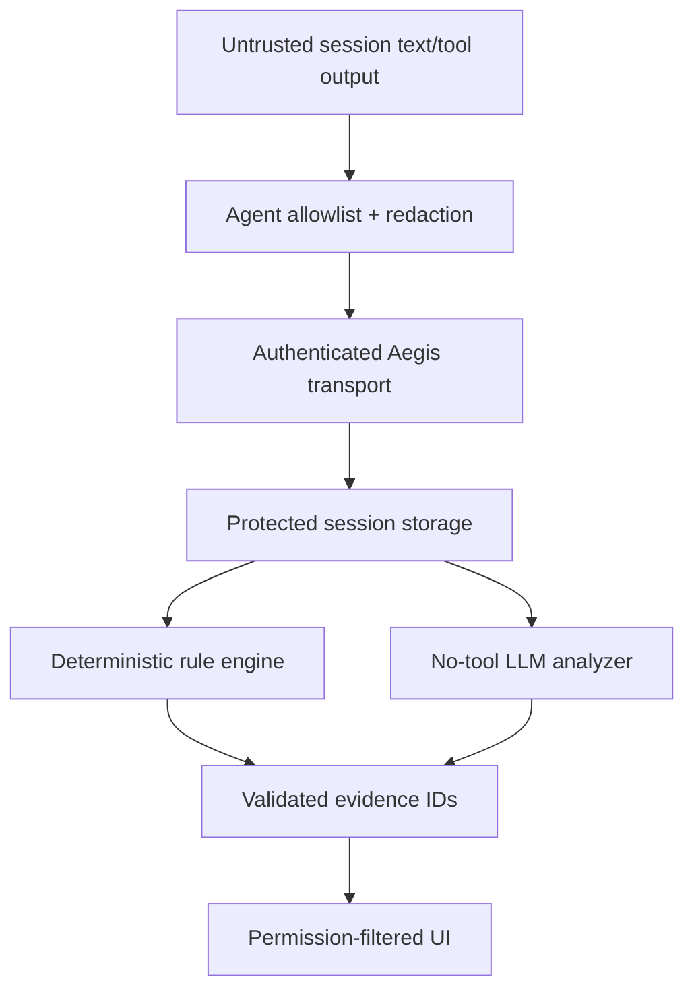

# Aegis V6.3 智能体会话感知总体架构

## 1. 当前基线

截至 V6.2，代码已具备：

- `agent/internal/agentguard/` 的 Agent 识别、Managed Hook 注入、真实 session
  生命周期和可信工具事件；
- Agent -> Server -> `aegis.security.events` -> DC/api-server 的 Agent Guard 数据面；
- `agent_behavior_sessions`、`agent_behavior_events`、`agent_security_findings` 和
  AI finding analysis；
- 前端“智能体事件感知与防护”“智能体逃逸防护”“智能体配置检测”。

V6.3 不修改或依赖当前 Hook 契约。会话正文按 ADR Sensor 方式静态读取本地落盘
JSONL，并通过隔离的 session-content 数据面上报。

## 2. 目标架构



## 3. 四条业务链路

### 3.1 采集链路

```text
Periodic read-only file scan
  -> source discovery/parser
  -> unified item
  -> local redaction
  -> local spool
  -> gRPC/Kafka
  -> DC projection
```

正文第一次离开本机来源文件前必须完成字段 allowlist 和 secret redaction。
Server、Kafka、DC 不拥有“稍后再脱敏”的例外。

### 3.2 规则分析链路

```text
DC commits new item range
  -> marks rule watermark pending
  -> api-server durable worker claims range
  -> deterministic normalization/match/sequence correlation
  -> rule run + rule hits
  -> risk marking + metadata notification
```

规则引擎位于 api-server，与当前 V6.2 工具规则归属一致；DC 只投影、关联和维护
待处理水位，不解释 prompt 语义。

### 3.3 AI 分析链路

```text
manual / idle_inferred / ended_observed-or-inferred / rule escalation
  -> create durable AI run
  -> load model context limit and policy budget
  -> build token-bounded chunks
  -> analyze chunks with no tools
  -> validate evidence item IDs
  -> hierarchical reduce
  -> session verdict + marking + usage
```

AI 失败不覆盖规则结果，不能将失败翻译为 benign。

### 3.4 查询链路

```text
Frontend
  -> api-server permission filter
  -> metadata/session/items/rule runs/AI runs/related behaviors
  -> metadata-only WebSocket invalidation
```

正文只从明确的 content API 返回，响应 `Cache-Control: no-store`。

## 4. 统一领域模型

```text
AgentConversationSession
  ├── ConversationItem[]
  │     ├── user_message
  │     ├── assistant_message
  │     ├── tool_call / tool_result
  │     ├── permission_request / permission_decision
  │     ├── compaction
  │     ├── subagent / lifecycle / error
  │     └── per-item visible token estimate
  ├── ConversationToolCall[]
  ├── SessionRuleAnalysisRun[]
  │     └── SessionRuleHit[]
  ├── SessionAIAnalysisRun[]
  │     └── SessionAIAnalysisChunk[]
  ├── SessionRiskMarking[]
  └── RelatedBehaviorEvent/Finding[]
```

`AgentConversationSession` 与现有 `AgentBehaviorSession` 不合并：

| 对象 | 含义 | 身份来源 |
| --- | --- | --- |
| AgentConversationSession | 静态日志恢复的产品会话和可见对话 | Claude/Codex JSONL session ID |
| AgentBehaviorSession | Agent Guard 操作系统行为窗口 | Hook/session 关联或运行窗口 |

两者优先通过已有 Agent Guard external session ID、tool call ID 建立关系；否则只能
使用 host、UID、project hash 和时间窗口做 probable 关联。静态采集自身不产生
PID/start ticks/correlation token，弱关联不能重复归属行为证据。

## 5. Session 契约

```json
{
  "schema": "aegis.agent_session.v1",
  "session_audit_id": "uuid",
  "host_id": "uuid",
  "instance_id": "uuid-or-null",
  "behavior_session_id": "uuid-or-null",
  "agent_type": "claude-code|codex",
  "source_subject_uid": 1000,
  "source_storage_namespace_hash": "sha256:...",
  "source_session_id": "source-id",
  "source_parent_session_id": null,
  "source_version": "version",
  "source_mode": "static_scan|static_backfill",
  "source_attestation": "versioned_static_parser",
  "project_name_redacted": "project-a",
  "project_root_hash": "sha256:...",
  "model_redacted": "model-id",
  "status": "active_inferred|idle_inferred|ended_observed|ended_inferred|unknown",
  "collection_coverage": "complete|partial|metadata_only|unsupported|source_not_found|disabled",
  "content_mode": "metadata_only|redacted_text",
  "first_source_at": "RFC3339Nano",
  "last_source_at": "RFC3339Nano",
  "last_sequence": 42,
  "item_count": 42,
  "tool_call_count": 8,
  "visible_token_estimate": 12340,
  "token_estimation_method": "aegis_visible_v1",
  "source_usage_coverage": "none|partial|complete",
  "missing_ranges": []
}
```

稳定唯一键：

```text
host_id + source_subject_uid + agent_type
  + source_storage_namespace_hash + source_session_id
```

`collection_coverage=complete` 只表示“截至 `last_scan_at` 已解析到当时文件末尾的
最后一个完整记录”，不表示会话已经结束，也不保证下一轮扫描不会出现新内容。

## 6. Item 契约

```json
{
  "item_id": "uuid",
  "session_audit_id": "uuid",
  "source_message_id": "source-id-or-null",
  "source_part_id": "source-part-or-null",
  "source_revision": "digest-or-revision",
  "source_sequence": 42,
  "turn_id": "stable-turn-id",
  "parent_item_id": null,
  "item_type": "user_message|assistant_message|tool_call|tool_result|permission_request|permission_decision|compaction|subagent|lifecycle|error",
  "role": "user|assistant|tool|system_visible|none",
  "occurred_at": "RFC3339Nano",
  "content_redacted": "visible redacted text",
  "content_digest": "sha256:...",
  "redaction_state": "none|redacted|truncated|suppressed",
  "visibility": "visible|metadata_only|unobservable",
  "visible_token_estimate": 120,
  "token_estimation_method": "aegis_visible_v1",
  "source_usage": null,
  "source_event_type": "response_item.message",
  "source_digest": "sha256:...",
  "previous_item_digest": "sha256:...",
  "schema_version": 1
}
```

## 7. 组件职责

### 7.1 Agent

- 按配置解析纳管 UID/home 和允许的静态会话目录；
- 周期性有界扫描 Claude/Codex JSONL，只读打开并校验 owner/path/dev/inode；
- 使用 byte cursor 读取新增完整行，处理 truncate/inode change/半行；
- 丢弃 hidden reasoning 和不允许字段；
- 本机脱敏、截断、排序、幂等、cursor、加密 spool；
- 批量上报并根据 ACK 清理 spool；
- 上报 coverage/capability，不做 AI 分析。

### 7.2 Server

- 校验连接 host、batch schema、大小、序号和 digest；
- 写入专用 Kafka topic 后再 ACK；
- 不解析正文、不做规则判断、不写正文日志。

### 7.3 DC

- 消费、幂等投影 Session/Item/Tool；
- 计算 item/session 可见内容 Token 估算并汇总来源 usage；
- 检测 gap、乱序、digest conflict 和 parser coverage；
- 关联现有 Agent Guard instance/session/event/finding；
- 推进 rule/AI 待处理水位；
- 发布无正文的实时更新。

### 7.4 api-server

- 权限过滤、分页和详情 API；
- 使用持久化 Token 估算做 chunk preflight，并保存模型实际 usage；
- 版本化确定性 session rule engine；
- 持久化 AI queue、chunker、模型调用、schema/evidence 校验和 reduce；
- 风险 marking、人工处置和审计；
- 禁止给 AI client 注册工具或动作 callback。

### 7.5 Frontend

- 复用 Agent Guard 页面 shell、指标、筛选、列表和 drawer 交互；
- 分开呈现规则/AI/综合风险；
- 显示 Token 指标来源和估算标签；
- 不持久化正文，不将正文发送到 console/analytics。

## 8. 信任边界



信任规则：

- 本机用户可以控制会话 JSONL 内容，因此正文不是不可抵赖证据。
- static parser 只能证明 Aegis 从指定 owner/path 的文件观察到内容，不能证明该内容
  必然由真实模型生成，也不能提供进程级实时证明。
- 会话文本、tool output、compact summary 和 source model response 对分析器都是
  untrusted data。
- OS behavior/eBPF 是执行事实；会话文字是意图/上下文。两者不互相冒充。

## 9. 可用性和失败行为

| 故障 | 行为 |
| --- | --- |
| 来源目录不存在/无持久化 | 标记 source_not_found，不从 Hook 补采、不解释为 clean |
| 静态 scanner 预算耗尽 | 保存 continuation cursor，下轮继续，coverage 标记 partial |
| JSONL parser 未知 | 停止该文件正文解析，只保留安全文件 metadata，标记 unsupported |
| redaction 失败 | fail closed，只上传 metadata 和 suppressed 标记 |
| spool 满 | 停止推进来源 cursor，保留未读来源数据并标记 pressure；不得静默跳过 |
| Server/Kafka 不可用 | Agent 指数退避，未 ACK batch 留在 spool |
| DC 重放 | 唯一键/digest 幂等；digest 冲突 quarantine |
| 规则引擎失败 | run=failed，不影响正文查询和后续 AI 手工重试 |
| LLM 超时/无效输出 | chunk/run failed 或 inconclusive；不得标 benign |
| WebSocket 断开 | UI warning + REST refresh，已加载数据保留 |

## 10. 兼容策略

- Proto 只做 additive message/RPC；旧 Agent/Server 在 flags off 时继续工作。
- 新 Kafka topic 与 `aegis.security.events` 分离。
- migration 032 只新增表、索引、权限和内置规则，不改旧表语义。
- frontend 新路由懒加载，不改变现有三页行为。
- 所有 V6.3 feature flags 默认关闭，按 static metadata scan -> redacted scan -> rule ->
  AI 顺序启用。
